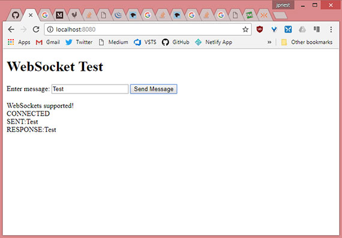

<!-- markdownlint-disable MD022 MD024 MD032 -->
# Chapter 10 - WebSocket Communications

Notes from [Programming in HTML5 with JavaScript & CSS3 Training Guide](https://www.amazon.com/Training-Guide-Programming-JavaScript-Microsoft/dp/0735674388) by Glenn Johnson.

This is part of my study material for passing Microsoft's [Exam 70-480: Programming in HTML5 with JavaScript & CSS3](https://www.microsoft.com/en-us/learning/exam-70-480.aspx) certification exam.

---

WebSockets allows initiating communication from the browser to the server or from the server to the browser. If the server can send messages to the browser, the browser doesn't need to poll the server for status info.

An example of two-way communication is a chat room app by which the server can notify many browsers that a message was received from a browser.

## 1. Communicating by using WebSocket

The WebSocket protocol is a web technology that provides full-duplex communications over a single TCP connection.

WebSocket replaces the _long polling_ concept.

## 2. Understanding the WebSocket protocol

The WebSocket protocol provides a standardized way for the server to send content to the browser without being solicited by the client and to allow messages to be passed back and forth while keeping the connection open. A two-way (bidirectional), ongoing conversation can take place between a browser and the server.

The WebSocket protocol is designed to be implemented in web browsers and web servers, but any client or server application can use it. The protocol is an independent, TCP-based protocol. Its only relationship to HTTP is that its handshake is interpreted by HTTP servers as a request to switch to WebSocket protocol.

Each frame of WebSocket protocol has only 2 bytes of overhead, and there are no headers. The light weight nature of the WebSocket protocol enables more interaction between a browser and website. This performance increase makes the WebSocket protocol an easy choice for communicating when it's necessary to deliver live content and real-time gaming.

## 3. Defining the WebSocket API

At the heart of the WebSocket API is the `WebSocket` object, which is defined on the window object. You can easily test if this object exists to determine whether the browser supports WebSocket. The WebSocket object contains the following members:

- **WebSocket constructor** A method that requires a URL argument and can optionally accept additional parameters to define the sub-protocol that you'll use, such as _chat_ or _rpc_. The client and the server are typically matched to use the same protocol.
- **close** A method that closes WebSocket.
- **send** A method that sends data to the server.
- **binaryType** A property that indicates the binary data format the `onmessage` event receives.
- **bufferedAmount** A property containing the number of data bytes queued using the send method.
- **extensions** A property that indicates the extensions the server selected.
- **onclose** An event property that's called when the socket is closed.
- **onerror** An event property that's called when there is an error.
- **onmessage** An event property that's called when a message is received.
- **onopen** An event property that's called when WebSocket establishes a connection.
- **protocol** A property that indicates the protocol that the server selected.
- **readyState** A property that indicated the state of the WebSocket connection.
- **url** A property that indicates the current URL of the WebSocket object.

## 4. Implementing the WebSocket object

WebWSocket protocol communications typically use TCP port number 80, so environments that block non-standard Internet connections by using a firewall will still pass WebSocket packets.

In the following example, a webpage is created that calls the WebSocket.org echo server, which will return the message passed to it. Consider the following webpage that contains a text box for entering a message and a button to send the message to a server; all output is appended to the `<div id="divOutput">` element.

```html
<!DOCTYPE html>
<html lang="en">
<head>
    <meta charset="UTF-8">
    <meta name="viewport" content="width=device-width, initial-scale=1.0">
    <meta http-equiv="X-UA-Compatible" content="ie=edge">
    <title>WebSocket</title>
</head>
<body>
    <h1>WebSocket Test</h1>
    Enter message: <input type="text" name="txtMessage" id="txtMessage"><br>
    <button id="btnSend" type="button">Send Message</button>
    <div id="divOutput"></div>
    <script src="scripts/jquery.js"></script>
    <script src="scripts/index.js"></script>
</body>
</html>
```

Whereas an HTTP URL begins with `http://` or `https://` for secure HTTP, the WebSocket URL begins with `ws://` or `wss://` for secure WebSocket protocol.

In the JavaScript code, you create a `WebSocket` object and configure the `onopen`, `onmessage`, and `onclose` events. Call the `send` method to send a message, and the `onmessage` event triggers if there is a response.

#### index.js

```js
// ES5
var wsUri = 'ws://echo.websocket.org/';
var webSocket;

$(document).ready(function() {
    if (checkSupported()) {
        connect();
        $('#btnSend').click(doSend);
    }
});

function writeOutput(message) {
    var output = $('#divOutput');
    output.html(output.html() + '<br>' + message);
}

function checkSupported() {
    if (window.WebSocket) {
        writeOutput('WebSockets supported!');
        return true;
    } else {
        writeOutput('WebSockets NOT supported!');
        $('#btnSend').attr('disabled', 'disabled');
        return false;
    }
}

function connect() {
    webSocket = new WebSocket(wsUri);
    webSocket.onopen = function(evt) { onOpen(evt); };
    webSocket.onclose = function(evt) { onClose(evt); };
    webSocket.onmessage = function(evt) { onMessage(evt); };
    webSocket.onerror = function(evt) { onError(evt); };
}

function doSend() {
    if (webSocket.readyState !== webSocket.OPEN) {
        writeOutput('NOT OPEN:' + $('#txtMessage').val());
        return;
    }
    writeOutput('SENT:' + $('#txtMessage').val());    
    webSocket.send($('#txtMessage').val());
}

function onOpen(evt) { writeOutput('CONNECTED'); }
function onClose(evt) { writeOutput('DISCONNECTED'); }
function onMessage(evt) { writeOutput('RESPONSE:' + evt.data); }
function onError(evt) { writeOutput('ERROR:' + evt.data); }
```

In this example, `wsUri` is set to the WebSocket.org server, which echoes messages sent to it. The `ready` function calls the `checkSupported` function to see whether WebSocket is supported. This is accomplished by checking whether the window object has a WebSocket object. If so, the `connect` function is called.

The `connect` function instantiates WebSocket. The constructor accepts a URI argument. Creating the WebSocket object automatically initiates communications to the URI to attempt to open the connection asynchronously. The `connect` function also subscribes to the `onopen`, `onclose`, `onmessage`, and `onerror` events.

It's important to  subscribe to these events immediately because the connection might open quickly, and you want to ensure that you are subscribed to the `onopen` event as soon as possible so you don't miss the event.

> ### Quick check
> - Can you create a WebSocket object and call the open method when you want to open a WebSocket connection?
>
> ### Answer
> - No, there is no open method on the WebSocket object. When you instantiate the WebSocket object, it automatically attempts to open asynchronously.

The `doSend` function sends a message to the server. Before sending the message, this function checks the `readyState` property of the WebSocket object. The readyState property contains one of the following values.

- **CONNECTING = 0** Connection is open and ready to communicate.
- **OPEN = 1** Connection is open and ready to communicate.
- **CLOSING = 2** Connection is in the process of closing.
- **CLOSED = 3** Connection is closed or couldn't be opened.

The `readyState` property will be set to one of the numeric values, but you can  use the constants as shown in the `doSend` function that tests for `webSocket.OPEN`. If the WebSocket is not open, a message is displayed, and the function returns without sending. If WebSocket is open, a message is displayed, and the message is sent using the `send` method.

When a message is received from the server, the `onMessage` function is called, and the `event` object is passed. The `data` property of the `event` object contains the message.

When an error is received, the  `onError` function is called, and the `event` object is passed. An error can come from the server or be generated when either the client cannot connect to server or the connection is timed out. Depending on the error, the `event` object might pass the cause on the `data` property. You might also find that the `data` property is `undefined`, especially is a timeout scenario.

When the page is displayed a message shows 'WebSocket Supported!'. The CONNECTED message is displayed when the connection is open, and a response is displayed if a message is entered and the 'Send Message' button is clicked to send the message to the server.

[](assets/images/full-size/chap10-1.png)

## 5. Dealing with timeouts
One way of dealing with timeouts is to send an empty message to the server periodically.

#### index.js with updated functions

```js
// ES5
var timerId = 0;

function keepAlive() {
    var timeout = 15000;
    if (webSocket.readyState === webSocket.OPEN) {
        webSocket.send('');
    }
    timerId = setTimeout(keepAlive, timeout);
}

function cancelKeepAlive() {
    if (timerId) {
        clearTimeout(timerId);
    }
}

function onOpen(evt) { writeOutput('CONNECTED'); keepAlive(); }
function onClose(evt) { writeOutput('DISCONNECTED'); cancelKeepAlive();}
```

At the top is the declaration of the `timerId`. A `keepAlive` function has been added that sends an empty message every 15 seconds. The `keepAlive` function is called when the `onOpen` function is executed and is recursive; it doesn't stop until the timer is cancelled by using the `timerId`.

A `cancelKeepAlive` function has been added to cancel the looping of the `keepAlive` function, and it's called when the `onClose` function is called.

### Handling connection disconnects
In addition to providing the keepAlive capability, you might also need to deal with connections that close due to network errors. This can require you to call the `connect` function from within the `onClose` function. Your application may need to handle this by forcing the client to send an identification message.

### Dealing with web farms
Sometimes, when pushing your WebSocket application to production, you need your application to run in a _web farm_, where multiple servers handle incoming requests. These requests are load balanced to provide the best performance.

You can  share state across multiple web servers by using one of the many products that handle this problem such as Redis & MS App Fabric Caching Service.

> ### Quick check
> - Do the WebSocket protocol and WebSocket API provide native support for load balancing in a web farm?
>
> ### Answer
> - No, there is no native support for web farm load balancing with WebSocket protocol and the WebSocket object.

## 6. Using WebSocket libraries
Dealing with timeouts, dropped connections, incompatible browsers, and web farms can be a daunting task. For this reason it's usually a better practice to use a library that can handle this task for you in a consistent manner. The thing to understand though is that these libraries run at both the client and the server. Here's a short list.

### SignalR
SignalR is a Microsoft library for ASP.NET developers. It is meant to be implemented on an ASP.NET website, using a .NET language such as C# on the server and JavaScript on the client.

SignalR simplifies the addition of real-time web functionality to your applications. It uses WebSocket when it's available but gracefully falls back to techniques such as long polling when WebSockets is not available.

### Socket.IO
Socket.IO is a WebSocket library created by Guillerma Rauch who also created Engine.IO and other open source libraries. Socket.IO has both a client-side and server-side library, each written in JavaScript. The server side is for use with Node.js; It uses feature detection to decide whether the connection will be established with WebSocket, Ajax long polling or Flash polling.

## 7. Lesson Summary

- The WebSocket protocol provides a standardized way for the server to send content to the browser without being solicited by the client, and it allows messages to be passed back and for the while keeping the connection open.
- The WebSocket object contains methods to send data and close connection.
- The WebSocket object contains the following events: `onclose`, `onmessage`, `onerror`, and `onopen`.
- You can check the `readyState` property on the WebSocket object to obtain the state of the connection.
- Use `ws://` for WebSocket protocol or `wss://` for secure WebSocket protocol.
- Timeouts, dropped connections, web farm implementations, and browser incompatibility are problems you must resolve when implementing WebSocket.

