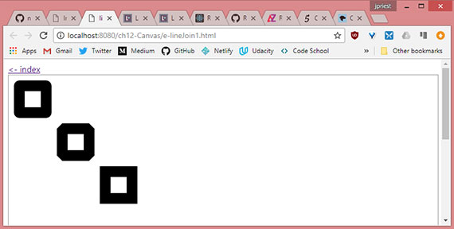
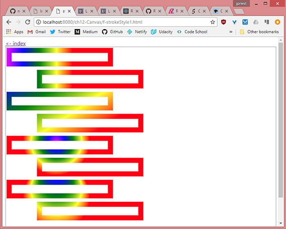
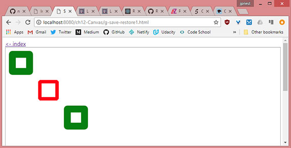
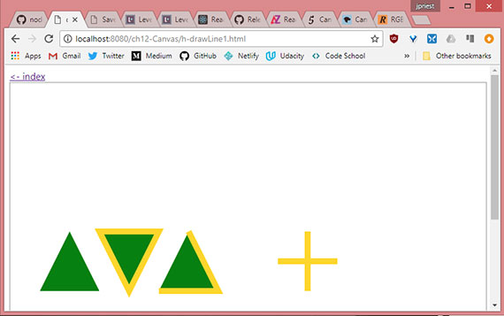
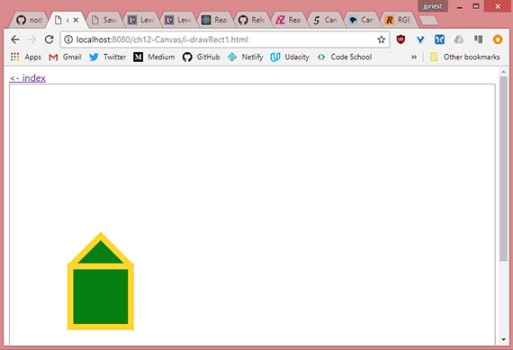
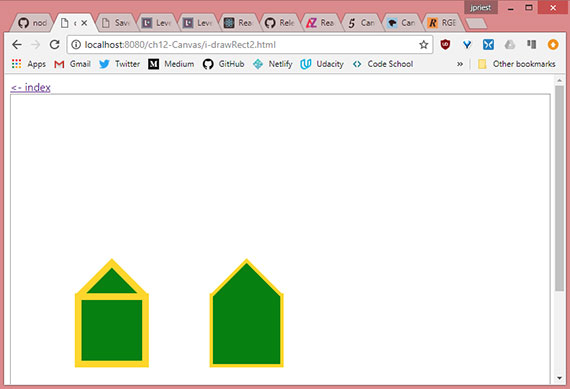
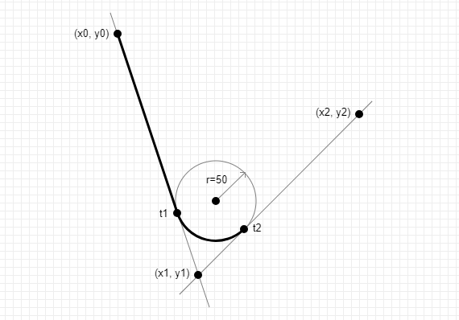
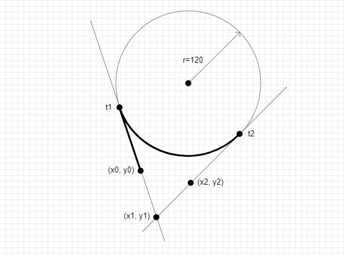
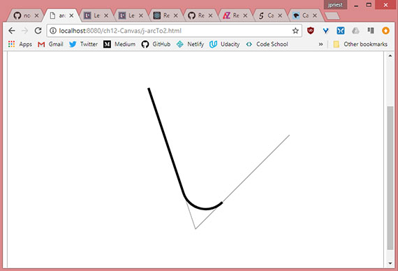
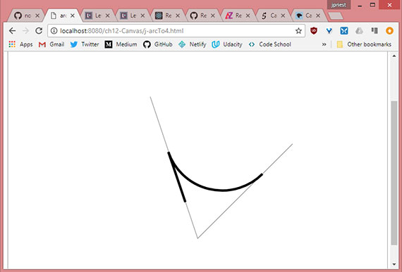

<!-- markdownlint-disable MD022 MD024 MD032 -->
# Chapter 12 - HTML5 Canvas & SVG

Notes from [Programming in HTML5 with JavaScript & CSS3 Training Guide](https://www.amazon.com/Training-Guide-Programming-JavaScript-Microsoft/dp/0735674388) by Glenn Johnson.

This is part of my study material for passing Microsoft's [Exam 70-480: Programming in HTML5 with JavaScript & CSS3](https://www.microsoft.com/en-us/learning/exam-70-480.aspx) certification exam.

---

Prior to HTML5 we had to rely on something like Adobe Flash for drawing on a webpage. Now we have the ability to draw in HTML5 by using the `<canvas>` element.

We can display Scalable Vector Graphics by using the `<svg>` element. SVG is a language by which to define two-dimensional graphics in XML. The XML can then be rendered by the browser using the `<svg>` tag. Although you could learn and write SVG by hand, you will most likely use an image editor to create SVG graphics. The benefits of SVG is that they're scalable.

This lesson presents the `<canvas>` element and demonstrates drawing on the canvas. Then the lesson covers `<svg>` from an implementation perspective rather than from a drawing perspective.

# 1. Drawing with canvas
The only significant attributes that `<canvas>` has are the `height` and `width` attributes. The content you place in the `<canvas>` element is displayed if the browser doesn't support the canvas element.

```html
<canvas id="myCanvas" width="800" height="600">
    You need a browser that supports HTML5!
</canvas>
```

The `<canvas>` element is invisible by default so we apply the following.

```css
canvas {
    border: 1px solid #999;
}
```

## 2. Canvas element reference
The `<canvas>` element exposes an abundance of functionality through its canvas context, which is accessible using JavaScript. The element provides the following members.

- **height** Property that sets or gets the height of the canvas
- **width** Property that sets or gets the width of the canvas
- **getContext()** Method that accepts a parameter of `2d` and returns a `CanvasRenderingContext2D` object that represents the canvas context
- **toDataUrl()** Method that creates a URL that can be used with an element that requires an image URL, such as the `` element

## 3. Context object reference
The `<canvas>` element is simply a graphics container; the context object (`CanvasRenderingContext2D`) that is returned from the `getContext()` method is used to draw on the canvas.

The following is a list of the context object's members.

- **addColorStop()** Method to set the colors and stop positions in a gradient object
- **arc()** Method to create an arc/curve
- **actTo()** Method to create an arc/curve between two tangents
- **beginPath()** Method to start a path or reset the current path
- **bezierCurveTo()** Method to create a cubic Bezier curve
- **clearRect()** Method to clear a given rectangle
- **clip()** Method to clip a region of any shape and size from the original canvas
- **closePath()** Method to create a path from the current point back to the starting point
- **createImageData()** Method to create a new, blank ImageData object
- **createLinearGradient()** Method to create a linear gradient
- **createPattern()** Method to repeat a specified element in a specified direction
- **createRadialGradient()** Method to create a radial/circular gradient
- **data** Property that gets an `ImageData` object that contains the image data
- **drawImage()** Method to draw an image, canvas, or video onto the canvas
- **fill()** Method to fill the drawing path
- **fillRect()** Method to draw a filled rectangle
- **fillStyle** Property that sets or gets the color, gradient, or pattern used to fill the drawing
- **fillText()** Method to draw filled text on the canvas
- **font** Property that sets or gets the font properties for text content
- **getImageData()** Method to get an `ImageData` object that copies the pixel data for the specified rectangle on a canvas
- **globalAlpha** Property that sets or gets the current alpha or transparency value fo the drawing
- **globalCompositeOperation** Property that sets or gets how a new image is drawn onto an existing image
- **isPointInPath()** Method that returns `true` if the specified point is in the current path
- **lineCap** Property that sets or gets the style of the end caps for a line
- **lineJoin** Property that sets or gets the type of corner to create when two lines meet
- **lineTo()** Method that adds a new point and creates a line from that point to the last specified point in the canvas
- **lineWidth** Property that sets or gets the current line width
- **measureText()** Method that gets an object that contains the width of the specified text
- **miterLimit** Property that sets or gets the maximum miter length
- **moveTo()** Method that moves the path to the specified point in the canvas without creating a line
- **putImageData()** Method that puts the image data from a specified `ImageData` boject back onto the canvas
- **quadraticCurveTo()** Method that creates a quadratic Bezier curve
- **rect()** Method that creates a rectangle
- **restore()** Method that pops the previously saved context from the stack
- **rotate()** Method that rotates the current drawing
- **save()** Method that pushes the state of the current context onto a stack
- **scale()** Method that scales the current drawing bigger or smaller
- **setTransform()** Method that resets the current transform to the identity matrix and then call the `transform()` method
- **shadowBlur** Property that sets or gets the blur level setting to use for shadows
- **shadowColor** Property that sets or gets the color setting to use for shadows
- **shadowOffsetX** Property that sets or gets the horizontal distance setting of the shadow from the shape
- **shadowOffsetY** Property that sets or gets the vertical distance setting of the shadow  from the shape
- **stroke()** Method to draw the path you have defined
- **strokeRect()** Method to draw a rectangle without fill
- **strokeStyle** Property that sets or gets the color, gradient, or pattern used for strokes
- **strokeText()** Method that draws text on the canvas without fill
- **textAlign** Property that sets or gets the alignment setting for text content
- **textBaseline** Property that sets or gets the text baseline setting used when drawing text
- **transform()** Method that replaces the transformation matrix setting for the drawing
- **translate()** Method that remaps the (0,0) position on the canvas

## 4. Implementing the canvas
When working with the `canvas` object, you must get a reference to the canvas context. This can be accomplished by using the `getContext()` method, which accepts a parameter.

Currently the values for the parameter are `2d` and `webgl`. WebGL focuses on more advanced three-dimensional drawing but this lesson will focus on the more mature `2d` parameter which returns a `CanvasRenderingContext2D` object. This object will be referred to as the _context_ object.

```js
$(document).ready(function() {
    drawSomething();
});

function drawSomething() {
    var canvas = document.getElementById('myCanvas');
    var ctx = canvas.getContext('2d');
    ctx.fillRect(10, 50, 100, 200);
}
```

In this example, `canvas` is a reference to the `<canvas>` element whose `id` is `myCanvas`. After that, `ctx` is set to reference the `context` object, with which you can start drawing.

The coordinates of the drawing surface are represented as `x`, `y` where 0,0 is the upper-left corner of the canvas

[](assets/images/full-size/chap12-1.png)<br>
**Live sample:** <a href="https://james-priest.github.io/node_samples/ch12-Canvas/a-canvas1.html" target="_blank">https://james-priest.github.io/node_samples/ch12-Canvas/a-canvas1.html</a>

### Quick check
- What is the proper parameter to pass to the `getContext` method on the canvas to create two-dimensional drawings?

### Answer
- `2d`

## 5. Drawing rectangles
The methods for creating rectangles accept four parameters. The first two are the x and y locations of the upper-left corder. The last two parameters represent the width and height of the rectangle. You can create rectangles by using one of the following methods.

- **clearRect(x, y, w, h)** Clear the specified rectangular area.
- **fillRect(x, y, w, h)** Draw a filled rectangular area.
- **strokeRect(x, y, w, h)** Draw an unfilled rectangular area.

The following code demonstrates this.

```js
$(document).ready(function() {
    drawSomething();
});

function drawRectangle() {
    var canvas = document.getElementById('myCanvas'),
        ctx = canvas.getContext('2d'),
        offset = 15,
        clearOffset = 30,
        pushDownOffset = 10,
        height = 50,
        width = 100,
        count = 4;

    for (var i = 0; i < count; i++) {
        ctx.fillRect(i * (offset + width) + offset, offset, width, height);

        ctx.clearRect(i * (offset + width) + (clearOffset / 2) + offset,
            offset + (clearOffset / 2) + (pushDownOffset /2),
            width - clearOffset, height - clearOffset);

        ctx.strokeRect(i * (offset + width) + offset,
            (2 * offset) + height, width, height);
    }
}
```

In this example, the `fillRect()` method is used to create four rectangles. Each is spaced horizontally by the offset amount. Next the `clearRect()` method is used to clear a rectangular area that is inside the filled-in area. Finally, the `strokeRect()` method is used to create a second row, but these rectangles are not filled in.

[](assets/images/full-size/chap12-1.png)<br>
**Live sample:** <a href="https://james-priest.github.io/node_samples/ch12-Canvas/b-rect1.html" target="_blank">https://james-priest.github.io/node_samples/ch12-Canvas/b-rect1.html</a>

So, drawing on the canvas does indeed require knowledge of JavaScript and the canvas context object.

## 6. Configuring drawing state
In the previous example, we did not set the fill color for `fillRect()` or the line thickness and color for `strokeRect()`. The canvas context has properties we can set before calling any of the drawing methods.

After we change a property, the new value is used for th subsequent drawing statements.

## 7. Setting fillStyle
We can set fill style to CSS color, gradient, or pattern

## 8. fillstyle: CSS color
This creates a solid color fill based on valid CSS color value such as a named color (black, red, etc.), hex value(#FF0000), or css function (rgb(), rgba(), hsl(), hsla()).

```js
function drawUsingCssColor() {
    // var canvas = document.getElementById('myCanvas');
    var canvas = document.createElement('canvas'),
        ctx = canvas.getContext('2d'),
        offset = 10,
        size = 50;

    canvas.id = 'myCanvas';
    canvas.width = 800;
    canvas.height = 600;
    document.body.appendChild(canvas);

    ctx.fillStyle = "red";
    ctx.fillRect(offset + (0 * (offset + size)), offset, size, size);
    ctx.fillRect(offset + (1 * (offset + size)), offset, size, size);

    ctx.fillStyle = "#00FF00";
    ctx.fillRect(offset + (2 * (offset + size)), offset, size, size);
    ctx.fillRect(offset + (3 * (offset + size)), offset, size, size);

    ctx.fillStyle = "rgba(0, 0, 255, 0.25)";
    ctx.fillRect(offset + (4 * (offset + size)), offset, size, size);
    ctx.fillRect(offset + (5 * (offset + size)), offset, size, size);
}
```

In this example, `fillStyle` is set to "red" and two rectangles are created. Next, `fillStyle` is set to green, using "#00FF00" and two rectangles are created. Finally, `fillStyle` is set to blue with an opacity of 25 percent and two rectangles are created.

[](assets/images/full-size/chap12-3.png)<br>
**Live sample:** <a href="https://james-priest.github.io/node_samples/ch12-Canvas/c-fillStyle1.html" target="_blank">https://james-priest.github.io/node_samples/ch12-Canvas/c-fillStyle1.html</a>

## 9. fillstyle: Gradient
A `CanvasGradient` object that is created by the context's `createLinearGradient()` or `createRadialGradient()` method to create a gradient fill.

The `createLinearGradient()` method accepts the `x` and `y` values of two points that are used to create a linear gradient, for example, `createLinearGradient(x0, y0, x1, y1)`.

The `createRadialGradient()` accepts the `x` and `y` center and the radius of the two circles, for example, `createRadialGradient(x0, y0, x1, y1, r1)`.

After the gradient object is created, call its `addColorStop` method to specify that a color is set at a location on the gradient. The `addColorStop` function takes two parameters; the first is the location, which is a value between 0 and 1 where 0 is the beginning of the gradient and 1 is the end of the gradients, and the second parameter is the color value.

```js
function drawGradient() {
    // var canvas = document.getElementById('myCanvas');
    var canvas = document.createElement('canvas'),
        ctx = canvas.getContext('2d'),
        gradient = '',
        x0 = 0,
        y0 = 0,
        r0 = 0,
        x1 = 200,
        y1 = 0,
        r1 = 100,
        width = 300,
        height = 50,
        offset = 10;

    canvas.id = 'myCanvas';
    canvas.width = 800;
    canvas.height = 600;
    document.body.appendChild(canvas);

    gradient = ctx.createLinearGradient(x0, y0, x1, y1);
    addColorStops(gradient);
    ctx.fillStyle = gradient;
    ctx.fillRect(10, 0 * (height + offset), width, height);
    ctx.fillRect(100, 1 * (height + offset), width, height);

    y1 = 300;
    gradient = ctx.createLinearGradient(x0, y0, x1, y1);
    addColorStops(gradient);
    ctx.fillStyle = gradient;
    ctx.fillRect(10, 2 * (height + offset), width, height);
    ctx.fillRect(100, 3 * (height + offset), width, height);

    x0 = x1 = width / 2;
    y0 = y1 = 4 * (height + offset) + (height / 2);
    gradient = ctx.createRadialGradient(x0, y0, r0, x1, y1, r1);
    addColorStops(gradient);
    ctx.fillStyle = gradient;
    ctx.fillRect(10, 4 * (height + offset), width, height);
    ctx.fillRect(100, 5 * (height + offset), width, height);

    y0 = 5 * (height + offset) + (height / 2);
    y1 = y0 + 100;
    gradient = ctx.createRadialGradient(x0, y0, r0, x1, y1, r1);
    addColorStops(gradient);
    ctx.fillStyle = gradient;
    ctx.fillRect(10, 6 * (height + offset), width, height);
    ctx.fillRect(100, 7 * (height + offset), width, height);
}

function addColorStops(gradient) {
    gradient.addColorStop('0', 'magenta');
    gradient.addColorStop('.25', 'blue');
    gradient.addColorStop('.50', 'green');
    gradient.addColorStop('.75', 'yellow');
    gradient.addColorStop('1.0', 'red');
}
```

This example code displays two rectangles for each test, in which the second rectangle is offset from the first rectangle, so you can see how the gradient is rendered relative to the canvas, not the rectangle.

[](assets/images/full-size/chap12-4.png)<br>
**Live sample:** <a href="https://james-priest.github.io/node_samples/ch12-Canvas/c-fillStyle2.html" target="_blank">https://james-priest.github.io/node_samples/ch12-Canvas/c-fillStyle2.html</a>

The first pair of rectangles demonstrates a horizontal linear gradient when y0 and y1 are equal.

The second pair of rectangles shows what happens when y1  is different from y0. In this example, if you draw a line from x0, y0 to x1, y.1, the line will be angled downward. The gradient is rendered along this line and displays as a diagonal linear gradient.

The third pair of rectangles illustrates the radial gradient when x0=x1 and y0=y1, but  r0 us set to zero when r1 is set to 100. Becasue both points are the same, the radial gradient is circular. Because r0 is zero, the gradient starts in the center. The gradient ends at r1, which is set to 100.

The last pair of rectangles shows what happens when the two points are not the same. In this case, x0 and x1 are the same, but y0 and y1 are different, which produces a non-circular gradient.

## 10. fillstyle: Pattern
A `CanvasPattern` object that is created by using the context's `createPattern()` method and creates a pattern fill. The `createPattern` method takes an image parameter and a direction parameter. The image is a reference to an `` element, and the direction is a string containing `no-repeat`, `repeat-x`, `repeat-y`, or `repeat`.


By using the image above, the following code creates a pattern that is assigned to the `fillStyle` property.

```js
function drawPattern() {
    // var canvas = document.getElementById('myCanvas');
    var canvas = document.createElement('canvas'),
        ctx = canvas.getContext('2d');

    canvas.id = 'myCanvas';
    canvas.width = 800;
    canvas.height = 600;
    document.body.appendChild(canvas);

    // create new image object to use as pattern
    var img = new Image();
    img.src = "assets/images/shapes.png";
    img.onload = function() {
        // create pattern
        var ptrn = ctx.createPattern(img, 'repeat');
        ctx.fillStyle = ptrn;
        ctx.fillRect(0, 0, 700, 500);
    };
}
```

In this example, instead of creating an `` element, the image is dynamically created and its source is set to the shapes.png file. Next, the `onload` event of the image is subscribed to that creates the pattern on the canvas after shapes.png is loaded.

[](assets/images/full-size/chap12-4.png)<br>
**Live sample:** <a href="https://james-priest.github.io/node_samples/ch12-Canvas/c-fillStyle3.html" target="_blank">https://james-priest.github.io/node_samples/ch12-Canvas/c-fillStyle3.html</a>

## 11. Setting lineWidth
The `lineWidth` property specifies the thickness of any line you draw. The following code example draws rectangles by using different `lineWidth` settings.

```js
function drawlineWidth() {
    // var canvas = document.getElementById('myCanvas');
    var canvas = document.createElement('canvas'),
        ctx = canvas.getContext('2d'),
        offset = 40,
        width = 5,
        height = 5,
        i = 0,
        centerX = 400,
        centerY = 300;

    canvas.id = 'myCanvas';
    canvas.width = 800;
    canvas.height = 600;
    document.body.appendChild(canvas);

    for( i = 1; i < 15; i++) {
        ctx.lineWidth = i;
        ctx.strokeRect(centerX - (width / 2) - (i * offset / 2),
            centerY - (height / 2) - (i * offset / 2),
            width + (i * offset), height + (i * offset));
    }
}
```

In this example, `lineWidth` is changed on each iteration of the `for` loop; the drawn rectangle starts small and gets larger with each iteration.

[](assets/images/full-size/chap12-6.png)<br>
**Live sample:** <a href="https://james-priest.github.io/node_samples/ch12-Canvas/d-lineWidth1.html" target="_blank">https://james-priest.github.io/node_samples/ch12-Canvas/d-lineWidth1.html</a>

## 12. Setting lineJoin
The `lineJoin` property specifies the way lines that join each other are drawn. You can set the `lineJoin` property to 'round', 'bevel', or 'miter'. The default is 'miter'. The difference between these settings is most noticeable with thicker lines.

The following code shows the creation of three rectangles that have different `lineJoin` settings.

```js
function drawLineJoin() {
    // var canvas = document.getElementById('myCanvas');
    var canvas = document.createElement('canvas'),
        ctx = canvas.getContext('2d');

    canvas.id = 'myCanvas';
    canvas.width = 800;
    canvas.height = 600;
    document.body.appendChild(canvas);

    ctx.lineWidth = 20;

    ctx.lineJoin = 'round';
    ctx.strokeRect(20, 20, 50, 50);

    ctx.lineJoin = 'bevel';
    ctx.strokeRect(100, 100, 50, 50);

    ctx.lineJoin = 'miter';
    ctx.strokeRect(180, 180, 50, 50);
}
```

In this example, the first rectangle's `lineJoin` property is set to 'round'. This produces a rectangle with rounded corners. The second is set to 'bevel', which produces a rectangle with beveled corners. Finally, the third is set to 'miter', which produces a rectangle with mitered, or pointy, corners.

[](assets/images/full-size/chap12-7.png)<br>
**Live sample:** <a href="https://james-priest.github.io/node_samples/ch12-Canvas/e-lineJoin1.html" target="_blank">https://james-priest.github.io/node_samples/ch12-Canvas/e-lineJoin1.html</a>

## 12. Setting strokeStyle
The `strokeStyle` property specifies the way you want to draw lines. This setting is the same as the `fillStyle` property described earlier.

```js
function drawGradientStroke() {
    // var canvas = document.getElementById('myCanvas');
    var canvas = document.createElement('canvas'),
        ctx = canvas.getContext('2d'),
        gradient ='',
        x0 = 0,
        y0 = 0,
        r0 = 0,
        x1 = 200,
        y1 = 0,
        r1 = 100,
        width = 300,
        height = 40,
        offset = 25;

    canvas.id = 'myCanvas';
    canvas.width = 800;
    canvas.height = 600;
    document.body.appendChild(canvas);

    ctx.lineWidth = 15;
    gradient = ctx.createLinearGradient(x0, y0, x1, y1);
    addColorStops(gradient);
    ctx.strokeStyle = gradient;
    ctx.strokeRect(10, 0 * (height + offset) + 10, width, height);
    ctx.strokeRect(100, 1 * (height + offset)+10, width, height);

    y1 = 300;
    gradient = ctx.createLinearGradient(x0, y0, x1, y1);
    addColorStops(gradient);
    ctx.strokeStyle = gradient;
    ctx.strokeRect(10, 2 * (height + offset)+10, width, height);
    ctx.strokeRect(100, 3 * (height + offset)+10, width, height);

    x0 = x1 = width / 2;
    y0 = y1 = 4 * (height + offset) + (height / 2);
    gradient = ctx.createRadialGradient(x0, y0, r0, x1, y1, r1);
    addColorStops(gradient);
    ctx.strokeStyle = gradient;
    ctx.strokeRect(10, 4 * (height + offset)+10, width, height);
    ctx.strokeRect(100, 5 * (height + offset)+10, width, height);

    y0 = 5 * (height + offset) + (height / 2);
    y1 = y0 + 100;
    gradient = ctx.createRadialGradient(x0, y0, r0, x1, y1, r1);
    addColorStops(gradient);
    ctx.strokeStyle = gradient;
    ctx.strokeRect(10, 6 * (height + offset)+10, width, height);
    ctx.strokeRect(100, 7 * (height + offset)+10, width, height);
}

function addColorStops(gradient) {
    gradient.addColorStop('0', 'magenta');
    gradient.addColorStop('.25', 'blue');
    gradient.addColorStop('.50', 'green');
    gradient.addColorStop('.75', 'yellow');
    gradient.addColorStop('1.0', 'red');
}
```

This example is a modified version of the `drawGradient()` function.

[](assets/images/full-size/chap12-8.png)<br>
**Live sample:** <a href="https://james-priest.github.io/node_samples/ch12-Canvas/f-strokeStyle1.html" target="_blank">https://james-priest.github.io/node_samples/ch12-Canvas/f-strokeStyle1.html</a>

## 13. Save & Restore drawing state
It is possible to save all the context object properties to a stack, which is a last-in, first-out (LIFO) collection. This does not save the actual canvas; just the settings are saved. The save method saves the current setting, and the restore method restores the settings as shown below.

```js
function saveRestore() {
    // var canvas = document.getElementById('myCanvas');
    var canvas = document.createElement('canvas'),
        ctx = canvas.getContext('2d');

    canvas.id = 'myCanvas';
    canvas.width = 800;
    canvas.height = 600;
    document.body.appendChild(canvas);

    ctx.lineWidth = 20;
    ctx.strokeStyle = 'green';
    ctx.lineJoin = 'round';
    ctx.strokeRect(20, 20, 50, 50);
    ctx.save();

    ctx.lineWidth = 10;
    ctx.strokeStyle = 'red';
    ctx.lineJoin = 'bevel';
    ctx.strokeRect(100, 100, 50, 50);

    ctx.restore();
    ctx.strokeRect(180, 180, 50, 50);
}
```

In this example, the `lineWidth`, `strokeStyle`, and `lineJoin` properties are set, and a rectangle is drawn. The `save()` method is called to save the settings. The settings are modified, and a new rectangle is drawn with the new settings. Finally, the `restore()` method is called which pops (gets and removes) the settings from the stack, and a rectangle is drawn.

The rectangle has the same property settings as the first one.

[](assets/images/full-size/chap12-9.png)<br>
**Live sample:** <a href="https://james-priest.github.io/node_samples/ch12-Canvas/g-save-restore1.html" target="_blank">https://james-priest.github.io/node_samples/ch12-Canvas/g-save-restore1.html</a>

You can save many times to create a stack of settings and then restore many times to empty the stack..

## 14. Drawing with paths
A path is a set of lines that are used to draw shapes. Each line is called a _sub-path_. Each sub-path has a start and  an end, and the end one sub-path is typically where the next sub-path starts. The collection of sub-paths makes a shape.

The sequence for creating a shape is as follows.

1. Start a path by calling the `beginPath()` method.
1. Go to the starting position by calling the `moveTo()` method.
1. Draw sub-paths calling methods such as `lineTo()` and `rect()`.
1. End the path by optionally calling the `closePath()` method.
1. Render the filled shape or outlined shape by calling `fill()` or `stroke()` methods, respectively.

## 15. Drawing lines
The easiest path to create is one composed of lines. This is accomplished by using the `lineTo()` method, which accepts `x` and `y` parameters. The following is an example of using lines to create shapes that have a yellow outline and a green fill.

```js
$(document).ready(function() {
    drawLine();
});

function drawLine() {
    // var canvas = document.getElementById('myCanvas');
    var canvas = document.createElement('canvas'),
        ctx = canvas.getContext('2d');

    canvas.id = 'myCanvas';
    canvas.width = 800;
    canvas.height = 600;
    document.body.appendChild(canvas);

    ctx.fillStyle = 'green';
    ctx.strokeStyle = 'gold';
    ctx.lineWidth = 10;

    ctx.beginPath();
    ctx.moveTo(100, 250);
    ctx.lineTo(150, 350);
    ctx.lineTo(50, 350);
    ctx.closePath();
    ctx.fill();

    ctx.beginPath();
    ctx.moveTo(150, 250);
    ctx.lineTo(250, 250);
    ctx.lineTo(200, 350);
    ctx.closePath();
    ctx.fill();
    ctx.stroke();

    ctx.beginPath();
    ctx.moveTo(300, 250);
    ctx.lineTo(350, 350);
    ctx.lineTo(250, 350);
    ctx.fill();
    ctx.stroke();

    ctx.beginPath();
    ctx.moveTo(500, 250);
    ctx.lineTo(500, 350);
    ctx.moveTo(450, 300);
    ctx.lineTo(550, 300);
    ctx.fill();
    ctx.stroke();
}
```

This example draws the four shapes below.

[](assets/images/full-size/chap12-10.png)<br>
**Live sample:** <a href="https://james-priest.github.io/node_samples/ch12-Canvas/h-drawLine1.html" target="_blank">https://james-priest.github.io/node_samples/ch12-Canvas/h-drawLine1.html</a>

The first shape is a triangle. It's created by drawing two lines and then calling the `closePath()` method, which draws a line from the end back to the start. The `fill()` method is called to fill the triangle with green. There is no outline because the `stroke()` method was not called.

The second shape is also a triangle and is drawn like the first triangle, but the `stroke()` method is called after the `fill()` method. the `stroke()` method creates a yellow outline.

The third shape is also a triangle, but this code doesn't call the `closePath()` method. In this example, the `fill()` method implicitly calculates the fill area, but because the `closePath()` method is not called, there is no line from the end to the start; therefore no outline (or stroke) from the end to the start.

The fourth shape is a plus sign. This demonstrates the use of the `moveTo()` method to create a line that doesn't start where the previous line ended. The `stroke()` method creates the lines, but the `fill()` method doesn't render anything.

## 16. Drawing rectangles
You can add rectangles to you path by calling the `rect()` method. Keep in mind that if all you need to do is draw a rectangle, you can use the `fillRect()` and the `strokeRect()` methods.

The `rect()` method is useful when you are defining a complex shape. Instead of adding many `lineTo()` calls to draw a rectangle, you just call the `rect()` method. The following is an example fo creating a shape that consists of a triangle and rectangle.

```js
function drawRect() {
    // var canvas = document.getElementById('myCanvas');
    var canvas = document.createElement('canvas'),
        ctx = canvas.getContext('2d');

    canvas.id = 'myCanvas';
    canvas.width = 800;
    canvas.height = 600;
    document.body.appendChild(canvas);

    ctx.fillStyle = 'green';
    ctx.strokeStyle = 'gold';
    ctx.lineWidth = 10;

    ctx.beginPath();
    ctx.moveTo(100, 300);
    ctx.lineTo(150, 250);
    ctx.lineTo(200, 300);
    ctx.rect(100, 300, 100, 100);
    ctx.fill();
    ctx.stroke();
}
```

The rendered output is below. Notice that the triangle and the rectangle are outlined.

[](assets/images/full-size/chap12-11.png)<br>
**Live sample:** <a href="https://james-priest.github.io/node_samples/ch12-Canvas/i-drawRect1.html" target="_blank">https://james-priest.github.io/node_samples/ch12-Canvas/i-drawRect1.html</a>

> ### Quick check
> - What are the four parameters of the `rect()` method?
>
> ### Quick check answer
> - The first and second parameters are the x and y coordinates of the upper-left corner of the rectangle. The third parameter is the width, and the fourth is the height.

## 17. Ordering fill & stroke method calls
You might be wondering whether there is a difference between calling `fill()` and then `stroke()` versus calling `stroke()` then `fill()`.  There is a difference, but before the difference is displayed, you need to understand how the stroke is rendered.

When stroke is called, the outline is created using the current `lineWidth` property. Half of `lineWidth` is outside the shape, and half is inside. The part of the outline that is inside the shape overwrites the fill if the `stroke()` method is called after the `fill()` method.

However, if the `fill()` method is called after the stroke method, the fill overwrites the stroke method are called.

[](assets/images/full-size/chap12-12.png)<br>
**Live sample:** <a href="https://james-priest.github.io/node_samples/ch12-Canvas/i-drawRect2.html" target="_blank">https://james-priest.github.io/node_samples/ch12-Canvas/i-drawRect2.html</a>


The rendered output of the outline of the second shape is narrow compared to the outline of the first shape, and the second shape does not have the horizontal line of the triangle. These differences result from the fill method being called after the stroke method so that fill overwrites and previous color.

## 17. Drawing arcs using arcTo
In addition to drawing straight lines, you can draw curved lines by using the `arc()` and `arcTo()` methods on the context object.

The `arcTo()` method accepts `x1` and `y1` coordinate that define a point through which the arc lines must pass, followed by an x2 and y2 coordinate that define the endpoint, followed by the radius of the arc. Although only two points are provided as parameters, a third point (x0, y0) is the starting point of the arc. The third point is the ending point of the previous sub-path.

Drawing an arc by using the `arcTo()` method can be confusing. To understand how `arcTo()` works, perform the following steps.

1. On a piece of paper, draw a line through (x0, y0) and (x1, y1).
1. Draw a line through (x1, y1) and (x2, y2).
1. On a separate piece of paper, draw a circle of a radius _r_ and cut it out.
1. Place the circle on the paper that has the two lines and slide the circle down between the line that contains (x0, y0) and the line that contains (x2, y2) until it just touches both lines. The two points where the circle touches the lines are called tangent points, where t1 is closest to (x0, y0) and t2 is closest to (x2, y2).
1. Draw a line from point (x0, y0) to the first tangent point on the line from (x0, y0) to (x1, y1).
1. Draw an arc from that tangent point to the other tangent point on the line from (x1, y1) to (x2, y2) along the circumference of the circle.
1. The endpoint of `arcTo()` is the second tangent point on the line from (x1, y1) to (x2, y2).

<br>
**Live sample:** <a href="https://james-priest.github.io/node_samples/ch12-Canvas/j-arcTo1.html" target="_blank">https://james-priest.github.io/node_samples/ch12-Canvas/j-arcTo1.html</a>

In this example, the radius of the circle is small, so the circle is slid down past (x0, y0) and (x2, y2) until it touches the lines. In the example, t1 is between (x0, y0) and (x1, y1), whereas t2 is between (x1, y1) and (x2, y2). There is some distance between (x0, y0) and t1, so this arc starts as a straight line until it reaches t1. At t1, the curve starts until it reaches t2, where the are ends.

<br>
**Live sample:** <a href="https://james-priest.github.io/node_samples/ch12-Canvas/j-arcTo3.html" target="_blank">https://james-priest.github.io/node_samples/ch12-Canvas/j-arcTo3.html</a>

In the second example, the radius is much larger, so the circle is slid up  until it touches the lines, but this time, t1 is outside (x0, y0) and t2 is outside (x2, y2). There is still some distance between (x0, y0) and t1, so a straight line is drawn between the two points. At t1, the curve starts until it reaches t2, where the arc ends.

Consider the following code example that draws two lines and then creates an arc by using the `arcTo()` method.

```js
function drawArcTo() {
    // var canvas = document.getElementById('myCanvas');
    var canvas = document.createElement('canvas'),
        ctx = canvas.getContext('2d');

    canvas.id = 'myCanvas';
    canvas.width = 800;
    canvas.height = 600;
    document.body.appendChild(canvas);

    // lines
    ctx.strokeStyle = 'gray';
    ctx.lineWidth = 1;
    ctx.beginPath();
    ctx.moveTo(300, 200);
    ctx.lineTo(400, 500);
    ctx.lineTo(600, 300);
    ctx.stroke();

    // arc
    ctx.strokeStyle = 'black';
    ctx.lineWidth = 5;
    ctx.beginPath();
    ctx.moveTo(300, 200);
    ctx.arcTo(400, 500, 600, 300, 50);
    ctx.stroke();
}
```

In this example, the lines are drawn to depict the lines from the previous example. The lines are gray, and the `lineWidth` is set to 1. The arc is drawn by using the `arcTo()` method. This starting point is 300, 200, the second point is 400, 500, and the last point is 600, 300.  The radius is set to 50.

[](assets/images/full-size/chap12-15.png)<br>
**Live sample:** <a href="https://james-priest.github.io/node_samples/ch12-Canvas/j-arcTo2.html" target="_blank">https://james-priest.github.io/node_samples/ch12-Canvas/j-arcTo2.html</a>

Because the starting point is always the ending point of the previous sub-path (or, in this case, the `moveTo` location), the stroke continues from that point until it reaches the first tangent, and then the curve starts until it reaches the second tangent, and then the arc is finished.

In this code example the points stay the same, but the radius is changed from 50 to 120.

```js
function drawArcTo() {
    // var canvas = document.getElementById('myCanvas');
    var canvas = document.createElement('canvas'),
        ctx = canvas.getContext('2d');

    canvas.id = 'myCanvas';
    canvas.width = 800;
    canvas.height = 600;
    document.body.appendChild(canvas);

    // lines
    ctx.strokeStyle = 'gray';
    ctx.lineWidth = 1;
    ctx.beginPath();
    ctx.moveTo(300, 200);
    ctx.lineTo(400, 500);
    ctx.lineTo(600, 300);
    ctx.stroke();

    // arc
    ctx.strokeStyle = 'black';
    ctx.lineWidth = 5;
    ctx.beginPath();
    ctx.moveTo(374, 423);
    ctx.arcTo(400, 500, 600, 300, 120);
    ctx.stroke();
}
```

The radius of this circle has a profound impact on the rendered arc. In addition, because the circle is slid into the angle that's formed by the line (x0, y0) is on and the line (x2, y2) is on, you can't possibly create an arc that is greater than 180 degrees because the circle will always touch these lines to create a tangent t1 and t2 before the arc reaches 180 degrees.

[](assets/images/full-size/chap12-16.png)<br>
**Live sample:** <a href="https://james-priest.github.io/node_samples/ch12-Canvas/j-arcTo4.html" target="_blank">https://james-priest.github.io/node_samples/ch12-Canvas/j-arcTo4.html</a>

<!--
## 18. Drawing arcs using arc
The `arc()` method is much simpler to use than the `arcTo()` method. The `arc()` method can be used to draw a circle or any part of a circle.
-->