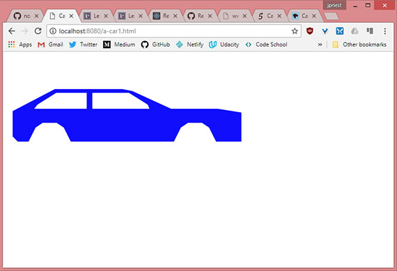
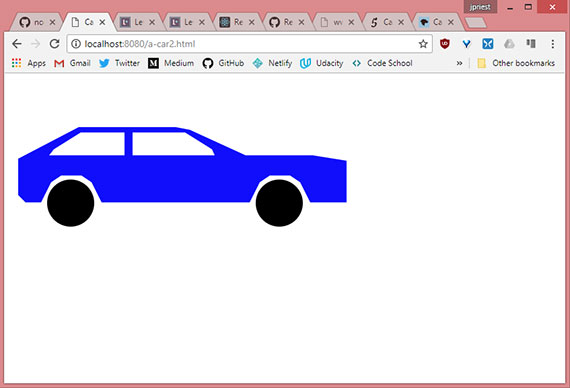

<!-- markdownlint-disable MD022 MD024 MD032 -->
# Chapter 12 - SVG

Notes from [Programming in HTML5 with JavaScript & CSS3 Training Guide](https://www.amazon.com/Training-Guide-Programming-JavaScript-Microsoft/dp/0735674388) by Glenn Johnson.

This is part of my study material for passing Microsoft's [Exam 70-480: Programming in HTML5 with JavaScript & CSS3](https://www.microsoft.com/en-us/learning/exam-70-480.aspx) certification exam.

---

## 1. What is SVG

What is scalable vector graphics (SVG), and why would you want to use it?

In the previous section, [HTML5 Canvas](CH12-Canvas.md), you learned to draw on a `<canvas>` element, using JavaScript. Although you might have used shape-specific methods such as `fillRect()` or `arc()`, the rendering on the canvas is done in a **bitmapped manner**.

This means that calling various methods command pixels to be rendered according to code parameters, and after the shape is rendered, the canvas is left with bitmapped results.

This also means, the canvas doesn't store the fact that you created a rectangle. Also, if the drawing surface is scaled larger, the canvas only has the pixels to work with, so the results is a **blocky and pixelated version of the graphic**.

**SVG is different from canvas;** with SVG, the commands are stored in a manner that enables them to be re-executed. If  the size of the drawing surface changes, the commands can be scaled and re-executed for the new drawing to create a new image, based on the SVG command. **The result is that you see a crisp image regardless of the scale.**

Even though SVG renders better than canvas, it takes time to scale and re-execute the commands, so performance is not as good. **Canvas is preferable when performance is more important.**

SVG is XML-based, and you can embed SVG in your HTML page by using the `<svg>` element. The `<svg>` element, plus its content, is part of the document object model (DOM), so all of the `<svg>` element and its children are accessible from JavaScript.

Events can also be attached to any of the elements. However, you don't want to write all the XML that's required to create a complex drawing. It's typically best to use an SVG editor to create the drawing and then embed the drawing into your webpage.

In this lesson you'll learn how to use the `<svg>` element to embed a drawing in an HTML page to display simple graphics. IN addition, you  learn how to use the `` element to display `.svg` files.

## 2. Using the svg element
The `<svg>` element is a container for the XML-based command. Using it in your HTML page enables you to embed your drawing directly into the page. The following is an example of a basic `<svg>` element.

```html
<svg width="500" height="300" xmlns="http://www.w3.org/2000/svg">
</svg>
```

Here the width and height are set, and the XML namespace is defined to indicate that this is an SVG drawing.

## 3. Creating a path
A path is a sequence of commands that create a complex shape. Use the `<path>` element, which has an `id`, `fill`, and `d` attributes, to create a path.

The `fill` attribute is passed the color with which you want to fill the path. The `d` attribute is for the `<path>` element's data, which is populated with the commands and typically starts with a command to move to the point at which the drawing of the shape begins.

The command to move is `m` or `M`. When the lowercase command is used, it indicates that the coordinates are relative. Uppercase indicates the coordinates are absolute.

The following is a list of command that can be used in a path.

- **M or m** Move to a specified coordinate.
- **L or l** Draw a line from the current location to the coordinate specified
- **H or h** Draw a horizontal line from the current location to the new `x` value specified on the same horizontal plane.
- **V or v** Draw a vertical line from the current location to the new `y` value specified on the same vertical plane.
- **A or a** Parameters are `rx`, `ry`, `x-axis-rotation`, `large-arc`, `sweep`, `x`, and `y`. This command draws an elliptical arc from the current point to the specified coordinate of `x, y` with a x-radius of `rx` and y-radius of `ry`. The ellipse is rotated `x-axis-rotation` degrees. If the arc is less than 180 degrees, `large-arc` is zero; else it is set to 1. If the arc is drawn in the positive direction, the `sweep` is set to 1;else it is set to zero;
- **Q or q** Parameters are `x1`, `y1`, `x`, and `y`. This command draws a quadratic Bezier curve from the current location to the coordinate specified as x, y by using the control point specified as x1, y1.
- **T or t** Draws a quadratic Bezier curve from the current point to the coordinate specified, using the previous Q command's control point.
- **C or c** Parameters are `x1`, `y1`, `x2`, `y2`, `x` and `y`. This command draws a cubic Bezier curve from the current point to the x, y coordinate specified by using control point x1, y1 for the beginning of the curve and control point x2,y2 for the end of the curve.
- **S or s** Parameters are `x2`, `y2`, `x`, and `y`. This command draws a cubic Bezier curve from the current point to the x, y coordinate specified by using the control point from the previous C command for the beginning of the curve and control point X2, y2 for the end of the curve.
- **Z or z** Close the path from the current position to the beginning of the path.

The following example draws a car body by using a path that moves to 267, 76 and draws lines by using the `l` (lowercase L) command.

```html
<svg width="500" height="300" xmlns="http://www.w3.org/2000/svg">
  <path d="m267 76 l-21 -4 -144 0 -90 47 0 54 11 11 23 0 15 -30 15 -10 30 0 15
           10 15 30 220 0 15 -30 15 -10 30 0 15 10 15 30 125 0 7 -7 -13 -38 -20
           -10 -95 -15 -100 0 z" fill="blue" id="carBody" />
</svg>
```

In this example, the lowercase L was not repeating for each line command, which demonstrates that you can specify the command once, provide parameters, provide parameters again, and so on. The path ends with the lowercase Z command, which closes the path. The `fill` color is set to `blue`, and the `id` attribute is set to `carBody`.

Here are two mor paths, which create the front and rear windows of the car.

```html
  <path d="m65 105 l40 -25 65 0 0 34 -112 0 z" fill="white" id="rearWindow" />
  <path d="m300 105 l-40 -25 -78 0 0 34 122 0 z" fill="white" id="frontWindow" />
```

These paths have a fill color of white.

[](assets/images/full-size/chap12-27.png)<br>
**Live sample:** <a href="https://james-priest.github.io/node_samples/ch12-SVG/a-car1.html" target="_blank">https://james-priest.github.io/node_samples/ch12-SVG/a-car1.html</a>

## 4. Drawing circles
You can add circles to an SVG drawing by using the `<circle>` element, which has `r`, `cx`, `cy`, `fill`, and `id` attributes. The r attribute sets the circle radius. The cx and cy attributes set the circle center coordinate. The fill attribute sets the color of the circle.

The following adds two wheels to the car.

```html
  <circle r="35" cy="185" cx="90" fill="black" id="realWheel" />
  <circle r="35" cy="185" cx="400" fill="black" id="frontWheel" />
```

The completed `<svg>` element.

```html
<svg width="500" height="300" xmlns="http://www.w3.org/2000/svg">
  <path d="m267 76 l-21 -4 -144 0 -90 47 0 54 11 11 23 0 15 -30 15 -10 30 0 15
          10 15 30 220 0 15 -30 15 -10 30 0 15 10 15 30 125 0 7 -7 -13 -38 -20
          -10 -95 -15 -100 0 z" fill="blue" id="carBody" />
  <path d="m65 105 l40 -25 65 0 0 34 -112 0 z" fill="white" id="rearWindow" />
  <path d="m300 105 l-40 -25 -78 0 0 34 122 0 z" fill="white" id="frontWindow" />
  <circle r="35" cy="185" cx="90" fill="black" id="realWheel" />
  <circle r="35" cy="185" cx="400" fill="black" id="frontWheel" />
</svg>
```

The completed car outline.

[](assets/images/full-size/chap12-28.png)<br>
**Live sample:** <a href="https://james-priest.github.io/node_samples/ch12-SVG/a-car2.html" target="_blank">https://james-priest.github.io/node_samples/ch12-SVG/a-car2.html</a>

## 5. SVG in img element
You have just seen how you can create SVG images by writing the XML yourself, but you can use any of the SVG editors, such as svg-edit which is a browser-based application, available at [https://github.com/SVG-Edit/svgedit](https://github.com/SVG-Edit/svgedit).

If you use an SVG editor, you typically want to externalize the SVG into its own file to make it easier to work on the drawing rather than embedding the drawing in your HTML page in an `<svg>` element. You can do this by using the `` element and setting the source to the location of the `.svg` file.

In the following example, the `<svg>` element is cut from the HTML page and pasted into a new file called car.svg. In the HTML page, an `` element is added with a reference to the car.svg file.

```html
<!DOCTYPE html>
<html lang="en">
<head>
    <meta charset="UTF-8">
    <meta name="viewport" content="width=device-width, initial-scale=1.0">
    <meta http-equiv="X-UA-Compatible" content="ie=edge">
    <title>Car 3</title>
</head>
<body>
    
</body>
</html>
```

When you display the HTML page the car is displayed but if you try to resize the page, the image won't resize because the settings need to be changed.

## 6. Making SVG scalable
The SVG file currently has the content from the `<svg>` element, but you need to make some changes to make the image scale. First, change the height and width setting to 100 percent and then add a `viewBox` attribute to the `<svg>` element.

The `viewBox` attribute describes the part of the canvas you want the viewer to see. Even though the drawing covers the entire computer screen, the figure on you drawing might only exist in a small part of the drawing. The `viewBox` attribute enables you to tell the parser to zoom in on that part to eliminate the extra white space.

The `viewBox` attribute has four parameters: the minimum x coordinate, the minimum y coordinate, the width, and the height. This enables you to describe the rectanglular area to be displayed. In this example, some white space at the top and bottom will be cropped so the following is the viewBox setting.

```html
viewBox="0 50 500 175"
```

This setting crops 50 pixels from the top and limits the viewing height to 175 pixels. The original width of the drawing was 500 pixels, and there isn't a lot of white space on the sides, so it is left as is.

```html
<svg width="100%" height="100%" xmlns="http://www.w3.org/2000/svg"
    viewBox="0 50 500 175">
    <path d="m267 76 l-21 -4 -144 0 -90 47 0 54 11 11 23 0 15 -30 15 -10 30 0 15
            10 15 30 220 0 15 -30 15 -10 30 0 15 10 15 30 125 0 7 -7 -13 -38 -20
            -10 -95 -15 -100 0 z" fill="blue" id="carBody" />
    <path d="m65 105 l40 -25 65 0 0 34 -112 0 z" fill="white" id="rearWindow" />
    <path d="m300 105 l-40 -25 -78 0 0 34 122 0 z" fill="white" id="frontWindow" />
    <circle r="35" cy="185" cx="90" fill="black" id="realWheel" />
    <circle r="35" cy="185" cx="400" fill="black" id="frontWheel" />
</svg>
```

In the css, the following style rule has been added to resize the `` element when the page resizes.

```css
img { width: 100%; }
```

Once we refresh the page the image resizes to fill the space.

[](assets/images/full-size/chap12-29.png)<br>
**Live sample:** <a href="https://james-priest.github.io/node_samples/ch12-SVG/a-car3.html" target="_blank">https://james-priest.github.io/node_samples/ch12-SVG/a-car3.html</a>

## 7. Summary

- The `<svg>` element is used to create and display scalable vector graphics (SVG).
- SVG is XML-based, and the contents of the `<svg>` element contain the commands that compose the drawing in XML format. The `<svg>` element can be placed in an `.svg` file
- Use the `<path>` element to create complex shapes. The path contains a list of commands to create a shape. 
- Each command is represented as an uppercase or lowercase letter. Uppercase indicates that the coordinates are absolute; lowercase indicates the coordinates are relative.
- The `<circle>` element is used to draw a circle. To include an external `.svg` file on an HTML page, use the `` element and set the src element to the location of the `.svg` file.
- To make the `<svg>` element automatically scale when the HTML page is resized, set the height and width attributes on the `<svg>` element to 100 percent and add a `viewBox` attribute that describes the view area of the drawing. Finally, add a style to your `` element that sets its width to 100 percent.