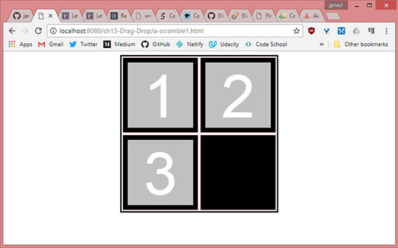
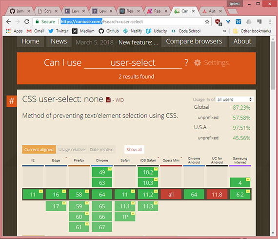
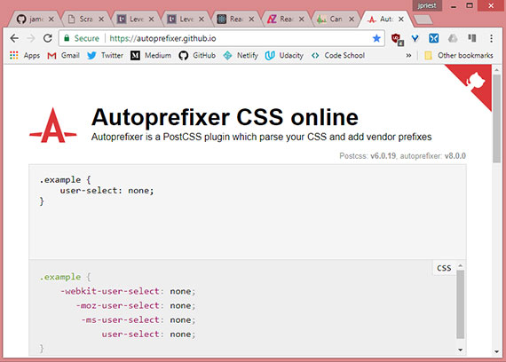
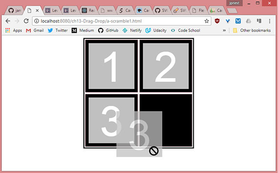
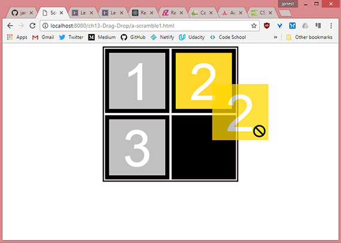
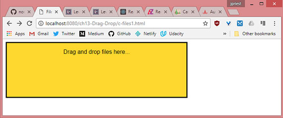
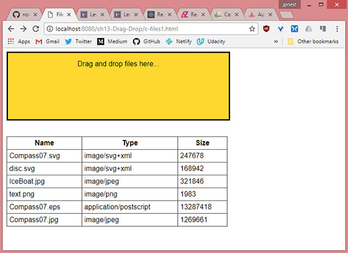

<!-- markdownlint-disable MD022 MD024 MD032 -->
# Chapter 13 - Drag & Drop

Notes from [Programming in HTML5 with JavaScript & CSS3 Training Guide](https://www.amazon.com/Training-Guide-Programming-JavaScript-Microsoft/dp/0735674388) by Glenn Johnson.

This is part of my study material for passing Microsoft's [Exam 70-480: Programming in HTML5 with JavaScript & CSS3](https://www.microsoft.com/en-us/learning/exam-70-480.aspx) certification exam.

---

Prior to HTML5, the ability to use drag and drop operations was possible only with certain browsers and was typically implemented by using a third-party library such as jQuery.

Now Drag and drop is a first-class citizen of HTML5. You might still use jQuery for other functionality but it's not required for drag and drop.

## 1. Dragging and dropping
Making drag and drop part of HTML5 means that you can get browser compatibility and browser integration. This can even extend to integration with the operating system.

To illustrate the drag and drop technique, consider the following HTML page, which defines a large square container inside it.

```html
<!DOCTYPE html>
<html lang="en">
<head>
    <meta charset="UTF-8">
    <meta name="viewport" content="width=device-width, initial-scale=1.0">
    <meta http-equiv="X-UA-Compatible" content="ie=edge">
    <title>Scramble 1</title>
    <link rel="stylesheet" href="a-scramble.css">
</head>
<body>
    <div id="container">
        <div id="hole1" class="hole"><div id="item1" class="item">1</div></div>
        <div id="hole2" class="hole"><div id="item2" class="item">2</div></div>
        <div id="hole3" class="hole"><div id="item3" class="item">3</div></div>
        <div id="hole4" class="hole"></div>
    </div>

    <script src="https://code.jquery.com/jquery-3.3.1.slim.min.js" 
    integrity="sha256-3edrmyuQ0w65f8gfBsqowzjJe2iM6n0nKciPUp8y+7E=" 
    crossorigin="anonymous"></script>
    <script src="a-scramble1.js"></script>
</body>
</html>
```

This HTML document contains a `<div>` element whose `id` is called `container`. Inside the container are four `<div>` elements that are "holes" which can contain an item. The first three are populated.

The CSS uses flexbox for centering and contains the following rules.

```css
body {
    display: flex;
    justify-content: center;
}
#container {
    border: solid;
    width: 332px;
    height: 332px;
    display: flex;
    flex-wrap: wrap;
    align-items: center;
    justify-content: space-around;
}
.hole {
    background-color: black;
    border: 1px pink solid;
    width: 160px;
    height: 160px;
    display: flex;
    align-items: center;
    justify-content: center;
}
.item {
    font-size: 128px;
    font-family: Arial, Helvetica, sans-serif;
    width: 140px;
    height: 140px;
    background-color: #C0C0C0;
    color: #FFF;
    text-align: center;
    user-select: none;
}
```

The `body` rule centers the container `<div>` horizontally on the page. The `#container` rule sets flexbox display to center and align each hole (`<div id="hole">`).

The rules under `.hole` set flexbox display to center each item element (`<div id="item">`) within each hole. The final rule is for the items and it sets a gray square with a large, centered number. The last part of the style sets `user-select: none;` to keep the user from accidentally selecting the text when trying to do a drag.

[](assets/images/full-size/chap13-1.png)<br>
**Live sample:** <a href="https://james-priest.github.io/node_samples/ch13-Drag-Drop/a-scramble1.html" target="_blank">https://james-priest.github.io/node_samples/ch13-Drag-Drop/a-scramble1.html</a>

## 2. Browser support
There are two tools I use to make sure the code I write works in as many browsers and platforms as possible. In other words, I get cross-browser compliance and as wide a coverage as possible for the CSS, JavaScript, and HTML5 features I use.

The two tools are:

- Can I Use... ([https://caniuse.com/](https://caniuse.com/))
- CSS Autoprefixer ([https://autoprefixer.github.io/](https://autoprefixer.github.io/))

## 3. Can I Use
This is a brilliant tool that allows you to search for any HTML, JavaScript or CSS feature and see what the current browser coverage is on the feature. This allows you to then make an informed decision on whether to use the feature as is, use it with a polyfill and/or autoprefix, or to find a separate way altogether to implement the functionality.

For instance, we have a CSS rule that implements `user-select: none;`. If I then go to http://caniuse.com, I can get all sorts of information on that feature.

[](assets/images/full-size/chap13-3.png)

Here I see all the browser that currently support the feature along with the version number that began support for it. This includes IE11, Edge16+, Firefox58+, Chrome64+, etc. Additionally, I can hover over any one of the browser boxes to see support notes, release date, and market share to get the percentage of users using that particular platform!

The information I find **really useful** though are the statistics on the right hand side of the page. Here we see that globally my `user-select` feature will be supported in 87.23% of all browser and 97.51% of browsers domestically.

The data that's particularly interesting are the _unprefixed_ numbers. This shows we'll only have 57.58% & 45.56% browser support, respectively, without including autoprefixing.

This means we'll effectively lose half our user-base if we don't autoprefix our CSS.

## 4. CSS Autoprefixing
So, what's autoprefixing? That brings us to tool #2.

Autoprefixing is the process of using browser-specific css to ensure a particular feature is rendered properly on that platform.

Take a look at the interface of CSS Autoprefixer.

[](assets/images/full-size/chap13-4.png)

The way it works is, we copy our CSS into the source container and the CSS prefixed output is displayed in the output container.  We can then copy and paste this back into our css file.

For the record, this is the manual way of achieving this. There are many pre and post processor solutions that will do this for you automatically, but these require installation and configuration. For now, the quick and dirty solution is to simply copy and paste.

As you can see, `user-select: none;` outputs four different rules or declarations to be compliant across various browsers.

Using the new CSS ensures the feature functionality will jump back up from 57 & 45 percent to 87 and 97 percent, respectively.

The final step, once we're done working with our CSS, is to copy the contents of our entire CSS into the source container in order to get a finalized output copy.

For purposes of these notes I will keep the CSS simple and unprefixed.

## 5. Dragging
To specify to the browser that an element can be dragged, use the `draggable` attribute. It has three valid values: `true`, `false`, and `auto`. For most browsers `auto` is the default which means the browser decides whether the element should be draggable. For example, the `` element is usually draggable by default, but a `<div>` is not.

In this HTML sample the item is a `<div>` element, and it's not draggable by default so we need to add the draggable attribute.

```html
<div id="container">
    <div id="hole1" class="hole">
        <div id="item1" draggable="true"  class="item">1</div>
    </div>
    <div id="hole2" class="hole">
        <div id="item2" draggable="true"  class="item">2</div>
    </div>
    <div id="hole3" class="hole">
        <div id="item3" draggable="true"  class="item">3</div>
    </div>
    <div id="hole4" class="hole"></div>
</div>
```

After adding the `draggable` attribute to the items, you can drag them.

[](assets/images/full-size/chap13-2.png)<br>
**Live sample:** <a href="https://james-priest.github.io/node_samples/ch13-Drag-Drop/a-scramble2.html" target="_blank">https://james-priest.github.io/node_samples/ch13-Drag-Drop/a-scramble2.html</a>

You can drag and item, but the item contains the _no-entry_ cursor symbol to indicate that the item cannot be dropped.

## 6. Understanding drag events
When dragging and dropping, there are events that are based on the dragged element, and there are events based on the drop target. Using these events, you should be able to customize the drag and drop operation as needed. **The following events are based on the dragged element.**

- **dragstart** Triggers when the drag is started
- **drag** Triggers continuously as the element is being dragged
- **dragend** Triggers when the drag is finished

The following code is placed in the scramble1.js file and shows the use of the `dragstart` and `dragend` events to change the style of the item being dragged until the dragging ends.

```js
var $draggedItem;

$(document).ready(function() {
    $('.item').on('dragstart', dragging);
    $('.item').on('dragend', draggingEnded);
});

function dragging(e) {
    $(e.target).addClass('dragging');
    $draggedItem = $(e.target);
}

function draggingEnded(e) {
    $(e.target).removeClass('dragging');
}
```

The example uses the jQuery document ready function to subscribe to the `dragstart` and `dragend` events on all elements that have the CSS class 'item' assigned. The `dragging()` function add the 'dragging' CSS class when the dragging start and then sets `$draggedItem` with the value of the item being dragged. The `draggingEnded()` function removes the 'dragging' class.

In the CSS file the dragging rule is defined as follows.

```css
.dragging {
    background-color: yellow;
}
```

This changes the background of the dragged item until the dragging stops.

[](assets/images/full-size/chap13-5.png)<br>
**Live sample:** <a href="https://james-priest.github.io/node_samples/ch13-Drag-Drop/a-scramble3.html" target="_blank">https://james-priest.github.io/node_samples/ch13-Drag-Drop/a-scramble3.html</a>

## 7. Dropping
After dragging, the drop must be made operational. The following events are based on the drop target.

- **dragenter** Triggers when the drag enters a drop zone
- **dragover** Triggers continuously as the element is dragged over the drop zone
- **dragleave** Triggers when the dragged item leaves a drop zone
- **drop** Triggers when the dragged item is dropped

The `dragenter` and `dragover` events default to rejecting dragged items, which is why you can't currently drop an item. You can enable dropping by cancelling the default action on these events.

The `drop` event removes the dropped item from the document object model (DOM) and then adds it back to the DOM at the drop zone location. The following code subscribes to the `dragenter`, `dragover`, and `drop` events.

```js
var $draggedItem;

$(document).ready(function() {
    $('.item').on('dragstart', dragging);
    $('.item').on('dragend', draggingEnded);
    $('.hole').on('dragenter', preventDefault);
    $('.hole').on('dragover', preventDefault);
    $('.hole').on('drop', dropItem);
});

function dragging(e) {
    $(e.target).addClass('dragging');
    $draggedItem = $(e.target);
}

function draggingEnded(e) {
    $(e.target).removeClass('dragging');
}

function preventDefault(e) {
    e.preventDefault();
}

function dropItem(e) {
    var hole = $(e.target);
    if (hole.hasClass('hole') && hole.children().length === 0) {
        $draggedItem.detach();
        $draggedItem.appendTo(hole);
    }
}
```

In this example, the document ready function has added statements to subscribe to `dragenter`, `dragover`, and `drop`. Notice that `dragenter` and `dragover` call the same `preventDefault()` function, which prevents the rejection of the dragged items.

The `drop` event calls the dropItem function. In `dropItem`, a jQuery object is created from `e.target`, which is the drop target, and is assigned to a `hole` variable. The `if` statement checks whether the drop target has the 'hole' CSS class. This is necessary because you might drop something on top of an 'item' instead of a 'hole'.

When the item is in a hole, the drop event bubbles up and executes the drop event on the hole. If the drop target is a hole, the code checks whether there are children; if there is a child, this hole already has an item, and you shouldn't be able to drop.

If the drop target is a hole with no children, jQuery detaches the dragged item from the DOM and then appends `$draggedItem` to the drop target.

[](assets/images/full-size/chap13-6.png)<br>
**Live sample:** <a href="https://james-priest.github.io/node_samples/ch13-Drag-Drop/a-scramble4.html" target="_blank">https://james-priest.github.io/node_samples/ch13-Drag-Drop/a-scramble4.html</a>

> ### Quick check
> - Which two events' default operations must be prevented to allow the drop event to operate?
>
> ### Solution
> - The `dragenter` and `dragover` events

## 8. Using the DataTransfer object
The previous example demonstrates a complete drag and drop operation, but you can also use the `DataTransfer` boject to pass data from the `dragstart` event to the `drop` event.

By using the DataTransfer object, you don't need to create a global variable to reference the item being dragged. Using the DataTransfer object also empowers you to pass any data to the `drop` event as long as it can be represented as a string or URL. The `DragStart` object is referenced as a `dataTransfer` property on the `dragstart` event.

> ### NOTE: Using the DataTransfer object with jQuery
> jQuery's event system normalizes the event object according to W3C standards. Most properties from the original event are copied over and normalized to the new event object.
>
> `dataTransfer` is one property that does not get copied to jQuery's standardized Event object. ThereforeIt can be accessed using the `event.originalEvent` object as follows.
>
> `var dt = event.originalEvent.dataTransfer;`

You can pass data to the drop event by using the `dataTransfer` property. The DataTransfer object has the following members.

- **clearData()** Method that clears the data in the DataTransfer object
- **dropeffect** Property that gets or sets the type of drag and drop operation and the cursor type. It can be set to `copy`, `link`, `move`, or `none`.
- **effectAllowed** Property that gets or sets the allowed operations on the source element. It can be set to `copy`, `copyLink`, `copyMove`, `link`, `linkMove`, `move`, `all`, `uninitialized`, or `none`.
- **files** Property that gets a file list of the files being dragged .If files aren't involved the property is an empty list.
- **getData()** Method that gets the data in the DataTransfer object
- **setData()** Method that sets the data in the DataTransfer object
- **types** Property that gets a string list of types being sent.

In the following example, the HTML document has an unordered list of cars, from which you can drag and drop any of the cars to a different unordered list of favorite cars as follows.

```html
<!DOCTYPE html>
<html lang="en">
<head>
    <meta charset="UTF-8">
    <meta name="viewport" content="width=device-width, initial-scale=1.0">
    <meta http-equiv="X-UA-Compatible" content="ie=edge">
    <title>Cars 1</title>
    <style>
        #favoriteCars { min-height:100px; background-color:gold; }
    </style>
</head>
<body>
    <p>What cars do you like?</p>
    <ul>
        <li draggable="true" data-value="car,Chevrolet">Chevrolet</li>
        <li draggable="true" data-value="car,Ford">Ford</li>
        <li draggable="true" data-value="car,BMW">BMW</li>
    </ul>
    <p>Drop your favorite cars below:</p>
    <ul id="favoriteCars"></ul>

    <script src="https://code.jquery.com/jquery-3.3.1.slim.min.js" 
    integrity="sha256-3edrmyuQ0w65f8gfBsqowzjJe2iM6n0nKciPUp8y+7E=" 
    crossorigin="anonymous"></script>
    <script src="b-cars1.js"></script>
</body>
</html>
```

Here, each of the car list items is draggable and uses the data attributes to provide data that will be collected when the dragging starts and then passed to the `drop` event. The JavaScript file is similar to the previous example, which was used to move numbers, but this time, the data is passed to the drop event by using the DataTransfer object as follows.

```js
$(document).ready(function() {
    $('#carList').on('dragstart', dragging);
    $('#favoriteCars').on('dragenter', preventDefault);
    $('#favoriteCars').on('dragover', preventDefault);
    $('#favoriteCars').on('drop', dropItem);
});

function dragging(e) {
    var val = e.target.dataset.value;
    e.originalEvent.dataTransfer.setData('text/plain', val);
    e.originalEvent.dataTransfer.effectAllowed = 'copy';
}

function preventDefault(e) {
    e.preventDefault();
}

function dropItem(e) {
    var data = e.originalEvent.dataTransfer.getData('text').split(',');
    if (data[0] === 'car') {
        var li = document.createElement('li');
        li.textContent = data[1];
        e.target.appendChild(li);
    }
}
```

In the document ready function we subscribe to the required events. The `dragging()` function is called when the dragging starts. It collects the data from the data-value attribute and assigns it to the DataTransfer object. The `effectAllowed` property is set to 'copy', which changes the mouse pointer to a pointer with a plus sign under it. If it were set to 'move', the pointer would be a pointer with a small box under it.

The `dropItem` function is called from the `drop` event. The DataTransfer object is also available on the drop event through the `dataTransfer` property. The data is retrieved, split into an array, and assigned to a variable. Next the element is tested to see if its a car. If so, a new list item is created and appended to the drop element. Lastly, we call `preventDefault()` method of the event that's handled the drop so that the default browser handling does not handle the dropped data as well.

[](assets/images/full-size/chap13-7.png)<br>
**Live sample:** <a href="https://james-priest.github.io/node_samples/ch13-Drag-Drop/b-cars1.html" target="_blank">https://james-priest.github.io/node_samples/ch13-Drag-Drop/b-cars1.html</a>

## 9. Summary

- The drag and drop functionality in HTML5 is now consistent and compatible across browsers.
- The drag and drop attribute must be set to true and added to each element that needs to be draggable.
- The `dragstart` and `dragend` events can be used to change the style of the element being dragged.
- The `dragenter` and `dragover` events must be coded to prevent the default operation and enable dropping.
- The `drop` event triggers when the item is dropped on a drop target.
- The DataTransfer object is used to pass data between the `dragstart` event and the `drop` event.

## 10. Review Questions

1. Which of the following events trigger continuously during a drag and drop operation?
    - [ ] dragstart
    - [x] drag
    - [ ] dragend
    - [ ] dragenter
    - [x] dragover
    - [ ] dragleave
    - [ ] drop

1. Which of the following events are associated with the item being dragged?
    - [x] dragstart
    - [x] drag
    - [x] dragend
    - [ ] dragenter
    - [ ] dragover
    - [ ] dragleave
    - [ ] drop

1. Using the DataTransfer object, what kind of data can you pass to the drop event?
    - [ ] Any valid string, number, date/time, or Boolean value
    - [ ] Any URL that is within the dame domain as the webpage
    - [ ] Any JSON object
    - [x] Any object that can be represented as a string or URL

## 11. Dragging & dropping files
You can drag and drop files using the File API (application programming interface), which is also part of HTML5. The File API provides indirect access to files in a tightly controlled manner.

## 12. Using FileList & File objects
When dropping a file, the DataTransfer object returns a `FileList` object which is a collection of `File` objects that were dropped. The `File` object has the following properties.

- **name** Property that gets the file name and extension without a path.
- **type** Property that gets the MIME type of the file.
- **size** Property that gets the file size in bytes.

The following HTML document has a `<div>` element onto which files can be dropped and a `<table>` element that is populated with information about the dropped files.

```html
<!DOCTYPE html>
<html lang="en">
<head>
    <meta charset="UTF-8">
    <meta name="viewport" content="width=device-width, initial-scale=1.0">
    <meta http-equiv="X-UA-Compatible" content="ie=edge">
    <title>Files 1</title>
    <link rel="stylesheet" href="c-files1.css">
</head>
<body>
    <div id="target">
        <p>Drag and drop files here...</p>
    </div>
    <table id="fileInfo"></table>

    <script src="https://code.jquery.com/jquery-3.3.1.slim.min.js" 
    integrity="sha256-3edrmyuQ0w65f8gfBsqowzjJe2iM6n0nKciPUp8y+7E=" 
    crossorigin="anonymous"></script>
    <script src="c-cars1.js"></script>
</body>
</html>
```

The css file contains rules to size the drag and drop target as well as tules to format the information table.

```css
body { font-family: Arial, Helvetica, sans-serif; }
#target {
    border: solid;
    width: 500px;
    height: 150px;
    background-color: gold;
    text-align: center;
}
#fileInfo {
    width: 500px;
}
table, th, td {
    border-collapse: collapse;
    border: 1px solid #333;
}
th, td {
    padding: 5px;
}
```

There is no JavaScript yet, so you might think that you can't drag and drop any files here, but there is a default behavior for files that are dragged and dropped. If you drop a file anywhere on the webpage, the file will open in-page if the browser can render the file otherwise it will open in another window.

[](assets/images/full-size/chap13-8.png)<br>
**Live sample:** <a href="https://james-priest.github.io/node_samples/ch13-Drag-Drop/c-files1.html" target="_blank">https://james-priest.github.io/node_samples/ch13-Drag-Drop/c-files1.html</a>

To process the dropped files and display the file information in a table below the drop box, the following JavaScript is added.

```js
$(document).ready(function() {
  $('#target').on('dragenter', preventDefault);
  $('#target').on('dragover', preventDefault);
});

function preventDefault(e) {
  e.preventDefault();
}
```

In the document ready function, jQuery is set up to expose the DataTransfer object. The `dragenter` and `dragover` events are then programmed to prevent the default operation that prevents dropping. Once the `drop` event is added, the dragged file can be dropped.

We subscribe to that `drop` event and add the `dropItem()` function handler. The JavaScript is completed with the following code.

```js
$(document).ready(function() {
  $('#target').on('dragenter', preventDefault);
  $('#target').on('dragover', preventDefault);
  $('#target').on('drop', dropItem);
});

function preventDefault(e) {
  e.preventDefault();
}

function dropItem(e) {
  var files = e.originalEvent.dataTransfer.files,
      $table = $('#fileInfo'),
      i = 0;

  $table.html('<thead><tr><th>Name</th><th>Type</th><th>Size</th></tr></thead>');
  for (i = 0; i < files.length; i++) {
      $('<tr><td>' + files[i].name +
        '</td><td>' + files[i].type +
        '</td><td>' + files[i].size +
        '</td></tr>').appendTo($table);
  }
  e.preventDefault();
}
```

The `dropItem` function retrieves the files collection from the DataTransfer object. The content in the file information table is overwritten with the header, which also clears any existing information that was in the table. Next, a for loop is used to loop over the files and add a row of information to the file info table for each file. Finally, we prevent the browser's default behavior which is to open each of the files.

Now we can grab a series of files and drag them on the yellow drop area.

[](assets/images/full-size/chap13-9.png)<br>
**Live sample:** <a href="https://james-priest.github.io/node_samples/ch13-Drag-Drop/c-files2.html" target="_blank">https://james-priest.github.io/node_samples/ch13-Drag-Drop/c-files2.html</a>

Once several files are dragged and dropped the file information table populates and displays the information.

[](assets/images/full-size/chap13-10.png)<br>
**Live sample:** <a href="https://james-priest.github.io/node_samples/ch13-Drag-Drop/c-files2.html" target="_blank">https://james-priest.github.io/node_samples/ch13-Drag-Drop/c-files2.html</a>

> ### Quick check
> - Which object provides access to the dropped files?
>
> ### Solution
> - The DataTransfer object

## 13. Lesson summary

- The File object provides the name, type, and size properties.
- To enable dropping of files, the `dragenter` and `dragover` events must be programmed to prevent the default behavior that prevents dropping.
- The DataTransfer object provides access to the list of dropped files.
- The `drop` event provides access to the DataTransfer object.

## 14. Lesson review

1. To which events do you need to subscribe to program file drag and drop?
    - [ ] dragstart
    - [ ] drag
    - [ ] dragend
    - [ ] dragenter
    - [ ] dragover
    - [ ] dragleave
    - [x] drop

2. Which of the following is not a property on the File object?
    - [ ] name
    - [x] path
    - [ ] type
    - [ ] size