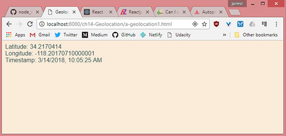
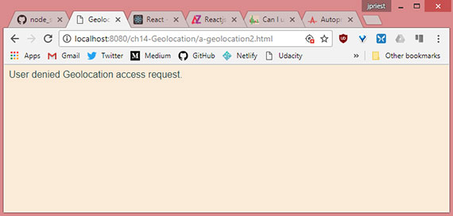
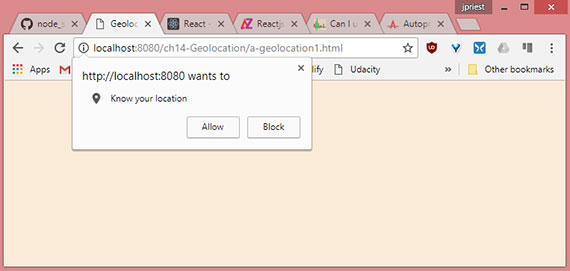
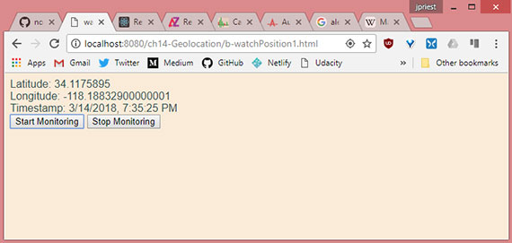
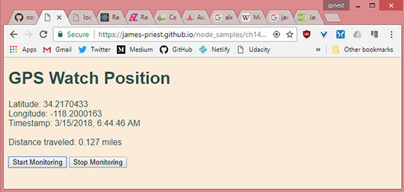

<!-- markdownlint-disable MD022 MD024 MD032 -->
# Chapter 14 - Geolocation

Notes from [Programming in HTML5 with JavaScript & CSS3 Training Guide](https://www.amazon.com/Training-Guide-Programming-JavaScript-Microsoft/dp/0735674388) by Glenn Johnson.

This is part of my study material for passing Microsoft's [Exam 70-480: Programming in HTML5 with JavaScript & CSS3](https://www.microsoft.com/en-us/learning/exam-70-480.aspx) certification exam.

---

The Geolocation API provides an interface with device location information such as latitude and longitude; you can use the Geolocation API to make your applications location-aware.

The API is generic enough to interface with many underlying location information sources such as GPS and location inferred from network signals such as IP address, radio frequency identification (RFID), WiFi and Bluetooth MAC addresses, cell IDs, and user input.

No guarantee is given that the API returns the device's actual location, and the accuracy can vary widely.

The API is designed to enable both one-shot position requests and repeated position updates. Lesson 1, "Basic positioning," covers one-shot queries; Lesson 2, "monitored positioning," covers repeated position updates.

# Lesson 1
## 1. Basic positioning
The Geolocation object is accessible by using the `navigator.geolocation` global variable. Most browsers support the Geolocation API, and the following code can be used to test if this feature is available.

```js
function supportsDeolocation() {
    return 'geolocation' in navigatior;
}
```

The code checks whether a geolocation property is on the object that's referenced by the `navigator` global variable. If the property exists, it will reference the Geolocation object.

## 2. Geolocation object reference
The Geolocation object has a simple API with the following methods.

- **getCurrentPosition()** Method accepts a success callback, and error callback, and options array and calls the success callback with the current position
- **watchPosition()** Method that accepts a success callback, an error callback, and an options array and _continuously_ calls the success callback with the current position
- **clearWatch()** Method that stops continuous calling that was started by using the `watchPosition()` method

Notice that the `getCurrentPosition()` and `watchPosition()` methods have the same parameters. Both these methods provide access to the the Position object as a parameter of the success callback. The Position object has the following properties.

- **coords** Gets a Coordinates object that contains information about the current position
- **timestamp** Get the time that the Coordinates object was created. The format for the timestamp is milliseconds since the start of the Unix Epoch and can be converted to a regular date and time by using the following code.

    `var dataTime = new Date(timestamp).toLocaleString();`

By focusing on the coords property that gets a Coordinates object, the Coordinates object contains the following information about the current location.

- **latitude** Gets the latitude in decimal degrees
- **longitude** Gets the longitude in decimal degrees
- **altitude** Gets the height in meters
- **accuracy** Gets the accuracy of the coordinates in meters
- **altitudeAccuracy** Gets the accuracy of the altitude in meters
- **heading** Gets the direction fo travel in degrees
- **speed** Gets the speed of travel in meters/second

The device hardware is the determining factor regarding the properties returned. For example, with GPS, most properties are populated, but if location is determined by using you IP, you might be missing altitude, heading, and speed-related information.

## 3. Retrieving the current position
It is easy to retrieve the current position by using the Geolocation object's `getCurrentPosition()` method. At a minimum, you need to pass a callback method to receive a Position object, which has `coords` and `timestamp` properties. For the subsequent examples, consider the following webpage.

```html
<!DOCTYPE html>
<html lang="en">
<head>
    <meta charset="UTF-8">
    <meta name="viewport" content="width=device-width, initial-scale=1.0">
    <meta http-equiv="X-UA-Compatible" content="ie=edge">
    <title>Geolocation 1</title>
    <link rel="stylesheet" href="a-geolocation.css">
</head>
<body>
    <div id="message"></div>

    <script src="https://code.jquery.com/jquery-3.3.1.min.js"
    integrity="sha256-FgpCb/KJQlLNfOu91ta32o/NMZxltwRo8QtmkMRdAu8="
    crossorigin="anonymous"></script>
    <script src="a-geolocation1.js"></script>
</body>
</html>
```

The webpage has a reference to jQuery, a css file, and a js file. It also contains an empty `<div>` with an id of 'message'. The following code example demonstrates a simple call to the `getCurrentPosition` method.

```js
$(document).ready(function() {
    getLocation();
});

function supportsGeolocation() {
    return 'geolocation' in navigator;
}

function showMessage(message) {
    $('#message').html(message);
}

function getLocation() {
    if (supportsGeolocation()) {
        navigator.geolocation.getCurrentPosition(showPosition);
    } else {
        showMessage("Geolocation isn't supported by your browser");
    }
}

function showPosition(position) {
    var datetime = new Date(position.timestamp).toLocaleString();
    showMessage('Latitude: ' + position.coords.latitude + '<br>' +
        'Longitude: ' + position.coords.longitude + '<br>' +
        'Timestamp: ' + datetime);
}
```

The document ready function calls the `getLocation` function. Within `getLocation()` an if statement determines whether it should attempt to call the `getCurrentPosition()` method by calling the `supportsGeolocation()` function. The `supportsGeolocation()` function tests whether the browser supports this feature.

When the `getCurrentPosition()` method is called, the `showPosition()` function is passed. The `showPosition()` function is called when the position information has been successfully obtained. When the `showPosition()` function is called, it's passed a Position object that contains a `coords` and `timestamp` property.

[](assets/images/full-size/chap14-1.png)<br>
**Live sample:** <a href="https://james-priest.github.io/node_samples/ch14-Geolocation/a-geolocation1.html" target="_blank">https://james-priest.github.io/node_samples/ch14-Geolocation/a-geolocation1.html</a>

## 4. Handling errors
You must handle errors when calling methods on the Geolocation object. You handle errors by adding another callback parameter to the call so that the first parameter is the success callback, and the second is the error callback.

```js
$(document).ready(function() {
    getLocation();
});

function supportsGeolocation() {
    return 'geolocation' in navigator;
}

function showMessage(message) {
    $('#message').html(message);
}

function getLocation() {
    if (supportsGeolocation()) {
        navigator.geolocation.getCurrentPosition(showPosition, showError);
    } else {
        showMessage("Geolocation isn't supported by your browser");
    }
}

function showPosition(position) {
    var datetime = new Date(position.timestamp).toLocaleString();
    showMessage('Latitude: ' + position.coords.latitude + '<br>' +
        'Longitude: ' + position.coords.longitude + '<br>' +
        'Timestamp: ' + datetime);
}

function showError(error) {
    switch (error.code) {
        case error.PERMISSION_DENIED:
            showMessage("User denied Geolocation access request.");
            break;
        case error.POSITION_UNAVAILABLE:
            showMessage("Location Information unavailable.");
            break;
        case error.TIMEOUT:
            showMessage("Get user location request timed out.");
            break;
        case error.UNKNOWN_ERROR:
            showMessage("An unknown error occurred.");
            break;
    }
}
```

In this example,  the `showError()`function is called if there is an error when calling the `getCurrentPosition()` method. An error is passed to the `showError()` function and it attempts to determine the cause of the error and display a meaningful message.

[](assets/images/full-size/chap14-2.png)<br>
**Live sample:** <a href="https://james-priest.github.io/node_samples/ch14-Geolocation/a-geolocation2.html" target="_blank">https://james-priest.github.io/node_samples/ch14-Geolocation/a-geolocation2.html</a>

## 5. Addressing privacy
If a webpage can get your current position, is that an invasion of privacy? Yes, and you will receive a prompt that says, "[Domain Name] wants to track you physical location." At that point, you can decide whether you want your location to be retrieved or not.

[](assets/images/full-size/chap14-3.png)

## 6. Specifying options
The third parameter that you can pass to the `getCurrentPosition()` method is the `option`, which is a PositionOptions object that provides you with the following optional properties.

- **enableHIghAccuracy** This specifies that the best possible result is requested even if it takes more time. Default is false.
- **timeout** This specifies the timeout in milliseconds that the browser will wait for a response. Default is -1, which means there is no timeout.
- **maximumAge** Specifies that a cached location is acceptable as long as it's no older than the specified milliseconds. Default is 0, which means that a cached location is not used.

The following is an example of passing the `options` object to the `getCurrentPosition()` method.

```js
function getLocation() {
    if (supportsGeolocation()) {
        var options = {
            enableHighAccuracy: true,
            timeout: 3000,
            maximumAge: 20000
        };
        navigator.geolocation.getCurrentPosition(showPosition, showError, options);
    } else {
        showMessage("Geolocation is not supported by this browser.");
    }
}
```

> ### Quick check
> - What must you do to prevent sites from retrieving you location without your knowledge?
>
> ### Answer
> - When you visit a site that requests your location, a pop-up is displayed, and you must explicitly grant permission to the site before you location can be retrieved.

## 7. Lesson summary

- The Geolocation API provides an interface with device location information.
- Depending on the location source, you can receive latitude, longitude, altitude, heading, speed, and accuracy information.
- The Geolocation API is accessible by using the geolocation property on the `navigator` global variable.
- The Geolocation object has a `getCurrentPosition()` method that is a one-time call to get the current location.
- The `getCurrentPosition()` method takes a _success callback_, and _error callback_, and an `options` parameter.

## 8. Lesson review

1. Which method gets your current location once from the Geolocation object?
    - [ ] watchPosition()
    - [ ] watchLocation()
    - [x] getCurrentPosition()
    - [ ] getCurrentLocation()
1. Which of the following is not a valid parameter on the `getCurrentPosition()` method?
    - [ ] Error callback function
    - [ ] Position options object
    - [ ] Success callback function
    - [x] Use GPS only

# Lesson 2
## 9. Monitored positioning
If you were writing an application that plotted your current location on a map, it would be more efficient to let the Geolocation API tell you when the location changes than write code that continues to poll for the current location. That's the focus of this lesson.

## 10. Where are you now? How about now?
You can you the Geolocation object's `watchPosition()` method to retrieve continuous position updates. This method takes the same parameters as the `getCurrentPosition()` method. The difference is that when you call `watchPosition()` once, it continues calling the success function until you call the `clearWatch()` method to stop monitoring your position.

The `watchPosition()` method returns an id, which is passed to the `clearWatch()` method to end the monitoring. In this example, the webpage is modified with the addition of a button to start location monitoring and another one to end location monitoring.

```js
var watchId = 0;

$(document).ready(function() {
    $('#startMonitoring').on('click', getLocation);
    $('#stopMonitoring').on('click', endWatch);
});

function supportsGeolocation() {
    return 'geolocation' in navigator;
}

function showMessage(message) {
    $('#message').html(message);
}

function getLocation() {
    if (supportsGeolocation()) {
        var options = { enableHighAccuracy: true };
        watchId = navigator.geolocation.watchPosition(showPosition, showError, options);
    } else {
        showMessage("Geolocation isn't supported by your browser");
    }
}

function endWatch() {
    if (watchId != 0) {
        navigator.geolocation.clearWatch(watchId);
        watchId = 0;
        showMessage("Monitoring ended.");
    }
}

function showPosition(position) {
    var datetime = new Date(position.timestamp).toLocaleString();
    showMessage('Latitude: ' + position.coords.latitude + '<br>' +
        'Longitude: ' + position.coords.longitude + '<br>' +
        'Timestamp: ' + datetime);
}

function showError(error) {
    switch (error.code) {
        case error.PERMISSION_DENIED:
            showMessage("User denied Geolocation access request.");
            break;
        case error.POSITION_UNAVAILABLE:
            showMessage("Location Information unavailable.");
            break;
        case error.TIMEOUT:
            showMessage("Get user location request timed out.");
            break;
        case error.UNKNOWN_ERROR:
            showMessage("An unknown error occurred.");
            break;
    }
}
```

This code doesn't require many changes to get the benefit of continuous monitoring. The big change is the addition of the `endWatch()` function that uses the `watchId` global variable to stop location monitoring.

[](assets/images/full-size/chap14-4.png)<br>
**Live sample:** <a href="https://james-priest.github.io/node_samples/ch14-Geolocation/b-watchPosition1.html" target="_blank">https://james-priest.github.io/node_samples/ch14-Geolocation/b-watchPosition1.html</a>

## 11. Calculating distance
When you're continuously monitoring the user's location, you might want to calculate the distance between samples.

Calculating the distance traveled is relatively easy if you are traveling over a flat plane. Because people are traveling over the earth, you need to use spherical geometry to calculate the distance traveled. There are several formulas for this calculation, based primarily on accuracy.

In addition, all calculations are based on the earth being perfectly round with no hills and valleys.

This example shows implementation of the haversine formula to calculate the distance. This formula is a bit more complex than other formulas, such as the spherical law of cosines, but it provides better accuracy.

The following is a `getDistance()` function using the haversine formula.

```js
function getDistance(lat1, lon1, lat2, lon2) {
    var earthRadius = 3959; //miles
    var latRadians = getRadians(lat2 - lat1);
    var lonRadians = getRadians(lon2 - lon1);
    var a = Math.sin(latRadians / 2) * Math.sin(latRadians / 2) +
        Math.cos(getRadians(lat1)) * Math.cos(getRadians(lat2)) *
        Math.sin(lonRadians / 2) * Math.sin(lonRadians / 2);
    var c = 2 * Math.atan2(Math.sqrt(a), Math.sqrt(1 - a));
    var distance = earthRadius * c;
    return distance;
}

function getRadians(latlongDistance) {
    return latlongDistance * Math.PI / 180;
}
```

## 12. GPS Watch Position
The following code uses the `getDistance()` function from above to continuously calculate the distance traveled once the 'Start Monitoring' button is clicked. This relies on your device's GPS so Geolocation done through IP won't show any change in distance traveled.

Here's the updated HTML.

```html
<!DOCTYPE html>
<html lang="en">
<head>
    <meta charset="UTF-8">
    <meta name="viewport" content="width=device-width, initial-scale=1.0">
    <meta http-equiv="X-UA-Compatible" content="ie=edge">
    <title>watchPosition 2</title>
    <link rel="stylesheet" href="a-geolocation.css">
</head>
<body>
    <h1>GPS Watch Position</h1>
    <div id="message"></div><br>
    Distance traveled: <span id="distance">0</span> miles<br><br>
    <button id="startMonitoring">Start Monitoring</button>
    <button id="stopMonitoring">Stop Monitoring</button>

    <script src="https://code.jquery.com/jquery-3.3.1.min.js"
    integrity="sha256-FgpCb/KJQlLNfOu91ta32o/NMZxltwRo8QtmkMRdAu8="
    crossorigin="anonymous"></script>
    <script src="b-watchPosition2.js"></script>
</body>
</html>
```

The stylesheet is minimal and is unchanged.

```css
body {
    font-family: Arial, Helvetica, sans-serif;
    background-color: antiquewhite;
    color: darkslategray;
}
```

The JavaScript introduces three additional global variable. These are `firstCall`, `lat1`, and `lon1`. We use these to get a starting position.

```js
var watchId = 0,
    firstCall = true,
    lat1 = 0,
    lon1 = 0;

function getLocation() {
    if (supportsGeolocation()) {
        var options = { enableHighAccuracy: true };
        watchId = navigator.geolocation.watchPosition(showPosition, showError, options);
    } else {
        showMessage("Geolocation isn't supported by your browser");
    }
}

function showPosition(position) {
    var dateTime = new Date(position.timestamp).toLocaleString();
    var lat2 = position.coords.latitude,
        lon2 = position.coords.longitude;

    showMessage('Latitude: ' + lat2 + '<br>' +
        'Longitude: ' +lon2 + '<br>' +
        'Timestamp: ' + dateTime);

    if (firstCall) {
        lat1 = lat2;
        lon1 = lon2;
        firstCall = false;
    }
    var dist = getDistance(lat1, lon1, lat2, lon2);
    $('#distance').html(dist.toFixed(3));
}
```

Next, we update the `showPosition()` function to save the starting position to `lat1` and `lat2`. We then set `firstCall` to `false` so as to not overwrite our starting position.

Finally, we call `getDistance()` and write the output to screen. Remember that the `watchPosition()` method continues to call the success callback, in this case `showPosition()` function, until the watch is explicitly stopped with the `clearWatch()` method.

Here's the completed JavaScript.

```js
var watchId = 0,
    firstCall = true,
    lat1 = 0,
    lon1 = 0;

$(document).ready(function() {
    $('#startMonitoring').on('click', getLocation);
    $('#stopMonitoring').on('click', endWatch);
});

function supportsGeolocation() {
    return 'geolocation' in navigator;
}

function showMessage(message) {
    $('#message').html(message);
}

function getLocation() {
    if (supportsGeolocation()) {
        var options = { enableHighAccuracy: true };
        watchId = navigator.geolocation.watchPosition(showPosition, showError, options);
    } else {
        showMessage("Geolocation isn't supported by your browser");
    }
}

function endWatch() {
    if (watchId !== 0) {
        navigator.geolocation.clearWatch(watchId);
        watchId = 0;
        showMessage("Monitoring ended.");
    }
}

function showPosition(position) {
    var dateTime = new Date(position.timestamp).toLocaleString();
    var lat2 = position.coords.latitude,
        lon2 = position.coords.longitude;

    showMessage('Latitude: ' + lat2 + '<br>' +
        'Longitude: ' +lon2 + '<br>' +
        'Timestamp: ' + dateTime);

    if (firstCall) {
        lat1 = lat2;
        lon1 = lon2;
        firstCall = false;
    }
    var dist = getDistance(lat1, lon1, lat2, lon2);
    $('#distance').html(dist.toFixed(3));
}

function showError(error) {
    switch (error.code) {
        case error.PERMISSION_DENIED:
            showMessage("User denied Geolocation access request.");
            break;
        case error.POSITION_UNAVAILABLE:
            showMessage("Location Information unavailable.");
            break;
        case error.TIMEOUT:
            showMessage("Get user location request timed out.");
            break;
        case error.UNKNOWN_ERROR:
            showMessage("An unknown error occurred.");
            break;
    }
}

function getDistance(lat1, lon1, lat2, lon2) {
    var earthRadius = 3959; //miles
    var latRadians = getRadians(lat2 - lat1);
    var lonRadians = getRadians(lon2 - lon1);
    var a = Math.sin(latRadians / 2) * Math.sin(latRadians / 2) +
        Math.cos(getRadians(lat1)) * Math.cos(getRadians(lat2)) *
        Math.sin(lonRadians / 2) * Math.sin(lonRadians / 2);
    var c = 2 * Math.atan2(Math.sqrt(a), Math.sqrt(1 - a));
    var distance = earthRadius * c;
    return distance;
}

function getRadians(latlongDistance) {
    return latlongDistance * Math.PI / 180;
}
```

The final result looks like this.

[](assets/images/full-size/chap14-5.png)<br>
**Live sample:** <a href="https://james-priest.github.io/node_samples/ch14-Geolocation/b-watchPosition2.html" target="_blank">https://james-priest.github.io/node_samples/ch14-Geolocation/b-watchPosition2.html</a>

> ### Quick check
> - Which method monitors your location?
>
> ### Answer
> - The `watchPosition()` method.

## 13. Lesson summary

- The `watchPosition()` method monitors your location and takes the same parameters as the `getCurrentPosition()` method.
- The `watchPosition()` method returns an `id` that is used when you want to stop monitoring.
- The `clearWatch()` method stops monitoring.
- The `clearWatch()` method requires a watch id.

## 14. Lesson review

1. Which method continuously monitors your current location from the Geolocation object?
    - [x] watchPosition()
    - [ ] watchLocation()
    - [ ] getCurrentPosition()
    - [ ] getCurrentLocation()
1. Which of the following formulas can you use to calculate the distance between two samples?
    - [x] haversine
    - [ ] Pythagorean theorem
    - [ ] quadratic
    - [ ] hyperbolic