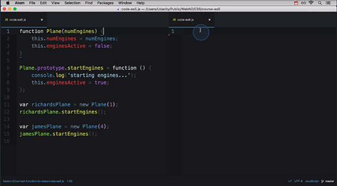
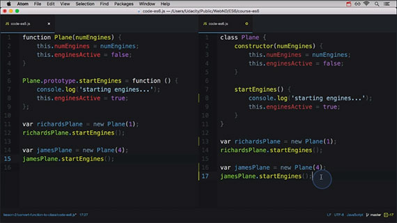

<!-- markdownlint-disable MD022 MD024 MD032 -->
# Lesson 2.5: Classes
Notes from _**Lesson 2: Functions**_ of _**ES6 JavaScript Improved**_ by Richard Kalehoff and James Parkes. This class is part of the Udacity course [ES6 - JavaScript Improved](https://www.udacity.com/course/es6-javascript-improved--ud356)

This is an Intermediate skill level course which takes approximately 4 weeks to complete and is offered for **FREE**!

| Lesson 1 | Lesson 2 | Lesson 2.5 | Lesson 3 | Lesson 4 |
| --- | --- | --- | --- | --- |
| [Syntax](ES6-Syntax.html) | [Functions](ES6-Functions.html) | **Classes** | [Built-ins](ES6-Built-ins.html) | [Professional Developer-fu](ES6-Professional-Developer-fu.html) |

## 12. Class Preview
Here's a quick peek of what a JavaScript class look like:

```js
class Dessert {
  constructor(calories = 250) {
    this.calories = calories;
  }
}

class IceCream extends Dessert {
  constructor(flavor, calories, toppings = []) {
    super(calories);
    this.flavor = flavor;
    this.toppings = toppings;
  }
  addTopping(topping) {
    this.toppings.push(topping);
  }
}
```

Notice the new `class` keyword right in front of `Dessert` and `IceCream`, or the new `extends` keyword in `class IceCream extends Dessert`? What about the call to `super()` inside the IceCream's `constructor()` method.

There are a bunch of new keywords and syntax to play with when creating JavaScript classes. But, before we jump into the specifics of how to write JavaScript classes, we want to point out a rather confusing part about JavaScript compared with class-based languages.

## 13. JavaScript's Illusion of Classes
Classes in JavaScript can be a bit confusing if you think about how classes work in other
languages but the general concept is all the same.

In other languages we use classes to create objects and provide inheritance. But JavaScript isn't like that exactly. In JavaScript we use functions to create objects.

```js
var cookie = new Desert();
```

So when we create a `new Dessert()` like above, `Dessert()` is just a regular function.

Being able to inherit data and functionality (properties and methods) in JavaScript happens through _prototypal inheritance_.

Just because ECMAScript has provided us with the following new keywords

- `class`
- `super`
- `extends`

It doesn't mean the entire way the language works has changed.

JavaScript still uses functions and prototypal inheritance under the hood. We just have a new cleaner way to write the same functionality.

Just keep in mind that the underlying functionality of the language hasn't changed. That said,

1. JavaScript is not a class-based language
1. It uses functions to create objects
1. It links objects together by prototypal inheritance

In other words, JavaScript classes are just a thin mirage over regular functions and prototypal inheritance.

## 14. ES5 vs ES6 Classes
### ES5 "Class" Recap
Since ES6 classes are just a mirage and hide the fact that prototypal inheritance is actually going on under the hood, let's quickly look at how to create a "class" with ES5 code:

```js
// ES5 Sytnax
function Plane(numEngines) {
  this.numEngines = numEngines;
  this.enginesActive = false;
}

// methods "inherited" by all instances
Plane.prototype.startEngines = function () {
  console.log('starting engines...');
  this.enginesActive = true;
};

const richardsPlane = new Plane(1);
richardsPlane.startEngines();

const jamesPlane = new Plane(4);
jamesPlane.startEngines();
```

In the code above, the `Plane` function is a _constructor function_ that will create new Plane objects. The data for a specific `Plane` object is passed to the Plane function and is set on the object.

Methods that are "inherited" by each Plane object are placed on the `Plane.prototype` object. Then `richardsPlane` is created with one engine while `jamesPlane` is created with 4 engines.

Both objects, however, use the same `startEngines` method to activate their respective engines.

Things to note:

- the constructor function is called with the `new` keyword
- the constructor function, by convention, starts with a capital letter
- the constructor function controls the setting of data on the objects that will be created
- "inherited" methods are placed on the constructor function's prototype object

Keep these in mind as we look at how ES6 classes work because, remember, ES6 classes set up all of this for you under the hood.

### ES6 Classes
Here's what that same `Plane` class would look like if it were written using the new `class` syntax:

```js
// ES6 Syntax
class Plane {
  constructor(numEngines) {
    this.numEngines = numEngines;
    this.enginesActive = false;
  }

  startEngines() {
    console.log('starting engines…');
    this.enginesActive = true;
  }
}
```

## 15. Converting a Function to a Class
#### Before
[](assets/images/full-size/lesson6-class1.png)

Let's convert this function into a class.

```js
// ES5 Syntax
function Plane(numEngines) {
  this.numEngines = numEngines;
  this.enginesActive = false;
}

Plane.prototype.startEngines = function () {
  console.log('starting engines...');
  this.enginesActive = true;
}

var richardsPlane = new Plane(1);
richardsPlane.startEngines();

var jamesPlane = new Plane(4);
jamesPlane.startEngines();
```

Everything inside the constructor function is now placed inside a method with the name constructor.

```js
// ES6 Syntax
class Plane {
  constructor(numEngines) {
    this.numEngines = numEngines;
    this.enginesActive = false;
  }
}
```

This constructor method will automatically run when a new object is constructed from this class. If any data is needed to create the object then it needs to be included here.

So this takes care of creating an object. Now the methods that all objects inherit are placed inside the class.

```js
// ES6 Syntax
class Plane {
  constructor(numEngines) {
    this.numEngines = numEngines;
    this.enginesActive = false;
  }

  startEngines() {
    console.log('starting engines...');
    this.enginesActive = true;
  }
}
```

`startEngines()` exists on the prototype explicitly in the pre-class way of writing it. Now it appears inside the class but the functionality is exactly the same.

Also it looks like `startEngines()` and this `constructor()` method are the same kind of method but the constructor method is not on the prototype. It's a new special method that
exists in a class and is used to initialize new objects.

To drive this home, the functionality of these two is exactly the same. The class syntax is just a nicer way of writing it. In fact, we create new objects in exactly the
same way with this new class syntax.

```js
// ES6 Syntax
class Plane {
  constructor(numEngines) {
    this.numEngines = numEngines;
    this.enginesActive = false;
  }

  startEngines() {
    console.log('starting engines...');
    this.enginesActive = true;
  }
}

var richardsPlane = new Plane(1);
richardsPlane.startEngines();

var jamesPlane = new Plane(1);
jamesPlane.startEngines();
```

If you already understand prototypal inheritance then you already have a good understanding of how `class` and class methods work.

#### After
[](assets/images/full-size/lesson6-class2.png)

## 16. Working with JavaScript Classes
Just to prove that there isn't anything special about `class`, check out this code:

```js
class Plane {
  constructor(numEngines) {
    this.numEngines = numEngines;
    this.enginesActive = false;
  }

  startEngines() {
    console.log('starting engines…');
    this.enginesActive = true;
  }
}

typeof Plane; // function
```

> **Returns:** function

That's right—it's just a function! There isn't even a new type added to JavaScript.

> ### ⚠️ Where Are All The Commas? ⚠️
Did you notice that there aren't any commas between the method definitions in the Class? Commas are not used to separate properties or methods in a Class. If you add them, you'll get a `SyntaxError` of `unexpected token ,`.

#### Quiz Question
Take a look at the following code:

```js
class Animal {
  constructor(name = 'Sprinkles', energy = 100) {
    this.name = name;
    this.energy = energy;
  }

  eat(food) {
    this.energy += food / 3;
  }
}
```

Which of the following are true?

1. [ ] the `eat()` method ends up on`Animal.prototype`
1. [ ] typeof Animal === 'class'
1. [ ] typeof Animal === 'function'

#### Solution
Options 1 and 3 are both true. Methods that appear in the class definition are placed on that class's prototype object and a class is just a function.

- [x] Option 1 is correct. Methods that appear in the class definition are, under the hood, placed on that class's prototype object.
- [ ] Option 2 is not correct. A class is actually just a function.
- [x] Option 3 is correct. A class is a function.

### Static methods
To add a static method, the keyword `static` is placed in front of the method name. Look at the `badWeather()` method in the code below.

```js
class Plane {
  constructor(numEngines) {
    this.numEngines = numEngines;
    this.enginesActive = false;
  }

  static badWeather(planes) {
    for (plane of planes) {
      plane.enginesActive = false;
    }
  }

  startEngines() {
    console.log('starting engines…');
    this.enginesActive = true;
  }
}
```

See how `badWeather()` has the word `static` in front of it while `startEngines()` doesn't? That makes `badWeather()` a method that's accessed directly on the `Plane` class, so you can call it like this:

```js
Plane.badWeather([plane1, plane2, plane3]);
```

> **NOTE:** A little hazy on how constructor functions, class methods, or prototypal inheritance works? We've got a course on it! Check out [Object Oriented JavaScript](https://www.udacity.com/course/object-oriented-javascript--ud015).

### Benefits of classes

1. Less setup
    - There's a lot less code that you need to write to create a function
1. Clearly defined constructor function
    - Inside the class definition, you can clearly specify the constructor function.
1. Everything's contained
    - All code that's needed for the class is contained in the class declaration. Instead of having the constructor function in one place, then adding methods to the prototype one-by-one, you can do everything all at once!

### Things to look out for when using classes

1. `class` is not magic
    - The `class` keyword brings with it a lot of mental constructs from other, class-based languages. It doesn't magically add this functionality to JavaScript classes.
1. `class` is a mirage over prototypal inheritance
    - We've said this many times before, but under the hood, a JavaScript class just uses prototypal inheritance.
1. Using classes requires the use of `new`
    - When creating a new instance of a JavaScript class, the `new` keyword **must be used**

For example,

```js
class Toy {
  // some class code
}

const myToy1 = Toy(); // throws an error
```

> **Uncaught TypeError:** Class constructor Toy cannot be invoked without 'new'

```js
const myToy2 = new Toy(); // this works!
```

## 17. Super and Extends
Now that we've looked at creating classes in JavaScript. Let's use the new `super` and `extends` keywords to extend a class.

```js
// ES6 --------------------------------------
class Tree {
  constructor(size = '10', leaves = {
      spring: 'green',
      summer: 'green',
      fall: 'orange',
      winter: null}) {
    this.size = size;
    this.leaves = leaves;
    this.leafColor = null;
  }

  changeSeason(season) {
    this.leafColor = this.leaves[season];
    if (season === 'spring') {
      this.size += 1;
    }
  }
}

class Maple extends Tree {
  constructor(syrupQty = 15, size, leaves) {
    super(size, leaves);
    this.syrupQty = syrupQty;
  }

  changeSeason(season) {
    super.changeSeason(season);
    if (season === 'spring') {
      this.syrupQty += 1;
    }
  }

  gatherSyrup() {
    this.syrupQty -= 3;
  }
}

const myMaple = new Maple(15, 5);
myMaple.changeSeason('fall');
myMaple.gatherSyrup();
myMaple.changeSeason('spring');
```

Both `Tree` and `Maple` are JavaScript classes. The `Maple` class is a "subclass" of `Tree` and uses the `extends` keyword to set itself as a "subclass". 

To get from the "subclass" to the parent class, the `super` keyword is used. Did you notice that `super` was used in two different ways? In `Maple`'s constructor method, `super` is used as a function. In `Maple`'s `changeSeason()` method, `super` is used as an object!

### Compared to ES5 subclasses
Let's see this same functionality, but written in ES5 code:

```js
// ES5 --------------------------------------
function Tree() {
  this.size = size || 10;
  this.leaves = leaves || {
    spring: 'green', summer: 'green', fall: 'orange', winter: null
  };
  this.leafColor;
}

Tree.prototype.changeSeason = function(season) {
  this.leafColor = this.leaves[season];
  if (season === 'spring') {
    this.size += 1;
  }
}

function Maple (syrupQty, size, leaves) {
  Tree.call(this, size, leaves);
  this.syrupQty = syrupQty || 15;
}

Maple.prototype = Object.create(Tree.prototype);
Maple.prototype.constructor = Maple;

Maple.prototype.changeSeason = function(season) {
  Tree.prototype.changeSeason.call(this, season);
  if (season === 'spring') {
    this.syrupQty += 1;
  }
}

Maple.prototype.gatherSyrup = function() {
  this.syrupQty -= 3;
}

const myMaple = new Maple(15, 5);
myMaple.changeSeason('fall');
myMaple.gatherSyrup();
myMaple.changeSeason('spring');
```

Both this code and the class-style code above achieve the same functionality.

## 18. Extending Classes from ES5 to ES6

Let's hide the inner workings of these classes to compare how they're constructed.

```js
// ES5 --------------------------------------
function Tree(size, leaves) {...}
Tree.prototype.changeSeason = function (season) {...}

function Maple(syrupQty, size, barkColor, leaves) {...}
Maple.prototype = Object.create(Tree.prototype);
Maple.prototype.constructor = Maple;

Maple.prototype.changeSeason = function (season) {...}
Maple.prototype.gatherSyrup = function () {...}

// ES6 --------------------------------------
class Tree {
  constructor(size = '10', leaves = {...}) {...}
  changeSeason(season) {...}
}

class Maple extends Tree {
  constructor(syrupQty = 15, size, leaves) {...}
  changeSeason(season) {...}
  gatherSyrup() {...}
}
```

Remember that there's a new special method called the `constructor()` that's run whenever the class is called. It's doing the same thing as the `Tree` constructor in _ES5_.

Also remember that a method inside of a class definition (`changeSeason`) is the same as adding that method to the prototype. That takes care of the base class which looks pretty similar to before.

The bigger difference comes when extending the base class with a subclass. With the older ES5 code we'd have to:

1. Create another constructor function
1. Then set the function's prototype to the base class' prototype
1. Since we've overwritten the original prototype object, we need to set/reset the connection between the constructor property and the original constructor function.

Then we're back to the normal routine of adding methods to the prototype object.

Now compare all of the code it took to get these two functions connected and prototype linked in ES5 to the class code of ES6.

It's just another class definition but it uses the extends keyword to connect the `Maple` class to the base class `Tree`.

Significantly nicer right? It's also a lot easier to call the base class from the subclass.

The es6 code uses the new `super` keyword while you have to use `.call` in the es5 code and pass `this` as the first argument.

Also, calling a prototype method also takes a lot less code in the new class format too.

## 19. Working with JavaScript Subclasses
Like most of the new additions, there's a lot less setup code and it's a lot cleaner syntax to create a subclass using `class`, `super`, and `extends`.

Just remember that, under the hood, the same connections are made between functions and prototypes.

### `super` must be called before `this`
In a subclass constructor function, before `this` can be used, a call to the super class must be made.

```js
class Apple {}
class GrannySmith extends Apple {
  constructor(tartnessLevel, energy) {
    this.tartnessLevel = tartnessLevel; // `this` before `super` throws an error!
    super(energy); 
  }
}
```

#### Question 1 of 2
Take a look at the following code:

```js
class Toy {}
class Dragon extends Toy {}
const dragon1 = new Dragon();
```

Given the code above, is the following statement true or false?

```js
dragon1 instanceof Toy;
```

1. [ ] true
1. [ ] false

#### Solution
The `dragon1` variable is an object created by the `Dragon` class, and since the `Dragon` class extends the `Toy` class, `dragon1` is also considered an instance of `Toy`.

- [x] true

#### Question 2 of 2
Let's say that a `Toy` class exists and that a `Dragon` class extends the `Toy` class.

What is the correct way to create a `Toy` object from inside the `Dragon` class's `constructor` method?

1. [ ] super();
1. [ ] super.call(this)
1. [ ] parent();
1. [ ] Toy();

#### Solution
Option 1 is the correct way to call the super class from within the subclass's constructor function.

- [x] super();

## 20. Quiz: Building Classes & Subclasses
### Directions
Create a `Bicycle` subclass that extends the `Vehicle` class. The `Bicycle` subclass should override `Vehicle`'s constructor function by changing the default values for `wheels` from `4` to `2` and `horn` from `'beep beep'` to `'honk honk'`.

#### Code

```js
/*
 * Programming Quiz: Building Classes and Subclasses (2-3)
 */

class Vehicle {
  constructor(color = 'blue', wheels = 4, horn = 'beep beep') {
    this.color = color;
    this.wheels = wheels;
    this.horn = horn;
  }

  honkHorn() {
    console.log(this.horn);
  }
}

// your code goes here

/* tests
const myVehicle = new Vehicle();
myVehicle.honkHorn(); // beep beep
const myBike = new Bicycle();
myBike.honkHorn(); // honk honk
*/
```

#### Solution

```js
/*
 * Programming Quiz: Building Classes and Subclasses (2-3)
 */

class Vehicle {
  constructor(color = 'blue', wheels = 4, horn = 'beep beep') {
    this.color = color;
    this.wheels = wheels;
    this.horn = horn;
  }

  honkHorn() {
    console.log(this.horn);
  }
}

// your code goes here
class Bicycle extends Vehicle {
  constructor(color, wheels = 2, horn = 'honk honk') {
    super(color, wheels, horn);
    this.horn = horn;
  }
  honkHorn() {
    super.honkHorn();
  }
}

/* tests
const myVehicle = new Vehicle();
myVehicle.honkHorn(); // beep beep
const myBike = new Bicycle();
myBike.honkHorn(); // honk honk
*/
```

## 21. Leason 2 Summary
In this lesson we covered a new way to write functions - the arrow function. We also looked at how you can you default function parameters to pass default values to functions. Finally, we wrapped it up with JavaScript classes (simulated through functions)

In the next lesson we'll explore the latest set of built-in that are available through JavaScript.