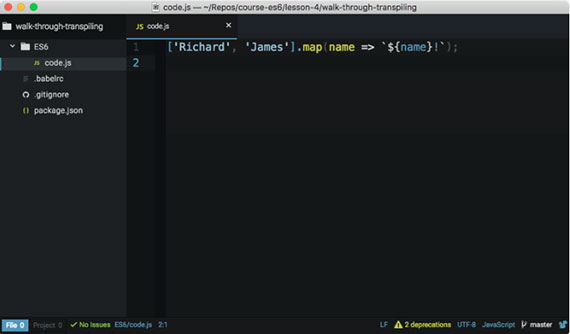
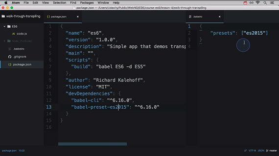

<!-- markdownlint-disable MD022 MD024 MD032 -->

[<-- back to Mobile Web Specialist Phase 1 Notes TOC](MWS-TOC.html)

---

# Lesson 4: Professional Developer-fu
Notes from _Lesson 4: Professional Developer-fu_ of _**ES6 JavaScript Improved**_ by Richard Kalehoff and James Parkes. This class is part of the Udacity course [ES6 - JavaScript Improved](https://www.udacity.com/course/es6-javascript-improved--ud356)

This is an Intermediate skill level course which takes approximately 4 weeks to complete and is offered for **FREE**!

| Lesson 1 | Lesson 2 | Lesson 2.5 | Lesson 3 | Lesson 3.5 | Lesson 4 |
| --- | --- | --- | --- | --- | --- |
| [Syntax](ES6-Syntax.html) | [Functions](ES6-Functions.html)  | [Classes](ES6-Classes.html) | [Built-ins](ES6-Built-ins.html) | [Built-ins Pt2](ES6-Built-ins-Pt2.html) | **Professional Developer-fu** |

## 1. The Web is Growing Up
This lesson will prepare you for deploying ES6 in the ever-changing environment that is the web.

Basically the web had a beginning but it won't have an end. As new technology comes out it won't be supported by older browsers and this can make it challenging when you want to work with ES6.

How are you supposed to write ES6 but still support older browsers?

Let's take a look.

## 2. Old and New Browsers
### Code doesn't work in old browsers
The code we've been looking at in this course is not supported by older browsers. Older browsers that were developed prior to the release of ES6 were developed to support the version of JavaScript at the time (which was ES5.1). If you try running any ES6 code in an older browser, it won't work.

[](assets/images/full-size/lesson9-1.png)

> An arrow function is run and causes a syntax error in Safari 9.

It makes sense that code doesn't work in older browsers that were developed prior to the release of ES6, but there are some browsers that have been released after ES6 that don't support the new JavaScript syntax and functionality yet.

Try using an arrow function in your code and opening it up in IE 11, and it won't work. There'll be an error on the console saying that it doesn't recognize the syntax.

[](assets/images/full-size/lesson9-2.png)

> An arrow function is run and causes a syntax error in IE 11.

Most of us don't think much about the browser and all it can do...until it doesn't work! But really, browser makers have a tough time. Think about HTML, CSS, and JavaScript - these languages are fluid and are always improving. Browser makers have to keep up with all of these changes.

#### But how do they know about these changes?

They learn (or actually build) the language specifications!

Just like the [World Wide Web Consortium (W3C)](https://www.w3.org/) is the standards body for things like HTML, CSS, and SVG, [Ecma International](https://www.ecma-international.org/) is an industry association that develops and oversees standards like JavaScript and JSON. You can find the specifications for ES6 [here](http://www.ecma-international.org/ecma-262/6.0/index.html).

### Further Info
Ecma International is an important industry community and definitely worth checking out in more detail:

- [https://en.wikipedia.org/wiki/Ecma_International](https://en.wikipedia.org/wiki/Ecma_International)
- [http://www.ecma-international.org/memento/index.html](http://www.ecma-international.org/memento/index.html)

> **NOTE:** The code we've been looking at in this course is not supported by older browsers. Older browsers that were developed prior to the release of ES6 were developed to support the version of JavaScript at the time (which was ES5.1). If you try running any ES6 code in an older browser, it won't work.

### 3. ES6 Specification
The specification (commonly shortened to "spec") for ES6 can be found [here](http://www.ecma-international.org/ecma-262/6.0/index.html). The spec lists the set of rules and guidelines on _how_ the language is supposed to function. It doesn't give specific details on how browser makers are supposed to achieve functionality, but it does provide step-by-step instructions on how the language is supposed to work. While making this course, we repeatedly referred to this official spec.

Ok, so honestly, it can be a little difficult to decipher some of the cryptic wording of the spec. But when you have a question about ES6, we recommend checking out info on the topic like that provided by the [Mozilla Developer Network](https://developer.mozilla.org/) and then also reviewing what the spec actually says.

#### Quiz Question
Check out the [ES6 Specification](http://www.ecma-international.org/ecma-262/6.0/index.html). Which section in the spec covers arrow functions?

1. [ ] section 6
1. [ ] section 10.3.2
1. [ ] section 14.2
1. [ ] section 18.3.29

#### Solution
The section on arrow functions is number 14.2

- [x] section 14.2

## 4. Supported Features
### How Can You Know What Features Browsers Support?
With new language specifications coming out every year and with browsers updating every other month, it can be quite challenging to know what browser supports which language features. Each browser maker (except for Safari) has a website that tracks its development status. Checkout the platform feature updates for each browser:

- Google Chrome - [https://www.chromestatus.com/features#ES6](https://www.chromestatus.com/features#ES6)
- Microsoft Edge - [https://developer.microsoft.com/en-us/microsoft-edge/platform/status/?q=ES6](https://developer.microsoft.com/en-us/microsoft-edge/platform/status/?q=ES6)
- Mozilla Firefox - [https://platform-status.mozilla.org/](https://platform-status.mozilla.org/)

> **NOTE:** Safari doesn't have it's own platform status website. Under the hood, though, Safari is powered by the open source browser engine, Webkit. The status for Webkit features can be found [here](https://webkit.org/status/).

This can be a lot of information to track down. If you prefer a birdseye view of all the feature support for all JavaScript code, check out 

- [https://caniuse.com/#search=arrow](https://caniuse.com/#search=arrow)

[](assets/images/full-size/lesson9-3.png)


You can also use the ECMAScript Compatibility Table built by [@kangax](https://twitter.com/kangax):

- [http://kangax.github.io/compat-table/es6/](http://kangax.github.io/compat-table/es6/)

[](assets/images/full-size/lesson9-4.png)

#### Quiz Question
Looking at the ECMAScript Compatibility Table, what kind of information does the first _colored_ column display?

1. [ ] The list of up-to-date browsers that support ES6.
1. [ ] The list of all ES6 features.
1. [ ] The status of all ES6 features supported by your current browser.
1. [ ] Links to each browser platform's status for the specific ES6 feature.

#### Solution
The very first column lists all of the ES6 features. The second column in the table is the first one that's colored and displays the support of each ES6 feature in your the current browser.

- [x] The status of all ES6 features supported by your current browser.

## 5. The Web is Eternal
You're a pro at JavaScript but that doesn't mean you can just kick back and coast. These new additions in ES6 have brought a major change to the language. You can't just ignore them and bank on your existing knowledge of a now behind the times technology. You've got to get up, dig into the features, read the specification, follow some tutorials, maybe even write some of your own.

The web is an evolving platform and you need to evolve with it. Imagine being stuck on old horrible equipment when there are newer nicer tools available for you to use. You now know how JavaScript language improvements are made and where to find browser support for them.

You've got the tools, now its time to use them.

## 6. Polyfills
When a wall has holes in it and is in bad shape we have a way to repair and deal with the missing parts. We fill the holes so you won't be able to tell anything's wrong with it or missing.

In the United States this fill is called _Spackling_ and it's just a common paste to fill holes and cracks. It also smooths out any defects in the wall. In the United Kingdom, a popular brand name for this is _Polyfilla_. Using _Spackling_ or _Polyfilla_, it's impossible to tell that there was ever a hole in the wall.

For the web, a polyfill does the same thing. There's some bit of functionality that might be missing in a browser that needs to get filled.

A polyfill is a JavaScript file that patches a hole by replicating some native feature for browsers that don't have it yet.

## 7. Using Polyfills
### What is a polyfill?

> A polyfill, or polyfiller, is a piece of code (or plugin) that provides the technology that you, the developer, expect the browser to provide natively.

Coined by Remy Sharp - [https://remysharp.com/2010/10/08/what-is-a-polyfill](https://remysharp.com/2010/10/08/what-is-a-polyfill)

> We, as developers, should be able to develop with the HTML5 APIs, and scripts can create the methods and objects that should exist. Developing in this future-proof way means as users upgrade, your code doesn't have to change but users will move to the better, native experience cleanly. From the HTML5 Boilerplate team on polyfills - [https://github.com/Modernizr/Modernizr/wiki/HTML5-Cross-Browser-Polyfills](https://github.com/Modernizr/Modernizr/wiki/HTML5-Cross-Browser-Polyfills)

Further research:
[https://en.wikipedia.org/wiki/Polyfill](https://en.wikipedia.org/wiki/Polyfill)

### An example polyfill
The code below is a polyfill for the new ES6 String method, startsWith():

```js
if (!String.prototype.startsWith) {
  String.prototype.startsWith = function (searchString, position) {
    position = position || 0;
    return this.substr(position, searchString.length) === searchString;
  };
}
```

As you can see, a polyfill is just regular JavaScript.

This code is a simple polyfill (check it out on MDN), but there's also a significantly more robust one, [here](https://github.com/mathiasbynens/String.prototype.startsWith/blob/master/startswith.js)

#### Quiz Question
Why does the startsWith() polyfill begin with the following line?:

```js
if (!String.prototype.startsWith)
```

1. [ ] Without it, the script would throw an error.
1. [ ] It checks to make sure the `String.prototype` exists.
1. [ ] It avoids overwriting the native `startsWith` method.

#### Solution
Remember that a polyfill is used to patch missing functionality. If the browser supports ES6 and has the native startsWith method, then there's no reason to polyfill it. If this check didn't exist, then this polyfill would overwrite the native implementation.

- [x] It avoids overwriting the native `startsWith` method.

## 8. Polyfill Walkthrough
Remember that a polyfill is used to fill a hole in a browser that doesn't yet support the native feature.

This polyfill starts with a check to see if the native `startsWith` method actually exists. If it does exist then we don't want to override the native version with this one. If it doesn't exist then the browser will then run the code following.

```js
if (!String.prototype.startsWith) {
  String.prototype.startsWith = function (searchString, position) {
    position = position || 0;
    return this.substr(position, searchString.length) === searchString;
  };
}

/* Sample usage */
'Udacity'.startsWith('Udac'); // returns `true`
'Udacity'.startsWith('Udac', 2); // returns `false`
'Udacity'.startsWith('ES6'); // returns `false`
```

This adds a new method to String's prototype object. The function defaults to the position indicated by this second argument that's passed in or it'll be the first character of the string.

Then it returns `true` or `false` if the string that's passed in is the same as the string that we're looking at.

## 9. Other Uses for Polyfills
### Polyfills aren't only for patching missing JavaScript features
JavaScript is the language used to create a polyfill, but a polyfill doesn't just patch up missing JavaScript features! There are polyfills for all sorts of browser features:

- SVG
- Canvas
- Web Storage (local storage / session storage)
- Video
- HTML5 elements
- Accessibility
- Web Sockets
- and many more!

For a more-complete list of polyfills, check out [this link](https://github.com/Modernizr/Modernizr/wiki/HTML5-Cross-Browser-Polyfills)

## 10. Transpiling
You've probably heard the term _compiler_ before. A compiler is a computer program that takes source code language, let's say C++, and then converts it to a target language like machine code.

Running code through a compiler changes its level of abstraction - meaning how close it is to human readable code vs machine runnable code.

> _Compiling_ is taking a source language and converting it into a lower level language.

> _Transpiling_ is a subset of compiling so it takes source code and converts it into target code, just like a compiler, but the source code and the target code are at the same level of abstraction.

Basically if the source code starts out as human readable then the output language will also be human readable.

But why would we want this? Well, we just saw that older browsers do not fully support ES6 but they do support ES5 code. This way we could write our JavaScript using ES6 syntax and
functionality and then use a transpiler to convert it from ES6 code to ES5.

So, we write code using the newest and best but convert it so that it'll run everywhere.

#### Quiz Question
To convert Java to JavaScript, would you use a compiler or a transpiler?

1. [ ] a compiler
1. [ ] a transpiler

#### Solution
Since both the Java source code and the JavaScript target code are of the same level of abstraction (they're both human-readable), a transpiler would be used.

- [x] a transpiler

## 11. Using Babel
The most popular JavaScript transpiler is called [Babel](https://babeljs.io/).

Babel's original name was slightly more descriptive - 6to5. This was because, originally, Babel converted ES6 code to ES5 code. Now, Babel does a lot more. It'll convert ES6 to ES5, JSX to JavaScript, and Flow to JavaScript.

Before we look at transpiling code on our computer, let's do a quick test by transpiling some ES6 code into ES5 code directly on the Babel website. Check out [Babel's REPL](http://babeljs.io/repl/#?babili=false&evaluate=true&lineWrap=false&presets=es2015)(Read-Eval-Print Loop) and paste the following code into the section on the left:

```js
class Student {
  constructor (name, major) {
    this.name = name;
    this.major = major;
  }

  displayInfo() {
    console.log(`${this.name} is a ${this.major} student.`);
  }
}

const richard = new Student('Richard', 'Music');
const james = new Student('James', 'Electrical Engineering');
```

### Babel REPL
[](assets/images/full-size/lesson9-5.png)

### Transpiling project in repo
If you check in the [repo for this project](https://github.com/udacity/course-es6/tree/master/lesson-4/walk-through-transpiling), inside the Lesson 4 directory is a little project that's all set up for transpiling ES6 code to ES5 code. There's an "ES6" directory that contains the ES6 code we'll be transpiling (using Babel) to ES5 code that will be able to run in every browser.

The way Babel transforms code from one language to another is through plugins. There are plugins that transform ES6 arrow functions to regular ES5 functions (the [ES2015 arrow function plugin](http://babeljs.io/docs/plugins/transform-es2015-arrow-functions/)). There are plugins that transform ES6 template literals to regular string concatenation (the [ES2015 template literals transform](http://babeljs.io/docs/plugins/transform-es2015-template-literals/)). For a full list, check out [all of Babel's plugins](http://babeljs.io/docs/plugins/).

[](assets/images/full-size/lesson9-6.png)

Now, you're busy and you don't want to have to sift through a big long list of plugins to see which ones you need to convert your code from ES6 to ES5. So instead of having to use a bunch of individual plugins, Babel has **presets** which are groups of plugins bundled together. So instead of worrying about which plugins you need to install, we'll just use the [ES2015 preset](http://babeljs.io/docs/plugins/preset-es2015/) that is a collection of all the plugins we'll need to convert all of our ES6 code to ES5.

You can see that the project has a `.babelrc` file. This is where you'd put all of the plugins and/or presets that the project will use. Since we want to convert all ES6 code, we've set it up so that it has the ES2015 preset.

#### .babelrc

```json
{
    "presets": ["es2015"]
}
```

> **WARNING:** Babel uses both **Node** and **NPM** to distribute its plugins. So before you can install anything, make sure you have both of these tools installed:
>
> - install [Node](https://nodejs.org/) (which will automatically install NPM)

## 12. Transpiling Walkthrough
The project's `package.json` file lists all of the NPM packages that this project depends on.

[](assets/images/full-size/lesson9-7.png)

This project depends on

- bable-cli
- babel-preset-es2015

The babel 2015 preset is a collection of all es6 plugins. So these are the plugins that will be downloaded and installed.

Once they're installed we need to tell the Babel CLI which plugins it should use to do the
transpiling. The CLI will check the `.babelrc` file for which plugins and presets to
use.

So the `package.json` file lists what should be installed and the .`babelrc` file tells babel which plugins to use when it does its transpiling.

Now that babel knows to use this preset we need to tell it to actually transpile the code. To do that we've added a build script that will tell babel to take the files in the ES6 directory, transpile them using the es2015 preset, and then put the transformed code in the ES5 directory.

## 13. Transpiling Recap
> NOTE: As of the creation of this course (circa Winter 2016), most of ES6 is supported by the current set of browsers. But that's "most", not "all", unfortunately. And that's also referring to "current" browsers. There are plenty of older browsers that do not support many, if any, of the new ES6 additions. However, it is safe to say that pretty much every browser supports the previous version of the language (ES5.1).

It's important to stay on top of all the changes JavaScript is going through. The best way to do that is to start making use of the new features that are added. The problem is that not all browsers support these new features.

So, to have your cake and eat it too, you can write in ES6 and then use a transpiler to convert it to ES5 code. This lets you transform your project's code base to the newest version of the language while still letting it run everywhere. Then, once all of the browsers your app has to run on fully support ES6 code, you can stop transpiling your code and just serve the straight ES6 code, directly!

## 14. Course Recap
Congratulations! You've made it to the end of this course on ES6 / ES2015. Before we wrap up let's go over the things learned in this course.

[](assets/images/full-size/lesson6-syntax1`.png)

- In lesson one we learned about the most recent syntax
additions to the JavaScript language
- In lesson two we discovered new ways for writing functions and how to create JavaScript classes
- In lesson three we were exposed to the latest built-ins provided us in ES6
- In lesson four we wrapped it up by showing how to incorporate ES6 into our next JavaScript project

Hopefully you've found this course to be insightful and that it will inspire you to start using Es6 in whatever projects you work on in the future.