<!-- markdownlint-disable MD022 MD024 MD032 -->
# IndexedDB and Caching
Notes from _IndexedDB and Caching_ by Jake Archibald. This class is part of the Udacity course [Offline Web Applications by Google](https://www.udacity.com/course/offline-web-applications--ud899)

This is an Intermediate skill level course which takes approximately 3 weeks to complete and is offered for **FREE**!

These notes continue from where the previous set of class notes ([Introducing the Service Worker](Introducing-the-Service-Worker.html)) left off.

## 1. The IDB Promised Library
When the user opens Wittr, we want to start by showing the last post the device received - before going to the network. Then, we make the Web Socket connection and start receiving new posts one by one.

When we receive these posts, we want to display them, of course. But also we want to add them to the set of posts we already have stored. We also want to remove entries that are too old to be worth keeping.

A database is the best model for this. It means we can add and remove individual posts as needed, iterate over them, and query the data.

The web platform has a database called `IndexedDB` (IDB). It's fair to say that it has a bit of a bad reputation, but hopefully we can break through that in this chapter.

We aren't going to touch our Service Worker script for a bit, instead we will concentrate on learning IDB's shape and how it ticks. Then, we'll integrate it into a whole offline first experience.

### NoSQL
If you've used NoSQL Databases before, IDB will seem familiar. But if you've only used Relational Databases before, the concepts might seem a little weird. And if you've never used databases before, well, that might even help! As you can come to IDB fresh, without trying to translate it to similar but, ultimately, different things you've encountered.

### IndexedDB Database Shape

With IDB, you can have multiple databases with whatever name you give them. But we're only going to be creating one. Generally, you'll only have one database per application.

[](assets/images/full-size/lesson4-idb1.png)

That database contains multiple object stores; generally one for each kind of thing you want to store. 

[](assets/images/full-size/lesson4-idb2.png)

An object store can contain multiple values. These can be JavaScript `objects`, `strings`, `numbers`, `dates`, or `arrays`.

[](assets/images/full-size/lesson4-idb3.png)

Items in the object's store can have a separate primary key or you can assign a property of the values to be the key. The key must be unique within an object store. It becomes the way you identify a particular object.

[](assets/images/full-size/lesson4-idb4.png)

Later, you can `get`, `set`, `add`, `remove`, or `iterate` over items in object stores as part of a transaction. **All read or write operations in IndexedDB must be part of a transaction**.

#### Sample Transaction
1. [ ] Add "hello:world" to "keyval" store
1. [ ] Get the first value from the "people" store
1. [ ] Change the person's name to "James"
1. [ ] Write it back to the "peoples" store

This means that if you create a transaction for a series of steps and one of the actions fail, none of them are applied. The state of the database would be as if none of the steps happened.

| Transaction: | If one fails... | All fail! |
| --- | ---|
| [ ] step one | [ ] step one | [x] step one |
| [ ] step two | [x] step two | [x] step two |
| [ ] step three | [ ] step three | [x] step three |
| [ ] step four | [ ] step four | [x] step four |

You can also create indexes within an object store, which provides a different view of the same data ordered by particular properties:

[](assets/images/full-size/lesson4-idb5.png)

The model here is similar to a lot of databases, which makes a lot of sense. The browser support is good as well, with every major browser supporting it. So, why does IndexedDB have such a bad reputation?

[](assets/images/full-size/lesson4-idb6.png)

Unfortunately, the API is a little... horrid and often creates spaghetti code. It's all asynchronous, which is fine, but it pre-dates Promises. So it kind of invented its own event-based Promise system which creates really confusing code. 

To avoid this clumsy API, we're going to use a really small library that mirrors the IndexedDB API, but uses Promises rather than events. The library is called IndexedDB Promised. Anything you use in this library, you can apply to using IndexedDB directly.

[](assets/images/full-size/lesson4-idb7.png)

Take a look at this libraries repository and examples here: [https://github.com/jakearchibald/idb](https://github.com/jakearchibald/idb)

Next, we'll take a look at how you create a real-life database in the browser.

## 2. Getting Started with IDB
Hold on tight - you're now going to get a crash course in IndexedDB... Let's get through this as quickly as possible, and hopefully in one piece.

Start off by opening your browser to [http://localhost:8888/idb-test/](http://localhost:8888/idb-test/)

You'll see that it is just a blank page with a script tag. This script is located at the file path: public/js/idb-test/index.js

All the script contains, at the moment, is an `import` statement for the idb library.

If you open the idb libraries examples ([https://github.com/jakearchibald/idb](https://github.com/jakearchibald/idb)), to open a database you can see that the function signature is:

- **idb.open(name, version, upgradeCallback)**

```js
import idb from 'idb'

idb.open('test-db', 1, function(upgradeDb) {
    // in order to maintain referential integrity
    // this is the only place to create object stores & indexes
});
```

The `upgradeCallback` function will be called if the browser hasn't heard about this database before, or if the version it knows about is less than the version specified.

You'll notice that the callback function gets the `upgradeDb` parameter, which is used to define the database. To ensure database integrity, this is the only place you can create and remove object stores and indexes.

The API for `upgradeDb` is in the library, but it's mostly just a mirror of the real **IndexedDB API** on MDN, except for a few minor differences which we will cover.

### Create an Object Store
The library docs show that createObjectStore is the same for the IndexedDB API on MDN. So, MDN can give us the full detail of the API: [https://developer.mozilla.org/en-US/docs/Web/API/IDBDatabase/createObjectStore](https://developer.mozilla.org/en-US/docs/Web/API/IDBDatabase/createObjectStore)

In short, the syntax for createObjectStore looks something like this:

- **var objectStore = IDBDatabase.createObjectStore(name, options);**

The object store name is required, while the options parameter is optional.

So we'll create an object store with a name of 'keyval'. Because we haven't told it otherwise, this store has a key that is separate from the data - which is exactly what we want for a key/value store:

```js
import idb from 'idb';

idb.open('test-db', 1, function(upgradeDb) {
  var keyValStore = upgradeDb.createObjectStore('keyval');
});
```

### Write to the database
Now we need to add some content to the object store. We can accomplish this using the `put` method of the object store (`keyValStore`). Additional methods can be found by [viewing the docs](https://github.com/jakearchibald/idb#objectstore). These methods include: _put, add, delete, clear, get, getAll, getAllKeys, & count_. 

The put method has the following syntax:

- **var request = objectStore.put(item);**
- **var request = objectStore.put(item, key);**

If we look at `put` on MDN, it shows `put` takes an item and optional key, but returns a request. These request objects are the thing that makes IDB really difficult to deal with. 

So whenever IDB would return a request, the library returns a Promise. And yes, the signature here is [value, key] rather than [key. value] which is a real gotcha, but you'll see why it's like that later on.

**Once again: Whenever the IDB API returns an IDBRequest object, the IDB library will return a Promise that resolves with an IDBRequest object.**

So I'm going to put the value 'world', and set the key to be 'hello'. With that, we've finished setting our database up.:

```js
import idb from 'idb';

idb.open('test-db', 1, function(upgradeDb) {
  var keyValStore = upgradeDb.createObjectStore('keyval');
  keyValStore.put('world', 'hello');
});
```

The database is setup, but we need to add one last piece to this to wrap it up. `idb.open` returns a Promise that resolves with an `IDBDatabase` object. So we'll store that Promise for later:

```js
import idb from 'idb';

var dbPromise = idb.open('test-db', 1, function(upgradeDb) {
  var keyValStore = upgradeDb.createObjectStore('keyval');
  keyValStore.put('world', 'hello');
});
```

Later, we can use the `IDBDatabase` object to get and set items in the database.

Now, we can head back to the browser and refresh the page to run the new code. Open Dev Tools and click the **Application** tab. Under the Storage section, click on **IndexedDB**, locate the `keyval` store and click on it. Then, click the button to refresh the database. You should see the key of 'hello' and the value of 'world' inside.

[](assets/images/full-size/lesson4-idb8.png)

### Read from the Database
So now, if I want to read from the database, I need to create a transaction. The function to do this is `db.transaction()` to which I pass in the object stores I'm going to be using. In this case just `keyval`. Then I call `objectStore()`, passing in the name of the object store I want, `keyval`. This seems a bit repetitive but it's possible to have a transaction that uses multiple objects stores.

I called `get()` on the object store, passing in the key I'm interested in, `hello`. This returns a promise, which resolves to the value I'm looking for. Which I'll log.

```js
import idb from 'idb';

var dbPromise = idb.open('keyval', 1, function(upgradeDb) {
  var keyValStore = upgradeDb.createObjectStore('keyval');
  keyValStore.put('world', 'hello');
});

// read "hello" in "keyval"
dbPromise.then(function(db) {
  var tx = db.transaction('keyval');
  var keyValStore = tx.objectStore('keyval');
  return keyValStore.get('hello');
}).then(function(val) {
  console.log('The value of "hello" is:', val);
});
```

Now, say I wanted to add another value to the object store.

To do that, I create a transaction just as I did before but I specify that I want to read write this time. Now, I can get my objects stores before but this time, call `put` on on it to set a value.

I'm going to set the key `foo` to be value `bar`, `put` returns a Promise but this Promise doesn't necessarily mean the operation worked. As we saw, if the transaction fails. All the operations are part of it are undone.

```js
// set "foo" to be "bar" in "keyval"
dbPromise.then(function(db) {
  var tx = db.transaction('keyval', 'readwrite');
  var keyValStore = tx.objectStore('keyval');
  keyValStore.put('bar', 'foo');
  return tx.complete;
}).then(function() {
  console.log('Added foo:bar to keyval');
});
```

This means that you can do a lot of work in a transaction and be sure that it won't be left or accessed in some kind of half finished state. Either all happens or none of it happens.

`Transaction.complete()` is a promise that fulfills if and when the transaction completes, and it rejects if it fails. Once the transaction completes, we logout a success message.

[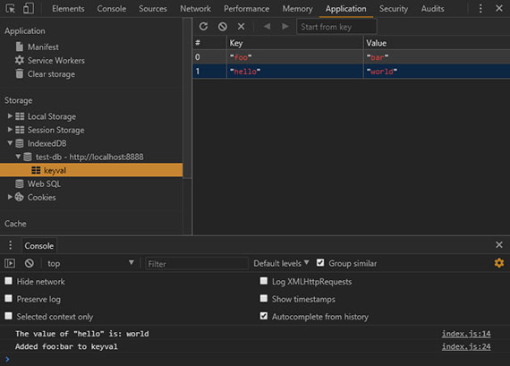](assets/images/full-size/lesson4-idb9.png)

## 3. Diving Deeper with IDB
### Quiz
Your task is to set the 'favoriteAnimal' key to the name of your favorite animal, whatever that is. Once you've changed the code, refresh the page and check the Chrome developer tools to see if your favorite animal has appeared in IDB.

### Solution
```js
dbPromise.then( function( db ) {
  // TODO: in the keyval store, set
  // "favoriteAnimal" to your favourite animal
  // eg "cat" or "dog"
  var tx = db.transaction( 'keyval', 'readwrite' );
  tx.objectStore( 'keyval' ).put( 'Hungry shark🐠🐟🐡☠️', 'scariestAnimal' );
  tx.objectStore( 'keyval' ).put( 'Soggy Octopus🐙', 'mostFavoriteAnimal' );
  tx.objectStore( 'keyval' ).put( 'Astonished kitty🙀', 'nextFavoriteAnimal' );
  tx.objectStore( 'keyval' ).put( 'Ambivalent koala bear🐨😐', 'leastfavoriteAnimal' );
  return tx.complete;
}).then( () => {
  console.log( 'Koala put!' );
  console.log( 'Octo-squeeze!' );
  console.log( 'Meow-purrr!' );
  console.log( 'Shark bites!' );
});
```

I created a 'readwrite' transaction with access to the `keyval` store. Then I got the store and called `put` on it. Next I passed in my favorite animal, "Soggy Octopus🐙" as the value and 'mostfavoriteAnimal' as the key. I then do the same for the rest of my menagerie. I wait on completion of this transaction then log out a set of confirmation messages.

Over in the browser I refresh and see the IDB data as well as the console.log() messages.

[](assets/images/full-size/lesson4-idb10.png)

### Diving Deeper
So far we've created a key/val object store, but what if I wanted to created a different store with objects all of the same kind: People, for instance? To do that, you'll need to create another object store. As mentioned earlier, to maintain database integrity, you can only create object stores and indexes within the `upgradeDb` method. But `upgradeDb` isn't going to get called, because its already been called for `version` 1 of the database...

To fix this, start by bumping the `version` up to 2. Then, create a new object store called 'people'. The 'people' object store isn't going to have separate keys. Instead, make the 'name' property of the objects inside the store be the key:

```js
var dbPromise = idb.open('test-db', 2, function(upgradeDb) {
  var keyValStore = upgradeDb.createObjectStore('keyval');
  keyValStore.put('world', 'hello');
  upgradeDb.createObjectStore('people', { keyPath: 'name' });
});
```

In the real world, you can have more than one person with the same name - but for the sake of this demo we're going to assume names are unique.

By doing this, we've actually created a bug here. You can see it if you try reloading the page and taking a look at the Console.

[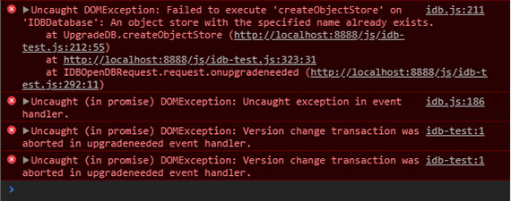](assets/images/full-size/lesson4-idb11.png)

Because the browser hasn't seen `version` 2 yet, it will attempt to create a new object store with the name 'keyval' first. And when it does so, it will fail because the 'keyval' store already exists.

Thankfully, the `upgradeDb` object has a property named `oldVersion` which tells us the `version` the browser already knows about. We can use a `switch` statement to make the browser skip the parts it already knows about:

```js
var dbPromise = idb.open('test-db', 2, function(upgradeDb) {
  switch (upgradeDb.oldVersion) {
    case 0:
      var keyValStore = upgradeDb.createObjectStore('keyval');
      keyValStore.put('world', 'hello');
    case 1:
      upgradeDb.createObjectStore('people', {
        keyPath: 'name'
      });
  }
});
```

Usually with `switch` statements, you include a `break` after each case, but we specifically do not want to do that here so if the browser hasn't setup a db it'll start with `case 0` and will continue to fall-through the cases. Otherwise, if the browser already has `version` 1, it will start with `case 1` and only setup the new 'person' object store.

If you refresh the browser now, the errors are gone and the store has appeared in the **Application** panel under the **Storage > IndexedDB** section.

[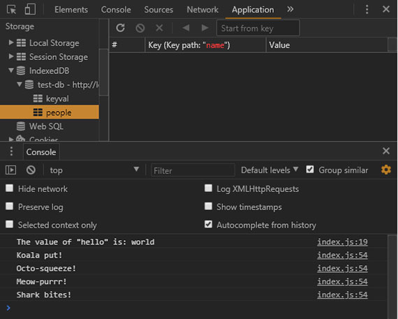](assets/images/full-size/lesson4-idb12.png)

Now we can create a `transaction` to put data in the new store:

```js
// .. previous code

dbPromise.then(function(db) {
  var tx = db.transaction('people', 'readwrite');
  var peopleStore = tx.objectStore('people');

  peopleStore.put({
    name: 'Sam Munoz',
    age: 25,
    favoriteAnimal: 'dog'
  });
  peopleStore.put({
    name: 'Susan Keller',
    age: 34,
    favoriteAnimal: 'cat'
  });
  peopleStore.put({
    name: 'Marc Stone',
    age: 39,
    favoriteAnimal: 'cat'
  });

  return tx.complete;
}).then(function() {
  console.log('People added!');
});
```

In this model, a person is just a plain JavaScript object. Notice that we're calling `put`, but we aren't providing a key this time. This is because when we created the object store for 'people', we told it to use the `name` property as the key.

Once we add the people, we wait on the transaction completing, then we log out a success message to the console.

If we refresh the browser, you can see this operation has completed and the people have been added.

[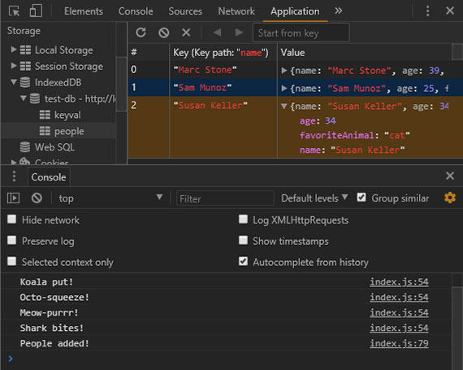](assets/images/full-size/lesson4-idb13.png)

Now, let's read the people in the store. To do that, we create another transaction and set it to the people store. We then use the `getAll` method of the object store which returns a Promise. This Promise resolves to an array of all the objects in the store:

```js
dbPromise.then(function(db) {
  var tx = db.transaction('people');
  var peopleStore = tx.objectStore('people');
  return peopleStore.getAll();
}).then(function(people) {
  console.log('People:', people);
});
```

If we run this code in a browser we see that all the people are logged in alphabetical order.

[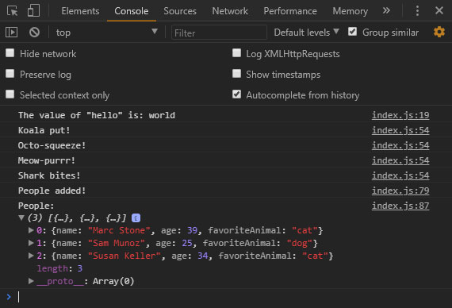](assets/images/full-size/lesson4-idb14.png)

Notice that since the key is `name`, all of the objects will be in alphabetical order based on their name. This presents the next challenge... What if we wanted to group them together based on their favorite animal? This is where indexes come in.

Like other modifications to the database, indexes can only be created as part of a version upgrade. So we need to bump the version number up and start adding to our switch statement:

```js
var dbPromise = idb.open('test-db', 3, function(upgradeDb) {
  switch (upgradeDb.oldVersion) {
    case 0:
      var keyValStore = upgradeDb.createObjectStore('keyval');
      keyValStore.put('world', 'hello');
    case 1:
      upgradeDb.createObjectStore('people', {
        keyPath: 'name'
      });
    case 2:
      var peopleStore = upgradeDb.transaction.objectStore('people');
      peopleStore.createIndex('animal', 'favoriteAnimal');
  }
});
```

In the last case block, you can see that we're using the `transaction` object on the database object to obtain the 'people' object store, similar to obtaining the object store when creating transactions. Next, we use the `createIndex` method of the object store to create an index named 'animal' from the 'favoriteAnimal' property.

To use this index, we will modify the code where we are listing all the people. We'll start by getting the index from the object store by it's name: 'animal'.

An index has a very similar API to the object store. So, instead of calling `getAll` on the object store, we can call it on the index:

```js
dbPromise.then(function(db) {
  var tx = db.transaction('people');
  var peopleStore = tx.objectStore('people');
  var animalIndex = peopleStore.index('animal');

  return animalIndex.getAll();
}).then(function(people) {
  console.log('People:', people);
});
```

If you refresh the browser, this time the people are sorted by favoriteAnimal. In Chrome developer tools, you can see the index as well.

[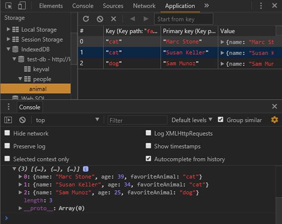](assets/images/full-size/lesson4-idb15.png)

You can even execute queries on the index. For instance, let's say you just want to see the people whose favoriteAnimal is 'cat'. You simply pass the string 'cat' to the `getAll` method:

```js
dbPromise.then(function(db) {
    var tx = db.transaction('people');
    var peopleStore = tx.objectStore('people');
    var animalIndex = peopleStore.index('animal');

    return animalIndex.getAll('cat');
  })
  .then(function(people) {
    console.log('People:', people);
  });
```

Now we have only the people that love cats.

[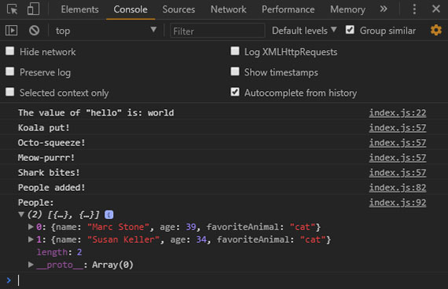](assets/images/full-size/lesson4-idb16.png)

## 4. IDB Cursors and Indexes
### Quiz

You just learned how to create an index to sort people by favoriteAnimal. Your task is to create an index where people are ordered by age.

```js
var dbPromise = idb.open('test-db', 4, function(upgradeDb) {
  switch(upgradeDb.oldVersion) {
    case 0:
      var keyValStore = upgradeDb.createObjectStore('keyval');
      keyValStore.put("world", "hello");
    case 1:
      upgradeDb.createObjectStore('people', { keyPath: 'name' });
    case 2:
      var peopleStore = upgradeDb.transaction.objectStore('people');
      peopleStore.createIndex( 'animal', 'favoriteAnimal' );
  }
  // TODO: create an index on 'people' named 'age', ordered by 'age'
});

// TODO: console.log all people ordered by age
```

### Solution

```js
var dbPromise = idb.open('test-db', 4, function(upgradeDb) {
  switch(upgradeDb.oldVersion) {
    case 0:
      var keyValStore = upgradeDb.createObjectStore('keyval');
      keyValStore.put("world", "hello");
    case 1:
      upgradeDb.createObjectStore('people', { keyPath: 'name' });
    case 2:
      var peopleStore = upgradeDb.transaction.objectStore('people');
      peopleStore.createIndex( 'animal', 'favoriteAnimal' );
    // TODO: create an index on 'people' named 'age', ordered by 'age'
    case 3:
      peopleStore = upgradeDb.transaction.objectStore('people');
      peopleStore.createIndex( 'age', 'age' );
  }
});

// TODO: console.log all people ordered by age
dbPromise.then( function( db ) {
  var tx = db.transaction( 'people' );
  var peopleStore = tx.objectStore( 'people' );
  var ageIndex = peopleStore.index( 'age' );

  return ageIndex.getAll();
}).then( function( people ) {
  console.log( 'Ordered by Age', people );
});
```

Once you've changed the code, refresh the page and check the Chrome developer tools to see if the people are ordered by age.

[](assets/images/full-size/lesson4-idb17.png)

### Crash Course Wrap-up
At the moment, we're getting all the items out of the store. But we can actually go through them one at a time using _cursors_. Taking the 'age' code from the solution, rather than calling `getAll` you can call `openCursor`. This returns a Promise for a cursor object representing the first item in the index, or `undefined` if there isn't one.

```js
dbPromise.then( function( db ) {
  var tx = db.transaction( 'people' );
  var peopleStore = tx.objectStore( 'people' );
  var ageIndex = peopleStore.index( 'age' );

  return ageIndex.openCursor();
}).then( function( cursor ) {
  if (!cursor) return;
  console.log( 'Cursored at:', cursor.value.name );
});
```

If it's undefined, we simply return. Otherwise, we console.log it.

The first person in the index is in `cursor.value`. To move on to the next person, we'll call `cursor.continue` which returns a Promise for a cursor representing the next person, or `undefined` if there isn't one.

A neat trick is to name the callback function and then call that function once `cursor.continue` resolves. This sets up a kind of asynchronous loop until cursor is `undefined`. Meaning, we're at the end of the list:


```js
dbPromise.then( function( db ) {
  var tx = db.transaction( 'people' );
  var peopleStore = tx.objectStore( 'people' );
  var ageIndex = peopleStore.index( 'age' );

  return ageIndex.openCursor();
}).then( function logPerson ( cursor ) {
  if (!cursor) return;
  console.log( 'Cursored at:', cursor.value.name );
  return cursor.continue().then( logPerson )
}).then(function() {
  console.log('Done cursoring');
});
```

So when we hit this next step in the Promise chain, we'll have gone through the whole object store.

[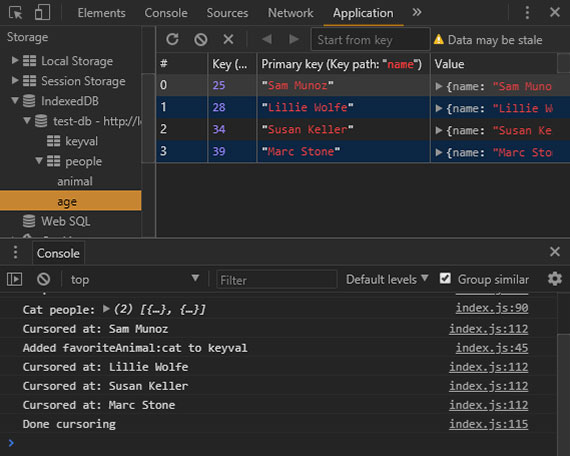](assets/images/full-size/lesson4-idb18.png)

At the moment, this is just a complicated way of calling `getAll`, but cursors become really useful when you want to modify items as you're looping through them.

You can use `cursor.update` to change the value, or `cursor.delete` to remove it. You could also skip some items using `cursor.advance`:

```js
dbPromise.then( function( db ) {
  var tx = db.transaction( 'people' );
  var peopleStore = tx.objectStore( 'people' );
  var ageIndex = peopleStore.index( 'age' );

  return ageIndex.openCursor();
}).then( function( cursor ) {
  if (!cursor) return;
  return cursor.advance(2);
}).then( function logPerson ( cursor ) {
  if (!cursor) return;
  console.log( 'Cursored at:', cursor.value.name );
  // cursor.update(newValue);
  // cursor.delete();
  return cursor.continue().then( logPerson )
}).then(function() {
  console.log('Done cursoring');
});
```

Notice that the number 2 is passed to `cursor.advance` here, this causes the first two items to be skipped.

[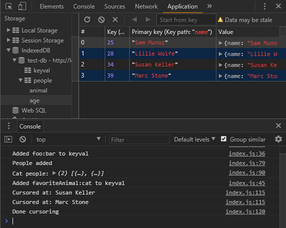](assets/images/full-size/lesson4-idb19.png)

That covers a majority of the IndexedDB API. In the next chapter, we'll put some of that knowledge into practice on Wittr itself.

## 5 IDB Cache & Display Entries
[](assets/images/full-size/lesson4-idb20.png)

The plan here is to create a database for Wittr that stores the posts.

When Wittr loads, via a Service Worker, it does so without going to the network. It fetches the page skeleton and assets straight from the cache.

[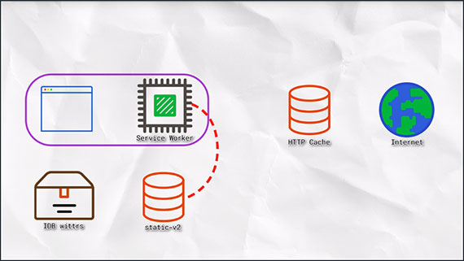](assets/images/full-size/lesson4-idb21.png)

At the moment, we have to go to the network for posts. We're going to change that so instead we'll get posts from the database and display them. Meaning we'll show post content before we go to the network.

[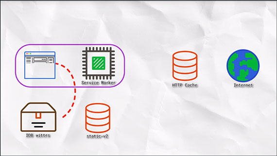](assets/images/full-size/lesson4-idb22.png)

Next, we'll connect the WebSocket to get updated posts. WebSockets bypass both the Service Worker and the HTTP cache. As new posts arrive, we'll ad them to the database for next time.

[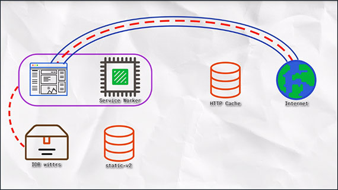](assets/images/full-size/lesson4-idb23.png)

### Populate the Database
The first thing we'll do is populate the database. We'll deal with displaying its contents later. If you take a look at the file path: public/js/main/IndexController.js, you can see that the IndexController._openSocket method is called to open the Web Socket. In that method you can see a listener for the message event, which hands off to the IndexController._onSocketMessage method passing in the data it received.

IndexController._onSocketMessage then parses the JSON data and passes it to IndexController._postsView.addPosts.

```js
// open a connection to the server for live updates
IndexController.prototype._openSocket = function() {
  var ws = new WebSocket(socketUrl.href);

  ws.addEventListener('message', function(event) {
    requestAnimationFrame(function() {
      indexController._onSocketMessage(event.data);
    });
  });
};

// called when the web socket sends message data
IndexController.prototype._onSocketMessage = function(data) {
  var messages = JSON.parse(data);
  console.log(mesages);
  this._postsView.addPosts(messages);
};
```

We can output the data with a console.log().

The data is an array of objects; When we go to our browser we can see the data looks like the following:

[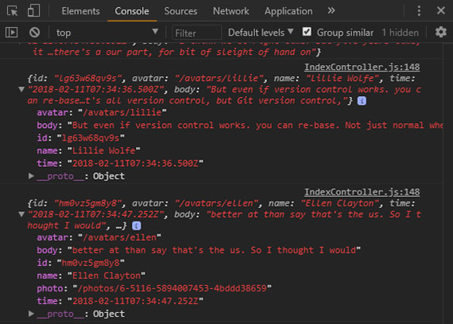](assets/images/full-size/lesson4-idb24.png)

The goal here is to store these objects straight into IndexedDB. The obvious primary key here is the 'id' property. And we'll want to be able to display the posts in date order, so we'll need to be able to create an index on the 'time' property.

```js
{
  avatar: String,
  body: String,
  id: String,
  name: String,
  time: String
}
```

<!--
## Using IDB Cache
We're back to editing Wittr, so head over to public/js/main/IndexController.js.

In the constructor, we're creating a Promise for a database by calling the openDatabase function. This function is incomplete.

Your task is to return a Promise for a database called 'wittr' that has an object store called 'wittrs' that uses 'id' as its key and has an index called called 'by-date', which is sorted by the 'time' property.
-->