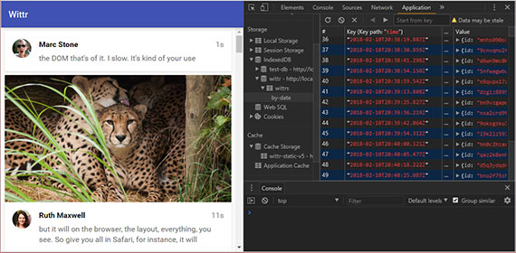
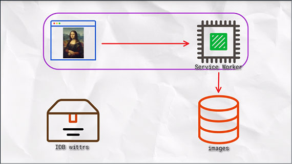
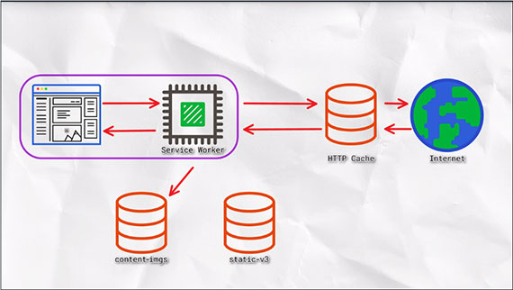
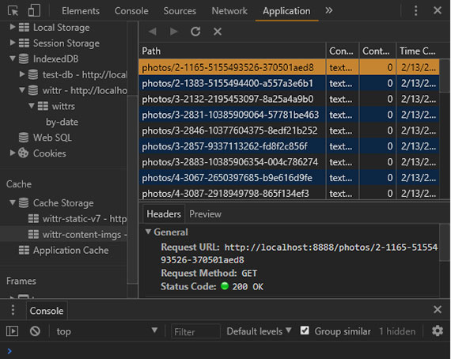
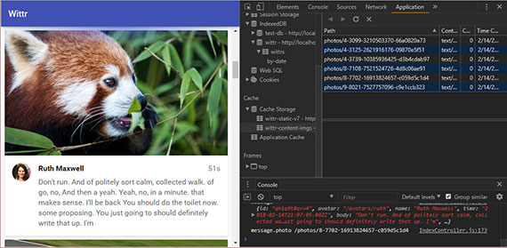

<!-- markdownlint-disable MD022 MD024 MD032 -->

[<-- back to Mobile Web Specialist Phase 1 Notes TOC](MWS-TOC.html)

---

# IndexedDB and Caching
Notes from _IndexedDB and Caching_ by Jake Archibald. This class is part of the Udacity course [Offline Web Applications by Google](https://www.udacity.com/course/offline-web-applications--ud899)

This is an Intermediate skill level course which takes approximately 3 weeks to complete and is offered for **FREE**!

These notes continue from where the previous set of class notes ([Introducing the Service Worker](Introducing-the-Service-Worker.html)) left off.

## 1. The IDB Promised Library
When the user opens Wittr, we want to start by showing the last post the device received - before going to the network. Then, we make the Web Socket connection and start receiving new posts one by one.

When we receive these posts, we want to display them, of course. But also we want to add them to the set of posts we already have stored. We also want to remove entries that are too old to be worth keeping.

A database is the best model for this. It means we can add and remove individual posts as needed, iterate over them, and query the data.

The web platform has a database called `IndexedDB` (IDB). It's fair to say that it has a bit of a bad reputation, but hopefully we can break through that in this chapter.

We aren't going to touch our Service Worker script for a bit, instead we will concentrate on learning IDB's shape and how it ticks. Then, we'll integrate it into a whole offline first experience.

### NoSQL
If you've used NoSQL Databases before, IDB will seem familiar. But if you've only used Relational Databases before, the concepts might seem a little weird. And if you've never used databases before, well, that might even help! As you can come to IDB fresh, without trying to translate it to similar but, ultimately, different things you've encountered.

### IndexedDB Database Shape

With IDB, you can have multiple databases with whatever name you give them. But we're only going to be creating one. Generally, you'll only have one database per application.

[](assets/images/full-size/lesson4-idb1.png)

That database contains multiple object stores; generally one for each kind of thing you want to store. 

[](assets/images/full-size/lesson4-idb2.png)

An object store can contain multiple values. These can be JavaScript `objects`, `strings`, `numbers`, `dates`, or `arrays`.

[](assets/images/full-size/lesson4-idb3.png)

Items in the object's store can have a separate primary key or you can assign a property of the values to be the key. The key must be unique within an object store. It becomes the way you identify a particular object.

[](assets/images/full-size/lesson4-idb4.png)

Later, you can `get`, `set`, `add`, `remove`, or `iterate` over items in object stores as part of a transaction. **All read or write operations in IndexedDB must be part of a transaction**.

#### Sample Transaction
1. [ ] Add "hello:world" to "keyval" store
1. [ ] Get the first value from the "people" store
1. [ ] Change the person's name to "James"
1. [ ] Write it back to the "peoples" store

This means that if you create a transaction for a series of steps and one of the actions fail, none of them are applied. The state of the database would be as if none of the steps happened.

| Transaction: | If one fails... | All fail! |
| --- | ---|
| [ ] step one | [ ] step one | [x] step one |
| [ ] step two | [x] step two | [x] step two |
| [ ] step three | [ ] step three | [x] step three |
| [ ] step four | [ ] step four | [x] step four |

You can also create indexes within an object store, which provides a different view of the same data ordered by particular properties:

[](assets/images/full-size/lesson4-idb5.png)

The model here is similar to a lot of databases, which makes a lot of sense. The browser support is good as well, with every major browser supporting it. So, why does IndexedDB have such a bad reputation?

[](assets/images/full-size/lesson4-idb6.png)

Unfortunately, the API is a little... horrid and often creates spaghetti code. It's all asynchronous, which is fine, but it pre-dates Promises. So it kind of invented its own event-based Promise system which creates really confusing code. 

To avoid this clumsy API, we're going to use a really small library that mirrors the IndexedDB API, but uses Promises rather than events. The library is called IndexedDB Promised. Anything you use in this library, you can apply to using IndexedDB directly.

[](assets/images/full-size/lesson4-idb7.png)

Take a look at this libraries repository and examples here: [https://github.com/jakearchibald/idb](https://github.com/jakearchibald/idb)

Next, we'll take a look at how you create a real-life database in the browser.

## 2. Getting Started with IDB
Hold on tight - you're now going to get a crash course in IndexedDB... Let's get through this as quickly as possible, and hopefully in one piece.

Start off by opening your browser to [http://localhost:8888/idb-test/](http://localhost:8888/idb-test/)

You'll see that it is just a blank page with a script tag. This script is located at the file path: public/js/idb-test/index.js

All the script contains, at the moment, is an `import` statement for the idb library.

If you open the idb libraries examples ([https://github.com/jakearchibald/idb](https://github.com/jakearchibald/idb)), to open a database you can see that the function signature is:

- **idb.open(name, version, upgradeCallback)**

```js
import idb from 'idb'

idb.open('test-db', 1, function(upgradeDb) {
    // in order to maintain referential integrity
    // this is the only place to create object stores & indexes
});
```

The `upgradeCallback` function will be called if the browser hasn't heard about this database before, or if the version it knows about is less than the version specified.

You'll notice that the callback function gets the `upgradeDb` parameter, which is used to define the database. To ensure database integrity, this is the only place you can create and remove object stores and indexes.

The API for `upgradeDb` is in the library, but it's mostly just a mirror of the real **IndexedDB API** on MDN, except for a few minor differences which we will cover.

### Create an Object Store
The library docs show that createObjectStore is the same for the IndexedDB API on MDN. So, MDN can give us the full detail of the API: [https://developer.mozilla.org/en-US/docs/Web/API/IDBDatabase/createObjectStore](https://developer.mozilla.org/en-US/docs/Web/API/IDBDatabase/createObjectStore)

In short, the syntax for createObjectStore looks something like this:

- **var objectStore = IDBDatabase.createObjectStore(name, options);**

The object store name is required, while the options parameter is optional.

So we'll create an object store with a name of 'keyval'. Because we haven't told it otherwise, this store has a key that is separate from the data - which is exactly what we want for a key/value store:

```js
import idb from 'idb';

idb.open('test-db', 1, function(upgradeDb) {
  var keyValStore = upgradeDb.createObjectStore('keyval');
});
```

### Write to the database
Now we need to add some content to the object store. We can accomplish this using the `put` method of the object store (`keyValStore`). Additional methods can be found by [viewing the docs](https://github.com/jakearchibald/idb#objectstore). These methods include: _put, add, delete, clear, get, getAll, getAllKeys, & count_. 

The put method has the following syntax:

- **var request = objectStore.put(item);**
- **var request = objectStore.put(item, key);**

If we look at `put` on MDN, it shows `put` takes an item and optional key, but returns a request. These request objects are the thing that makes IDB really difficult to deal with. 

So whenever IDB would return a request, the library returns a Promise. And yes, the signature here is [value, key] rather than [key. value] which is a real gotcha, but you'll see why it's like that later on.

**Once again: Whenever the IDB API returns an IDBRequest object, the IDB library will return a Promise that resolves with an IDBRequest object.**

So I'm going to put the value 'world', and set the key to be 'hello'. With that, we've finished setting our database up.:

```js
import idb from 'idb';

idb.open('test-db', 1, function(upgradeDb) {
  var keyValStore = upgradeDb.createObjectStore('keyval');
  keyValStore.put('world', 'hello');
});
```

The database is setup, but we need to add one last piece to this to wrap it up. `idb.open` returns a Promise that resolves with an `IDBDatabase` object. So we'll store that Promise for later:

```js
import idb from 'idb';

var dbPromise = idb.open('test-db', 1, function(upgradeDb) {
  var keyValStore = upgradeDb.createObjectStore('keyval');
  keyValStore.put('world', 'hello');
});
```

Later, we can use the `IDBDatabase` object to get and set items in the database.

Now, we can head back to the browser and refresh the page to run the new code. Open Dev Tools and click the **Application** tab. Under the Storage section, click on **IndexedDB**, locate the `keyval` store and click on it. Then, click the button to refresh the database. You should see the key of 'hello' and the value of 'world' inside.

[](assets/images/full-size/lesson4-idb8.png)

### Read from the Database
So now, if I want to read from the database, I need to create a transaction. The function to do this is `db.transaction()` to which I pass in the object stores I'm going to be using. In this case just `keyval`. Then I call `objectStore()`, passing in the name of the object store I want, `keyval`. This seems a bit repetitive but it's possible to have a transaction that uses multiple objects stores.

I called `get()` on the object store, passing in the key I'm interested in, `hello`. This returns a promise, which resolves to the value I'm looking for. Which I'll log.

```js
import idb from 'idb';

var dbPromise = idb.open('keyval', 1, function(upgradeDb) {
  var keyValStore = upgradeDb.createObjectStore('keyval');
  keyValStore.put('world', 'hello');
});

// read "hello" in "keyval"
dbPromise.then(function(db) {
  var tx = db.transaction('keyval');
  var keyValStore = tx.objectStore('keyval');
  return keyValStore.get('hello');
}).then(function(val) {
  console.log('The value of "hello" is:', val);
});
```

Now, say I wanted to add another value to the object store.

To do that, I create a transaction just as I did before but I specify that I want to read write this time. Now, I can get my objects stores before but this time, call `put` on on it to set a value.

I'm going to set the key `foo` to be value `bar`, `put` returns a Promise but this Promise doesn't necessarily mean the operation worked. As we saw, if the transaction fails. All the operations are part of it are undone.

```js
// set "foo" to be "bar" in "keyval"
dbPromise.then(function(db) {
  var tx = db.transaction('keyval', 'readwrite');
  var keyValStore = tx.objectStore('keyval');
  keyValStore.put('bar', 'foo');
  return tx.complete;
}).then(function() {
  console.log('Added foo:bar to keyval');
});
```

This means that you can do a lot of work in a transaction and be sure that it won't be left or accessed in some kind of half finished state. Either all happens or none of it happens.

`Transaction.complete()` is a promise that fulfills if and when the transaction completes, and it rejects if it fails. Once the transaction completes, we logout a success message.

[](assets/images/full-size/lesson4-idb9.png)

## 3. Diving Deeper with IDB
### Quiz
Your task is to set the 'favoriteAnimal' key to the name of your favorite animal, whatever that is. Once you've changed the code, refresh the page and check the Chrome developer tools to see if your favorite animal has appeared in IDB.

### Solution
```js
dbPromise.then( function( db ) {
  // TODO: in the keyval store, set
  // "favoriteAnimal" to your favourite animal
  // eg "cat" or "dog"
  var tx = db.transaction( 'keyval', 'readwrite' );
  tx.objectStore( 'keyval' ).put( 'Hungry shark🐠🐟🐡☠️', 'scariestAnimal' );
  tx.objectStore( 'keyval' ).put( 'Soggy Octopus🐙', 'mostFavoriteAnimal' );
  tx.objectStore( 'keyval' ).put( 'Astonished kitty🙀', 'nextFavoriteAnimal' );
  tx.objectStore( 'keyval' ).put( 'Ambivalent koala bear🐨😐', 'leastfavoriteAnimal' );
  return tx.complete;
}).then( () => {
  console.log( 'Koala put!' );
  console.log( 'Octo-squeeze!' );
  console.log( 'Meow-purrr!' );
  console.log( 'Shark bites!' );
});
```

I created a 'readwrite' transaction with access to the `keyval` store. Then I got the store and called `put` on it. Next I passed in my favorite animal, "Soggy Octopus🐙" as the value and 'mostfavoriteAnimal' as the key. I then do the same for the rest of my menagerie. I wait on completion of this transaction then log out a set of confirmation messages.

Over in the browser I refresh and see the IDB data as well as the console.log() messages.

[](assets/images/full-size/lesson4-idb10.png)

### Diving Deeper
So far we've created a key/val object store, but what if I wanted to created a different store with objects all of the same kind: People, for instance? To do that, you'll need to create another object store. As mentioned earlier, to maintain database integrity, you can only create object stores and indexes within the `upgradeDb` method. But `upgradeDb` isn't going to get called, because its already been called for `version` 1 of the database...

To fix this, start by bumping the `version` up to 2. Then, create a new object store called 'people'. The 'people' object store isn't going to have separate keys. Instead, make the 'name' property of the objects inside the store be the key:

```js
var dbPromise = idb.open('test-db', 2, function(upgradeDb) {
  var keyValStore = upgradeDb.createObjectStore('keyval');
  keyValStore.put('world', 'hello');
  upgradeDb.createObjectStore('people', { keyPath: 'name' });
});
```

In the real world, you can have more than one person with the same name - but for the sake of this demo we're going to assume names are unique.

By doing this, we've actually created a bug here. You can see it if you try reloading the page and taking a look at the Console.

[](assets/images/full-size/lesson4-idb11.png)

Because the browser hasn't seen `version` 2 yet, it will attempt to create a new object store with the name 'keyval' first. And when it does so, it will fail because the 'keyval' store already exists.

Thankfully, the `upgradeDb` object has a property named `oldVersion` which tells us the `version` the browser already knows about. We can use a `switch` statement to make the browser skip the parts it already knows about:

```js
var dbPromise = idb.open('test-db', 2, function(upgradeDb) {
  switch (upgradeDb.oldVersion) {
    case 0:
      var keyValStore = upgradeDb.createObjectStore('keyval');
      keyValStore.put('world', 'hello');
    case 1:
      upgradeDb.createObjectStore('people', {
        keyPath: 'name'
      });
  }
});
```

Usually with `switch` statements, you include a `break` after each case, but we specifically do not want to do that here so if the browser hasn't setup a db it'll start with `case 0` and will continue to fall-through the cases. Otherwise, if the browser already has `version` 1, it will start with `case 1` and only setup the new 'person' object store.

If you refresh the browser now, the errors are gone and the store has appeared in the **Application** panel under the **Storage > IndexedDB** section.

[](assets/images/full-size/lesson4-idb12.png)

Now we can create a `transaction` to put data in the new store:

```js
// .. previous code

dbPromise.then(function(db) {
  var tx = db.transaction('people', 'readwrite');
  var peopleStore = tx.objectStore('people');

  peopleStore.put({
    name: 'Sam Munoz',
    age: 25,
    favoriteAnimal: 'dog'
  });
  peopleStore.put({
    name: 'Susan Keller',
    age: 34,
    favoriteAnimal: 'cat'
  });
  peopleStore.put({
    name: 'Marc Stone',
    age: 39,
    favoriteAnimal: 'cat'
  });

  return tx.complete;
}).then(function() {
  console.log('People added!');
});
```

In this model, a person is just a plain JavaScript object. Notice that we're calling `put`, but we aren't providing a key this time. This is because when we created the object store for 'people', we told it to use the `name` property as the key.

Once we add the people, we wait on the transaction completing, then we log out a success message to the console.

If we refresh the browser, you can see this operation has completed and the people have been added.

[](assets/images/full-size/lesson4-idb13.png)

Now, let's read the people in the store. To do that, we create another transaction and set it to the people store. We then use the `getAll` method of the object store which returns a Promise. This Promise resolves to an array of all the objects in the store:

```js
dbPromise.then(function(db) {
  var tx = db.transaction('people');
  var peopleStore = tx.objectStore('people');
  return peopleStore.getAll();
}).then(function(people) {
  console.log('People:', people);
});
```

If we run this code in a browser we see that all the people are logged in alphabetical order.

[](assets/images/full-size/lesson4-idb14.png)

Notice that since the key is `name`, all of the objects will be in alphabetical order based on their name. This presents the next challenge... What if we wanted to group them together based on their favorite animal? This is where indexes come in.

Like other modifications to the database, indexes can only be created as part of a version upgrade. So we need to bump the version number up and start adding to our switch statement:

```js
var dbPromise = idb.open('test-db', 3, function(upgradeDb) {
  switch (upgradeDb.oldVersion) {
    case 0:
      var keyValStore = upgradeDb.createObjectStore('keyval');
      keyValStore.put('world', 'hello');
    case 1:
      upgradeDb.createObjectStore('people', {
        keyPath: 'name'
      });
    case 2:
      var peopleStore = upgradeDb.transaction.objectStore('people');
      peopleStore.createIndex('animal', 'favoriteAnimal');
  }
});
```

In the last case block, you can see that we're using the `transaction` object on the database object to obtain the 'people' object store, similar to obtaining the object store when creating transactions. Next, we use the `createIndex` method of the object store to create an index named 'animal' from the 'favoriteAnimal' property.

To use this index, we will modify the code where we are listing all the people. We'll start by getting the index from the object store by it's name: 'animal'.

An index has a very similar API to the object store. So, instead of calling `getAll` on the object store, we can call it on the index:

```js
dbPromise.then(function(db) {
  var tx = db.transaction('people');
  var peopleStore = tx.objectStore('people');
  var animalIndex = peopleStore.index('animal');

  return animalIndex.getAll();
}).then(function(people) {
  console.log('People:', people);
});
```

If you refresh the browser, this time the people are sorted by favoriteAnimal. In Chrome developer tools, you can see the index as well.

[](assets/images/full-size/lesson4-idb15.png)

You can even execute queries on the index. For instance, let's say you just want to see the people whose favoriteAnimal is 'cat'. You simply pass the string 'cat' to the `getAll` method:

```js
dbPromise.then(function(db) {
    var tx = db.transaction('people');
    var peopleStore = tx.objectStore('people');
    var animalIndex = peopleStore.index('animal');

    return animalIndex.getAll('cat');
  })
  .then(function(people) {
    console.log('People:', people);
  });
```

Now we have only the people that love cats.

[](assets/images/full-size/lesson4-idb16.png)

## 4. IDB Cursors and Indexes
### Quiz

You just learned how to create an index to sort people by favoriteAnimal. Your task is to create an index where people are ordered by age.

```js
var dbPromise = idb.open('test-db', 4, function(upgradeDb) {
  switch(upgradeDb.oldVersion) {
    case 0:
      var keyValStore = upgradeDb.createObjectStore('keyval');
      keyValStore.put("world", "hello");
    case 1:
      upgradeDb.createObjectStore('people', { keyPath: 'name' });
    case 2:
      var peopleStore = upgradeDb.transaction.objectStore('people');
      peopleStore.createIndex( 'animal', 'favoriteAnimal' );
  }
  // TODO: create an index on 'people' named 'age', ordered by 'age'
});

// TODO: console.log all people ordered by age
```

### Solution

```js
var dbPromise = idb.open('test-db', 4, function(upgradeDb) {
  switch(upgradeDb.oldVersion) {
    case 0:
      var keyValStore = upgradeDb.createObjectStore('keyval');
      keyValStore.put("world", "hello");
    case 1:
      upgradeDb.createObjectStore('people', { keyPath: 'name' });
    case 2:
      var peopleStore = upgradeDb.transaction.objectStore('people');
      peopleStore.createIndex( 'animal', 'favoriteAnimal' );
    // TODO: create an index on 'people' named 'age', ordered by 'age'
    case 3:
      peopleStore = upgradeDb.transaction.objectStore('people');
      peopleStore.createIndex( 'age', 'age' );
  }
});

// TODO: console.log all people ordered by age
dbPromise.then( function( db ) {
  var tx = db.transaction( 'people' );
  var peopleStore = tx.objectStore( 'people' );
  var ageIndex = peopleStore.index( 'age' );

  return ageIndex.getAll();
}).then( function( people ) {
  console.log( 'Ordered by Age', people );
});
```

Once you've changed the code, refresh the page and check the Chrome developer tools to see if the people are ordered by age.

[](assets/images/full-size/lesson4-idb17.png)

### Crash Course Wrap-up
At the moment, we're getting all the items out of the store. But we can actually go through them one at a time using _cursors_. Taking the 'age' code from the solution, rather than calling `getAll` you can call `openCursor`. This returns a Promise for a cursor object representing the first item in the index, or `undefined` if there isn't one.

```js
dbPromise.then( function( db ) {
  var tx = db.transaction( 'people' );
  var peopleStore = tx.objectStore( 'people' );
  var ageIndex = peopleStore.index( 'age' );

  return ageIndex.openCursor();
}).then( function( cursor ) {
  if (!cursor) return;
  console.log( 'Cursored at:', cursor.value.name );
});
```

If it's undefined, we simply return. Otherwise, we console.log it.

The first person in the index is in `cursor.value`. To move on to the next person, we'll call `cursor.continue` which returns a Promise for a cursor representing the next person, or `undefined` if there isn't one.

A neat trick is to name the callback function and then call that function once `cursor.continue` resolves. This sets up a kind of asynchronous loop until cursor is `undefined`. Meaning, we're at the end of the list:

```js
dbPromise.then( function( db ) {
  var tx = db.transaction( 'people' );
  var peopleStore = tx.objectStore( 'people' );
  var ageIndex = peopleStore.index( 'age' );

  return ageIndex.openCursor();
}).then( function logPerson ( cursor ) {
  if (!cursor) return;
  console.log( 'Cursored at:', cursor.value.name );
  return cursor.continue().then( logPerson )
}).then(function() {
  console.log('Done cursoring');
});
```

So when we hit this next step in the Promise chain, we'll have gone through the whole object store.

[](assets/images/full-size/lesson4-idb18.png)

At the moment, this is just a complicated way of calling `getAll`, but cursors become really useful when you want to modify items as you're looping through them.

You can use `cursor.update` to change the value, or `cursor.delete` to remove it. You could also skip some items using `cursor.advance`:

```js
dbPromise.then( function( db ) {
  var tx = db.transaction( 'people' );
  var peopleStore = tx.objectStore( 'people' );
  var ageIndex = peopleStore.index( 'age' );

  return ageIndex.openCursor();
}).then( function( cursor ) {
  if (!cursor) return;
  return cursor.advance(2);
}).then( function logPerson ( cursor ) {
  if (!cursor) return;
  console.log( 'Cursored at:', cursor.value.name );
  // cursor.update(newValue);
  // cursor.delete();
  return cursor.continue().then( logPerson )
}).then(function() {
  console.log('Done cursoring');
});
```

Notice that the number 2 is passed to `cursor.advance` here, this causes the first two items to be skipped.

[](assets/images/full-size/lesson4-idb19.png)

That covers a majority of the IndexedDB API. In the next chapter, we'll put some of that knowledge into practice on Wittr itself.

## 5. IDB Cache & Display Entries
[](assets/images/full-size/lesson4-idb20.png)

The plan here is to create a database for Wittr that stores the posts.

When Wittr loads, via a Service Worker, it does so without going to the network. It fetches the page skeleton and assets straight from the cache.

[](assets/images/full-size/lesson4-idb21.png)

At the moment, we have to go to the network for posts. We're going to change that so instead we'll get posts from the database and display them. Meaning we'll show post content before we go to the network.

[](assets/images/full-size/lesson4-idb22.png)

Next, we'll connect the WebSocket to get updated posts. WebSockets bypass both the Service Worker and the HTTP cache. As new posts arrive, we'll ad them to the database for next time.

[](assets/images/full-size/lesson4-idb23.png)

### Populate the Database
The first thing we'll do is populate the database. We'll deal with displaying its contents later. If you take a look at the file path: public/js/main/IndexController.js, you can see that the IndexController._openSocket method is called to open the Web Socket. In that method you can see a listener for the message event, which hands off to the IndexController._onSocketMessage method passing in the data it received.

IndexController._onSocketMessage then parses the JSON data and passes it to IndexController._postsView.addPosts.

```js
// open a connection to the server for live updates
IndexController.prototype._openSocket = function() {
  var ws = new WebSocket(socketUrl.href);

  ws.addEventListener('message', function(event) {
    requestAnimationFrame(function() {
      indexController._onSocketMessage(event.data);
    });
  });
};

// called when the web socket sends message data
IndexController.prototype._onSocketMessage = function(data) {
  var messages = JSON.parse(data);
  console.log(mesages);
  this._postsView.addPosts(messages);
};
```

We can output the data with a console.log().

The data is an array of objects; When we go to our browser we can see the data looks like the following:

[](assets/images/full-size/lesson4-idb24.png)

The goal here is to store these objects straight into IndexedDB. The obvious primary key here is the 'id' property. And we'll want to be able to display the posts in date order, so we'll need to be able to create an index on the 'time' property.

```js
{
  avatar: String,
  body: String,
  id: String,
  name: String,
  time: String
}
```

## 6. Populate the IDB Database
We're back to editing Wittr, so head over to public/js/main/IndexController.js.

In the constructor, we're creating a Promise for a database by calling the openDatabase function. This function is incomplete.

```js
import idb from 'idb';

export default function IndexController(container) {
  this._openSocket();
  this._dbPromise = openDatabase();
  this._registerServiceWorker();
}

function openDatabase() {
  // If the browser doesn't support service worker,
  // we don't care about having a database
  if (!navigator.serviceWorker) {
    return Promise.resolve();
  }

  // TODO: return a promise for a database called 'wittr'
  // that contains one objectStore: 'wittrs'
  // that uses 'id' as its key
  // and has an index called 'by-date', which is sorted
  // by the 'time' property
}
```

Your task is to return a Promise for a database called 'wittr' that has an object store called 'wittrs' that uses 'id' as its key and has an index called called 'by-date', which is sorted by the 'time' property. The 'idb' polyfill has been imported at the top of the script so it is ready to use.

Once you've done that, you'll need to add messages to the database. Down in the IndexController._onSocketMessage method, the database has been fetched. Your task is to add each of the messages to the Wittr store. Note that we're not using the entries in the database yet - we'll do that in the next chapter.

```js
// called when the web socket sends message data
IndexController.prototype._onSocketMessage = function(data) {
  var messages = JSON.parse(data);

  this._dbPromise.then(function(db) {
    if (!db) return;

    // TODO: put each message into the 'wittrs'
    // object store.
  });

  this._postsView.addPosts(messages);
};
```

If the database gets into a bad state, you can remove it and start fresh by clicking the 'Delete Database' button under Dev Tools -> Application -> IndexedDB -> 'wittr'.

### Solution

```js
function openDatabase() {
  // If the browser doesn't support service worker,
  // we don't care about having a database
  if (!navigator.serviceWorker) {
    return Promise.resolve();
  }

  // TODO: return a promise for a database called 'wittr'
  // that contains one objectStore: 'wittrs'
  // that uses 'id' as its key
  // and has an index called 'by-date', which is sorted
  // by the 'time' property
  var dbPromise = idb.open('wittr', 1, function(upgradeDb) {
    var wittrsStore = upgradeDb.createObjectStore('wittrs', { keyPath: 'id' });
    wittrsStore.createIndex('by-date', 'time');
  });
  return dbPromise;
}

// called when the web socket sends message data
IndexController.prototype._onSocketMessage = function(data) {
  var messages = JSON.parse(data);

  this._dbPromise.then(function(db) {
    if (!db) return;

    // TODO: put each message into the 'wittrs'
    // object store.
    var tx = db.transaction('wittrs', 'readwrite');
    var wittrsStore = tx.objectStore('wittrs');

    messages.forEach(message => {
      wittrsStore.put(message);
    });

    return tx.complete;
  });

  this._postsView.addPosts(messages);
};
```

We go to the browser and refresh the database to see if our data has been saved properly.

[](assets/images/full-size/lesson4-idb25.png)

## 7. Display IDB Data on Page
Now we want to get posts that are in the database (IDB 'wittrs' object store) and display them (post them  to the page).

[](assets/images/full-size/lesson4-idb22.png)

We want to do this before connecting to the websocket that gets us new posts.

[](assets/images/full-size/lesson4-idb23.png)

First, we verify we've got posts in the database with Dev Tools. 

[](assets/images/full-size/lesson4-idb25.png)

Once verified we open public/js/main/IndexController.js file.

Previously, we were calling the `IndexController._openSocket` method, but now we're calling the `IndexController._showCachedMessages` method and then opening the socket. However, the '_showCachedMessages' method isn't fully implemented yet.

```js
export default function IndexController(container) {
  this._container = container;
  this._postsView = new PostsView(this._container);
  this._toastsView = new ToastsView(this._container);
  this._lostConnectionToast = null;
  this._dbPromise = openDatabase();
  this._registerServiceWorker();

  var indexController = this;

  this._showCachedMessages().then(function() {
    indexController._openSocket();
  });
}

IndexController.prototype._showCachedMessages = function() {
  var indexController = this;

  return this._dbPromise.then(function(db) {
    // if we're already showing posts, eg shift-refresh
    // or the very first load, there's no point fetching
    // posts from IDB
    if (!db || indexController._postsView.showingPosts()) return;

    // TODO: get all of the wittr message objects from indexeddb,
    // then pass them to:
    // indexController._postsView.addPosts(messages)
    // in order of date, starting with the latest.
    // Remember to return a promise that does all this,
    // so the websocket isn't opened until you're done!
  });
};
```

The task is to get all of the Wittr message objects from the database and pass them to the `IndexController._postsView.addPosts` method. Make sure they are in date order, starting with the latest; which may not be the way they come out of the database.

Once we've made changes to the code, we'll need to bump the cache version number in the Service Worker so the changes are picked up.

If the database gets into a bad state, we can remove the database through Dev Tools.

### Solution
We start by creating a transaction for the 'wittrs' store. Then we get the objectStore. Then we get the 'by-date' index. We use `getAll`, which returns a promise for everything in the index and then pass the results to `addPosts`.

However, the messages here will be in date-ascending order by default. So, we reverse them so the latest post appears at the top.

```js
IndexController.prototype._showCachedMessages = function() {
  var indexController = this;

  return this._dbPromise.then(function(db) {
    // if we're already showing posts, eg shift-refresh
    // or the very first load, there's no point fetching
    // posts from IDB
    if (!db || indexController._postsView.showingPosts()) return;

    // TODO: get all of the wittr message objects from indexeddb,
    // then pass them to:
    // indexController._postsView.addPosts(messages)
    // in order of date, starting with the latest.
    // Remember to return a promise that does all this,
    // so the websocket isn't opened until you're done!
    var tx = db.transaction('wittrs');
    var store = tx.objectStore('wittrs');
    var dateIndex = store.index('by-date');

    return dateIndex.getAll().then(function(messages) {
      indexController._postsView.addPosts(messages.reverse());
    });
  });
};
```

Alternatively, we can write the code like this:

```js
IndexController.prototype._showCachedMessages = function() {
  var indexController = this;

  return this._dbPromise.then(function(db) {
    if (!db || indexController._postsView.showingPosts()) return;

    var dateIndex = db.transaction('wittrs')
      .objectStore('wittrs').index('by-date');

    return dateIndex.getAll().then(function(messages) {
      indexController._postsView.addPosts(messages.reverse());
    });
  });
};
```

We want to see how this update works the natural way. So we bump the service worker cache version. Then over in the browser, we disable 'Update on reload' and refresh the page. There's our update.

## 8. Cleaning the IDB Database

[](assets/images/full-size/lesson4-idb26.png)

Things are looking great, but at the moment we're only adding things to the database. At some point, you'll end up with thousands and thousands of items in there. And the browser's going to not allow any more storage. So we need to make sure we're only keeping what we need.

Head over to the public/js/main/IndexController.js file and take a look at the IndexController._onSocketMessage method. We're already adding items into the database, but after that you need to ensure there are no more than 30 items in the object store. The code in public/js/idb-test/index.js should act as a good reference to achieve this task.

```js
// called when the web socket sends message data
IndexController.prototype._onSocketMessage = function(data) {
  var messages = JSON.parse(data);

  this._dbPromise.then(function(db) {
    if (!db) return;

    var tx = db.transaction('wittrs', 'readwrite');
    var store = tx.objectStore('wittrs');
    messages.forEach(function(message) {
      store.put(message);
    });

    // TODO: keep the newest 30 entries in 'wittrs',
    // but delete the rest.
    //
    // Hint: you can use .openCursor(null, 'prev') to
    // open a cursor that goes through an index/store
    // backwards.
  });

  this._postsView.addPosts(messages);
};
```

Once you've put the code in place, refresh Wittr in the browser to run your code. I recommend SHIFT refreshing to bypass the Service Worker until you've got everything working. Then, bump the version of the Service Worker static cache to pick up your changes.

If everything's working, you should see the 'wittr' database in Chrome developer tools and in there, you should see no more than 30 messages.

[](assets/images/full-size/lesson4-idb27.png)

### Solution
The code for dealing with this is a little bit tricky. Over in `_onSocketMessage`, after adding the messages into the database, we continue using the same transaction and the same object store.


```js
// called when the web socket sends message data
IndexController.prototype._onSocketMessage = function(data) {
  var messages = JSON.parse(data);

  this._dbPromise.then(function(db) {
    if (!db) return;

    var tx = db.transaction('wittrs', 'readwrite');
    var store = tx.objectStore('wittrs');
    messages.forEach(function(message) {
      store.put(message);
    });

    // TODO: keep the newest 30 entries in 'wittrs',
    // but delete the rest.
    //
    // Hint: you can use .openCursor(null, 'prev') to
    // open a cursor that goes through an index/store
    // backwards.
    var index = store.index('by-date');

    return index.openCursor(null, 'prev').then(function(cursor) {
      return cursor.advance(30);
    }).then(function deletePost(cursor) {
      if (!cursor) return;
      cursor.delete();
      return cursor.continue().then(deletePost);
    });
  });

  this._postsView.addPosts(messages);
};
```

We get the 'by-date' index, because we want to remove the oldest posts, and we open a cursor, but pass a 'null' and 'prev', so the cursor goes backwards for the index starting with the newest post.

We don't care about the first 30 posts, those are the newest ones,they can stay. We advance past them.

With the posts after that, if the cursor is 'undefined', we're done. Overwise We delete the entry, then 'continue' the cursor calling the same function again to loop through the remaining entries. This keeps the news 30 post, but deletes the rest.

## 9. Cache Photos
[](assets/images/full-size/lesson4-idb31.png)

Some of the posts on Wittr have photos with them, we want to cache those images too. At the moment, we're only caching resources at install time, whereas the images appear over the lifetime of the application with the posts. So we want to cache images as they appear.

We could put these images in IDB along with the rest of the post data, but that means we'd need to read the pixel data and convert it into a blob and that kind of complicated and it also loses streaming, which has a performance impact.

When we get an item from a database, we have to take the whole thing out in one lump then convert it into image data and add it to the page. Whereas, if we get the image from a cache it will stream the data so we don't need to wait for the whole thing before we display anything. This is more memory efficient, and leads to faster renders. For that reason, the **Cache API** is a much better fit.

[](assets/images/full-size/lesson4-idb28.png)


Since we're into the advanced stages of the course, this hasn't been made totally straightforward. Here is the code for the responsive image:

```html

```

Because images can appear at a variety of different widths, this responsive image lets the browser decide which image to load based on the width of the window and also the network conditions.

So, when the post arrives through the WebSocket, which version do we cache?

Well, we wait until the browser makes the request. Then we hear about it in the Service Worker. We go to the network for the image and once we get a response, we put it in the cache. At the same time, we send it on to the page.

[](assets/images/full-size/lesson4-idb29.png)


Note that we'll put the image into a separate cache to the rest of the static content. We reset the content of our static cache whenever we update our JavaScript or our CSS, but we want these images to live between versions of our application.

Next time we get a request for an image that we already have cached, we simply return it. But, here's the trick; we'll return the image from the cache even if the browser requests a different size of the same image. Posts on Wittr are short-lived, so if the browser requests a bigger version of the same image returning a smaller one from the cache isn't really a problem. Returning a bigger image than the browser asked for is perfectly fine too - we're not wasting bandwidth by doing that. In fact, getting a smaller version of something we already have cached would be a waste of bandwidth. Also, resizing the browser window back and forth is only really something that web developers do.

At this point, we've covered most of the APIs you'd need to be able to cache images. There's only one thing left to cover. **You can only use the body of a Response once**.

If you read the Response as `json`, you cannot then read it as a `blob`. The following example would fail:

```js
fetch('/foo').then(function(response) {
  var jsonData = response.json();
  var blobData = response.blob(); // fails
});
```

This is because the original data has been used already by the time you attempt to read it as a blob. Keeping it around in memory would just be a waste. Also, `respondWith` uses the body of the Response as well, so you cannot later read it again:

```js
fetch('/foo').then(function(response) {
  var jsonData = response.json(); // response consumed
  var blobData = response.blob(); // fails
  event.respondWith(response); // also fails
});
```

In most cases, this is great because if the response was a huge video file (like 3GB) the browser doesn't need to keep the whole 3GB in memory - it only needs to keep the bit that is currently playing, plus a bit extra for buffering. However, this is a problem for our images.

We want to open a cache, fetch from the network, and send a response to both the cache AND back to the browser. But, using the Response body twice like this doesn't work:

```js
event.respondWith(
  caches.open('wittr-content-imgs').then(function(cache) {
    return fetch(request).then(function(response) {
      cache.put(request, response); // response consumed here
      return response; // fails :(
    });
  })
);
```

Luckily, we can fix this issue by cloning the Response we send to the cache with the clone method:

```js
event.respondWith(
  caches.open('wittr-content-imgs').then(function(cache) {
    return fetch(request).then(function(response) {
      cache.put(request, response.clone());
      return response;
    });
  })
);
```

Now our clone goes to the cache and the original get's sent back to the page. The browser keeps enough of the original request around to satisfy all of the clones.

## 10. Cache Photos Code
So, let's start coding this up.First thing we need is to set up our image cache in the service worker. I'm going to create a variable to hold the name of this new image cache. And I'm going to create an array to hold all the cache names we care about.

```js
var staticCacheName = 'wittr-static-v6';
var contentImgsCache = 'wittr-content-imgs';
var allCaches = [
  staticCacheName,
  contentImgsCache
];
```

In our activate event that we wrote earlier, we're deleting any cache that isn't the static cache. That isn't good enough anymore as we start losing our image cache. Instead, we want to delete any caches that aren't in our array of caches that we care about.

```js
self.addEventListener('activate', function(event) {
  event.waitUntil(
    caches.keys().then(function(cacheNames) {
      return Promise.all(
        cacheNames.filter(function(cacheName) {
          return cacheName.startsWith('wittr-') &&
                 // cacheName != staticCacheName;   // old
                 !allCaches.includes(cacheName);    // new
        }).map(function(cacheName) {
          return caches.delete(cacheName);
        })
      );
    })
  );
});
```

Now, to handle those photo requests. Over in our fetch handler, I'm going to handle URLs that have the same origin and have a path that starts with slash photo slash. When I see one of those, I'm going to respond with whatever returns from `servePhoto`. All we need to do now is implement 'servePhoto'.

```js
self.addEventListener('fetch', function(event) {
  var requestUrl = new URL(event.request.url);

  if (requestUrl.origin === location.origin) {
    if (requestUrl.pathname === '/') {
      event.respondWith(caches.match('/skeleton'));
      return;
    }
    // new code start
    if (requestUrl.pathname.startsWith('/photos/')) {
      event.respondWith(servePhoto(event.request));
      return;
    }
    // new code end
  }

  event.respondWith(
    caches.match(event.request).then(function(response) {
      return response || fetch(event.request);
    })
  );
});
```

I'm only wanting to store one copy of each photo, and photo URLs look like this.

`/photos/9-8028-7527734776-e1d2bda28e-800px.jpg`

They have width information at the end. So, I'm going to create a storage URL that doesn't have the size info. I'm going to do that using a regular expression matching on dash, some digits and then px.jpg. And I'm going to replace that with nothing. Now, I have the URL, but missing the size-specific stuff. This is the URL I'm going to use in the cache.

```js
function servePhoto(request) {
  // Photo urls look like:
  // /photos/9-8028-7527734776-e1d2bda28e-800px.jpg
  // But storageUrl has the -800px.jpg bit missing.
  // Use this url to store & match the image in the cache.
  // This means you only store one copy of each photo.
  var storageUrl = request.url.replace(/-\d+px\.jpg$/, '');

  // TODO: return images from the "wittr-content-imgs" cache
  // if they're in there. Otherwise, fetch the images from
  // the network, put them into the cache, and send it back
  // to the browser.
  //
  // HINT: cache.put supports a plain url as the first parameter
}
```

The aim is to serve photos from the cache if they're there. Otherwise, get them from the network, but put them into the cache for the next time.

Remember to use storageUrl when matching and putting stuff into the image cache so you only end up with one photo in the cache no matter how many different sizes are requested. Once again, developing gets a lot easier if you have Developer Tools open and 'Update on reload' checked so you only need to refresh once to see changes.

You know things are working when you see a Wittr content images cache in devtools where the URLs are missing the width and the .jpg extension at the end. You should be able to take the server offline, reload the page, and still get images.

### Solution


```js
function servePhoto(request) {
  // Photo urls look like:
  // /photos/9-8028-7527734776-e1d2bda28e-800px.jpg
  // But storageUrl has the -800px.jpg bit missing.
  // Use this url to store & match the image in the cache.
  // This means you only store one copy of each photo.
  var storageUrl = request.url.replace(/-\d+px\.jpg$/, '');

  // TODO: return images from the "wittr-content-imgs" cache
  // if they're in there. Otherwise, fetch the images from
  // the network, put them into the cache, and send it back
  // to the browser.
  //
  // HINT: cache.put supports a plain url as the first parameter
  return caches.open(contentImgsCache).then(function(cache) {
    return cache.match(storageUrl).then(function(response) {
      return (
        response || fetch(request).then(function(networkResponse) {
          cache.put(storageUrl, networkResponse.clone());
          return networkResponse;
        })
      );
    });
  });
}
```

First we open the cache for our images. Once we've got the cache, we look for a match for storageUrl. If there is one we return it. Otherwise, we fetch the image from the network using the fetch API.

Once we get the response, we add it to the cache using the storageUrl and a clone of the response. Then we return the original response to the browser. Remember, you can only read a response's body once. This is why we have one copy going to the cache and the original going to the browser.

Now we use 'Update on reload' and reload the page. If we check the Application panel in dev tools we can see the new cache and it has images in it. If I resize this panel so we can see the whole URL,you can see the URL ends before the bit with the pixel width,confirming the cache URLs aren't site specific.

[](assets/images/full-size/lesson4-idb30.png)

Then we test the serving. We bring the server down, go offline, and reload the page. We should see the images are still loading but here's the ultimate test. If I change the width of the browser and reload, yep, the images still load. This means the service worker is returning the image we have cached no matter which width of image the browser requests.

## 11. Cleaning Photo Cache
Caching the photos is great, but like we saw with the database earlier you can't just keep adding stuff to the cache. We'll need to remove stuff that we don't need anymore.

This involves a couple of cache methods that we haven't seen yet. If we want to remove specific entries from the cache, we can use `cache.delete`, passing in the URL or the request of the thing we want to delete:

```js
cache.delete(request);
```

There's also a `cache.keys` method that returns a Promise which gives us all the requests for entries in the cache:

```js
cache.keys().then(function(requests) {
  // ...
});
```

What hasn't been mentioned so far is that all of this is available from pages, as well as Service Workers. Let's have a look at using these methods to clean the image cache in the next chapter.

## 12. Clean Photo Cache Code
Let's keep our image cache under control. We're going to do this from the index controller in 'public/js/main/IndexController.js'. We start by creating a new method called `_cleanImageCache`. When the page loads it starts the controller and calls the new _cleanImageCache method but that means the cache can still go out of control if the user keeps the page open for ages. So we'll also call it every five minutes.

```js
export default function IndexController(container) {
  this._container = container;
  this._postsView = new PostsView(this._container);
  this._toastsView = new ToastsView(this._container);
  this._lostConnectionToast = null;
  this._dbPromise = openDatabase();
  this._registerServiceWorker();
  this._cleanImageCache();        // new code

  var indexController = this;

  setInterval(function() {        // new code
    indexController._cleanImageCache();
  }, 1000 * 60 * 5);

  this._showCachedMessages().then(function() {
    indexController._openSocket();
  });
}
```

Now what we need to do is implement this new `_cleanImageCache` method. Implementing cleanImageCache is going to bring together IndexedDB and the Cache API. A combination of things we've learned in this course.

Head over to public/js/main/IndexController.js. Your task is to implement the `IndexController._cleanImageCache` method.

It involves getting all the messages from the database, looking at what photos they need, then going through the images cache and getting rid of the ones that aren't needed anymore. Remember that the 'photo' properties value may not exactly match the URL in the cache.

```js
IndexController.prototype._cleanImageCache = function() {
  return this._dbPromise.then(function(db) {
    if (!db) return;

    // TODO: open the 'wittr' object store, get all the messages,
    // gather all the photo urls.
    //
    // Open the 'wittr-content-imgs' cache, and delete any entry
    // that you no longer need.
  });
};
```

Once you've written the code, head over to the browser and refresh the page using the 'Update on reload' option so you only need to refresh once to see changes. Looking at dev tools you should see the cache only contains images that are on the page. An easy way to test is to open a new tab and navigate to the URL here. We can see in the cache that this image has been stored. Now when I reload witter the cleanup code kicks in and the image is gone from the cache.

When you're finished, turn 'Update on reload' off in the Chrome developer tools, enter the Task ID in the settings page, and refresh the Wittr page within 8 seconds.

### Solution
This was a bit tough. In order to solve it I had to reference the Service Worker file which contained the Cache API code I had previously written. This was located in '\public\js\sw\index.js'.

I then had to reference the IndexController file which contained the IndexedDB code I had previously written. This was located at '\public\js\main\IndexController.js'.

First we start by creating an array of images that I want to keep, Then we create a transaction to look at the 'wittrs' objects store.

```js
IndexController.prototype._cleanImageCache = function() {
  return this._dbPromise.then(function(db) {
    if (!db) return;

    // TODO: open the 'wittr' object store, get all the messages,
    // gather all the photo urls.
    //
    // Open the 'wittr-content-imgs' cache, and delete any entry
    // that you no longer need.
    var imagesNeeded = [];

    var messages = db.transaction('wittrs')
      .objectStore('wittrs').getAll()
      .then(function(messages) {
        messages.forEach(function(message) {
          if (message.photo) {
            // console.log('message', message);
            // console.log('message.photo', message.photo);
            imagesNeeded.push(message.photo);
          }
        });

        return caches.open('wittr-content-imgs');
      }).then(function(cache) {
        return cache.keys().then(function(requests) {
          requests.forEach(function(request) {
            var url = new URL(request.url);

            if (!imagesNeeded.includes(url.pathname)) {
              cache.delete(request);
            }
          });
        });
    });
  });
};
```

Then we get the object store and get all the messages. Now we can take a peek into the database. For each message, we'll look to see if it has a photo property. This contains the photo URL, but without the width bit at the end. So we add those to the array of images that we want to keep. 

Then we open the images cache and get all the requests that are stored in it using cache.keys. Now, the URLs on request objects are absolute so they'll include the local host port 8080 bit, whereas the URLs we're storing in IndexedDB, don't have that.

So for each request I'm going to parse as URL.So now if the path name of the URL isn't in our array of images needed, we'll pass the request to cache.delete.

So with 'Update on reload' enabled, we refresh the page and see we've only got a handful of images cached. We're caching photos now, we're so very nearly there.

[](assets/images/full-size/lesson4-idb32.png)

The last thing we need to deal with is avatars. One more chapter before we achieve total offline first.

## 13. Caching Avatars
Compared to what you've done so far, this last part should be a breeze! We just need to cache the avatar images. This is almost the same as caching the photo images, but there's one small difference...

Some people like to change their avatar a lot and we don't want people to be stuck with some old version of their avatar. So, when we fetch a particular avatar from the cache we will also fetch it from the network and update the cache.

Avatars are also responsive images, but they vary by density rather than width. Pretty much the same as photo images, but a slightly different URL pattern:

```html

```

We're going to cache the avatars in the same cache as photos. Notice that the imagesNeeded array in the updated code branch now includes the avatar image URLs so that it includes them in the images we want to keep. We don't want those getting lost in the cleanup.

Head over to 'public/js/sw/index.js'. There are two things for you to implement:

```js
self.addEventListener('fetch', function(event) {
  var requestUrl = new URL(event.request.url);

  if (requestUrl.origin === location.origin) {
    if (requestUrl.pathname === '/') {
      event.respondWith(caches.match('/skeleton'));
      return;
    }
    if (requestUrl.pathname.startsWith('/photos/')) {
      event.respondWith(servePhoto(event.request));
      return;
    }
    // TODO: respond to avatar urls by responding with
    // the return value of serveAvatar(event.request)
  }

  event.respondWith(
    caches.match(event.request).then(function(response) {
      return response || fetch(event.request);
    })
  );
});

function serveAvatar(request) {
  // Avatar urls look like:
  // avatars/sam-2x.jpg
  // But storageUrl has the -2x.jpg bit missing.
  // Use this url to store & match the image in the cache.
  // This means you only store one copy of each avatar.
  var storageUrl = request.url.replace(/-\dx\.jpg$/, '');

  // TODO: return images from the "wittr-content-imgs" cache
  // if they're in there. But afterwards, go to the network
  // to update the entry in the cache.
  //
  // Note that this is slightly different to servePhoto!
}
```

1. You need to call the `serveAvatar` function from the fetch event handler.

1. Then, you'll need to implement the `serveAvatar` function. The function should return avatar images from the cache if they're there. If not, get it from the network and put it in the cache. But here's the difference, even if you return it from the cache you'll need to go to the network to update it for the next fetch. Once again, we're removing the size-specific parts of the URL with the storageUrl variable. So use this URL to put and match in the cache. The solution will be similar to servePhoto, but not exactly the same.

Once you've written the code, head over to the browser and enable Update on reload in Chrome developer tools. You should see avatar images arriving into the cache. If you go 'Offline' and refresh, the avatar images should still load.

### Solution

```js
self.addEventListener('fetch', function(event) {
  var requestUrl = new URL(event.request.url);
  // code...

  // TODO: respond to avatar urls by responding with
  // the return value of serveAvatar(event.request)
  if (requestUrl.pathname.startsWith('/avatars/')) {
    event.respondWith(serveAvatar(event.request));
    return;
  }

  // code...
});

function serveAvatar(request) {
  // Avatar urls look like:
  // avatars/sam-2x.jpg
  // But storageUrl has the -2x.jpg bit missing.
  // Use this url to store & match the image in the cache.
  // This means you only store one copy of each avatar.
  var storageUrl = request.url.replace(/-\dx\.jpg$/, '');

  // TODO: return images from the "wittr-content-imgs" cache
  // if they're in there. But afterwards, go to the network
  // to update the entry in the cache.
  //
  // Note that this is slightly different to servePhoto!
  return caches.open(contentImgsCache).then(function(cache) {
    return cache.match(storageUrl).then(function(response) {
      var fetchPromise = fetch(request).then(function(networkResponse) {
        cache.put(storageUrl, networkResponse.clone());
        return networkResponse;
      });

      return response || fetchPromise;
    });
  });
}
```

Here's how the final bits came together. So over in our `fetch` event we react to URLs that start with /avatars/.For those we call `respondWith`, passing in the result of `serveAvatar`.

Over in `serveAvatar`, we start by opening the image cache, then look for a match for the storageUrl. Here's where things start to get a little bit different. We do a network fetch for the avatar and if we get a response, we put a clone in the cache using the storageUrl, then we return the original response.

Now we've got a response from the cache that might be `undefined` if there's no match for this particular request. But we've also got a promise for the network response. So we return the cache response or the network response, and that's it.

[](assets/images/full-size/lesson4-idb34.png)

Now we can see in the Cache Storage that both photos and avatars are being saved.

## 14. Wrap-up
And that's it, job done! We've taken an entirely online only site and made it an offline first Progressive Web Application! By making it to the end of this course, you're ready to take on ANY offline first project.

Wittr was specifically designed to cover most of the gnarly edge-cases you'll encounter in the "wild." For example:

- [x] Cache versioning for big updates like theme changes;
- [x] Interactive updates to get the user onto the latest version;
- [x] Dealing with server rendering by serving a page skeleton;
- [x] Responsive images
- [x] Multiple caches
- [x] You even had to master IndexedDB, the most feared API on the platform!

You did it all!

If the user was on some kind of non-perfect connection they used to have to wait for the page to appear, and imagery took ages! Now, stuff appears on the screen instantly. Lie-fi users used to be left staring at a white screen forever, but now they get content instantly. Offline users used to get a browser error page, but now they get content and a non-disruptive custom error. This is a huge improvement in the user experience!

If your site works offline first, users are going to notice that it loads reliably and fast whatever the network. They'll have a less frustrating experience with your site than the rest of the web, and that's what matters; the user experience!