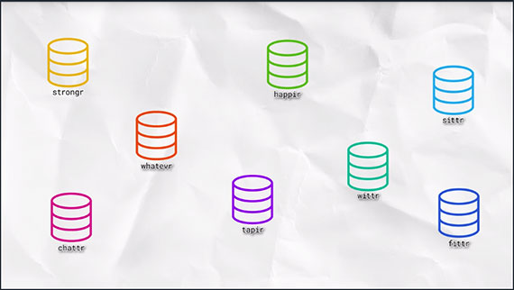
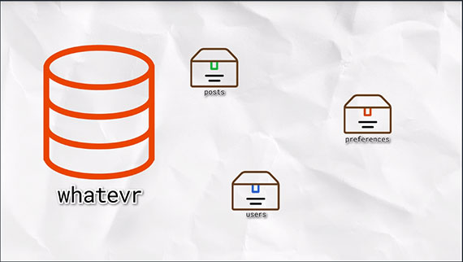
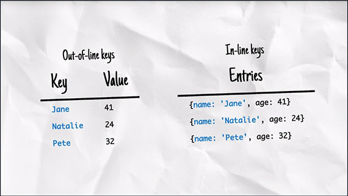
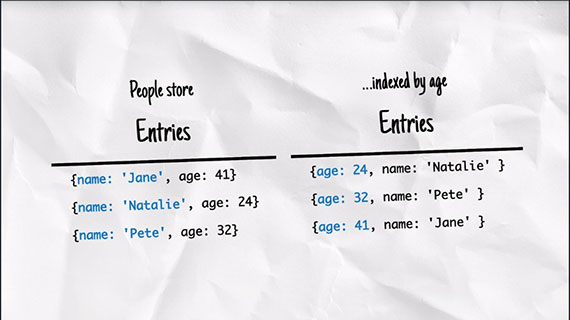
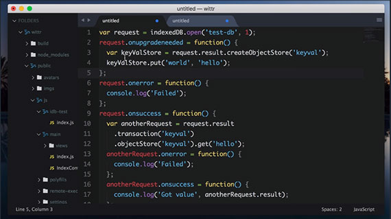

<!-- markdownlint-disable MD022 MD024 MD032 -->
# IndexedDB and Caching
Notes from _IndexedDB and Caching_ by Jake Archibald. This class is part of the Udacity course [Offline Web Applications by Google](https://www.udacity.com/course/offline-web-applications--ud899)

This is an Intermediate skill level course which takes approximately 3 weeks to complete and is offered for **FREE**!

## 1. Introducing the IDB Promised Library
When the user opens Wittr, we want to start by showing the last post the device received - before going to the network. Then, we make the Web Socket connection and start receiving new posts one by one.

When we receive these posts, we want to display them, of course. But also we want to add them to the set of posts we already have stored. We also want to remove entries that are too old to be worth keeping.

A database is the best model for this. It means we can add and remove individual posts as needed, iterate over them, and query the data.

The web platform has a database called `IndexedDB` (IDB). It's fair to say that it has a bit of a bad reputation, but hopefully we can break through that in this chapter.

We aren't going to touch our Service Worker script for a bit, instead we will concentrate on learning IDB's shape and how it ticks. Then, we'll integrate it into a whole offline first experience.

### NoSQL
If you've used NoSQL Databases before, IDB will seem familiar. But if you've only used Relational Databases before, the concepts might seem a little weird. And if you've never used databases before, well, that might even help! As you can come to IDB fresh, without trying to translate it to similar but, ultimately, different things you've encountered.

### IndexedDB Database Shape

With IDB, you can have multiple databases with whatever name you give them. But we're only going to be creating one. Generally, you'll only have one database per application.

That database contains multiple object stores; generally one for each kind of thing you want to store. 

An object store can contain multiple values. These can be JavaScript `objects`, `strings`, `numbers`, `dates`, or `arrays`.

Items in the object's store can have a separate primary key or you can assign a property of the values to be the key. The key must be unique within an object store. It becomes the way you identify a particular object.

Later, you can `get`, `set`, `add`, `remove`, or `iterate` over items in object stores as part of a transaction. **All read or write operations in IndexedDB must be part of a transaction**.

#### Sample Transaction
1. [ ] Add "hello:world" to "keyval" store
1. [ ] Get the first value from the "people" store
1. [ ] Change the person's name to "James"
1. [ ] Write it back to the "peoples" store

This means that if you create a transaction for a series of steps and one of the actions fail, none of them are applied. The state of the database would be as if none of the steps happened.

| Transaction: | If one fails... | All fail! |
| --- | ---|
| [ ] step one | [ ] step one | [x] step one |
| [ ] step two | [x] step two | [x] step two |
| [ ] step three | [ ] step three | [x] step three |
| [ ] step four | [ ] step four | [x] step four |

You can also create indexes within an object store, which provides a different view of the same data ordered by particular properties:

The model here is similar to a lot of databases, which makes a lot of sense. The browser support is good as well, with every major browser supporting it. So, why does IndexedDB have such a bad reputation?

Unfortunately, the API is a little... horrid and often creates spaghetti code. It's all asynchronous, which is fine, but it pre-dates Promises. So it kind of invented its own event-based Promise system which creates really confusing code. 

To avoid this clumsy API, we're going to use a really small library that mirrors the IndexedDB API, but uses Promises rather than events. The library is called IndexedDB Promised. Anything you use in this library, you can apply to using IndexedDB directly.

Take a look at this libraries repository and examples here: [https://github.com/jakearchibald/idb](https://github.com/jakearchibald/idb)

Next, we'll take a look at how you create a real-life database in the browser.