<!-- markdownlint-disable MD022 MD024 MD032 -->
# Introducing the Service Worker
Notes from _Introducing the Service Worker_ by Jake Archibald. This class is part of the Udacity course [Offline Web Applications by Google](https://www.udacity.com/course/offline-web-applications--ud899)

This is an Intermediate skill level course which takes approximately 3 weeks to complete and is offered for **FREE**!

## 1. An Overview of the Service Worker

The **Service Worker** is:
- a JavaScript file that sits between you and network requests.
- a type of **Web Worker** meaning it runs separately from your page
- It's invisible to the user
- It can't access the DOM

But, it does control pages by intercepting requests as the browser makes them.

[](assets/images/full-size/lesson3-service-worker1.png)

You register for a service worker like this (giving the location of you service worker script).

```javascript
navigator.serviceWorker.register('/sw.js');
```

It returns a **Promise** so you get callbacks for success and failure.

```javascript
navigator.serviceWorker.register('/sw.js').then(function(reg) {
  console.log('Yay!');
}).catch(function(err) {
  console.log('Boo!');
});
```

If we provide a scope, the service worker will control a page at that level and deeper.

```javascript
navigator.serviceWorker.register('/sw.js', {
  scope: '/my-app/'
});
/*
/my-app/                yes
/my-app/hello/world/    yes
/                       no
/another-app            no
/my-app                 no (does not have the trailing slash)
*/
```

We can have multiple service workers with multiple scopes which is really handy for things like GitHub pages where multiple projects share the same origin. Scopes let you have a different service worker for each project.
- https://jakearchibald.gitub.io/svgomg/
- https://jakearchibald.gitub.io/trained-to-thrill/
- https://jakearchibald.gitub.io/isserviceworkerready/

Default scope is determined by the location of the service worker script. It's basically the path the script sits in.

| SW URL | Default scope |
| --- | --- |
| /foo/sw.js | /foo/ |
| /foo/bar/sw.js | /foo/bar/ |
| /sw.js | / |

Usually, you don't need to set the scope. Just put the service worker in the right place.

What happens in the service worker? Well, we listen for particular events.

```javascript
self.addEventListener('install', function(event) {
  // ...
});

self.addEventListener('activate', function(event) {
  // ...
});

self.addEventListener('fetch', function(event) {
  // ...
});

```

In order to make sure the browser supports Service Workers just wrap the registration in a simple feature detect.

```javascript
if (navigator.serviceWorker) {
  navigator.serviceWorker.register('/sw.js');
}
```

## 2. Quiz: Scoping Quiz
Given this registration code, which page URLs wll this service worker control?

```javascript
navigator.serviceWorker.register('/sw.js', {scope: '/foo/'});
```

- [ ] /
- [ ] /sw.js
- [ ] /foo
- [ ] /foo.html
- [x] /foo/
- [x] /foo/bar/index.html
- [x] /foo/bar

## 3. Adding a Service Worker To the Project
As mentioned before, the service worker receives events.

Let's add a `fetch` listener for one of these.
sw.js

```javascript
self.addEventListener( 'fetch', function(event) {
  console.log(event.request);
});
```

This code inspects the request.

Specifically it uses the [FetchEvent](https://developer.mozilla.org/en-US/docs/Web/API/FetchEvent)'s [request](https://developer.mozilla.org/en-US/docs/Web/API/FetchEvent/request) property to return a [Request](https://developer.mozilla.org/en-US/docs/Web/API/Request) object which represents the request the browser intends to make.

When the user navigates to a page within your service worker's scope, the service worker controls it. The network request for its html goes to the service worker and triggers a fetch event.

[](assets/images/full-size/lesson2-service-worker.png)

But not only that, you also get a `fetch` event for every request triggered by that page - css, javascript, images.  You get a _fetch_ request for each - **even if there are requests to another origin**.

[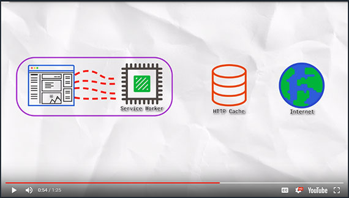](assets/images/full-size/lesson3-service-worker2.png)

## 4. Quiz: Registering a Service Worker

```javascript
IndexController.prototype._registerServiceWorker = function() {
  if ( !navigator.serviceWorker ) return;

  navigator.serviceWorker.register( '/sw.js' ).then( function() {
    console.log( 'Registration worked!' );
  }).catch( function() {
    console.log( 'Registration failed!' );
  });
};
```

## 5. The Service Worker Lifecycle
We have already experienced an oddity of the Service Worker lifecycle. When we first created the Service Worker, it took two page refreshes to see the result. In addition, when we changed the Service Worker the browser didn't seem to pick up that change. The lifecycle of the Service Worker is one of the most complex parts; once you get this bit the rest is easy!

### The Lifecycle
Just to recap, we had a window with the Wittr app open already, then we added new code to register a Service Worker, then we hit refresh in the browser.

[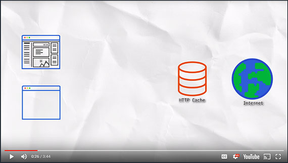](assets/images/full-size/lesson3-service-worker3.png)

Hitting refresh the first time spawned a new window client. Then the request went off to the network. We received a response back, and the old window client went away. It might not seem like there's an overlap between the old page and the new page when you hit refresh, but there is! For example, if the response came back indicating that the browser should save the resource to disk via a download dialogue then the old window would've stayed around. But in this case, the response was a page so we got rid of the old one.

[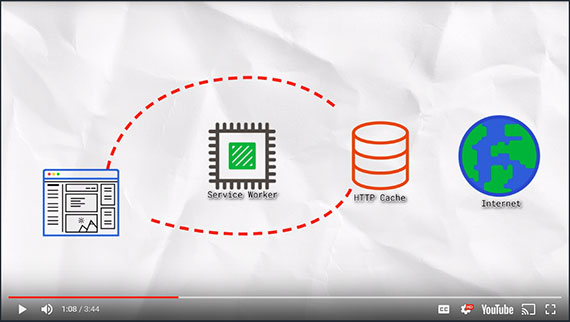](assets/images/full-size/lesson3-service-worker4.png)

From our page, requests went out for our CSS, images, but also our javascript which registered the Service Worker. **We didn't see requests log from this page, because the Service Worker only takes control of pages when they're loaded;** and this page was loaded before the Service Worker existed.That means, **any additional requests this page makes will bypass the Service Worker**.

[](assets/images/full-size/lesson3-service-worker5.png)
But then we refreshed the page once more, creating a new window client. And because our Service Worker was up and running, it took control of the page. Therefore, the request went to the Service Worker, as did all of the sub-resources.

So that explains why it took two refreshes to see logged requests, but if you make a change to the Service Worker and refresh the page nothing happens. How can we get the updated Service Worker recognized when the page is reloaded?

[](assets/images/full-size/lesson3-service-worker6.png)

If a page loads via a Service Worker, it will check for an update to the Service Worker in the background. If it finds it has changed, the changed Service Worker becomes the next version. **But the next version doesn't take control yet, it waits. It won't take over until all pages using the current version are gone.** This ensures there is only one version of your site running at a given time.

[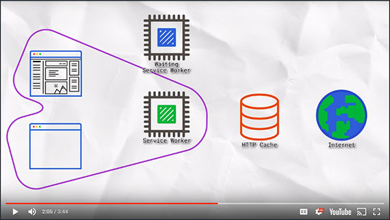](assets/images/full-size/lesson3-service-worker7.png)

Unfortunately, a refresh doesn't let the new version of the Service Worker take over. This is due to the overlap between window clients, which means there isn't actually a moment when the current active Service Worker is not in use. **For that to happen, the page needs to close or navigate to a page that isn't controlled by the Service Worker. When it does that, the new Service Worker takes over and future page loads will go to the new one.**

[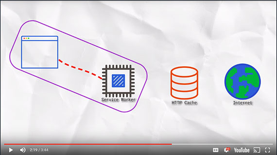](assets/images/full-size/lesson3-service-worker8.png)

The update process for Service Workers may sound complicated, but if you think about it this is actually the same process that normal software uses. Take Chrome for example: When there is an update to the browser, it will be downloaded in the background, but will not take affect until the browser is closed and reopened again.

### Cache Time
When the browser re-fetches the Service Worker, looking for updates, it will go through the browser cache - as pretty much all requests do. Because of this, it is recommended keeping the cache time on your Service Worker short. In fact, a cache time of 0 is recommended.

As a safety precaution, if you set the Service Worker script to cache for more than one day the browser will ignore that and set the cache to 24 hours.

That doesn't mean your Service Worker will stop working after 24 hours, it just means that update checks will bypass the browser cache if the Service Worker it has is over a day old.

## 6. Quiz: Enable Service Worker Dev Tools
Do this by  downloading and running [Chrome Canary](https://www.google.com/chrome/browser/canary.html).

Chrome Canary is the most current nightly build of Chrome with the newest features available. It is designed for developers and early adopters and can be run side-by-side with **Chrome Stable**.

The current version of Chrome Stable already has the necessary Dev Tools if you don't want to download Canary.

## 7. Quiz: Service Worker Dev Tools
Verify new Service Worker installs and goes into a "waiting  to active" state.

[](assets/images/full-size/chrome-dev-tools1.png)

1. Navigate to Application tab in DevTools.
1. Make a change to sw.js.
1. Verify that the new Service Worker has installed and is "waiting to activate".

## 8. Quiz: Service Worker Dev Tools 2
Activate the new Service Worker.

1. Navigate to a new website.
1. Navigate back.
1. Ensure the new Service Worker is active and that there is no Service Worker "waiting to activate".

## 9. Service Worker DevTools Continued
Reloading the page while holding `SHIFT` reloads the page but bypasses the Service Worker. This is part of the Service Worker spec, so it should work in any browser that implements the spec. This is handy for two reasons:

1. It's a quick way to test changes that are unrelated to the Service Worker, such as minor CSS changes.
1. Because the tab is no longer controlled by the Service Worker, it lets the waiting Service Worker take over.

If you refresh normally now, the request will go through the new Service Worker.

This way of bypassing the Service Worker and then refreshing is easier than navigating away from the origin or closing the tab, but Chrome's developer tools offer an even easier way:

In the Application tab of Chrome developer tools, there is an option called **Update on reload**. This changes the Service Worker lifecycle to be developer friendly. In this mode, when you hit refresh, rather than refreshing the page it fetches a Service Worker and treats it as a new version whether it has changed or not and lets it become active immediately. With this option active, you do not have to hold SHIFT and refresh or navigate away from the page.

## 10. Hijacking Requests
So far, we have:

- [X] Setup the Service Worker
- [X] Learned the Service Worker lifecycle
- [X] Explored Chrome Developer Tools

But we haven't really used the Service Worker to do anything useful yet. We have seen requests go from the page, through the Service Worker fetch event, and onto the network through the HTTP Cache.

[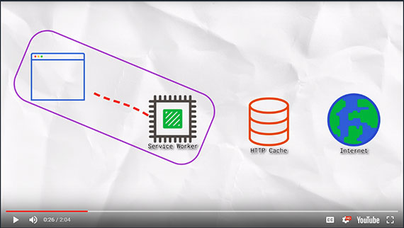](assets/images/full-size/lesson3-service-worker9.png)

Now, we're going to catch the request as it hits the Service Worker and respond ourselves so nothing goes to the network. **This is an important step in going offline first**.

```javascript
self.addEventListener('fetch', function(event) {
  event.respondWith(..);
});
```

The [respondWith()](https://developer.mozilla.org/en-US/docs/Web/API/FetchEvent/respondWith) method takes a [Response](https://developer.mozilla.org/en-US/docs/Web/API/Response) object or a [Promise](https://developer.mozilla.org/en-US/docs/Web/JavaScript/Reference/Global_Objects/Promise) that resolves with a [Response](https://developer.mozilla.org/en-US/docs/Web/API/Response). One way to create a Response is to create a new [Response()](https://developer.mozilla.org/en-US/docs/Web/API/Response/Response) instance:

```javascript
self.addEventListener('fetch', function(event) {
  event.respondWith(
    new Response('Hello <b>World</b>!')
  )
});
```

No matter what URL is entered into the URL bar, I get the same response because I'm intercepting **ALL** fetches.

[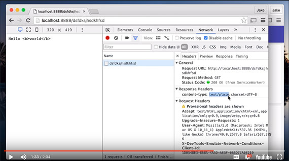](assets/images/full-size/lesson3-service-worker10.png)

Looks the html is being output ast text. That's because the default content-type is `text/plain`. Fortunately, we can set headers as part of the [Response](https://developer.mozilla.org/en-US/docs/Web/API/Response/Response).

```javascript
self.addEventListener('fetch', function(event) {
  event.respondWith(
    new Response('Hello <b>World</b>!', {
      headers: { 'foo': 'bar', 'Content-Type': 'text/html' }
    })
  )
});
```

Refresh the page and look at the **Network** tab in Chrome developer tools, take a look at the **Response Headers** section and you will see that `foo: bar` and `Content-Type: text/html` was returned as part of the [Response](https://developer.mozilla.org/en-US/docs/Web/API/Response/Response) headers.

[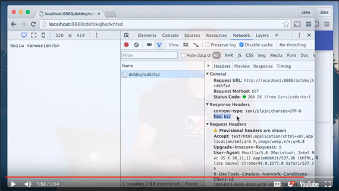](assets/images/full-size/lesson3-service-worker11.png)

## 11. Quiz: HijackingRequests 1 Quiz
In the Service Worker script file ('public/js/sw/index.js'), alter the Service Worker so it responds with some HTML. It can be whatever HTML you want as long as it includes the class name, 'a-winner-is-me'.

Make sure the _Update on reload_ option is selected in the Chrome developer tools on the _Application_ tab so you can see your changes to the Service Worker upon page refresh.

Set `'Content-Type': 'text/html'` in the headers object.

```javascript
self.addEventListener('fetch', function(event) {
  event.respondWith(
    new Response('Hello <b class="a-winner-is-me">Winner!</b>', {
      headers: {
        'Content-Type': 'text/html'
      }
    })
  );
});
```

## 12. Hijacking Requests 2
Now that we know how to hijack a request and respond with basic HTML, let's do something cooler...

Let's go to the network for the [Response](https://developer.mozilla.org/en-US/docs/Web/API/Response), but not for the thing that was requested. There is an API to achieve this: [Fetch API](https://developer.mozilla.org/en-US/docs/Web/API/Fetch_API).

You might be thinking: "Isn't this what XMLHttpRequest is for?" No, just... no! Much of the XHR API is 15 years old! Even from the outset, it wasn't particularly well thought out.

As an example, here's the code to fetch some JSON from the URL /foo:

```javascript
// Nope. This is Waaaay old school!
var client = new XMLHttpRequest();

client.addEventListener('load', function() {
  console.log(client.response);
});

client.addEventListener('error', function() {
  console.log('It failed');
});

client.responseType = 'json';
client.open('GET', '/foo');
client.send();
```

Everything just feels like it is in the wrong order. The URL is at the bottom, you have to open before you send for some reason, it makes you declare how the response is read before you make the request, and it doesn't support lower-level things like streams. But worst of all the event system gets you into 'callback hell.'

Here's the fetch code for the same operation:

```javascript
// Yup.
fetch('/foo').then(function(response) {
  return response.json();
}).then(function(data) {
  console.log(data);
}).catch(function() {
  console.log('It failed');
});
```

[fetch()](https://developer.mozilla.org/en-US/docs/Web/API/WindowOrWorkerGlobalScope/fetch) returns a [Promise](https://developer.mozilla.org/en-US/docs/Web/JavaScript/Reference/Global_Objects/Promise) that resolves to the [Response](https://developer.mozilla.org/en-US/docs/Web/API/Response). Then we can read the [Response](https://developer.mozilla.org/en-US/docs/Web/API/Response) as JSON, and then do something with the results. We can catch errors from either the [FetchEvent.request](https://developer.mozilla.org/en-US/docs/Web/API/FetchEvent/request), or reading the [Response](https://developer.mozilla.org/en-US/docs/Web/API/Response). DONE!

As it turns out, back in our Service Worker, `event.respondWith()` takes either a [Response](https://developer.mozilla.org/en-US/docs/Web/API/Response) or a [Promise](https://developer.mozilla.org/en-US/docs/Web/JavaScript/Reference/Global_Objects/Promise) that resolves to a [Response](https://developer.mozilla.org/en-US/docs/Web/API/Response). Since [fetch()](https://developer.mozilla.org/en-US/docs/Web/API/WindowOrWorkerGlobalScope/fetch) returns a [Promise](https://developer.mozilla.org/en-US/docs/Web/JavaScript/Reference/Global_Objects/Promise) that resolves to a [Response](https://developer.mozilla.org/en-US/docs/Web/API/Response), they compose together really well.

Let's respond with a [fetch()](https://developer.mozilla.org/en-US/docs/Web/API/WindowOrWorkerGlobalScope/fetch) for a .gif file:

```javascript
self.addEventListener('fetch', function(event) {
  event.respondWith(
    fetch('/imgs/dr-evil.gif')
  )
});
```

We've just served up different content using the network!

The [Fetch API](https://developer.mozilla.org/en-US/docs/Web/API/Fetch_API) performs a normal browser fetch, so the results may come from the cache. That is a benefit in this case as we want the .gif to cache as usual.

## 13. Quiz: Hijacking Requests 2 Quiz
Take a look at the code below. As you can see, your task is to only respond with a .gif if the request URL ends with .jpg. How you determine that is up to you, but remember that event.request gives you information about the request.

```javascript
self.addEventListener('fetch', function(event) {
  // TODO: only respond to requests with a url ending in ".jpg"
  
});
```

### Solution

```javascript
self.addEventListener('fetch', function(event) {
  // TODO: only respond to requests with a url ending in ".jpg"
  if ( event.request.url.endsWith( '.jpg' ) ) {
    event.respondWith(
      fetch( '/imgs/dr-evil.gif' )
    );
  }
});
```

We've already seen `event.request`. But what other properties does it have? One way to find out is to go to Google and search for MDN request.

MDN is a great place for documentation and in there there's a result about the [Fetch API](https://developer.mozilla.org/en-US/docs/Web/API/Fetch_API). In there it tells me about the [Request](https://developer.mozilla.org/en-US/docs/Web/API/Request) Fetch Interface and that contains `request.url` which is the URL of the request.

Alternatively, I could have added a `console.log()` and logged out event.request, as we were before, and then refresh the page. But because the console is cleared when the page navigates, we're losing the log for the page request. If I click 'preserve the log' in Dev Tools and refresh again, there it is. And inside the request object there are loads of details in there,one of which is the URL, and it's a string.

So with this knowledge back in the code I can use an if statement. So `respondWith()` is only called if the URL ends with .jpg. `endsWith()` is a relatively new string method, but it's really useful. Since service worker is only run in modern browsers, we can make use of some of the more modern JavaScript features. Back in the browser with force update enabled, I hit refresh and the page loads as normal, but all the images have been intercepted. So now we're handling requests dynamically depending on URL.

## 14. Hijacking Request 3
We've started handling requests dynamically depending on the URL, but there's a lot more we can do here. In the real world, we need to be a bit more dynamic than this.

The page can send a request, which we intercept and then send to the network. But rather than just sending a `Response` back, we can look at it and then do something else. For example, let's respond with a network `fetch()` for the request just as the browser would do. The fetch method will take a full request object as well as a URL. `fetch()` returns a `Promise`; with Promises you can attach a `.then` callback to get the results if the operation was successful. Whatever we return in this callback becomes the eventual value for the `Promise`.

```js
self.addEventListener('fetch', function(event) {
  event.respondWith(
    fetch( event.request ).then( function( response ) {
      if ( response.status === 404 ) {
        return new Response( 'Whoops, not found' );
      }
      return response;
    }).catch( function( error ) {
      return new Response( 'Uh oh, that totally failed:', error );
    })
  );
});
```

So we can look at the `Response` ourselves and if the `response.status` is 404 (not found) then we can respond with our own message. Otherwise, we return the Response we received.

`.catch` is similar to `.then`, but `.then` is for success and `.catch` is for failure. `fetch` will fail if can't make a connection to the server at all, which includes offline. When that happens, we can respond with our own message.

Now if we go to a page that doesn't exist we get the custom message for 404 errors. And if you take the server down and go offline, you get a custom message for that too!

We can create complex rules for requests, trying to get responses from multiple sources and reacting to the results. You can do this on a request by request basis using JavaScript. You can even go to the network and if that fails, get something else from the network.

## 15 Quiz: Hijacking Requests 3 Quiz

What if you wanted to serve a gif instead of a message for a 404?

```js
self.addEventListener('fetch', function(event) {
  event.respondWith(
    fetch(event.request).then(function(response) {
      if (response.status === 404) {
        // TODO: instead, respond with the gif at
        // /imgs/dr-evil.gif
        // using a network request
        return new Response("Whoops, not found");
      }
      return response;
    }).catch(function() {
      return new Response("Uh oh, that totally failed!");
    })
  );
});
```

### Solution
Over in the code, now if you return a promise within a promise, it passes the eventual value to the outer promise. So, rather than return a response I'm going to return a fetch for the gif's URL and that's it.

```js
self.addEventListener('fetch', function(event) {
  event.respondWith(
    fetch(event.request).then(function(response) {
      if (response.status === 404) {
        // TODO: respond with /imgs/dr-evil.gif using a network request
        return fetch( '/imgs/dr-evil.gif' );
      }
      return response;
    }).catch(function() {
      return new Response("Uh oh, that totally failed!");
    })
  );
});
```

## 16. Caching and Serving Assets
So far we've seen how to hijack requests and respond to them differently. We've even created responses ourselves, meaning we can respond without using the network at all. However, if we want to be able to load Wittr without using the network, we need somewhere to store the HTML, CSS, JavaScript, images, web fonts, etc. Thankfully, there is such a place: the `Cache API`.

### caches.open(cacheName) [on MDN](https://developer.mozilla.org/en-US/docs/Web/API/CacheStorage/open)
The `Cache API` gives us the `caches` object on the global. If you want to create or open a cache, you call the `caches.open()` method with the name of the cache.

```js
caches.open('my-stuff').then(function(cache) {
  //...
});
```

This returns a `Promise` for a cache of that name. If you haven't opened a cache with that name before, it creates the cache with that name and returns it.

A cache box can contain request/response pairs from any secure origin. It can be used to store fonts, scripts, images, and anything else really from both our own origin as well as elsewhere on the web.

[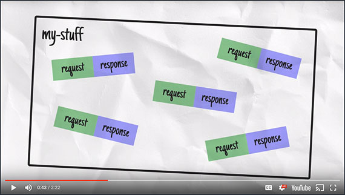](assets/images/full-size/lesson3-caches-box.png)

### cache.put(request, response) [on MDN](https://developer.mozilla.org/en-US/docs/Web/API/Cache/put)
To add cache items, you can use the `cache.put()` method and pass a request, or a URL, and a `Response`. For example:

```js
cache.put(request, response);
```

### cache.addAll(requests[]) [on MDN](https://developer.mozilla.org/en-US/docs/Web/API/Cache/addAll)
Alternatively, you can use `cache.addAll()` which takes an array of requests, or URLs, fetches them and puts the `Response` pairs into the cache. **However, if any of the items in the array fail to cache then none of them are added.**

```js
cache.addAll([
  '/foo',
  '/bar'
])
```

`cache.addAll()` uses `fetch` under the hood, so bare in mind that requests will go via the browser cache.

### cache.match(request, {options}) [on MDN](https://developer.mozilla.org/en-US/docs/Web/API/Cache/match)
Later, when you want to get something out of the cache you can call `cache.match()` and pass in a request, or URL. This will return a `Promise` for a matching `Response` if one is found, or `undefined` otherwise.

```js
cache.match(request);
```

### caches.match(request, {options}) [on MDN](https://developer.mozilla.org/en-US/docs/Web/API/CacheStorage/match) 
`caches.match()` does the same as `cache match()` except that it tries to find a match in any cache starting with the oldest.

```js
caches.match(request);
```

So we have a way to store items in the cache, but the question is - when should we store it? Thankfully, there is another [Service Worker](https://developer.mozilla.org/en-US/docs/Web/API/Service_Worker_API) event that helps here.

[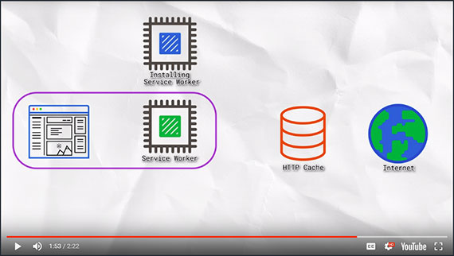](assets/images/full-size/lesson3-service-worker12.png)

When a browser runs a Service Worker for the first time, the [InstallEvent](https://developer.mozilla.org/en-US/docs/Web/API/InstallEvent) is fired. The browser will not allow the Service Worker to take control of the pages until its install phase has completed and we are in control of what that involves.

[](assets/images/full-size/lesson3-service-worker13.png)

We use the [InstallEvent](https://developer.mozilla.org/en-US/docs/Web/API/InstallEvent) as an opportunity to get everything we need from the network and create a cache for those resources.

```js
self.addEventListener('install', function(event){
  event.waitUntil(
    // ..
  );
});
```

[event.waitUntil()](https://developer.mozilla.org/en-US/docs/Web/API/ExtendableEvent/waitUntil) lets us signal the progress of the install. We pass it a [Promise](https://developer.mozilla.org/en-US/docs/Web/JavaScript/Reference/Global_Objects/Promise) and then if or when the Promise resolves the browser knows the install in complete. If the Promise rejects, it knows the install failed and this Service Worker should be discarded.

## 17. Quiz: Install and Cache Quiz
Take a look at the code located in public/js/sw/index.js. There is an array of URLs to cache there. Your task is to cache those URLs in a cache named `wittr-static-v1`.

```js
self.addEventListener('install', function(event) {
  var urlsToCache = [
    '/',
    'js/main.js',
    'css/main.css',
    'imgs/icon.png',
    'https://fonts.gstatic.com/s/roboto/v15/2UX7WLTfW3W8TclTUvlFyQ.woff'
  ];

  event.waitUntil(
    // TODO: open a cache named 'wittr-static-v1'
    // Add cache the urls from urlsToCache
  );
});
```

Remember to have the Chrome developer tools open and use the 'Update on reload' option so you only need to refresh once to see changes.

To verify the state of the cache in the Chrome developer tools, click on the **Application** tab and then **Cache Storage**. Hopefully, you will see your cache in there.

### Solution
I could have just referenced the array, but I moved it instead.

[event.waitUntil()](https://developer.mozilla.org/en-US/docs/Web/API/ExtendableEvent/waitUntil) takes a [Promise](https://developer.mozilla.org/en-US/docs/Web/JavaScript/Reference/Global_Objects/Promise) and [caches.open()](https://developer.mozilla.org/en-US/docs/Web/API/CacheStorage/open) returns one.


[Cache.AddAll()](https://developer.mozilla.org/en-US/docs/Web/API/Cache/addAll) also returns a [Promise](https://developer.mozilla.org/en-US/docs/Web/JavaScript/Reference/Global_Objects/Promise), so I return it. 

So [event.waitUntil()](https://developer.mozilla.org/en-US/docs/Web/API/ExtendableEvent/waitUntil) receives a [Promise](https://developer.mozilla.org/en-US/docs/Web/JavaScript/Reference/Global_Objects/Promise) for both actions combined.

```js
self.addEventListener('install', function(event) {
  event.waitUntil(
    // TODO: open a cache named 'wittr-static-v1'
    // Add cache the urls from urlsToCache
    caches.open( 'wittr-static-v1' ).then( function( cache ) {
      return cache.addAll([
        '/',
        'js/main.js',
        'css/main.css',
        'imgs/icon.png',
        'https://fonts.gstatic.com/s/roboto/v15/2UX7WLTfW3W8TclTUvlFyQ.woff'
      ]);
    })
  );
});
```

Now if I refresh the page, that new service worker will run andI can go to the resources panel in DevTools and there in cache storage,is the new cache recreated and the resources we added to it.

Success, but it's no good having cached items if we're not going to use them. So let's use them in responses.

## 18. Quiz: Cache Response Quiz
We haven't shown you code for responding with a cache entry, but you've seen [caches.match()](https://developer.mozilla.org/en-US/docs/Web/API/CacheStorage/match) for getting things out of the cache, and you've seen [event.respondWith()](https://developer.mozilla.org/en-US/docs/Web/API/FetchEvent/respondWith) for providing a response (more specifically a promise for a [Response](https://developer.mozilla.org/en-US/docs/Web/API/Response)). Time to put them together.

Your task is to respond to the request with an entry from the cache if there is one. Otherwise, fetch it from the network, here's a hint: **You need to call [event.respondWith()](https://developer.mozilla.org/en-US/docs/Web/API/FetchEvent/respondWith), synchronously. You can't call it within a promise handler, that's too late.**

Once you've coded it up, reload the page. Remember to have DevTools open and use 'Update on reload', so you only need to refresh once to see changes. You'll know it's working because you'll be able to put the site into Offline mode and still get a response.

### Solution
To begin, I'm going to [respondWith()](https://developer.mozilla.org/en-US/docs/Web/API/FetchEvent/respondWith) a match in the cache for this request.

I can just pass [event.request](https://developer.mozilla.org/en-US/docs/Web/API/FetchEvent/request) straight into [caches.match()](https://developer.mozilla.org/en-US/docs/Web/API/CacheStorage/match).

```js
self.addEventListener('fetch', function(event) {
  event.respondWith(
    caches.match( event.request ).then( function( response ) {
      return response || fetch(event.request);
    }).catch( function( error ) {
      console.log( error, 'no cache entry for:', event.request.url );
    })
  );
});
```

Of course there may not be a match in the cache for this particular request. In that case the promise will resolve with `undefined`.

So if the request is truthy, meaning I got a match in the cache I'll return it. Otherwise, I'll return a [fetch()](https://developer.mozilla.org/en-US/docs/Web/API/WindowOrWorkerGlobalScope/fetch) to the network for the original request. This is made cleaner by simply coding it as returning response or fetch().

We also throw in a .catch block in case we don't have the resource in cache and the network is unavailable.

[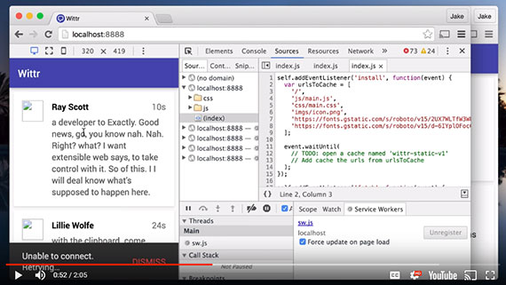](assets/images/full-size/lesson3-service-worker14.png)

With 'Update on reload' enabled I can refresh the page. And while it doesn't really look like much has changed if we go offline and refresh, we get a whole lot of content still. We shouldn't underestimate what we've done here, it's pretty huge.

Here's what we've achieved.

- Things haven't really changed on a perfect connection but perfect doesn't exist.
- On a slow connection, we're getting stuff on screen a whole lot faster.
- On Lie-Fi, we're delivering stuff rather than a blank screen which is great.
- And offline gets content, rather than a complete failure.

There are things we need to fix though. The photos and avatar aren't working offline, but also if we disable 'Update on reload' and go online, we can see new posts. But if we now go offline and refresh the new posts go away. We're not updating the posts in the cache. This is because we cached the HTML once and install time. So we're stuck with that set of messages in the cache.

Here's a to do list that gets us from where we are now to full offline first success. We need to:

- [ ] **Provide unobtrusive app updates**
- [ ] **Get the user onto the latest version as quickly as possible**.
- [ ] **Continually update the cache of posts**
- [ ] **Cache the photos**.
- [ ] **Cache the avatars**.

The rest of the course is about doing this. Starting with unobtrusive app updates.

## 19. Updating the Static Cache
It's time to disable 'Update on reload'. Now that this is done, the service worker lifecycle is back to normal, which is how real users will experience it.

[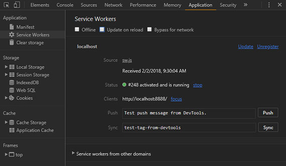](assets/images/full-size/chrome-dev-tools2.png)

'Update on reload' is great during development. Say we wanted to change the theme of the app. If I change the primary color to red then go back to the browser with 'Update on reload' enabled and then refresh - boom!, red toolbar!

**This is because 'Update on reload' reloads the service worker from the network on every refresh and causes it to install even if the service worker hasn't changed.**

Let's say I change the whole theme by uncommenting a new set of style variables. This should make the theme green except this time I disable 'Update on reload' and refresh the page. In this case the page remains red.

No matter how many times I refresh, still red. If I **Shift+refresh** and bypass the service worker, I see the changes, but normal refreshing gets me nowhere, because our cache still contains the old CSS. 

**This is because our cached CSS is updated as part of the `install` step. But that isn't happening because there's no new service worker to install.**

[](assets/images/full-size/chrome-dev-tools2.png)

We can see from Dev Tools there's no new service worker waiting. With 'Update on reload' disabled, the browser checks for an update to the service worker once per page load which happens on `install`. But we didn't change the service worker. We only changed the CSS, so there's nothing new to install.

We need to actually work with the service worker to get it to pick up changes. Since we change code all the time we need users to get those changes as soon as possible with minimum disruption.

Here's how we work with the service worker lifecycle.

1. To get the CSS to update, we need to make a change to the service worker.
1. The browser will then treat this updated worker as a new version.
1. Because it's new, it'll get its own `install` event where it'll fetch the JavaScript, HTML, and our updated CSS. It'll put these in a new cache.
1. This won't be done automatically, we have to manually change the name of our cache to make this happen.

[](assets/images/full-size/lesson3-service-worker15.png)

Also, we create a new cache because we don't want to disrupt the cache that's already being used by the old service worker and the pages it controls. Once the old service worker is released and we're ready to take over, we delete the old cache so the next page load gets resources from the new cache, meaning it gets the latest CSS.

[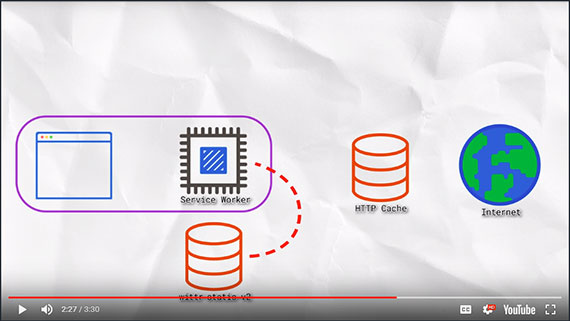](assets/images/full-size/lesson3-service-worker16.png)

We've already covered most of the parts needed to make this happen. We know that a change to the service worker will cause it to spin up a new instance and that change can simply be renaming the cache from v1 to v2. The bit we haven't covered is how to get rid of that old cache.

The first piece of the puzzle is the `activate` event. We've already seen the `install` event which fires when the browser sets up a new service worker for the first time, whereas the `activate` event fires when the service worker becomes active, when it's ready to control pages and the previous service worker is gone. This makes it the perfect time to get rid of old caches.

```js
self.addEventListener('activate', function(event) {
  // ...
});
```

Like the install event, you can use `event.waitUntil()` to signal the length of the process. While you're activating, the browser will queue other service worker events such as fetch. So by the time your service worker receives its first fetch, you know you have the caches how you want them. You can delete caches using `caches.delete()`, passing in the name of the cache. 

```js
caches.delete(cacheName);
```

You can also get the names of all your caches using `caches.keys()`.

```js
caches.keys();
```

Both of these methods return promises.

## 20. Quiz: Update Your CSS Quiz
This time, make sure the `Update on reload` option is disabled in Chrome developer tools.

Your task is to change the CSS theme of the site. Then, in the Service Worker, update the cache name and use the `activate` event to remove the old cache. Once you've done that, reload the page to see it working.

In the **Application** tab of Dev Tools you should see a Service Worker in the `waiting to activate` state.

## 21. Quiz: Update Your CSS 2
Now you're ready to activate the new Service Worker. As we saw earlier, the Service Worker won't activate until pages using the current version go away.

Either close this tab, navigate it to a page out of the Service Workers scope, or hold SHIFT and reload the page.

Once you've done this, when you navigate back to the Wittr application it should be showing the new theme.

### Solution for Quiz 20 & 21
There a few different ways to complete this one. The easy way and the scalable way.

#### Easy Way
```js
self.addEventListener('install', function(event) {
  event.waitUntil(
    caches.open('wittr-static-v2').then(function(cache) {
      return cache.addAll([
        '/',
        'js/main.js',
        'css/main.css',
        'imgs/icon.png',
        'https://fonts.gstatic.com/s/roboto/v15/2UX7WLTfW3W8TclTUvlFyQ.woff'
      ]);
    })
  );
});

self.addEventListener('activate', function(event) {
  event.waitUntil(
    caches.delete('wittr-static-v1')
  );
});
```

The easy way is to first make a change to the CSS theme. Then bump up the version number of the static cache in the Service Worker to 'wittr-static-v2'. The next step is to use the `activate` event to remove the old 'wittr-static-v1' cache.

[](assets/images/full-size/chrome-dev-tools1.png)

Now we refresh the page and we can see in Dev Tools the new version was installed and 'waiting to active'. If we look at Cache Storage in Dev Tools we can see v1 and v2. If we navigate away and back, or click skipWaiting link in Dev Tools the new Service Worker activates and the CSS theme changes.

#### Scalable Way
But what about when we get to version twenty? We can't just remove version 19 in the `activate` event because the user might be updating from an older version, maybe 18, maybe 17. Calling delete on every old cache name is going to be a bit messy and that code's only going to get bigger over time. Instead, we maintain a safe list of cache names we want to keep and remove the others.

To do that we store the name of the static cache in a `staticCacheName` variable. Then in the `activate` event, we get all of the cache names that exist using `caches.keys()`. We then `filter`that list of cache names and are only interested in the cache name begins with 'wittr-' but isn't the name of the static cache.

That gives us a list of wittr caches that we don't need anymore so, we `map` those to promises returned by `caches.delete()`. Then we wrap all of that in `promise.all()`. So we wait on the completion of all of those promises.

Checking the cache starts that with `wittr-` means we don't delete caches from other apps that might be running on the same origin, for example some other static v1.

It isn't really necessary here as we only have one service worker on the origin but on sites like GitHub pages you might have many service workers sharing the same origin.

When updating the cache remember that the requests are going via the standard browser cache. So if one of these resources had a cache time of say a year, the update would just be fetched from the HTTP cache. So you wouldn't get any changes you made. In the development server, all the resources are set to have a cache age of zero meaning they don't cache.

[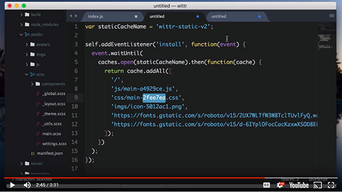](assets/images/full-size/lesson3-service-worker17.png)

In production, I strongly recommend having versioning as part of your resource names (shown above) where the version number is generated from the content of the file. Then you can give these resources a cache time of a year or more. So if you update your CSS, a build script could automatically update your service worker, changing the URL to this the CSS.

Your cache version number could also be generated based on the things it caches. Versioning resources like this and giving them a long cache time isn't advice specific to service workers, it's just general good caching practice. You can work around not to call caching with service worker. You pack pretty much anything. But things are so much easier if you work along side good caching. For example, in this model if I update my CSS the CSS URL changes, therefore cache name changes. Now when the browser fetches all these, it can get everything but the CSS from the browser cache because they haven't changed. The only thing that special from the network is the new CSS.

```js
var staticCacheName = 'wittr-static-v2';

self.addEventListener('install', function(event) {
  event.waitUntil(
    caches.open(staticCacheName).then(function(cache) {
      return cache.addAll([
        '/',
        'js/main.js',
        'css/main.css',
        'imgs/icon.png',
        'https://fonts.gstatic.com/s/roboto/v15/2UX7WLTfW3W8TclTUvlFyQ.woff'
      ]);
    })
  );
});

self.addEventListener('activate', function(event) {
  event.waitUntil(
    caches.keys().then(function(cacheNames) {
      return Promise.all(
        cacheNames.filter(function(cacheName) {
          return cachName.startsWith('witter-') && cacheName !== staticCacheName;
        }).map(function(cacheName) {
          return caches.delete(cacheName);
        })
      );
    })
  );
})
```

First we get all the keys of any existing caches using `caches.keys()`. This returns a Promise with that resolves to an Array of cache names. We return `Promise.all()` which takes an Array of Promises and waits for all of those Promises to resolve.

We then `filter` the Array of cache names; remember, we only care about caches that start with 'wittr-' and do not equal the `staticCacheName` (the name of our current cache).

Finally, we `map` over the filtered Array and delete each of those caches with `caches.delete()`.

So now we have a safe way to update our static assets. Next we'll look at making sure the user gets these updates quickly and painlessly.
 
## 22. Adding UX to the Update Process
We can now say we've successfully delivered unobtrusive updates. But as we saw in the previous chapter, the changes would be in the **waiting** worker.

- [x] Unobtrusive App Updates
- [ ] Get the user onto the latest version asap
- [ ] Continually update cache of posts
- [ ] Cache photos
- [ ] Cache avatars

Ideally, we want the user to be on the latest version as soon as possible. We want them to get the latest features, designs, and of course bug fixes. But as we saw when a new worker is discovered, it waits until all pages using the current version go away, before it can take over. And, that could be a long time. Let's do something better.

[](assets/images/full-size/lesson3-service-worker18.png)

Our goal here is to tell the user once an update has been found, and give them a button to ignore it or refresh the page to get the new version. But how can we achieve this? Well, first off, let's cover the update notification. Thankfully there are APIs that give us insight into the Service Worker lifecycle.

### Nuts & Bolts
When you register for a Service Worker it returns a Promise. That Promise fulfills with a [ServiceWorkerRegistration](https://developer.mozilla.org/en-US/docs/Web/API/ServiceWorkerRegistration) object. This object has properties and methods relating to the Service Worker registration.

```js
navigator.serviceWorker.register('/sw.js').then(function(reg) {
  // reg.method();
  // reg.property;
});
```

We get methods to do things like `unregister` the Service Worker or programmatically trigger an `update`. We also get these three properties:

- `installing`
- `waiting`
- `active`

These will point to a Service Worker object or be `null`. They give you an insight into the Service Worker lifecycle.

```js
navigator.serviceWorker.register('/sw.js').then(function(reg) {
  // reg.unregister();
  // reg.update();
  // reg.installing;
  // reg.waiting;
  // reg.active;
});
```

They also map directly to the Dev Tools view we've been working with so far. Dev Tools view is actually just looking at these registration objects.

For example, if there's a Service Worker instance in `.installing`, it tells us there's an update on its way- although it might be thrown away if the install fails.

If there's a Service Worker in `.waiting`, we know an updated Service Worker is _ready and waiting_ to take over.

The registration object will emit an event when a new update is found called `updatefound`. When this fires, `.installing` has become a new worker.

```js
navigator.serviceWorker.register('/sw.js').then(function(reg) {
  reg.addEventListener('updatefound', function() {
    // reg.installing is a new service worker that has changes
  });
});
```

On the Service Worker objects themselves, you can look at their state.

```js
var sw = reg.installing;
console.log(sw.state);  // ...logs "installing"
```

The state can be:

- `.installing` - The install event that has fired, but hasn't yet completed.
- `.installed` - Installation completed successfully but hasn't yet activated.
- `.activating` - The activate event has fired but not yet complete.
- `.activated` - The Service Worker is ready to receive fetch events.
- `.redundant` - The Service Worker has been thrown away. This happens when the Service Worker has been superseded by a newer worker or if the Service Worker fails to install.

The Service Worker fires an event `statechange` whenever the value of the state property changes.

```js
sw.addEventListener('statechange', function() {
  // sw.state has changes
});
```

Also, `navigator.serviceWorker.controller` refers to the Service Worker that controls this page. We want to tell the user when there's an update ready but because the Service Worker update happens in the background, the update could be: _ready and waiting_, it could be _in progress_, or it might have _not started yet_. 

This means we need to look at the state of things when the page loads but we may also need to listen for future changes.

For instance, if there's no controller, that means this page didn't load using a Service Worker - it loaded the content from the network.

```js
if (!navigator.serviceWorker.controller) {
  // page didn't load using a service worker
}
```

Otherwise we need to look at the registration.

If there's a waiting worker there's an update ready and waiting. We tell the user about it.

```js
if (reg.waiting) {
  // there's an update ready!
}
```

Otherwise if there's an `installing` worker there's an update in progress. Of course the update may fail. So, we listen to the state changes to track it and if it reaches the `installed` state, we tell the user.

```js
if (reg.installing) {
  // there's an update in progress
  reg.installing.addEventListener('statechange', function() {
    if (this.state === 'installed') {
      // there's an update ready!
    }
  })
}
```

Otherwise, we listen for the `updatefound` event. When that fires we track the state of the installing worker and if it reaches the installed state we tell the user.

```js
reg.addEventListener('updatefound', function() {
  reg.installing.addEventListener('statechange', function() {
    if (this.state === 'installed') {
      // there's and update ready!
    }
  });
})
```

That's how we can tell users about updates, whether they're already there, in progress, or start some time later.

## 23. Quiz: Adding UX Quiz
We're going to edit a different file this time: in public/js/main/IndexController.js. You might remember this file from earlier in the course when you registered a Service Worker.

There's a new method here: `_updateReady`. Calling this will show a notification to the user. Your job is to call it at the correct time(s).

There is a series of comments to guide you along the way. Once you've coded it up, you'll need to get those changes picked up by the browser. The easiest way to accomplish this is to delete the Service Worker, then refresh the page. This will refetch and cache your JavaScript.

```js
IndexController.prototype._registerServiceWorker = function() {
  if (!navigator.serviceWorker) return;

  var indexController = this;

  navigator.serviceWorker.register('/sw.js').then(function(reg) {
    // TODO: if there's no controller, this page wasn't loaded
    // via a service worker, so they're looking at the latest version.
    // In that case, exit early

    // TODO: if there's an updated worker already waiting, call
    // indexController._updateReady()

    // TODO: if there's an updated worker installing, track its
    // progress. If it becomes "installed", call
    // indexController._updateReady()

    // TODO: otherwise, listen for new installing workers arriving.
    // If one arrives, track its progress.
    // If it becomes "installed", call
    // indexController._updateReady()

  });
};
```

Now, make a change to your Service Worker. Adding a simple comment will suffice. Then refresh the page once more.

### Solution

```js
IndexController.prototype._registerServiceWorker = function() {
  if (!navigator.serviceWorker) return;

  var indexController = this;

  navigator.serviceWorker.register('/sw.js').then(function(reg) {
    // TODO: if there's no controller, this page wasn't loaded
    // via a service worker, so they're looking at the latest version.
    // In that case, exit early
    if (!navigator.serviceWorker.controller) { return; }

    // TODO: if there's an updated worker already waiting, call
    // indexController._updateReady()
    if ( reg.waiting ) {
      indexController._updateReady();
      return;
    }

    // TODO: if there's an updated worker installing, track its
    // progress. If it becomes "installed", call
    // indexController._updateReady()
    if ( reg.installing ) {
      // reg.installing.addEventListener( 'statechange', function() {
      //   if ( this.state === 'installed' ) {
      //     indexController._updateReady();
      //   }
      // });
      indexController._trackInstalling( reg.installing );
      return;
    }

    // TODO: otherwise, listen for new installing workers arriving.
    // If one arrives, track its progress.
    // If it becomes "installed", call
    // indexController._updateReady()
    reg.addEventListener( 'updatefound', function() {
      // reg.installing.addEventListener( 'statechange', function() {
      //   if ( this.state === 'installed' ) {
      //     indexController._updateReady();
      //   }
      // });
      indexController._trackInstalling( reg.installing );
      return;
    });
  });
};

IndexController.prototype._trackInstalling = function(worker) {
  var indexController = this;

  worker.addEventListener( 'statechange', function() {
    if ( worker.state === 'installed' ) {
      indexController._updateReady();
    }
  });
};
```

Here's what we did. First off, if the controller is falsely, we bail. The user already has the latest version if it wasn't loaded via a service worker.

If there's a worker waiting, we trigger the notification and return.

If there's a worker installing, we want to listen to its state changes. We call another method to do that, `_trackInstalling`. In `_trackInstalling`, we take the worker and listen to it's state change event. When that fires, We look at the state and if it's installed, We notify the user.

If there isn't an installing worker, we listen for updates. Once there's an update, we call `_trackInstalling` again. You can see now why I factored that code out. Now we make a random change to the service worker and then refresh the page.

Now we should have a notification. If we were to deploy this change, we'd bump the version number of our static cache, so the old and new version wouldn't step on each other's toes but this isn't really worth deploying yet since the notification is kind of useless. But this is an important step. In the next lesson, we'll let the user opt into the update.