<!-- markdownlint-disable MD022 MD032 -->
# James Priest

## 100 Days Of Code Log

**Commitment:** ***I will code for at least an hour a day for the next 100 days.***

This is part of Alexander Kallaway's [#100DaysOfCode](https://github.com/Kallaway/100-days-of-code "the official repo") challenge. More details about the challenge can be found here: [100daysofcode.com](http://100daysofcode.com/ "100daysofcode.com").

|  Start Date   | End Date     |
| ------------- | ------------ |
| June 12, 2017 | ------------ |

## Goals

- Code daily
- Expand portfolio
- Hone Git skills (especially CLI)
- Complete as many courses, classes, challenges, & certifications as possible
- Get established in Twitter dev community
  - This has been awesome!
  - Great support and encouragement from my Twitter family!
  - Use #100DaysOfCode, #CodeNewbie, & #freecodecamp hashtags.
- Pass my Microsoft Programming in HTML5 with JavaScript & CSS3 Cert - [Exam 70-480](https://www.microsoft.com/en-us/learning/exam-70-480.aspx "Exam 70-480: Programming in HTML5 with JavaScript and CSS3")

### Secondary Goals & Resources

- Knock out the following...
  - Complete [FCC Front End Development Certification](https://www.freecodecamp.com/james-priest "FCC Profile") program
  - Complete [Udemy The Web Developer Bootcamp](https://www.udemy.com/the-web-developer-bootcamp/ "The Web Developer Bootcamp by Colt Steele") certificate program
  - Complete [Udemy JavaScript: Understanding the Weird Parts](https://www.udemy.com/understand-javascript "JavaScript: Understanding the Weird Parts by Anthony Alicia") certificate program
  - Any and all [Code School courses](https://www.codeschool.com). These are highly focused, beginning to intermediate, subject matter classes that can be completed in 2-3 days each.
- Considering...
  - Maybe [Udacity's Front-End Web Developer Nanodegree](https://www.udacity.com/course/front-end-web-developer-nanodegree--nd001?utm_medium=referral&utm_campaign=api) program
  - Maybe [Coding Dojo's Full Stack Developer Bootcamp](http://www.codingdojo.com/web-development-accelerators)


# Log

<!--

## XX.
### Day XX: August 16, 2017 - Wednesday

**Project:**
**Progress:**
**Link to Work:**
**Thoughts:**

---

## 80.
### Day 80: December 7, 2017 - Tuesday

**Project:**

**Progress:**

**Thoughts:**

**Link to Work:**

---


## 93. MCE (My Code Editor) - Toggle Comments
### Day 93: December 28, 2017 - Wednesday

**Project:** MCE (My Code Editor) project

**Progress:**

**Thoughts:**

**Link to Work:**

-

## 92. DOM Manipulation with Ranges
### Day 92: December 27, 2017 - Wednesday

**Project:** MCE (My Code Editor) project

**Progress:**

**Thoughts:**

**Link to Work:**

---

## 91. CSS Props & Values - JavaScript Function Expressions
### Day 91: December 26, 2017 - Tuesday

**Project:** MCE (My Code Editor) project

**Progress:**

**Thoughts:**

**Link to Work:**
-->
---

## 90. CSS Props & Values - Array  & String Manipulation
### Day 90: December 25, 2017 - Monday

**Project:** MCE (My Code Editor) project

**Progress:** Completed

**Thoughts:** I wrote code that took a JSON file of every CSS property value and output that to the browser. The only problem is that this list was polluted with duplicates, embedded arrays, and redundant shorthand properties which provided other properties as their value.

I needed a single, cleaned-up list of CSS property values only. Here are some of the Array and String methods I used to achieve this.

- **forEach** - executes a provided function once for each array element.
- **filter** - creates a new array with all elements that pass the test implemented by the provided function.
- **trim** - removes whitespace from both ends of a string.
- **map** - creates a new array with the results of calling a provided function on every element in the calling array.
- **split** - creates a new array with the results of calling a provided function on every element in the calling array.
- **push** - adds one or more elements to the end of an array and returns the new length of the array.
- **sort** - sorts the elements of an array in place and returns the array.
- **reverse** - reverses an array in place.
- **indexOf** - returns the first index at which a given element can be found in the array, or -1 if it is not present.
- **splice** - changes the contents of an array by removing existing elements and/or adding new elements.

**Link to Work:**
- [CSS Master list of unique property values](http://localhost:8080/lib/test6-list.html) - contains css functions, named-colors, & values
- [test6-list.html](https://github.com/james-priest/grid-critters-code/blob/master/lib/test6-list.html) -  A _very messy_ **javascript/html/css** source file. This was a quick n dirty way of creating a text output of values for use as a _constant_ list in other code. So, for this reason I didn't really clean it up.

---

## 89. CSS Props & Values - Parsing JSON
### Day 89: December 24, 2017 - Sunday

**Project:** MCE (My Code Editor) project

**Progress:** Iterative..

**Thoughts:** I now had the JSON file in a local directory but had to get it from this:

```json
[
  {"property":"align-content","values":["stretch","center","flex-start","..."]},
  {"property":"border","values":["border-width","border-style","..."]},
  {"property":"color","values":["color","initial","inherit"]}
]
```

to this:

```javascript
var cssProperties = "align-content|border|color|...";
var cssValues = "border-color|border-width|border-style|center|flex-end|...";
```

I went old-school `XMLHttpRequest` on this...

```javascript
var xmlhttp = new XMLHttpRequest();
xmlhttp.onreadystatechange = function() {
  if (this.readyState == 4 && this.status == 200) {
    var myArr = JSON.parse(this.responseText);
    var propArr = [], valArr = [];
    myArr.forEach(item => {
      propArr.push(item.property);
      item.values.forEach(val => {
        valArr.push(val);
      });
    });
  }
};
xmlhttp.open("GET", "css-properties-values.json", true);
xmlhttp.send();

document.getElementById("prop").innerHTML = propArr.join('|');
document.getElementById("vals").innerHTML = valArr2.join('|');
```

The HTML table format of the output looks like this. 

[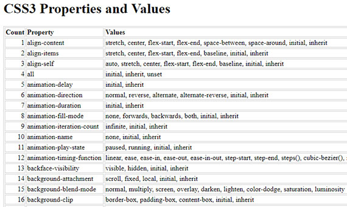](assets/images/full-size/css-props-and-values1.png)

I also ended up doing quite a bit of filtering, sorting, de-duping, etc. A word of warning... the code is icky since it was a quick and dirty way to get my list of unique CSS values.

**Link to Work:**
- Master CSS list of unique values - [HTML Table](https://my-code-editor.netlify.com/lib/test2.html) ([ source](https://github.com/james-priest/grid-critters-code/blob/master/lib/test2.html))
- Master CSS list of unique values - [List format](https://my-code-editor.netlify.com/lib/test5-list.html) ([source](https://github.com/james-priest/grid-critters-code/blob/master/lib/test5-list.html))

---

## 88. CSS Props & Values - Submit a Pull Request
### Day 88: December 23, 2017 - Saturday

**Project:** MCE (My Code Editor) project / css-properties-values node.js package

**Progress:** Complete

**Thoughts:** I mentioned in my last post that I would cover the parsing of the JSON file that the  `css-properties-values` package produced but I forgot one IMPORTANT step I took once I finished fixing the package.  That was to close the loop and do a Pull Request.

I wanted to contribute the fix to the author and the community.

So, once I updated the node.js code locally I pushed it back up to the server. I probably should have created a new branch for my updates but I kept it on _master_.

Now it was time to do a Pull Request. I went onto GitHub and clicked the Pull Request button. The system was smart enough to know where it should go based on the repo I originally forked from.

[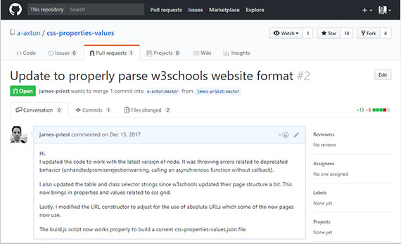](assets/images/full-size/github-css-properties-values-pull-request.png)

I then created a message detailing what had been done. It said,
> Hi,
> I updated the code to work with the latest version of node. It was throwing errors related to deprecated behavior (unhandledpromiserejectionwarning, calling an asynchronous function without callback).
>
>I also updated the table and class selector strings since w3schools updated their page structure a bit. This now brings in properties and values related to css grid.
>
>Lastly, I modified the URL constructor to adjust for the use of absolute URLs which some of the new pages now use.
>
>The build.js script now works properly to build a current css-properties-values.json file.

That was it. Now if the author decides to use it he can. He can also start a dialogue with me through GitHub to discuss any other issues or changes.  Pretty Cool!  

**Link to Work:**
- Link to [my Pull Request](https://github.com/a-axton/css-properties-values/pull/2)
- My fork of [css-properties-values repo](https://github.com/james-priest/css-properties-values) on GitHub

---

## 87. CSS Props & Values - Update Node.js Code
### Day 86: December 22, 2017 - Friday

**Project:** MCE (My Code Editor) project / css-properties-values node.js package

**Progress:** Steady

**Thoughts:** Now that I had my own personal copy of the repo, I set off to work.

The code was good but hadn't been updated in two years. This meant that the package relied on markup used on the site two years ago. Also, node now requires some more robust error handling which the package was short on.

Luckily, that was about it - a few css class names had been updated on the website and a couple semantic hierarchies had been modified but overall it looked like capturing 100% of the content was going to be doable. Below is a diff of some of the changes I made.

#### git diff
```bash
diff --git a/build.js b/build.js
index d80f41c..62f8223 100644
--- a/build.js
+++ b/build.js
@@ -14,7 +14,7 @@ const getPropValues = (url) => {
     got(childUrl(url))
       .then(response => {
         let $child = cheerio.load(response.body);
-        let $rows = $child('.w3-table-all tr');
+        let $rows = $child('.w3-table-all.notranslate tr');
         let results = [];

         $rows.each((i, row) => {
@@ -31,21 +31,28 @@ const getPropValues = (url) => {
 };

 const saveResults = () => {
-  fs.writeFile('css-properties-values.json', JSON.stringify(results));
+  fs.writeFile('css-properties-values.json', JSON.stringify(results), function(err) {
+    if(err) throw err;
+    console.log('Saved!');
+  });
 }

 got(parentUrl)
   .then(response => {
     let $parent = cheerio.load(response.body);
-    let $rows = $parent('.w3-table-all tr');
+    let $rows = $parent('.w3-table-all.notranslate tr');

     each($rows.toArray(), (row, next) => {
       let $cols = $parent(row).find('td');
       let property = $cols.eq(0).text();
-      let childUrl = $parent(row).find('a').attr('href');
+      let childUrl = $parent(row).find('a').attr('href') || '';
+      if(childUrl.charAt() === '/') {
+        childUrl = childUrl.replace(/\/cssref\//, '');
+      }
+      console.log('childUrl', childUrl);

       // no prop, skip
-      if (!property.length) {
+      if (!property.length || !childUrl.length) {
         next();
       } else {
         if (childUrl) {
```

The nice thing about the code relying on the `cheerio` package is that `cheerio` is a subset of jQuery ported over to node.js. So, the syntax was familiar.

Once I looked at how w3school's markup was laid out I could then see where the code was not capturing  certain HTML nodes properly. I made the changes and was good to go.

The output produced looked like this.

#### output
```json
[
  {
    "property":"align-content",
    "values":["stretch","center","flex-start","flex-end","space-between"]
  },
  {
    "property":"border",
    "values":["border-width","border-style","border-color","initial","inherit"]
  },
  {
    "property":"color",
    "values":["color","initial","inherit"]
  }
]
```

I still wasn't done. What I had was good but what I needed for matching purposes had to be de-duped, filtered, ordered, and had to end up looking like this:

#### needed
```javascript
var cssProperties = "align-content|border|color|...";
var cssValues = "border-color|border-width|border-style|center|flex-end|...";
```

That was what I tackled next and will detail in my next post.

**Link to Work:**
- My fork of [css-properties-values repo](https://github.com/james-priest/css-properties-values) on GitHub
- [build.js](https://github.com/james-priest/css-properties-values/blob/master/build.js) code on GitHub which scrapes and parses the html
- [css-properties-values.json](https://github.com/james-priest/css-properties-values/blob/master/css-properties-values.json) - the output of build.js

---

## 86. CSS Props & Values - Forking on GitHub
### Day 86: December 21, 2017 - Thursday

**Project:** MCE (My Code Editor) project / `css-properties-values` node.js package

**Progress:** Completed in a day!

**Thoughts:** When we last left our hero, he was scratching his head wondering who was going to fix the node.js `css-properties-values` package. This package is used to screen scrape the [w3schools CSS Reference page](http://www.w3schools.com/cssref/). It then dynamically builds a JSON file containing ALL css properties and associated values.

Well, before I could fix anything I first needed to fork the repository.

[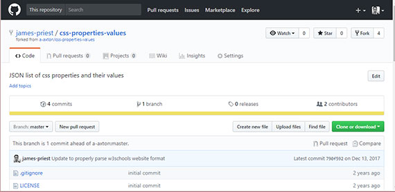](assets/images/full-size/github-css-properties-values.png)

From the GitHub Guides page on [Forking Projects](https://guides.github.com/activities/forking/):
> Creating a “fork” is producing a personal copy of someone else’s project. Forks act as a sort of bridge between the original repository and your personal copy. You can submit Pull Requests to help make other people’s projects better by offering your changes up to the original project.

So, I "forked" the repository by going to the source repo and clicking the **Fork** button in the upper right hand corner of the page. Now a copy existed on GitHub under my account but I still needed to **clone** it so I could work on it locally.

Once cloned, I got to work updating the code. More in my next post...

BTW, most folks recommend you create a feature branch to work on and then push that branch to GitHub before making the Pull Request. This keeps everything nice & tidy for the project owner who can then decide which feature branches to merge into their repo.

Here's a link to and great post that discusses [Using Fork & Branch GitHub Workflow](https://blog.scottlowe.org/2015/01/27/using-fork-branch-git-workflow/).

**Link to Work:**
- My fork of [css-properties-values repo](https://github.com/james-priest/css-properties-values) on GitHub
- [Forking Projects](https://guides.github.com/activities/forking/) GitHub Guides (4 minute read)
- [Using Fork & Branch GitHub Workflow](https://blog.scottlowe.org/2015/01/27/using-fork-branch-git-workflow/) by Scott Lowe

---

## 85. CSS Props & Values - NPM Package
### Day 85: December 20, 2017 - Wednesday

**Project:** MCE (My Code Editor) project / `css-properties-values` node.js package

**Progress:** Installed & ran the `css-properties-values` node.js package. Hit a few bumps in the road but got an opportunity to code node.js.

**Thoughts:** In writing regex patterns to match css properties and values, I needed a master list from which to match against. I briefly looked online for a **text file**  containing all css props & vals but didn't find one.

What I did find was no shortage of sites that laid out all 230+ properties (along with hundreds of values) as scrollable or searchable HTML. This didn't make it easy to pull into a hierarchical text format for my regular expressions to use.

[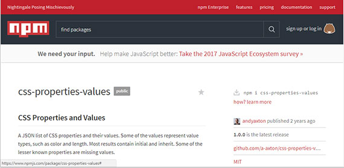](assets/images/full-size/npm-css-properties-values.png)

I then found a node.js package by Andy Axton published two years ago that screen scrapes from [http://w3schools.com/cssref](http://www.w3schools.com/cssref/) to dynamically build a JSON file containing ALL css properties and their values. Whew! This was just what I needed!😁😇

I quickly set to work by installing the packing into my current project.

```bash
npm install css-properties-values --save
npm run build
```

I ran the build which uses `cheerio` (an npm package which implements a subset of jQuery for use in a node.js server-side environment), to do an AJAX request for the web content. It then parses that into a JSON file. It was quick and managed to get about 80% of data.

But wait!... I needed 100%.

Apparently, the folks at w3schools changed the way they tagged their new properties so things like `flexbox` and `grid` items where missing or incomplete in the JSON file.

"Someone should fix this", I thought...😏😁

More in my next post.😄

**Link to Work:**
- npm [css-properties-values](https://www.npmjs.com/package/css-properties-values) package.
- RunKit playground to [test the css-properties-values package](https://npm.runkit.com/css-properties-values) with.
- npm [cheerio](https://www.npmjs.com/package/cheerio) package.

---

## 84. Syntax Highlighting - JavaScript
### Day 84: December 19, 2017 - Tuesday

**Project:** MCE (My Code Editor) project

**Progress:** Making it

**Thoughts:** Now that I had the RegEx going (from my previous posts), it was time to write the JavaScript to output my matched and augmented strings to the content editable div.

At it's simplest this is a one liner for String.replace().

```javascript
var rxProperties = /^[ \t\w-]+(?=:)/gm;

formatted = formatted.replace( this.rxProperties, 
  '<span class="mce-property">$&</span>' );

document.querySelector('.myCodeEditor').innerHTML = formatted;
```

The more involved syntax uses a callback to access matched regex groups.

```javascript
var rxQuotes = /^[/*].*\*\/|("[\w\s-]*"(?!>)|'[\w\s-]*'(?!>))/gm;

formatted = formatted.replace( this.rxQuotes, function(m, group1) {
  if (group1 !== undefined) {
    return '<span class="mce-quotes">' + group1 + '</span>';
  }
  return m;
} );

document.querySelector('.myCodeEditor').innerHTML = formatted;
```

The result is this.

[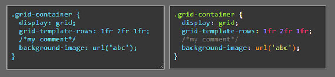](assets/images/full-size/my-code-editor5.png)

**Link to Work:**
- [MCE (My Code Editor) v4](https://my-code-editor.netlify.com/public/code_editor_dev/code-editor4.html)
- Source on GitHub ([html](https://github.com/james-priest/grid-critters-code/blob/master/public/code_editor_dev/code-editor4.html), [css](https://github.com/james-priest/grid-critters-code/blob/master/public/code_editor_dev/css/style4.css), [javascript](https://github.com/james-priest/grid-critters-code/blob/master/public/code_editor_dev/script/mce_ta4.js))

---

## 83. Syntax Highlighting - RegEx Patterns
### Day 83: December 18, 2017 - Monday

**Project:** MCE (My Code Editor) project

**Progress:** Moving along

**Thoughts:** With the RegEx tools mentioned in my previous post, I was ready to start writing patterns to match each part of a CSS expression or rule. First I had to break these down:

| Isolate | these | elements |
| --- | --- | --- |
| Selectors | HTML Elements | Rules |
| CSS Constants | CSS Keywords | Numbers |
| Properties | Functions | Quotes |

With that I fired up my RegEx tools and set to work. After days and weeks of going back and fine tuning as necessary I ended up with this set of RegEx sorcery.

```javascript
var myCodeEditor = {
  rxSelectors: /^[\w .\-#[\]'"=:()>^~*+,|$]+(?={)/gm,
  rxHtmlElements: new RegExp('\\/\\*.*|<.*?>|\\b(' + getHtmlElements() + ')\\b(?=.*{)','gm'),
  rxConstants: new RegExp('^[\\s\\w-]+|.*?{|\\w+\\(.*\\)|\\/\\*.*|<.*>|(\\b(' + getConstants() + ')(?![\\w-\\()]))', 'gm'),
  rxKeywords: new RegExp('^[\\s\\w-]+:|\\/\\*.*|\\(.*\\)|([\\d.]+)(ch|cm|deg|em|ex|fr|gd|grad|Hz|in|kHz|mm|ms|pc|pt|px|rad|rem|s|turn|vh|vm|vmin|vmax|vw|%)(?=\\W)', 'gm'),
  rxNumbers: /^[\s\w-]+:|.*?{|[a-z]\d+|\/\*.*|\(.*\)|([^:>("'/_-]\d*\.?\d+|#[0-9A-Fa-f]{3,6})/gm,
  rxProperties: /^[^{][ \t\w-]+(?=:)/gm,
  rxFunctions: new RegExp( '\\/\\*.*|((' + getFunctions() + ')\\([\\w\\d `~!@#$%^&*()\\-_=+[\\]{}\\\\|:;' + String.fromCharCode(39) + '",.\\/?]*\\))', 'gm' ),
  rxQuotes: /^[/*].*\*\/|("[\w\s-]*"(?!>)|'[\w\s-]*'(?!>))/gm,
  rxRules: /(.+)\s*(?={)|^[\t\s]*(.+;)/gm,
  rxTextToWrap: /[\w\d\-[\] {}.:;#,>+'"=()/~^$*]+$/gm,
  rxBlockToWrap: /[\w\d\-[\] {}.:;#,>+'"=()/~^$*%\t]+$/gm,
  rxFindComment: /\/\*|\*\//,
  rxReplaceComment: /\/\*|\*\//gm,
  rxComments: /\/\*.*\*\//gm,

  init: function()  {..}
  ..
}
```

I love that it looks completely crazy and illegible but is also readable and understandable now that I spent a month in the trenches writing patterns.😃😎

One thing I can say is that I am now a convert and true believer in regular expressions. It has an unprecedented ability to match, group, and replace portions of strings like no other technology.

It is also very properly supported and baked into JavaScript.

**Link to Work:**
- My Code Editor js file on GitHub - [mce_ta6.js](https://github.com/james-priest/grid-critters-code/blob/master/public/code_editor_dev/script/mce_ta6.js)

---

## 82. Syntax Highlighting - RegEx Tools
### Day 82: December 17, 2017 - Sunday

**Project:** MCE (My Code Editor) project

**Progress:** Fun & challenging

**Thoughts:** For the RegEx part of this project I needed to rely on some online Regular Expression editors and testers.  The two I used are [RegExr.com](https://regexr.com) & [RegEx101.com](https://regex101.com).

[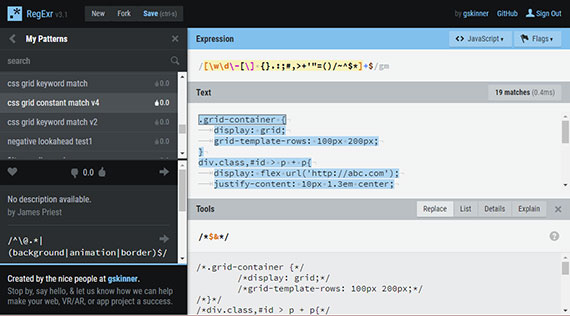](assets/images/full-size/regexr1.png)
[RegExr.com](https://regexr.com)

[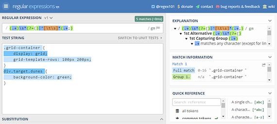](assets/images/full-size/regex101a.png)
[RegEx101.com](https://regex101.com)

These tools allowed me to write and test various RegEx patterns. Here are some of the features that both tools have.
- Ability to save, share, and version your regular expressions
- Visual indication of matches
- Syntax highlighting of matches and grouping
- Reference and cheatsheets for
  - Anchors
  - Escaped characters
  - Groups and references
  - Lookahead/Lookbehind
  - Quantifiers and Alteration
  - Substitution
  - Flags

Additionally, each tool offers an output window that shows you matches, replacements, groupings, and even explanations by simply hovering over the syntax in question.

**Link to Work:**
- [RegExr.com](https://regexr.com) - My RegEx to [Wrap code with comment blocks](https://regexr.com/3in48)
- [RegEx101.com](https://regex101.com) - My RegEx to [Group css rules & property/values](https://regex101.com/r/xRhl9X/1/)

---

## 81. Syntax Highlighting - HTML/CSS
### Day 81: December 16, 2017 - Saturday

**Project:** MCE (My Code Editor) project

**Progress:** Slow & steady

**Thoughts:** This was actually a pretty cool and fun part of the project.

I recently completed [Code School's Regular Expressions course](https://www.codeschool.com/courses/breaking-the-ice-with-regular-expressions) and now had a chance to put what I learned into practice. Armed with this new knowledge, I embarked on keyword matching for syntax highlighting.

The concept is to match a css keyword such as `flex` or `grid` and then wrap it with `<span>` tags such as `<span class="keyword">grid</span>`. We can then set the css class to specify a color or style for all css keywords. The output looks like this:

[](assets/images/full-size/my-code-editor5.png)

The classes I set look like this:

[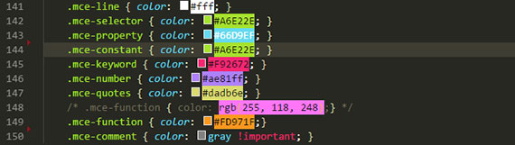](assets/images/full-size/mce-color-classes.png)

I'll discuss the necessary RegEx in my next post.

**Link to Work:**
- [MCE (My Code Editor) v4](https://my-code-editor.netlify.com/public/code_editor_dev/code-editor4.html)
- Source on GitHub ([html](https://github.com/james-priest/grid-critters-code/blob/master/public/code_editor_dev/code-editor4.html), [css](https://github.com/james-priest/grid-critters-code/blob/master/public/code_editor_dev/css/style4.css), [javascript](https://github.com/james-priest/grid-critters-code/blob/master/public/code_editor_dev/script/mce_ta4.js))

---

## 80. Content Editable Div
### Day 80: December 15, 2017 - Friday

**Project:** Create a simple code editor by upgrading my `<textarea>` input element to a contenteditable `<div>`.

**Progress:** Hit lots of roadblocks which made progress VERY slow.

**Thoughts:** So, one of the benefits of using a contenteditable `<div>` is that you can style the content in the same way a code editor does.

[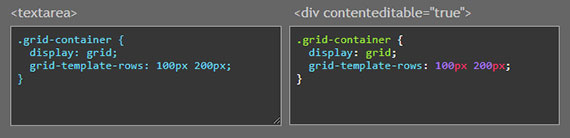](assets/images/full-size/my-code-editor3.png)

The problem is that the html produced varies across browsers. Manipulating the content is a bear, and dealing with cursor placement and positioning is much more code intensive. This is because we are now manipulating around html elements rather than straight text as is used in a textarea control.

So,this was not as easy as using a `<textarea>` element. As it turns out, various browsers handle simple things like the **&lt;Enter&gt;** key differently. Some wrap with a `<div>`, some use `<p>`, and others use `<br>`.

This is just one example of the lack of standard behavior across browsers. Apparently the issue is less fractured now but there still exists many inconsistencies that become difficult to work with.

**Link to Work:**
- _[Making Content Editable](https://developer.mozilla.org/en-US/docs/Web/Guide/HTML/Editable_content)_ article on MDN
- [Proof-of-concept page](https://my-code-editor.netlify.com/public/code_editor_dev/code-editor3.html) using content editable div as editor
- Source on GitHub ([html](https://github.com/james-priest/grid-critters-code/blob/master/public/code_editor_dev/code-editor3.html), [css](https://github.com/james-priest/grid-critters-code/blob/master/public/code_editor_dev/css/style3.css), [javascript](https://github.com/james-priest/grid-critters-code/blob/master/public/code_editor_dev/script/mce_div3.js))

[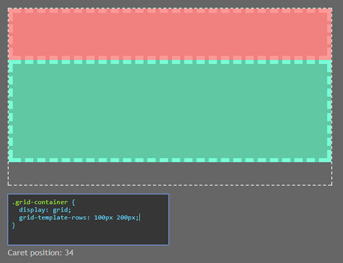](assets/images/full-size/my-code-editor4.png)

---

## 79. Writing My Own Code Editor
### Day 79: December 11, 2017 - Monday

<!-- **Project:** To write a CSS code editor in JavaScript for embedding into a web page or web app. -->
**Project:** To write a web-based CSS code editor in JavaScript for embedding in a web page.
**Progress:** How hard could it be, right?😁😉

[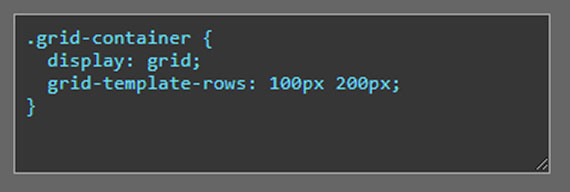](assets/images/full-size/my-code-editor2.png)

**Thoughts:** So, in the interest of full disclosure, I am writing this one month after going MIA on my [#100DaysOfCode](https://twitter.com/search?q=%23100DaysOfCode&src=tyah) twitter posts. Its not that I didn't code, it's that I didn't come out of the JavaScript hole for 4 weeks!

Let me step back and start with what started it all...

I loved how cool [Dave Geddes](https://twitter.com/geddski)' web apps [Grid Critters](https://gridcritters.com) and [Flexbox Zombies](https://flexboxzombies.com) were. They allowed me to read some narrative (the lesson), write some code (in browser), and see the results immediately.

This was awesome!!!

I wanted to see if I could write my own poor man's version of the same, mostly as a coding exercise and proof of concept.

I managed to do this in a day with 35 lines of non-optimized code. Pretty cool!

```javascript
var myCodeEditor = {
  gridContainer: document.querySelector( '.grid-container' ),
  codeEditor: document.querySelector( '.ta-code-editor' ),
  init: function(preFill) {
    var thisGrid = this;
    thisGrid.codeEditor.defaultValue = preFill;
    thisGrid.codeEditor.selectionStart = thisGrid.codeEditor.selectionEnd = 20;
    thisGrid.codeEditor.oninput = function( evt ) {
      thisGrid.applyStyle(evt);
    };
    thisGrid.codeEditor.onkeypress = function( evt ) {
      var val = this.value;
      if ( evt.keyCode === 13 || evt.which === 13 ) {
        var newLineIndent = '\u000A\u0020\u0020';
        var start, end;
        if ( typeof this.selectionStart === 'number' && typeof this.selectionEnd === 'number' ) {
          start = this.selectionStart;
          end = this.selectionEnd;
          this.value = val.slice( 0, start ) + newLineIndent + val.slice( end );

          // move the caret
          this.selectionStart = this.selectionEnd = start + 3;
        }
        return false;
      }
    };
  },
  applyStyle: function( evt ) {
    var css = evt.target.value;
    var pattern = /([\w-]+:\s*[\w-#\s]+;?$)/gm;
    var cssStatements = css.match( pattern );
    if ( cssStatements ) {
      this.gridContainer.setAttribute( 'style', cssStatements.join( ' ' ) );
    }
  }
};
```

I figured it was clear sailing from here on out - that I would be done replicating the in-browser code editor inside a week.

Well that turned out to not be true. The next dozen posts will detail what I learned.

**Link to Work:**
- An early version of my simple but working [code editor](https://my-code-editor.netlify.com/public/code_editor_dev/code-editor2.html)
- Source on GitHub ([html](https://github.com/james-priest/grid-critters-code/blob/master/public/code_editor_dev/code-editor2.html), [css](https://github.com/james-priest/grid-critters-code/blob/master/public/code_editor_dev/css/style2.css), [javascript](https://github.com/james-priest/grid-critters-code/blob/master/public/code_editor_dev/script/mce_ta1.js))

[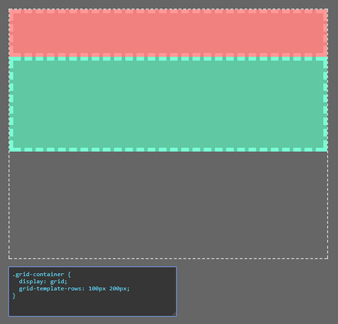](assets/images/full-size/my-code-editor1.png)

---

## 78. CSS Grid Critters
### Day 78: December 10, 2017 - Sunday

**Project:** Grid Critters ([https://gridcritters.com](https://gridcritters.com)) game-based learning course.

**Progress:** This a a paid course but the first chapter is free. It took me a day to complete.

[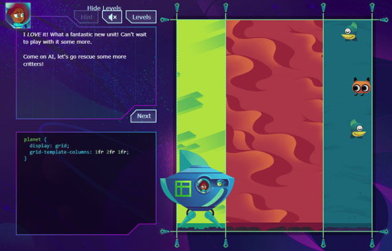](assets/images/full-size/grid-critters2.jpg)

**Thoughts:** If you've already taken the Flexbox Zombies course ([https://flexboxzombies.com](https://flexboxzombies.com)) then you know what a great learning method this is. If not then I highly recommend you do.

By employing spaced repetition and game-based learning this course manages to help commit the material to memory in a way that's fun and rewarding. 

Learning comes through a series of narratives and challenges so it almost doesn't feel like you're absorbing material as much as learning how to beat each challenge.

I highly recommend taking the free lesson to get started. The cost of the course is $225 but a request has been made to the author to consider a discounted rate for students. We'll see if he's able to do that.

In the meantime, you can follow him on twitter ([@geddski](https://twitter.com/geddski)) and check his feed to get info and updates on the course.

**Link to Work:**

- Grid Critters ([https://gridcritters.com](https://gridcritters.com)) site
- @geddski on twitter ([https://twitter.com/geddski](https://twitter.com/geddski))

---

## 77. Regular Expressions
### Day 77: December 9, 2017 - Saturday

**Project:** Completed [Code School's Breaking the Ice with Regular Expressions](https://www.codeschool.com/courses/breaking-the-ice-with-regular-expressions) course.

**Progress:** This took me 3 days to complete.

**Thoughts:** The class was a great start to learning the basics behind regular expressions. The course used a pirate theme and was pretty fun to puzzle through.

[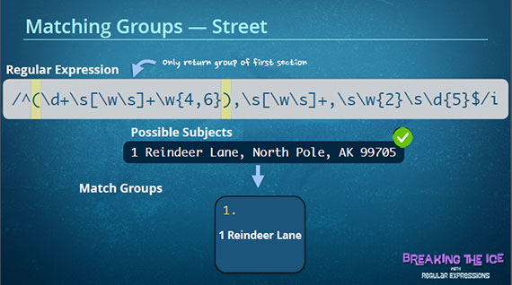](assets/images/full-size/code-school-regex.png)

The subjects covered were:

- Literals, operators, character sets, & modifiers
- Wildcards, escaping characters, groups, and anchors
- Word boundaries, negating character sets, and accumulators
- global, multi-line and case-insensitive modifiers
- Capture groups & non-capturing groups

**Link to Work:**
These are some great regex testing sites

- [https://regexr.com](https://regexr.com)
- [https://regex101.com](https://regex101.com)

---

## 76. Mobile Web Design
### Day 76: December 5, 2017 - Tuesday

**Project:** Completed [Code School's Journey Into Mobile](https://www.codeschool.com/courses/journey-into-mobile) Intermediate CSS Course

**Progress:** This took two days to complete.

**Thoughts:** This course covered the following Intermediate CSS design topics.

- Fluid Layouts
- Adaptive Design
- Responsive Design

[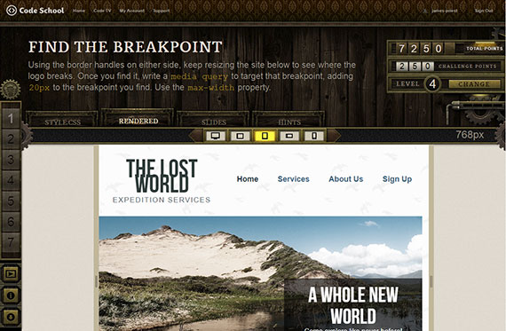](assets/images/full-size/code-school-mobile-web.png)

Some of the specific areas include.

- Relative font size formulas using _em_'s
- Calculating and setting relative container sizes using percentages(%)
- Adaptive markup
- Media queries & advanced media queries
- Display breakpoints
- Mobile first design
- Combining adaptive and responsive design
- Successfully targeting multiple contexts, devices, and display sizes with a single codebase

This course is about three years old but covers techniques that are widely in use today. I'm in the process of transitioning to using Flexbox and CSS Grid, now that all the major browsers support these, but it's still important to understand older style responsive and adaptive layout.

This course also gave me a solid set of steps to follow when using media queries and converting fixed-based layouts to responsive ones.

I would definitely recommend this course to make sure you have a solid understanding of these techniques before jumping into exclusive use CSS Grid and Flexbox.

**Link to Work:** [Code School's Journey Into Mobile](https://www.codeschool.com/courses/journey-into-mobile) Intermediate CSS Course

---

## 75. Flexbox Zombies
### Day 75: December 3, 2017 - Sunday

**Project:** Flexbox Zombies ([https://flexboxzombies.com](https://flexboxzombies.com)) game-based learning course.

**Progress:** This course took ten days to complete.

[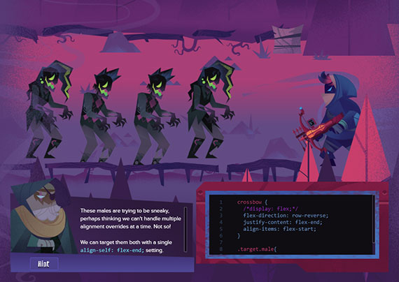](assets/images/full-size/flexbox-zombies1.png)

**Thoughts:** This course was so thoughtfully designed and so thoroughly thought out that it completely succeeded in helping me commit the lessons learned to long-term memory.

This was the third flexbox course I've taken and I didn't have a tenth of the recall available to me that this game provided me with. I cannot recommend this method of learning enough.

One of the additional things I did to help commit the lessons to memory was to code along and create my own flexbox displays to mirror what I was learning in the game. This quickly showed me any errors I had made because the zombies did not match the layout presented me in the game.

[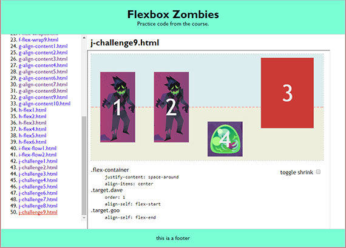](assets/images/full-size/flexbox-zombies-practice-code3.png)

This process of coding along also gave me a good amount of practice solving real-world implementation issues involving multiple flexbox displays.

**Link to Work:**
- Flexbox Zombies ([https://flexboxzombies.com](https://flexboxzombies.com)) site
- [My Flexbox Zombies pages](https://james-priest.github.io/flexbox-zombie-code/) - My Flexbox Zombies practice code
- [Flexbox Zombies practice code on GitHub](https://github.com/james-priest/flexbox-zombie-code) - GitHub repo of code

---

## 74. Web Image Optimization
### Day 74: November 28, 2017 - Tuesday

**Project:** I needed a way to reduce the load time of this code log.

High quality PNGs were originally used but these proved too expensive with 50+ images on the page and was clocking in at **35.22 seconds** for a complete page load. I needed a way to Batch optimized the images for web.

[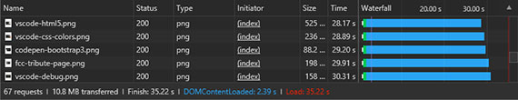](assets/images/full-size/chrome-load-time1.png)

**Progress:** This took a few hours to complete.

**Thoughts:** I used Photoshop and this article: "[Use Photoshop’s Batch Command to Quickly Save Images for Web](https://medium.com/stirtingale/use-photoshops-batch-command-to-quickly-save-images-for-web-2e4f2fe2fb8e)" to optimize all images in this code log.

This was done by creating a set of Photoshop actions which are run as part of a batch routine to convert, downsize, and optimize all images in a given folder.

Once this was done I was able to use the smaller sized JPGs and link to higher quality PNGs. This reduced load time to **8.41 seconds**.

[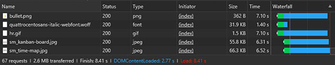](assets/images/full-size/chrome-load-time2.png)

Perhaps the next thing I'll explore is [lazy loading](https://www.sitepoint.com/lazy-loading-images-not-really-annoy-users/) of images so they only get loaded when someone scrolls to that point in the page.

**Link to Work:** "[Use Photoshop’s Batch Command to Quickly Save Images for Web](https://medium.com/stirtingale/use-photoshops-batch-command-to-quickly-save-images-for-web-2e4f2fe2fb8e)"

---

## 73. Cracking the Case with Flexbox
### Day 73: November 23, 2017 - Thursday

**Project:** Completed [Code School's Cracking the Case with Flexbox](https://www.codeschool.com/courses/cracking-the-case-with-flexbox)

**Progress:** Spent five days with this course and coded lots of examples to make it stick!

[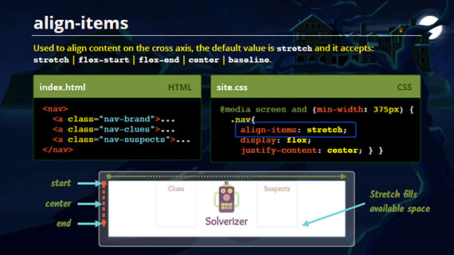](assets/images/full-size/code-school-flexbox.png)

**Thoughts:** I really enjoyed learning flexbox! It was something I put off because I had this fear it might prove to be confusing and difficult to understand. This was not the case at all. 

Doing _floats_, _positioning_ and _clears_ always felt like a hack to me. This finally addresses that and provides clear-cut ways to align and format content in a way that makes sense. I didn't want to learn another layout spec that consisted of more tweaks and fixes than actual working code.

This was not the case with flexbox. I can say I prefaced this course with [Flexbox Froggy](http://flexboxfroggy.com/) which provided a GREAT and gentle introduction to the basics of flexbox and the various css properties it uses.

**Link to Work:** 
- [Flexbox code on GitHub](https://github.com/james-priest/code-exercises/tree/master/html_exercises/cracking-flexbox) - This is my sample code used to test different flexbox layouts and properties.

---

## 72. CSS Grid Garden
### Day 72: November 14, 2017 - Tuesday

**Project:** CSS Grid Garden - A 28 lesson game for learning CSS .

**Progress:** This took one day to complete and was a bit more involved than Flexbox Froggy IMO.

[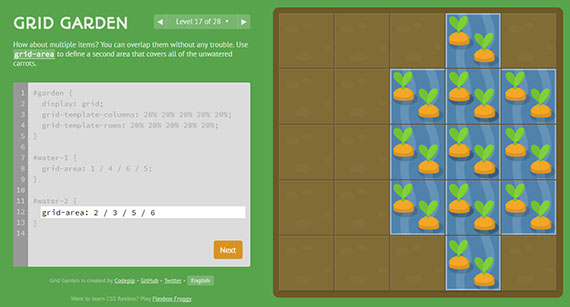](assets/images/full-size/css-grid-garden.png)

**Thoughts:** This was another great introduction to a new CSS3 layout mode. It introduces concepts and properties in a fun and easy to understand way.

Completing this course after having finished Flexbox Froggy gave me a sense of how each worked and which method was best suited for different layout needs. In fact, you can even combine the two in a way that utilizes each one's strengths.

Grid seems to be best suited for page layout and flexbox shines when used to format components or content areas on a page. [Flexbox and Grids, your layout's best friends](https://aerolab.co/blog/flexbox-grids/) helped put into context how the two where designed and which one is best suited for each task.

**Link to Work:**
- [CSS Grid Garden (http://cssgridgarden.com)](http://cssgridgarden.com/)
- [Flexbox and Grids, your layout's best friends](https://aerolab.co/blog/flexbox-grids/)

---

## 71. Flexbox Froggy
### Day 71: November 13, 2017 - Monday

**Project:** Flexbox Froggy - A 24 lesson game for learning CSS flexbox.

**Progress:** This took a day to complete... Very straightforward.

[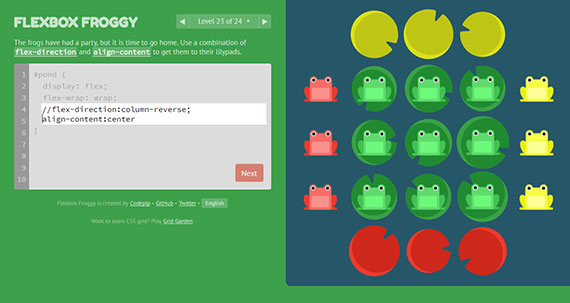](assets/images/full-size/flexbox-froggy.png)

**Thoughts:** I cannot recommend this game enough as a gentle introduction to the keywords, properties, and concepts of flexbox. Flexbox is a CSS3 layout mode that replaces old school table-based layout and the more recent but frustratingly awkward 'position & float' layout method.

I would definitely recommend going through this game before taking your first flexbox course. It will help with absorbing the material because it will be familiar when learning the concepts in more detail.

**Link to Work:** [Flexbox Froggy (http://flexboxfroggy.com)](http://flexboxfroggy.com/)

---

## 70. CSS Web Animations
### Day 70: November 18, 2017 - Saturday

**Project:** [Code School's Adventures in Web Animation](https://www.codeschool.com/courses/adventures-in-web-animations) course.

**Progress:** I kind of took my time with this and did it over four days.

**Thoughts:** This course was broken down into four sections.

1. transition (color, position, & visibility)
1. transform (rotate, translate, & scale)
1. keyframe animations
1. SVG animations

[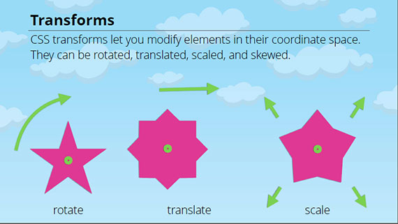](assets/images/full-size/code-school-web-animations.png)

So this course is different than one with the kinds of animations you'd produce with a JavaScript library like [p5.js](https://p5js.org). I haven't gone through too many of [@shiffman's](https://twitter.com/shiffman?lang=en) tutorials but from what I've gathered, those produce scalable vector graphics through the use of the HTML5 `<canvas>` element. Everything is code driven and relies on JavaScript.

This course deals with CSS3 animations on HTML elements & SVGs (although, technically you can also animate PNGs, GIFs, and JPGs as well). All animations are done in the stylesheet by specifying various property settings and applying those to different elements on the page through CSS selectors.

I imagine it's a little more low-level than JavaScript animation with canvas. The CSS style animation method is great for simple user interface, form element, or SVG image animations that you want use to enhance a website with.

The other thing that took some time was tracking down the HTML/CSS used in the course. Once I had that I deleted the code the lesson covered and followed along.

The other thing I like to do is download the PDF slide deck and create an outline/TOC that I can refer to during the tests or use later as part of my notes.

**Link to Work:**
- [GitHub repo of code exercises](https://github.com/james-priest/code-exercises/tree/master/html_exercises/web-animations) - This has links to starter HTML/CSS for those who like to code along in their editor of choice.

---

## 69. Advanced jQuery
### Day 68: November 12, 2017 - Tuesday

**Project:** [Code School's Advanced jQuery - The Return Flight](https://www.codeschool.com/courses/jquery-the-return-flight) course.

**Progress:** This took me five days to complete and the material went deeper than before.

[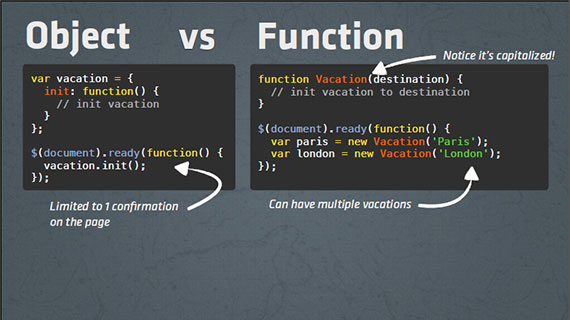](assets/images/full-size/code-school-jquery-return-flight.png)

**Thoughts:** This course covered the following topics:

- Ajax Basics
- Setting Ajax options
- Refactoring code to use JavaScript objects
- Refactoring JS objects to JS constructor functions for reusability
- Working with Ajax Forms
- Using Ajax to process, send, & receive JSON data
- Using jQuery Utility Methods
- Advanced Event Handling including namespaced events
- Authoring jQuery Plugins
- Using Promise objects
- Chaining asynchronous calls
- Use of $.when() and .then

The beautiful thing about taking this course after having taken [Code School's Real-time Web with Node.js](https://www.codeschool.com/courses/real-time-web-with-node-js) is that I was able to write all my own node servers to properly return formatted text, HTML, JSON, & script depending on what the Ajax call expected.

The course has you do the exercises in-browser so there's no need to worry about server-side code implementation, but I also like to follow along in my code editor ([Visual Studio Code](https://code.visualstudio.com)) so I can play and expand upon the code examples.

By writing both Front End and Back End code, I was able to get some solid experience in end-to-end development. It allowed my to fine-tune my Ajax calls, optimally format my json & HTML data payloads, and practice processing data on the server with node.js and Express.

**Link to Work:**
- [My code files on GitHub](https://github.com/james-priest/code-exercises/tree/master/javascript_exercises/try-jquery)
- [Code School exercise files](https://github.com/codeschool/jQueryReturnFlightDemos)

---

## 68. Git Real - Advanced Intro to Git
### Day 68: November 7, 2017 - Tuesday

**Project:** Completed [Code School's Git Real](https://www.codeschool.com/courses/git-real) course. This uses command line Git to solve all your day to day needs.

**Progress:** This took about three days to complete and by the end I had 16 pages of notes that cover all beginning and intermediate git usage scenarios.

**Thoughts:** This was a great class! It has everything you need to go from beginner to git cli master. It also covers GitHub and some Heroku deployment scenarios.

[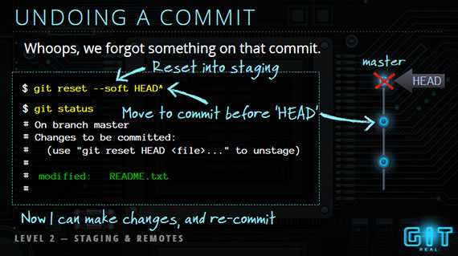](assets/images/full-size/code-school-git-real2.png)

The class was divided into the following sections.

- Git Basics
- Staging and Remotes
- Cloning and Branching
- Collaboration Basics
- Remote Branches and Tags
- Rebase & Conflict Resolution
- History and Configuration

[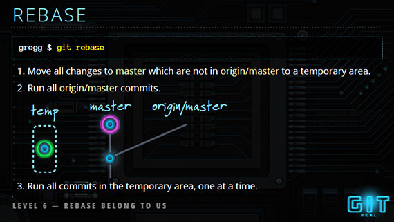](assets/images/full-size/code-school-git-real1.png)

Here are some of the useful skills and techniques I learned.

- Unstaging files
- Discarding changes
- Adding to a commit
- Undoing a commit
- Viewing file diffs (by commit, by branch, by date, by user, etc.)
- Resolving merge conflicts
- Branching, fast-forward merges, and recursive merging
- Reading the log
- Working in the commit editor (vi)
- Merging and deleting remote branches
- Understanding pull with merge vs. fetch and rebase
- Searching through and working with history
- Configuring aliases for common cli tasks

**Link to Work:**
[Git Real by Code School](https://www.codeschool.com/courses/git-real)

---

## 67. jQuery Promises
### Day 67: November 5, 2017 - Sunday

**Project:** Converted Ajax calls to use jQuery Promises.

 This was from Lesson 2 of _Chapter 8: Working with Web Services_ from [Programming in HTML5 with JavaScript and CSS3 Training Guide](http://www.daoudisamir.com/references/vs_ebooks/html5_css3.pdf) by Glenn Johnson.

**Progress:** It took 30 minutes to write the code and a day of reading and experimenting to understanding it thoroughly.

**Thoughts:** I learned the following about the jQuery Promise object:

- You can use promises to execute another ajax call after the first one is successful
- When you use jQuery to execute an ajax call, a promise object is returned
- The promise object enables you to register a callback to execute when the ajax call is successful, has failed, is progressing, and has completed.

The promise object has the following methods that can be used to register called functions:

- .always() - add handlers to be called when ajax has completed regardless of success or not
- .done() - called when ajax call is successful
- .fail() - called when ajax call has failed
- .progress() - called when ajax call generates progress notifications

Here's a portion of the modified code.

```javascript
// collects data, passes it to serverAddition, & decides how to process the results
function addNumbers( e ) {
    var data = getFormData();
    serverAddition( data ).done( displayResult ).fail( displayError );
}

// format data for the ajax call - optional args
function getFormData( x, y ) {
    x = x || $( '#x' ).val();
    y = y || $( '#y' ).val();
    return { 'x': x, 'y': y };
}

// handles ajax call to the server and returns a promise object
function serverAddition( data ) {
    return $.getJSON( '/addition', data );
}

function displayResult( serverData ) {
    $( '#result' ).html( serverData.result );
}
```

**Link to Work:** [default-promise.js](https://github.com/james-priest/node_samples/blob/master/math_service/public/scripts/default-promise.js) on GitHub

---

## 66. Ajax, XMLHttpRequest, & jQuery
### Day 66: November 3, 2017 - Friday

**Project:** _Chapter 8: Working with Web Services_ from [Programming in HTML5 with JavaScript and CSS3 Training Guide](http://www.daoudisamir.com/references/vs_ebooks/html5_css3.pdf) by Glenn Johnson.

**Progress:** Created a Node.js web service that performs a basic arithmetic calculation - add, subtract, multiply, or divide. It takes two operands, `x` and `y` and returns a `result`.

The web service is accessed through Ajax. I had practice using the `XMLHttpRequest` object as well as jQuery's `$.ajax()`, `$.get()`, `$.getJSON()`, and `$.post()` methods.

**Thoughts:** This was great practice using a varied mix of Asynchronous JavaScript (Ajax) calls to get data from a web service or web api. Below are a few examples of the different Ajax function calls I used.

#### Asynchronous XMLHttpRequest() method

```javascript
function addNumbersXhrAsync( e ) {
    e.preventDefault();
    var x = document.getElementById( 'x' ).value;
    var y = document.getElementById( 'y' ).value;
    var result = document.getElementById( 'result' );
    var xmlhttp = new XMLHttpRequest();

    xmlhttp.onreadystatechange = function() {
        if ( xmlhttp.readyState === 4 && xmlhttp.status === 200 ) {
            var jsonObject = JSON.parse( xmlhttp.response );
            result.innerHTML = jsonObject.result;
        }
    };

    xmlhttp.open( 'GET', '/addition?x=' + x + '&y=' + y, true );
    xmlhttp.send();
}
```

#### Asynchronous jQuery $.ajax() method with HTTP GET

```javascript
function addNumbers$ajax_typeGET(e) {
    e.preventDefault();
    console.log( ' ', '$.ajax() call' );

    $.ajax( {
        url: '/addition',
        data: ajaxData(),   // { 'x': x, 'y': y }
        type: 'GET',
        cache: false,
        dataType: 'json',
        success: function( data ) {
            $( '#result' ).html( data.result );
        }
    } );
}
```

#### Asynchronous jQuery $.get() method with HTTP GET

```javascript
function addNumbers$get( e ) {
    e.preventDefault();
    var ajaxData = formatAjaxData();   // { 'x': x, 'y': y }

    $.get( '/addition', ajaxData, function( data ) {
        $( '#result' ).html( data.result );
    }, 'json' );
}
```

#### Asynchronous jQuery $.getJSON() method with HTTP GET

```javascript
function addNumbers$getJSON( e ) {
    e.preventDefault();
    var ajaxData = formatAjaxData();   // { 'x': x, 'y': y }

    $.getJSON( '/addition', ajaxData, function( data ) {
        $( '#result' ).html( data.result );
    } );
}
```

#### Asynchronous jQuery $.post() method with HTTP POST

```javascript
function subtractNumbers$post( e ) {
    e.preventDefault();
    var ajaxData = formatAjaxData();

    $.post( '/subtraction', ajaxData, function( data ) {
        $( '#result' ).html( data.result );
    }, 'json' );
}
```

Along with the various Ajax methods, I also learned what dataType's you can work with and expect to receive from the server. These are _json_, _xml_, _html_, _script_, _jsonp_, or _text_.

There's an amazing amount of flexibility revolving around Ajax and using it to consume services. I used to be intimidated by the syntax until I spent the time to understand each variation and how they work.

**Link to Work:**

- [Math Service project on GitHub](https://github.com/james-priest/node_samples/tree/master/math_service)

---

## 65. Published My First NPM Package
### Day 65: October 31, 2017 - Tuesday

**Project:** **logcl** - Created a simple set of wrapper methods to `console.log()`. These methods output formatted text to the command line with headers and indentation for legibility.

**Progress:** Took a day to put everything together for the package. This included cleaning up the code, properly commenting the methods, creating the README.md, creating the package.json and setting up the GitHub repo.

The recipe I followed was from _Chapter 8: Websites & Services_ of [Programming in HTML5 with JavaScript and CSS3 Training Guide](http://www.daoudisamir.com/references/vs_ebooks/html5_css3.pdf) by Glenn Johnson.

**Link to Work:** [logcl package](https://www.npmjs.com/package/logcl) on npm

[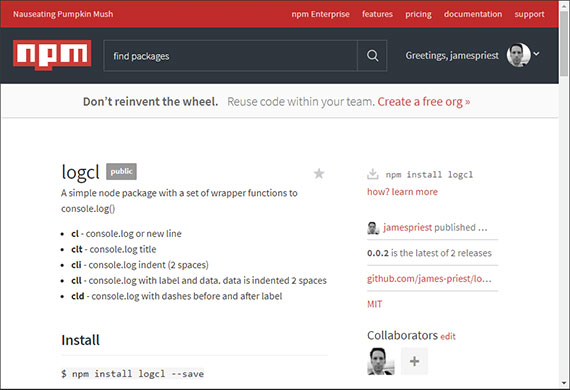](assets/images/full-size/npm-package-logcl.png)

**Thoughts:** I had been using a set of wrapper functions to `console.log()` for debugging purposes in many of my projects. Initially, I would copy the functions to my code file and reference them directly.

I then separated the code out to its own module from which I exposed its methods. I was then free to use these methods in my application code by using the `require` keyword.

In order to truly be DRY (Don't Repeat Yourself), I needed to put this code into a package that I could install and include in any of my projects.

This was the motivation for looking up how to do this. I'm glad I now know the process for structuring a package and how to utilize, access, and maintain it.

---

## 64. Hacktoberfest & GitHub Pull Requests
### Day 59: September 30, 2017 - Saturday

**Project:** Hacktoberfest, GitHub PRs, & freeCodeCamp Guide contributions

**Progress:** Completed four GitHub PRs as part of [GitHub & Digital Ocean's Hacktoberfest 2017](https://hacktoberfest.digitalocean.com) event. I was able to do this in one day.

[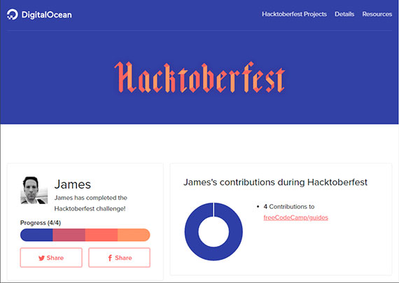](assets/images/full-size/hacktoberfest-complete.png)

**Thoughts:** This was a great exercise in learning the process of how to maneuver GitHub Pull Requests.

What made it an even easier learning curve was the option to contribute to the freeCodeCamp Guide right through the browser. You can do this through GitHub's edit feature and Quincy walks you through it in his post.

I did the first two PRs in this way and then read the [README.md for the freeCodeCamp Guides](https://github.com/freeCodeCamp/guides) on GitHub for step by step instructions on how to clone the repo, set my upstream connection, create a dev branch, make my changes, commit those changes, push the branch to GitHub, and then initiate the PR.

It sounds like a lot but it was straight forward and worked beautifully. I was even able to add new commits to a PR I had already submitted without any issues. I now feel comfortable contributing to any GitHub project without fear of anything breaking!

**Link Resources:**
- Quincy Larson's Medium article, "[I just got my free Hacktoberfest shirt. Here's a quick way you can get yours.](https://medium.freecodecamp.org/i-just-got-my-free-hacktoberfest-shirt-heres-a-quick-way-you-can-get-yours-fa78d6e24307)"
- The [README.md for freeCodeCamp Guides](https://github.com/freeCodeCamp/guides) on GitHub

---

## 63. Real-time Web with Node.js
### Day 63: October 25, 2017 - Wednesday

**Project:** Completed Code School's [Real Time Web with Node.js](https://www.codeschool.com/courses/real-time-web-with-node-js) course

**Progress:** Took me 5 days to complete.

**Link to Work:** [Real Time Web with Node.js](https://www.codeschool.com/courses/real-time-web-with-node-js)

[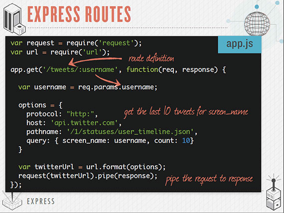](assets/images/full-size/code-school-nodejs.png)

**Thoughts:** This course was a great introduction to Node.js and the many technologies surrounding it. I had to table my need to understand every detail and just watch the videos, listen to the lectures, and take notes. The challenges reinforced what I learned and gave me a sense that I could write the code without fully understanding every detail of what was going on under the hood.

This course covered:
- Creating non-blocking, http node servers.
- Event emitters & event requests
- Streams
- Creating and requiring modules
- NPM & packages
- Web framework with Express
- JavaScript templating library with EJS (Embedded JavaScript)
- Web Sockets with Socket.io
- Persisting data with Redis (a NoSQL, in-memory, key-value data store)

The course was created in 2014 but is very much current and a great introduction to the node.js toolset, environment, and ecosystem. I would definitely recommend this course.

---

## 62. Try jQuery
### Day 62: October 21, 2017 - Saturday

**Project:** Completed Code School's [Try jQuery](http://try.jquery.com) course

**Progress:** Spent 2-3 days working through this and taking notes. It also has a great slide deck you can download.

**Link to Work:** [Free Try jQuery course](http://try.jquery.com)

[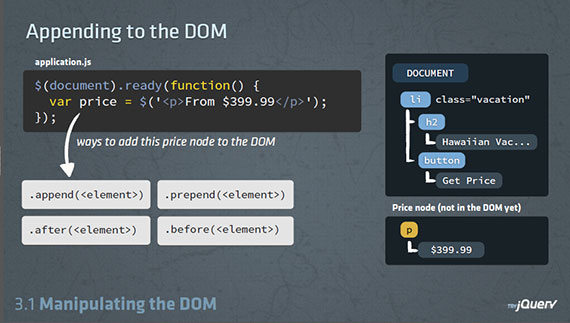](assets/images/full-size/code-school-try-jquery2.png)

**Thoughts:** This was a great introductory course on jQuery. It covered the following:
- CSS Selectors
- Traversing the DOM
- jQuery methods
- DOM Manipulation
- Refactoring and Filtering
- Event Handling
- CSS Styling
- Effect and Animations

This takes what I learned from Free Code Camp and expands on my understanding of what's possible through the jQuery library. In total it took 6-8 hours to complete. The exercises were all done in the browser but I also worked out the code in my editor. Very well worth it!

---

## 61. You, Me, & SVG
### Day 61: October 18, 2017 - Wednesday

**Project:** Completed [Code School](http://www.codeschool.com) You, Me, & SVG class

**Progress:** Finished over two days

**Link to Work:**
- [Code School - HTML/CSS Learning Path](https://www.codeschool.com/learn/html-css)
- CodePens:
  - [SVG Badge](https://codepen.io/james-priest/pen/aLXyYG)
  - [SVG Home](https://codepen.io/james-priest/pen/qPgXZx)
  - [SVG Absctract #1](https://codepen.io/james-priest/pen/mBvWXZ)

[](https://codepen.io/dashboard/)

**Thoughts:** This was a great class that covered the basics of writing SVG by hand as an exercise toward understanding it  s structure under the hood. SVG stands for Scalable Vector Graphics and is supported in all major browsers.

While its recommended that we use a vector-based image editing program when creating these, it is useful to know how to read, understand, and modify the text output of an SVG file.

Knowing how these are structured also allows use to modify these through CSor JavaScript and to even animate SVG though CSS transform directives.

---

## 60. Creating JavaScript Objects
### Day 60: October 14, 2017 - Saturday

**Project:** Completed "Creating Javascript Objects" repo on GitHub - This is taken from the Essential JavaScript chapter of [Programming in HTML5 with JavaScript and CSS3](https://www.amazon.com/Training-Guide-Programming-JavaScript-Microsoft/dp/0735674388) (MS Press)

It applies object-oriented design techniques to JavaScript and shows you how to architect your code to use objects, prototypes, constructors, and inheritance. It also touches on using the following design patterns:

- object literal pattern
- factory pattern
- prototype pattern
- module pattern

The sample code also uses a Test Driven Design (TDD) approach to test the functionality of properties and methods of the objects we create.

**Progress:** Finished both the object-oriented walk-thru and the accompanying code samples for each section.

**Link to Work:** GitHub repo: [Creating JavaScript Objects](https://github.com/james-priest/javascript-objects#creating-javascript-objects)

**Thoughts:** This took about a week to complete. I mostly did this as an exercise to walk through writing out each section of the book's chapter. I also took my time in writing out all the sample code and testing it with a light-weight TDD framework called [Tape](https://github.com/substack/tape). This allows you to write tests (assertions) to verify the code is doing what you expect it to do. These are small unit tests which are performed as a group and can be very helpful for proof-of-concept code.

Here's a sample of the kind of code this walk through builds:

```javascript
var Vehicle = (function() {
    function Vehicle( theYear, theMake, theModel ) {
        this.year = theYear;
        this.make = theMake;
        this.model = theModel;
    }
    Vehicle.prototype.getInfo = function() {
        return this.year + ' ' + this.make + ' ' + this.model;
    };
    Vehicle.prototype.startEngine = function() {
        return 'Vroom';
    };
    return Vehicle;
})();

var v = new Vehicle( 2012, 'Toyota', 'Rav4' );
var actual = v.getInfo();
var expected = '2012 Toyota Rav4';
```

It also explains exactly what is happening and why we construct the code as shown.

---

## 59. JavaScript Best Practices
### Day 59: October 7, 2017 - Saturday

**Project:** Completed Code School's JavaScript Best Practices course

**Progress:** Worked on this for about one week

**Link to Work:**
- [GitHub repo with my code examples and notes](https://github.com/james-priest/code-exercises/tree/master/javascript_exercises/javascript-best-practices)
- [Code School - JavaScript Learning Path](https://www.codeschool.com/learn/javascript)

**Thoughts:** Learned the following:
- Ternary conditionals, logical 'Or', logical 'And', operators & assignment
- Loop optimization,script execution, & performance tips
- Exception handling, object & type comparisons
- Coding conventions, numerical anomalies & work-arounds
- Namespaces & object prototype constructor
- Anonymous closures & Immediately Invoked Function Expressions (IIFEs)
- Module pattern, Factory Pattern and namespace
- Global imports and namespace augmentation

**Example of course material & code:**

```javascript
/**
 * Anonymous Closures - Making data & methods private using the Module Pattern 
 * So far we've seen modules that only have public properties.. 
 * what if we wanted some stuff to be accessible only to the module?
 *
 * First decide which properties should be public and which should be private
 * Then... have public methods signal private methods to update/modify private data
 */

var ARMORY = {
    // should be private - module's internal data
    weaponList: [ ' * list of weapon Objects * ' ], // these are modified only by internal methods
    armorList: [ ' * list of armor Objects * ' ],

    // should be public - external code can make requests
    makeWeaponRequest: function() { }, // these access methods below
    makeArmorRequest: function() { },

    // should be private - only module should access these
    removeWeapon: function() { }, // these access data above
    replaceWeapon: function() { },
    removeArmor: function() { },
    replaceArmor: function() { }
};

// Step 1 - Wrap entire set of properties in an IIFE
var ARMORY = ( function() { 
    // props go here...
} )(); // <--- these last parens indicate the Function Expression should be immediately executed, therefore, an IIFE


// Step 2 - Make desired private props into local executable code
var ARMORY = ( function() {
    var weaponList = [ ' * list of weapon Objects * ' ]; // these become local vars for IIFE's scope,
    var armorList = [ ' * list of armor Objects * ' ]; // and therefore, are private
    
    makeWeaponRequest: function() { },
    makeArmorRequest: function() { },

    var removeWeapon = function() { }; // these become local vars which now belong to the IIFE's scope
    var replaceWeapon = function() { }; // instead of the namespace, and are, therefore, private
    var removeArmor = function() { };
    var replaceArmor = function() { };
} )();

// Step 3 - Pull all private values and methods to the top of the function (for easy reference & good code organization)
var ARMORY = ( function() {
    var weaponList = [ ' * list of weapon Objects * ' ]; // these become local vars for IIFE's scope,
    var armorList = [ ' * list of armor Objects * ' ]; // and therefore, are private

    var removeWeapon = function() { }; // these become local vars which now belong to the IIFE's scope
    var replaceWeapon = function() { }; // instead of the namespace, and are, therefore, private
    var removeArmor = function() { };
    var replaceArmor = function() { };

    makeWeaponRequest: function() { },
    makeArmorRequest: function() { },  
} )();

// Step 4 - Here's the money: To make some properties public, return an object
// Add the public properties to their own object which, when returned, becomes the ARMORY namespace
var ARMORY = ( function() {
    var weaponList = [ ' * list of weapon Objects * ' ]; // these become local vars for IIFE's scope,
    var armorList = [ ' * list of armor Objects * ' ]; // and therefore, are private

    var removeWeapon = function() { }; // these become local vars which now belong to the IIFE's scope
    var replaceWeapon = function() { }; // instead of the namespace, and are, therefore, private
    var removeArmor = function() { };
    var replaceArmor = function() { };

    return {
        makeWeaponRequest: function() { }, // because the FE is immediately called, the returned object
        makeArmorRequest: function() { } // will be handed immediately to the ARMORY variable and become a namespace 
    };
} )();

/**
 * Closure now produces our desired private methods and values
 * Everything with a var is "bound down" within the scope of the returned namespace object.
 *
 * Notice that none of our function's local variables are ever properties with the returned
 * namespace object..
 *
 * ..but they are there nonetheless, visible to, and able to be referenced by, ONLY the members
 * of the local namespace scope!
 */

var mySword = ARMORY.makeWeaponRequest( "Excalibur" );
/**
 * makeWeaponRequest() calls an invisible removeWeapon() which, if some conditions are met,
 * deletes and retrieves an object from an invisible weaponList.
 * weaponList returns that object to the removeWeapon() function, which then returns the object
 * for use to the scope of WeaponRequest()
 */

/**
 * In short...
 * Private properties are created in the local scope of the function expression.
 * Public properties are built within the object which is then returned to become the namespace.
 * Access to private data is thus possible only because of closure within the larger module
 */

```

## 58. JavaScript Road Trip Part&nbsp;3
### Day 58: September 30, 2017 - Saturday

**Project:** JavaScript Road Trip Part 3 course

**Progress:** This took 3-4 days to complete and covered some advanced JavaScript subjects

**Link to Work:** 
- [GitHub repo with my code examples and notes](https://github.com/james-priest/code-exercises/tree/master/javascript_exercises/javascript-roadtrip3)
- [Code School - JavaScript Learning Path](https://www.codeschool.com/learn/javascript)

[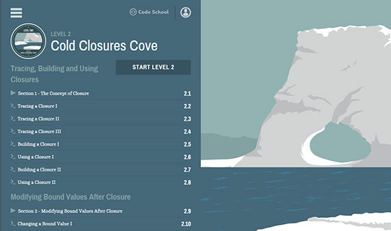](assets/images/full-size/code-school-js-part3.png)

**Thoughts:** The subject matter areas covered  ere:
- Function Expressions - Used to assign a function (usually anonymous function) to a variable or to assign a function to an object property to create a property method.
- Closures - Used in factory patterns and creating function "makers".
- Hoisting - Refers to the order in which the compiler reserves memory for variables through declaration. All formally declared variables and function statements are hoisted on the compiler's first pass; function expressions are not. They are processed during the compiler's execution stage in which the code is actually run.
- Objects - creation and manipulation of objects in all forms.
- Prototypes - Creation of function constructor's and moving of shared methods to an object's prototype for efficient memory footprint when many objects are created and used.

This course was really the missing set of lessons I needed to in order to know how to best structure my code. I now have a set of code examples to refer to when building the structure of my Free Code Camp projects.

Beyond the many in-browser exercises, I also copied much of the code into my VS Code editor and ran these from terminal with node. At other times I ran various code examples in Console right through Chrome DevTools.

This course is not for the faint of heart but is great for those with an intermediate grasp of JavaScript who want to kick it up to the next level.

---

## 57. JavaScript Road Trip Part&nbsp;2
### Day 57: September 26, 2017 - Tuesday

**Project:** JavaScript Road Trip Part 2 course on Code School

**Progress:** This took about a day and a half to complete

**Link to Work:** [Code School JavaScript Path](https://www.codeschool.com/learn/javascript)

[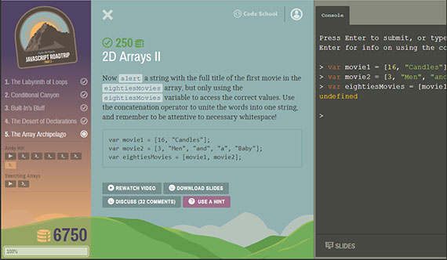](assets/images/full-size/code-school-js-part2.png)

**Thoughts:** Part 2 covered Loops, Conditionals, Build-ins, Functions and Arrays. It was pretty straight forward and provided a good refresher to each of these code constructs.

Additionally, the course focused on how to optimize each of the constructs for efficiency and readability.

I enjoy these lessons because they can be completed in a day or two and are pretty straight forward to grasp. I have lots of notes and sample code that I can refer to when building my next FCC project.

---

## 56. Weather App Fix & GitHub Pull Request
### Day 56: September 25, 2017 - Monday

**Project:** Updated Weather App on CodePen & Netlify with CSS Prefixes, JavaScript retooling, & cross-browser testing. (Whew!😅)

**Progress:** Once I had the Mac VM in place I was able to reproduce and fix _some_ of the errors that folks reported. I got help regarding CSS pre-fixes from one of our [#100DaysOfCode](https://twitter.com/search?q=%23100daysofcode&src=tyah) members who suggested Grunt, Gulp, or Webpack to automate the process.

The final bits of fine-tuning came from another [#100DaysOfCode](https://twitter.com/search?q=%23100daysofcode&src=tyah) friend who was awesome enough to clone the repo, streamline the bad bits, and submit a Pull Request to integrate the changes.

- **Thank you Peter ([@PeteCapeCod](https://twitter.com/PeteCapeCod)) for the spark of insight and point in the right direction!**
- **Thank you Vlad ([@_vladbogdan](https://twitter.com/_vladbogdan)) for code fixes, cross-browser testing, & the GitHub Pull Request!**

[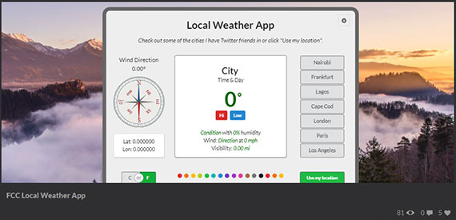](assets/images/full-size/codepen-weather-app-fix.png)

**Links:**
- [Weather App on Code Pen](https://codepen.io/james-priest/)
- [Weather App on Netlify](https://local-weather-app.netlify.com)

**Thoughts:** Testing on Safari & Mac OS required setting up a Mac VM in which to debug both the stand-alone & CodePen version of the app. Once this was done I proceeded to retool the the markup, css, & javascript. 

I added CSS pre-fixes to target specific versions of older browsers and integrated help from Vlad which consisted of switching ES6 to ES5 syntax (`let` to `var`) and using `forEach` rather than `for` to fix a scope issue.

The prefixing was done through a great tool that takes your CSS and adds the prefixing where needed. All you do is paste your source and the updated CSS is produced.

- [Autoprefixer CSS online](https://autoprefixer.github.io/)

I'll look into automating this process with Grunt, Gulp, or Webpack in the future.. possibly once I integrate Sass or SCSS into my process.😁

Now that I'm done, I can say it took longer to set up the test environment than it did to debug the code but was definitely a good experience. I now have three separate guest VMs from which to test and develop from:

- Windows 10
- Ubuntu 16.04
- Mac Sierra 10.12.6

Pretty cool!😎😀

Also, I got to integrate my first outside Pull Request. (Thanks again to Vlad!) I had done this on my own as practice but hadn't actually collaborated on any codebase. I guess its time for me to practice contributing to someone else's codebase by submitting my first pull request as well.

---

## 55. Mac VM on Windows - macOS Sierra 10.12.6
### Day 55: September 24, 2017 - Sunday

**Project:** Set up macOS Sierra 10.12.6 (previously Mac OS X) on Windows as a VM.

**Progress:** It took one day to download the vdsk, install the VM, & update the OS. I took another couple days to install Brew, Node, Git, Chrome, VS Code, Xcode Command Line Tools, Git Bash for Mac and some npm packages (http-server, eslint, etc.). Once done, I had a proper test environment to work from.

[](assets/images/full-size/sm_macOS-sierra-vm.png)

**Link:** [Complete Tutorial Steps](https://www.pcsteps.com/2157-mac-os-x-virtual-machine-vmware-player/) including link to fully configured macOS Sierra VM Disk

**Thoughts:** This tutorial was perfect. It worked as advertised and without any hitches or problems. The part that took the longest was downloading the VM disk. It's 4-5 GB. If anyone is looking to run macOS inside a VM then I would definitely recommend this guide.

I also applied the latest updates and logged in with my Apple ID to integrate iCloud services. I currently run the VM with 16 GB of allocated memory although you can run it with as little as 4 GB.

---

## 54. JavaScript Road Trip Part&nbsp;1
### Day 54: September 21, 2017 - Thursday

**Project:** Completed Code School's JavaScript Road Trip Part 1 course

**Progress:** This took about a day to complete

**Link to Work:** [Code School JavaScript Path](https://www.codeschool.com/learn/javascript)

[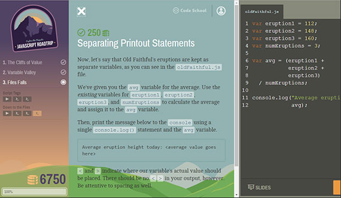](assets/images/full-size/code-school-js-part1.png)

**Thoughts:** All challenges took place in the browser and covered things like Booleans, Strings, and  Variables. Additionally, we covered some intrinsic js object methods such as String.charAt, String.indexOf, concatenation & arithmetic operations including modulus(%).

Besides coding in the browser environment provided by the course, I also opened up Console in Chrome DevTools for quick proof-of-concept tests.

[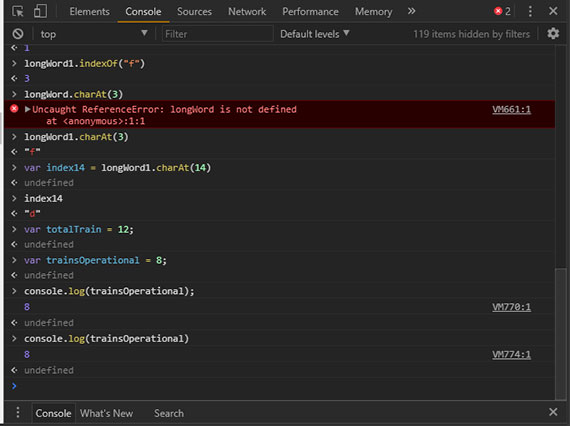](assets/images/full-size/code-school-js-part1-console.png)

For longer tests I usually create a js file in VS Code and then run the file with node. This gives me the added benefit of syntax highlighting, linting, & debugging if necessary. For the purposes of this course the console was enough.

In all, Part 1 of this course covers only the most basic JavaScript concepts and is good for those new to programming or those, like me, who enjoy quick refreshers.

---

## 53. Weather App on CodePen
### Day 53: September 19, 2017 - Tuesday

**Project:** Weather App on CodePen

**Progress:** Added background crossfade transitions to the Weather App, updated it on netlify, and posted it on CodePen. I had to make some modifications on the CodePen version to get everything to work alright.

**Link to Work:** 
- [Weather App on CodePen](https://codepen.io/james-priest/pen/XaQQaO)
- [Weather on Netlify](https://local-weather-app.netlify.com)

[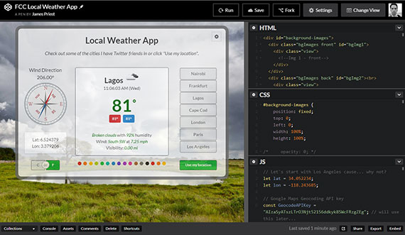](assets/images/full-size/codepen-weather-app.png)

**Thoughts:** The changes needed for CodePen involved removing styling from the body tag and instead creating a container that I could wrap my application in and style as needed. 

I also had issues with linking directly to SVGs on GitHub. These were being served as 'text/plain' rather than 'svg+xml' mime type. Instead I accessed these through Netlify and all was good.

---

## 52. True Crossfade Effect
### Day 52: September 18, 2017 - Monday

**Project:** Completed a CSS Crossfade & Carousel Effect using stacked divs, css, & jquery

**Progress:** I thought this would take me 2-3 hours but took more like 1-2 days

**Link to Work:**
- CodePen - Crossfade: [https://codepen.io/james-priest/pen/boEVXR](https://codepen.io/james-priest/pen/boEVXR)
- Crossfade on Netlify: [https://local-weather-app.netlify.com/crossfade.html](https://local-weather-app.netlify.com/crossfade.html)
- CodePen - Carousel: [https://codepen.io/james-priest/pen/EwPpaw](https://codepen.io/james-priest/pen/EwPpaw)
- Carousel on Netlify: [https://local-weather-app.netlify.com/carousel.html](https://local-weather-app.netlify.com/carousel.html)

[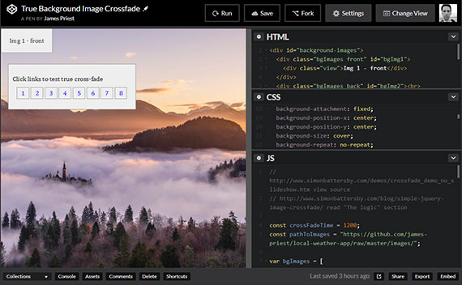](assets/images/full-size/codepen-crossfade.png)

**Thoughts:** There were lots online references to jQuery fadeIn, fadeOut, and fadeToggle but these didn't do the trick. One image would fade all the way down and then the next would fade up. This wasn't as clean.  You can see here.

[https://local-weather-app.netlify.com/transition1.html](https://local-weather-app.netlify.com/transition1.html)

I went through LOTS of posts, jquery docs, & stack overflow q&a's until I found something that I could adapt. That was here:

[http://www.simonbattersby.com/blog/simple-jquery-image-crossfade/](http://www.simonbattersby.com/blog/simple-jquery-image-crossfade/)

I had to change quite a few things around to adapt the sample to what I had in mind but the basic structure/logic was sound and worked great!

---

## 51. Local Weather App
### Day 51: September 15, 2017 - Friday

**Project:** Completed FCC Local Weather App

**Progress:** Originally estimated 2-3 days to complete but I had fun and put more effort into it.

**Link to Work:** [https://local-weather-app.netlify.com/](https://local-weather-app.netlify.com/)

[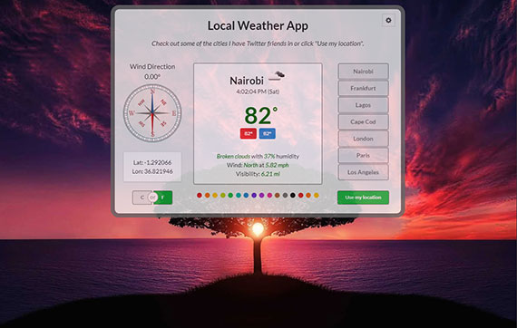](assets/images/full-size/fcc-weather5.png)

**Thoughts:** So, it took me five days to complete this once I got started but it feels like I've been working on this for weeks. Here's a list of features:

- Built with Semantic-UI for responsive layout
- Used both jQuery and standard javascript ajax to pull from the following APIs
  - freeCodeCamp weather API based on [http://openweathermap.org](http://openweathermap.org)
  - Google Maps Timezone API for local time
  - Google Maps Geolocation API (will integrate this later; currently using FCC API for geolocation)
- Created an SVG compass that uses CSS transform and rotate along with transitions to show wind direction. It also animates on mouse-over.
- Added Debug panel which uses tabbed display. It can be opened with the gear in the upper right corner
- Created a series of colored buttons to allow cycling of all background images.
- Included toggle switch for conversion of imperial and metric units of measurement.
- Lastly, had fun creating messages to Twitter friends by playing extensively with the Popup Module.

Open items / Needs
- Pre-load images
- CSS transitions between clicks

In the end it was fun and I got a lot of practical experience with js, jquery, json/ajax, css, & semantic-ui. 

---

## 50. Semantic-UI CSS framework
### Day 50: September 10, 2017 - Sunday

**Project:** Testing and evaluating Semantic-UI

**Progress:** I spent two days reading documentation and playing around with layout combinations.

**Link to Work:** Links coming in next post.

[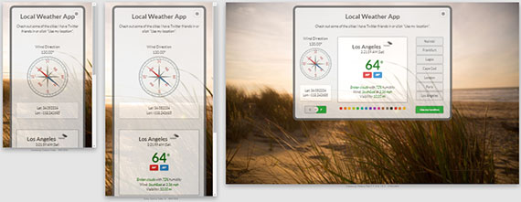](assets/images/full-size/fcc-semantic-ui-6.png)

**Thoughts:** Sematic-UI definitely gets my vote as far as a clean framework to develop from. It has semantic layout and many variations to choose from. There are quite a few components available and lots of ability for fine-grain control of behavior through js. UI features are broken down into elements, collections, views, and modules but these are all really just UI components.

One thing I can say though is that I struggled with the responsive portion for a few days before it fell into place. Now it works brilliantly and is actually very flexible without having to add any extra html elements (divs, spans, wraps, etc). I would definitely recommend this framework as a Bootstrap alternative and maybe even over bootstrap.

---

## 49. FCC Local Weather App
### Day 49: September 8, 2017 - Friday

**Project:** Build A Local Weather App from freeCodeCamp

**Progress:** So I've been working on this for 4 days. Most of the work was on writing code to use Geolocation to get JSON data back from a weather service that uses your location as input. The data that came back looked like this:

[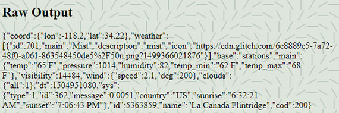](assets/images/full-size/fcc-weather2.png)

I wrote this :
[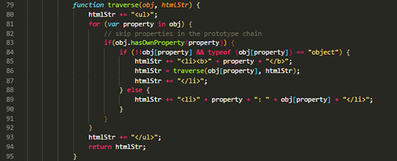](assets/images/full-size/fcc-weather4.png)

To get this:
[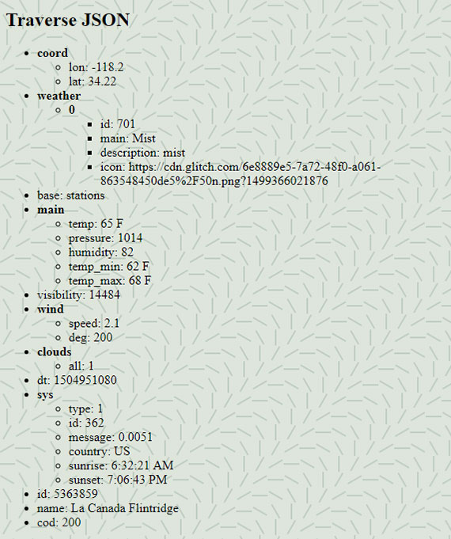](assets/images/full-size/fcc-weather3.png)

Here's short list of the things I researched for this project:
1. Iterating through an object
1. Conversion formulas
1. Frameworks including:
  - Bootstrap 3
  - Bootstrap 4
  - Bulma
  - Foundation
1. Look up jQuery methods for `$.getJSON()` and `$.ajax()`

**Link to Work:** 
- [traverse-json.html page](https://rawgit.com/james-priest/code-exercises/master/javascript_exercises/fcc/json-api-ajax/traverse-json.html)
- [traverse-json.html code](https://github.com/james-priest/code-exercises/blob/master/javascript_exercises/fcc/json-api-ajax/traverse-json.html) on GitHub

**Thoughts:** I saw some great looking weather app projects including this one [https://nawnaw7.github.io/weatherapp/](https://nawnaw7.github.io/weatherapp/) from [Nawnaw](https://twitter.com/sirbu_ioana). The code is clean and the interface is beautiful. Great use of open space.

This confirmed to me that I need to a framework in order to best layout the information. That along with images, font, icons and functionality should be all my project needs. :)

---

## 48. FCC Random Quote Generator on CodePen
### Day 48: September 4, 2017 - Monday

**Project:** Build A Random Quote Machine from freeCodeCamp

**Progress:** I built this over two days and hit some stumbling blocks when it came to using JSON. Instead I had to use the JSONP format. Here's short list of the things this project required:
1. Investigate available free quote generation web APIs
1. Look up jQuery methods for `$.getJSON()` and `$.ajax()`
1. Look up Twitter API to include a Tweet button.

**Link to Work:** [FCC Random Quote Generator](https://codepen.io/james-priest/full/RZdGNo/) on CodePen

**Thoughts:** Practiced the art of reading docs and writing code based on API documentation. I thought it would take a day to finish the project but it took longer due to the CORS security restrictions around cross-domain json. Once I got this working I practiced adding in the following:
- CSS box-shadows, transitions & blockquote formatting
- SVG backgrounds
- Use of Google fonts

[](https://codepen.io/james-priest/pen/RZdGNo/)

---

## 47. Completed FCC JSON, APIs & Ajax
### Day 47: September 2, 2017 - Saturday

**Project:** FCC JSON, APIs & Ajax section

**Progress:** Completed each exercise.

**Link to Work:** -
- [My FCC Code Portfolio](https://www.freecodecamp.com/james-priest "james-priest's code portfolio on FreeCodeCamp")
- [Sample code on GitHub](https://github.com/james-priest/code-exercises/tree/master/javascript_exercises/fcc/json-api-ajax)

**Thoughts:** Completing the JSON, API, and Ajax section was very straight forward compared to the hairpulling exercise of a couple of the algorithms challenges.

[](/assets/images/full-size/fcc-finish-json-apis-ajax.png)

---

## 46. Completed FCC Basic Algorithm Scripting
### Day 46: September 1, 2017 - Friday

**Project:** FCC Basic Algorithm Scripting

**Progress:** Completed all the challenges.

**Link to Work:** -
- [My FCC Code Portfolio](https://www.freecodecamp.com/james-priest "james-priest's code portfolio on FreeCodeCamp")
- [Sample code on GitHub](https://github.com/james-priest/code-exercises/tree/master/javascript_exercises/fcc/js-algorithms)

**Thoughts:** It took one day to figure out 15 of them and two and a half days to struggle through the remaining one - the "seek and destroy" challenge. This one killed me. I didn't want to look up the answer so I struggled through it and would tweet excessively as a distraction. (Sorry #100DaysOfCode party-ppl)

This did help to spark that diffuse mode of thinking and finally worked out. It was combining the Array.filter function with the built-in arguments object, throwing it in a loop and wrapping it all in a callback that screwed me up. (Won't make that mistake again :))

Marking up my screenshot with derogatory callouts did help me work out my frustration a bit. It helped me vent. :)

[](/assets/images/full-size/fcc-finish-basic-algorithms.png)

---

## 45. FCC Basic Algorithm Scripting
### Day 45: August 30, 2017 - Wednesday

**Project:** FCC Basic Algorithm Scripting

**Progress:** Completed first half of 12 challenges

**Link to Work:** -
- [My FCC Code Portfolio](https://www.freecodecamp.com/james-priest "james-priest's code portfolio on FreeCodeCamp")
- [Sample code on GitHub](https://github.com/james-priest/code-exercises/tree/master/javascript_exercises/fcc/js-algorithms)

**Thoughts:** I'm working through these with the examples from the Object Oriented & Functional Programming sections open in my VS Code Editor.

This has been a bit slow at times but I can tell some real learning is taking place; that point were we go from merely understanding and following a solution to creatively constructing and developing our own. It is this critical part that deeply engrains the mental patterns necessary to truly gain efficiency and then mastery of the material.

[](/assets/images/full-size/fcc-algorithms1.png)

---

## 44. FCC Object Oriented and Functional Programming
### Day 44: August 29, 2017 - Tuesday

**Project:** Completed FCC Object Oriented and Functional Programming section

**Progress:** This covered about about a dozen 30 challenges

**Link to Work:** - 
- [My FCC Code Portfolio](https://www.freecodecamp.com/james-priest "james-priest's code portfolio on FreeCodeCamp")
- [Sample code on GitHub](https://github.com/james-priest/code-exercises/tree/master/javascript_exercises/fcc/OO-and-FP)

**Thoughts:** Covered specific Array methods: concat, filter, join, map, reduce, reverse, sort & split. Also covered Object Oriented concepts such as creating objects as variables, constructing objects with functions, object instances with constructor function, passing parameters to constructor function and making object properties private.

[](/assets/images/full-size/fcc-finish-oo-and-fp.png)

---

## 43. Completed FCC Basic JavaScript Challenges
### Day 43: August 28, 2017 - Monday

**Project:** Free Code Camp Basic JavaScript challenges

**Progress:** Completed Basic JavaScript section (about 30 challenges today)

**Link to Work:** - [My FCC Code Portfolio](https://www.freecodecamp.com/james-priest "james-priest's code portfolio on FreeCodeCamp")

**Thoughts:** Covered Arrays, Multi-dimensional arrays, loops, objects, Math object, etc.

[](/assets/images/full-size/fcc-finish-basic-javascript.png)

---

## 42. FCC Basic JavaScript Challenges
### Day 42: August 27, 2017 - Sunday

**Project:** Free Code Camp Basic JavaScript challenges

**Progress:** Completed two thirds of the Basic JavaScript section (about 70 challenges today)

**Link to Work:** - [My FCC Code Portfolio](https://www.freecodecamp.com/james-priest "james-priest's code portfolio on FreeCodeCamp")

**Thoughts:** Left off on counting cards challenge. Will pick it up tomorrow.

[](/assets/images/full-size/fcc-counting-cards.png)

---

## 41. SPYCats Website on Netlify
### Day 41: August 25, 2017 - Friday

**Project:** Moved the site to Netlify

**Progress:** My FCC Personal Portfolio page morphed into the SPYCats project - A website advertising the undercover services of an elite team of cats.

**Link to Work:** [SPYCats Website](https://spycats.netlify.com/) on Netlify

**Thoughts:** I will go back and put together a personal portfolio site once I have a recent sampling of work. For now I decided to have fun with the project. I can also add more pages if I want to play with it since its on Netlify.

[](/assets/images/full-size/netlify-spycats-wide1.png)

---

## 40. FCC Personal Portfolio Project on CodePen
### Day 40: August 23, 2017 - Wednesday

**Project:** Personal Portfolio project from freeCodeCamp

**Progress:** It was slow going trying to develop on CodePen. Don't get me wrong, I love the environment but I love my code editor more.😁 (VSCode)

**Link to Work:** [FCC Portfolio Page - Bootstrap 3](https://codepen.io/james-priest/full/prpjEK) on CodePen

**Thoughts:** CodePen has some great features and I love how flexible it is. It's an awesome platform for sharing code and showcasing projects but difficult to do extensive development in.

[](https://codepen.io/james-priest/pen/prpjEK)

---

## 39. Bootstrap 3 Training
### Day 39: August 21, 2017 - Monday

**Project:** Completed [Code School](https://www.codeschool.com) class: [Blasting Off with Bootstrap](https://www.codeschool.com/courses/blasting-off-with-bootstrap).

**Progress:** Worked on this all day. It covered Bootstrap 3, CSS & Font Awesome

**Link to Work:**
- [My Code School Report Card](https://www.codeschool.com/users/james-priest)
- [Test code for Blasting Off with Bootstrap on GitHub](https://github.com/james-priest/code-exercises/tree/master/html_exercises/blasting-bootstrap)
- [Hosted Page](http://bootstrap-blast-off.netlify.com) on Netlify

**Thoughts:** This course helped tremendously on my WIP freeCodeCamp Bootstrap Portfolio project. It was just what I needed to understand the following:
- grids, offsets, and layouts
- components, glyphs, and plugins
- icons, fonts and behavior

[](http://bootstrap-blast-off.netlify.com)

---

## 38. Intermediate CSS Training
### Day 38: August 20, 2017 - Sunday

**Project:** Completed [Code School](https://www.codeschool.com) class: [CSS Cross Country](https://www.codeschool.com/courses/css-cross-country).

**Progress:** Worked on this throughout the day

**Link to Work:**
- [Code School HTML/CSS Course Path](https://www.codeschool.com/learn/html-css)
- [My Code School Report Card](https://www.codeschool.com/users/james-priest)
- [Test code for CSS Cross Country on GitHub](https://github.com/james-priest/code-exercises/tree/master/html_exercises/css-cross-country)
- [Page in browser](https://rawgit.com/james-priest/code-exercises/master/html_exercises/css-cross-country/index.html)

**Thoughts:** Worked on some of the deeper aspects of css such as:
- Specificity
- Floats, Clearfixes, & layouts
- selector best practices

[](https://rawgit.com/james-priest/code-exercises/master/html_exercises/css-cross-country/index.html)

---


## 37. HTML5 & CSS3 Basic Training
### Day 37: August 19, 2017 - Saturday

**Project:** Completed the [Code School](https://www.codeschool.com) class: [Front End Foundations](https://www.codeschool.com/courses/front-end-foundations).

**Progress:** Worked on this throughout the day

**Link to Work:**
- [Code School HTML/CSS Course Path](https://www.codeschool.com/learn/html-css)
- [My Code School Report Card](https://www.codeschool.com/users/james-priest)
- [Test code for Front End Foundation on GitHub](https://github.com/james-priest/code-exercises/tree/master/html_exercises/front-end-foundations)
- [Page in browser](https://rawgit.com/james-priest/code-exercises/master/html_exercises/front-end-foundations/magic-cake.html)

**Thoughts:** This was basic/beginning HTML/CSS but was a good refresher.

[](https://rawgit.com/james-priest/code-exercises/master/html_exercises/front-end-foundations/magic-cake.html)

---

## 36. HTML5 & CSS3 Intermediate Training
### Day 36: August 18, 2017 - Friday

**Project:** Completed the [Code School](https://www.codeschool.com) class: [Front End Formations](https://www.codeschool.com/courses/front-end-formations).

**Progress:** It took about 5-6 hours to complete. This included tutorials, typing out code exercises, creating my own code proof-of-concepts and taking quizzes & tests.

**Link to Work:**
- [Code School HTML/CSS Course Path](https://www.codeschool.com/learn/html-css)
- [My Code School Report Card](https://www.codeschool.com/users/james-priest)
- [My test code for Front End Formations on GitHub](https://github.com/james-priest/code-exercises/tree/master/html_exercises/front-end-formations)

**Thoughts:** I like the format of Code School's content. It's focused and clear.

[](/assets/images/full-size/vscode-css-colors.png)

---

## 35. FCC Personal Portfolio with Bootstrap 3
### Day 35: August 16, 2017 - Wednesday

**Project:** - FCC Personal Portfolio Webpage project

**Progress:** Switched to Bootstrap 3
- Created new Pen using Bootstrap 3
- Worked on Responsive/Collapsible Menu

**Link to Work:**
- [FCC Portfolio Page - Bootstrap3](https://codepen.io/james-priest/pen/prpjEK)

**Thoughts:** I had to play with Bootstrap and reference the docs and samples a lot in order to get things working.

Where I had trouble was in trying to change Bootstraps 3's structural format by eliminating unnecessary elements. I wanted to reduce Bootstrap's element clutter by removing unnecessary div elements and making the HTML more semantic by attaching class names to HTML5 elements. Things like changing divs to header, section, and article elements.

This didn't work so well so I changed back to the div heavy structure.

[](https://codepen.io/james-priest/pen/prpjEK)

---

## 34. FCC Personal Portfolio with Bootstrap 4
### Day 34: August 15, 2017 - Tuesday

**Project:** - FCC Personal Portfolio Webpage project

**Progress:** - Started with Bootstrap 4
- Added Bootstrap 4 css
- Added Bootstrap 4 js
- Worked on Responsive/Collapsible Menu with limited success

**Link to Work:**
- Created multiple Pens to test Bootstrap in CodePen
  - [FCC Portfolio Page - Bootstrap4](https://codepen.io/james-priest/pen/zdPdVP)
  - [Bootstrap4 Jumbotron](https://codepen.io/james-priest/pen/Ojzygj)

**Thoughts:** It seems the code samples are not collapsing properly for the responsive menu. I played with this for a while before deciding to switch to Bootstrap 3. I enjoy the challenge of debugging and fine-tuning html/css but I think I'll wait until Bootstrap 4 is no longer in Alpha to use it on "production" assignments.

---

## 33. FCC Tribute Page
### Day 33: August 14, 2017 - Monday

**Projects:**
- Finished FCC Tribute Page on CodePen.io

**Progress:**
- Knocked it out in a night without too much trouble. 😌

**Link to work:**
- [https://codepen.io/james-priest/pen/MvEdOV?editors=1100](https://codepen.io/james-priest/pen/MvEdOV?editors=1100)

**Thoughts:** Could have used bootstrap. Instead I hand-coded the css.

[](https://codepen.io/james-priest/pen/MvEdOV?editors=1100)

---

## 32. Node.js HTTP Server
### Day 32: August 13 2017 - Sunday

**Projects:**
- Setup a Node.js http server for running web apps locally

**Progress:**
1. Installed simple http-server: `npm install http-server -g`
1. Ran server from local directory `http-server . -p 8000`
1. Tested web app

**Link to work:**
- [https://threejs.org/docs/#manual/introduction/How-to-run-thing-locally](https://threejs.org/docs/#manual/introduction/How-to-run-thing-locally)

**Thoughts:** Found a great article on the [http://threejs.org](http://threejs.org) site that showed how to get a local http server running with any one of the following technologies:

- Python
- Ruby
- PHP
- Node.js
- lighttpd

Use the link on **Link to work:** to read the article

---

## 31. Debug JS with Node in VSCode
### Day 31: August 12 2017 - Saturday

**Projects:**
- Debug js code from within Visual Studio Code

**Progress:**
1. Set up Node debug configuration
1. Configured launch.json file
1. Set breakpoints
1. Ran debugger and stepped through code

**Link to work:**
- [https://github.com/james-priest/code-exercises/blob/master/javascript_exercises/js-internals/vm-internals.js](https://github.com/james-priest/code-exercises/blob/master/javascript_exercises/js-internals/vm-internals.js)
- [https://code.visualstudio.com/docs/editor/debugging](https://code.visualstudio.com/docs/editor/debugging)

**Thoughts:** Debugging from within VSCode is absolutely essential to tracking down errors and evaluating code during execution.

[](https://code.visualstudio.com/docs/editor/debugging)

---

## 30. WordPress Site
### Day 30: August 11, 2017 - Friday

**Project:**
- Setup a WordPress site for a blog on the 100 Days of Code challenge

**Progress:**
1. Registered for an account
1. Chose a theme
1. Customized the template (sidebar, header & footer)
1. Wrote my first post!

[](https://100daycodeblog.wordpress.com/)

**Link to work:**
- [https://100daycodeblog.wordpress.com/](https://100daycodeblog.wordpress.com/)

**Thoughts:** So all of this took me 3-4 hours (off and on) and an entire day to do but it's done.😁

While writing a WordPress blog is not something I thought I'd do I am glad I've started the process.  Writing a blog is a surefire way of letting prospective employers know about your mastery, skill set and breadth of knowledge.

I was actually inspired to do a WordPress blog by [@AdrianaHasburn](https://twitter.com/AdrianaHasbun) while reading her [Process to CSS Images](http://adrianahasbun.com/css/the-process-to-css-images) post. (Thanks Ariana!)

---

## 29. Chrome DevTools and Source Maps
### Day 29: August 10, 2017 - Thursday

**Project:**
- Setup for Chrome DevTools

**Progress:**
- Read sections on:
  - Code Editor Setup - They recommend Sublime/I use VSCode
  - Persistence with DevTools Workspaces - Setting up source file mapping allows code changes to persist to source files
  - CSS & JS Preprocessors - Using Source Maps allow direct references to preprocessed source files for saving changes directly from DevTools

[](https://developers.google.com/web/tools/setup/)

**Link to work:**
- Link to [DevTools Getting Started Docs](https://developers.google.com/web/tools/setup/)

**Thoughts:** I learned how to effectively use Chrome DevTools as part of my debug process. The combination of VSCode with Chrome DevTools gives me the type of end-to-end control that Visual Studio 2017 provides for back end development.

---

## 28. JS Closures & Variable Scope
### Day 28: August 8, 2017 - Tuesday

**Progress:**
- My goal was to create an object literal that contained a recursive function wrapped in a closure.
- Worked on this for days before I got it right!

```javascript
// my five year old nephew's favorite joke...
var comedian = {
    pauseReps: 3,
    pauseTime: 2000,
    setupJoke: function() {
        console.log("What's invisible and smells like carrots...");
    },
    timeThePunchLine: function () {
        var pauseRep = this.pauseReps;
        var pauseTime = this.pauseTime;
        var punchLine = this.punchLine;

        function timeoutHandler() {
            if (pauseRep == 0) {
                console.log(punchLine());
                return;
            } else {
                console.log(".");
                pauseRep--;
                setTimeout(timeoutHandler, pauseTime);
            }
        }

        timeoutHandler();
    },
    punchLine: function() {
        return "bunny farts.😲😂😐";
    }
};

var myNephew = comedian;
myNephew.setupJoke();
myNephew.timeThePunchLine();
```

**Link to work:** [https://codepen.io/james-priest/pen/EvydgE?editors=1011](https://codepen.io/james-priest/pen/EvydgE?editors=1011)

**Thoughts:** I read three articles by Kirupa ([@Kirupa on Twitter](https://twitter.com/kirupa)) of [http://www.kirupa.com](http://www.kirupa.com) that helped explain the concepts I needed to have down before successfully combining closures with object literals, recursion, variable hoisting, and scope chaining. They were from the [Learn JavaScript 101](https://www.kirupa.com/javascript/learn_javascript.htm) section of the site. These were:

- [Variable Scope in JavaScript](https://www.kirupa.com/html5/variable_scope_js.htm)
- [Variable and Function Hoisting](https://www.kirupa.com/html5/hoisting.htm)
- [Closures in JavaScript](https://www.kirupa.com/html5/closures_in_javascript.htm)

I also got syntactic help from [https://stackoverflow.com/questions/25889950/settimeout-and-recursive-function-with-parameters](https://stackoverflow.com/questions/25889950/settimeout-and-recursive-function-with-parameters).

---

## 27. GitHub Page for my 100DaysOfCode log
### Day 27: August 6, 2017 - Sunday

**Progress:**
- Updated CSS, jQuery, and Jekyll HTML template

**Link to work:**
- [https://james-priest.github.io/100-days-of-code-log/](https://james-priest.github.io/100-days-of-code-log/)

**Thoughts:**
- Needed to come up with a way of expanding the nav to accommodate a long TOC
- Updated nav css overflow to accommodate scroll

---

## 26. Jekyll, jQuery, & FontAwesome
### Day 26: August 5, 2017 - Saturday

**Projects:**
- Updated GitHub Page for my Resume/CV site

**Progress:**
- Added jQuery Nav
- Added FontAwesome for social media profile links & icons
- FontAwesome for nav pointer (breadcrumb)
- Updated CSS to indicate active link

[](https://james-priest.github.io/)

**Link to work:**
- [https://james-priest.github.io](https://james-priest.github.io/ "My online CV")

**Thought:**
- Used jQuery for on-page navigation; dynamic building of the TOC & for basic usability: breadcrumbs highlights, etc.

---

## 25. Objects, Expressions & Closures, Oh My!
### Day 25: August 3, 2017 - Wednesday

**Today's Challenge:**
- I set out to define different JavaScript constructs that incorporate recursion, setTimeout, and a closure.

**Progress:**
- Set up two test environments for tracing and debugging
  - CodePen for quick proof-of-concept testing
  - VSCode to run Node & step through code using debugger.

**Link to work:**
- [CodePen - setTimeout Patterns](https://codepen.io/james-priest/pen/jLmxvZ "https://codepen.io/james-priest/pen/jLmxvZ")
- [GitHub - setTimeout-patterns.js](https://github.com/james-priest/code-exercises/blob/master/javascript_exercises/design-patterns/closure/setTimeout-patterns.js)

**Thoughts:** This was not easy.😓 I initially wrote this as a Pen but needed additional debug info to trace scope so I also ran this with Node in the integrated Bash terminal I have going inside of VSCode.

I had read a great post from [@Kirupa](https://twitter.com/kirupa) that discussed IIFEs & scope. [Kirupa: Immediately Invoked Function Expressions a.k.a IIFEs](https://www.kirupa.com/html5/immediately_invoked_function_expressions_iife.htm)

Example 1: setTimeout in IIFE

```javascript
var reps = 3;

(function doStuff() {
    if (reps == 0)
        return;
    console.log(reps);

    reps--;
    setTimeout(doStuff, 1000);
})();
```

Example 2: setTimeout in object literal

```javascript
var obj2 = {
    count: 3,
    repeat: function () {
        // bring vars down here so inner function can contain the variable count in it's closure scope
        var enclosedCount = this.count;

        function doSomething() {
            if (enclosedCount == 0) {
                return;
            } else {
                console.log(enclosedCount);
                enclosedCount--;
                setTimeout(doSomething, 1000);
            }
        }

        doSomething();
    }
};

var inst = obj2;
inst.repeat();
```

Example 3: setTimeout in function expression

```javascript
var myFunc = function () {

    var outer = 3;

    function doStuff() {
        var inner = 3;
        if (outer == 0) {
            return;
        } else {
            for (; inner> 0; inner--) {
                console.log("in: " + inner);
            }
            console.log("outer: " + outer);
            outer--;
            setTimeout(doStuff, 1000);
        }

    }

    doStuff();
    return "done"; // occurs after first loop completes. Use Async?
};

var doIt = myFunc();
console.log(doIt);
```

---

## 24. CodePen Lesson!
### Day 24: August 2, 2017 - Wednesday

**Today's Project(s):**
- Creating some proof of concept pens and testing out the environment

[](https://codepen.io/james-priest/pen/PKmMzP?editors=1111)

**Progress:**
- Set up my profile
- Created two test pens & a prototyping pen
  - saved all progress
  - had one pen open in two different tabs (my bad); closed one tab & saved the other
  - overwrote my work by saving "wrong" tab. 😠😭

So I rewrote the proof-of-concept code from memory.

**Link to work:**
- [https://codepen.io/james-priest/pen/PKmMzP?editors=1011](https://codepen.io/james-priest/pen/PKmMzP?editors=1011)

**Thoughts:** So, I learned that CodePen doesn't have version control. This makes me real careful and deliberate with my changes.

In the end it turned out fine. By re-coding the exercise I inadvertently ended up employing a learning technique called Spaced Repetition.😁

---

## 23. JSBin vs. Plunker vs. CodePen
### Day 23: Aug 1, 2017 - Tuesday

**Today's Project(s):**
- Evaluated JSBin, Plunker and CodePen.

**Progress:**
- Set up accounts in each
- Created Gists from which to save and pull my code
- Tested out each code environment 

**Link to work:**
- [JSBin](http://jsbin.com/?html,js,output)
- [Plunker](https://plnkr.co/edit/?p=catalogue)
- [CodePen](https://codepen.io/)

**Thoughts:** Here are my two cents...

[](http://jsbin.com/howuzec/3/edit?html,js,output)
**JSBin** - This is my goto js playground for testing syntax & short proof-of-concepts
- Pros
  - quick setup
  - Console tab is predominantly featured - great for quick debug
  - version control - multiple snapshots
- Cons
  - AutoSave and snapshots are clunky to use/administer; they require manual steps to keep organized
  - Gists don't import/export right
  - loading & switching bins is slow & errs at times
  - collaboration does not work as advertised
  - less used features are not/is not inherently intuitive.
  - editor is limited to one html, css & js file

[](https://plnkr.co/edit/O73CdaJyTJenpBshvjzR?p=info)
**Plunker** - great multi-file environment
- Pros
  - Editor is spacious
  - can have multiple js, css, html & md files in a plunk
  - saved templates, multiple libraries, integrated gitter, live preview
  - multiple js frameworks available
  - version control, linting, chat, toolbox, and collaboration
- Cons
  - no integrated Console

[](https://codepen.io/james-priest/pen/jLmxvZ)
**CodePen** - great UX (fully featured experience)
- Pros
  - Intuitive and configurable ui
  - Pen or Project based workspace
  - clean & focused documentation
  - great social factor - huge community, profile setup & ability to post
- Cons
  - no version control - easy to overwrite saved version with old version

Beyond what I listed, CodePen is designed right. It just works - it "feels" good to use, its responsive, it's intuitive, and it's robust which means it doesn't seem to choke as easily as some others.

In the end, it's the design that makes CodePen attractive.

>"Design is how something works, not what it looks like." - Steve Jobs

---

## 22. JavaScript VM Internals
### Day 22: July 31, 2017 - Monday

**Today's Project(s):** Watched Arindam Paul's YouTube vid: [JavaScript VM Internals, Event loops, Async and Scope Chains](https://youtu.be/QyUFheng6J0)

**Progress:** Followed along with the video and coded the proof of concepts 

**Link to work:**
- [https://github.com/james-priest/code-exercises/tree/master/javascript_exercises/js-internals](https://github.com/james-priest/code-exercises/tree/master/javascript_exercises/js-internals)

**Thoughts:** JavaScript goes through a two phase process when a program is run. Phase one is the _compilation phase_ and phase two is the _execution phase_. The compiler actually alternates between these two phases as it digs deeper into nested functions. These nested function environments are referred to as _local scope_ or _lexical scope_ (The scope of the variable can be defined by its position in the source code).

When JavaScript goes through the _compilation phase_ it actually just extracts out declarations - the variable declarations and the function declarations (the value doesn't matter at this point). It moves them to the top of the code block and then prepares the memory so that it can execute the code. It is through this extraction that variable hoisting occurs.

Let's look at this example...

(column 1 & columns 3: _compilation phase_; column 2 & column 4: _execution phase_)

```javascript
 1 var a = 2;             // Global Scope (Window)
 2 b = 1;                 // a | a=2    |   |
 3                        // f | f="λf" |---|------> Lambda "f"
 4 function f(z) {        //   | b=1    |   | b=3    ('b' created at runtime)
 5     b = 3;             //   |        |   | c=4
 6     c = 4;             // ------------------------
 7     var d = 6;
 8     e = 1;             // Local execution scope for f()
 9                        // z | z=1    |   |
10     function g() {     // d | d=6    |   | d=18
11         var e = 0;     // g | g="λg" |---|------> Lambda "g"
12         d = 3 * d;     //   | e=1    |   |
13         return d;      // ------------------------
14     }
15                        // Local execution scope for g()
16     return  g();       // e | e=0
17     var e;             // ------------------------
18 }
19
20 f(1); //18
```

The compiler goes through the global scope, extracts the declarations `a` and `f` (column 1). It does not know what `b` is referring to at this point so it skips it. It then checks `f` for syntax, saves the contents of `function f` as a string blob - `Lambda "f"`, and then skips to line 18. This concludes the _compilation phase_ which then immediately kicks off the _execution phase_. This is where values are assigned to `a` and `f`. `b` is created at runtime and assigned a value as well (column 2).

Code execution continues onto line 20, `function f` is executed and the compiler creates a memory allocation in heap for `f` which can be thought of as a _local execution context_. This is where it enters into `f` and starts the _compilation phase_ once again. As soon as the compiler sees `z` as the function parameter, it declares it as a local variable. `b` and `c` are skipped over and `d` is declared. `e` is skipped and `g` is declared. Finally `e` on line 17 is declared before the _execution phase_ begins. This declaration of `e` is an example of variable hoisting because it occurs after the assignment in code but is actually _hoisted_ to be declared before execution. This concludes the _compilation phase_ for `f`.

We now enter the _execution phase_ for `f`. The first thing that happens is the value passed to `f` is assigned to the variable declaration `z`. JavaScript then encounter an assignment to `b` which it has no local reference to. It then checks it's stack pointer back to the parent function to see if `b` exists there (which it does) and then happily assigns `b` the new value of 3.

During the _execution phase_ JavaScript will follow the pointer chain all the way back to global scope looking for the referenced variable regardless of how many scope chains it has to go through. If it finds the variable before reaching global scope it will assign the value. If not, it will create the variable in global scope and then assign the value. This is what happens with variable `c` during execution.

Next, `d` is assigned the value of 6 followed by `e` being assigned the value of 1. `g` is then assigned the contents of `function g` as a string blob before line 16 is reached where the code says, "function g, execute self". At this point a heap memory allocation is created as a _local execution context_ for `g`. We then enter the _compilation phase_ for `g`. 

At this point the _compilation phase_ for `g` creates a pointer back to the _local execution scope_ for `f`. `e` is declared and that is all that happens in the _compilation phase_ for `g`.

The _execution phase_ for `g` looks for a local reference to `d` which it does not find so it goes up the scope chain and finds it it in the lexical scope of `f`. It then assigns `d` the value of 18 before hitting line 13 where it actually returns the value of  `d` which is 18. Execution context then continues to line 16 where `g()` is replaced with the value 18 which is then returned back to `f(1)` on line 20.

After F of 1 is done there is no reachability or reference to anything other than the Global scope. In JavaScript, if you have an object, or a function definition, or a function execution, or any other type of thing, if you do not have a way to reach it, it will be garbage collected.

---

## 21. JS Namespace Patterns
### Day 21: July 30, 2017 - Sunday

**Progress:**
- Practiced creating various namespace objects
- Created namespace objects with different singleton conventions

```javascript
// Option 1
var myApp = myApp || {};

// Option 2
if (!myApp) { myApp = {}; }

// Option 3 - useful only in a parameter/argument scenario
window.myApp || (window.myApp = {});

// Option 4 - jQuery plug-in
var myApplication = $.fn.myApplication = function () { };

// Option 5 - Long form (unnecessary)
var myApplication = myApplication === undefined ? {} : myApplication;
```

**Link to work:**
- [https://github.com/james-priest/code-exercises/tree/master/javascript_exercises/design-patterns/namespace](https://github.com/james-priest/code-exercises/tree/master/javascript_exercises/design-patterns/namespace)

**Thoughts:** Played with six different namespace design patterns. These incorporated a Singleton pattern to ensure one (and only one) instance is ever created. Some used coercion to test if an instance already existed, some instantiate an empty object and add properties to the object after the fact. Some define/declare the entire namespace object as an object literal. Some use IIFEs to immediate invoke and return  an object.

---

## 20. Singleton Design Pattern with IIFEs
### Day 20: July 28, 2017 - Friday

**Today's Project(s):**
- Singleton pattern using Immediately Invoked Function Expression (IIFE)

**Progress:**
- Read [The Singleton Pattern](https://addyosmani.com/resources/essentialjsdesignpatterns/book/#singletonpatternjavascript) in Addy Osmani's Essential JavaScript Design Patterns.

**Link to work:**
- [https://github.com/james-priest/code-exercises/blob/master/javascript_exercises/design-patterns/singleton/global-instance-iife.js](https://github.com/james-priest/code-exercises/blob/master/javascript_exercises/design-patterns/singleton/global-instance-iife.js)

**Thoughts:** Read a great post by [@kirupa](https://twitter.com/kirupa "Twitter profile") of [http://kirupa.com](http://kirupa.com) called [Immediately Invoked Function Expressions (aka IIFE)](https://www.kirupa.com/html5/immediately_invoked_function_expressions_iife.htm)  this is part of his site's [Learning JavaScript 101](https://www.kirupa.com/javascript/learn_javascript.htm) section.

Writing the function by following a pattern is pretty straight forward.  The key is to
1. understand what's going on under the hood
1. know when to use it
1. know why you're using it

Here are the key take-aways about IIFEs from @kirupa:
- The function executes in its own bubble. It comes into existence, does its work, and then disappears. No reference is created to the function so there's no way to access it after execution.
- An IIFE leaves behind no evidence of its existence after it has run. This is largely because IIFEs are anonymous functions that are nameless.
- Because the code runs in it's own function scope it's protected from accidental modification by code outside of it.
- IIFEs are great for protecting the IIFE code from the rest of your js, but they don't stop your IIFE code from wreaking havoc on the code outside of your IIFE.
- It executes immediately. No waiting time and no instantiating a var to then invoke the function with.
- Side Note: The reason the function executes immediately is because the compiler is ~~tricked~~ told to treat the function, which is normally just a _declaration_, as an _expression_.
- There are ways other than using wrapping parentheses to reach a valid point in the grammar so that your function is treated as an expression. (Although, parens should be used for readability since they are the convention)
  - void function(e){ console.log(e) }('hi')
  - !function(e){ console.log(e) }('hi')
  - typeof function(e){ console.log(e) }('hi')

[](/assets/images/full-size/vscode-singleton-iife.png)

---

## 19. JS Object Literals
### Day 19: July 27, 2017 - Thursday

**Today's Project(s):**
- Object literals

**Progress:**
- Created three types of objects using object-literal notation.

**Link to work:**
- [https://github.com/james-priest/code-exercises/tree/master/javascript_exercises/design-patterns/object-literals](https://github.com/james-priest/code-exercises/tree/master/javascript_exercises/design-patterns/object-literals)

**Thoughts:** Object literals are a beautiful way to organize your code. It uses key/value pairs and nests well for deeper hierarchies. It also reads well and is easy to understand if structured properly.

[](/assets/images/full-size/vscode_object_literals.png)

---

## 18. Npm, packages and scripts
### Day 18: July 26, 2017 - Wednesday

**Today's Project(s):** Set up a js project environment

**Progress:**

- set up a `package.json` file through `npm init`
- added dev-only and runtime packages through `npm install --save-dev` and `npm install`
- used `npm uninstall` and `npm update`
- created _build_, _test_, _prepublish_ and _flow_ scripts
- used `npm run`

**Link to work:**
- [https://github.com/james-priest/code-exercises/blob/master/package.json](https://github.com/james-priest/code-exercises/blob/master/package.json)

**Thoughts:** I love npm and its documentation. Organized well. Super simple. Intuitive.

---

## 17. Flow testing
### Day 17: July 25, 2017 - Tuesday

**Today's Project(s):**
- Flow JavaScript type checker

**Progress:**
- Completed installation & testing

**Link to work:**
- [https://github.com/james-priest/code-exercises/tree/master/javascript_exercises/flow](https://github.com/james-priest/code-exercises/tree/master/javascript_exercises/flow)

**Thoughts:**
- Flow was put out by Facebook and it allows static type checking of JavaScript code as well as a deeper capability to make smart decisions by understanding the code at a deeper level.

---

## 16. ESLint testing
### Day 16: July 24, 2017 - Monday

**Today's Project(s):**
- ESLint - config, fine-tune, & test

**Progress:**
- installed globally and as a dev dependency
  - `npm install -g eslint@latest`
  - `npm install eslint@latest --save-dev`
- created `.eslintrc.json` in script `./src` directory and a global config in my home directory
  - `eslint --init`
- run
  - `eslint a.js`
- installed VSCode ESLint extension
- Test Playground: [http://eslint.org/demo/](http://eslint.org/demo/)

**Link to work:**
- [https://github.com/james-priest/code-exercises/tree/master/javascript_exercises/linting#eslint](https://github.com/james-priest/code-exercises/tree/master/javascript_exercises/linting#eslint)

**Thoughts:** This was the third linter I tried and looks to be the most flexible. I like the extensibility capabilities and ability to choose between various different style guides.

---

## 15. JSHint testing
### Day 15: July 23, 2017 - Sunday

**Today's Project(s):**
- Linting with JSHint

**Progress:**
- installed globally
  - `npm install -g jshint@latest`
- created `.jshintrc` in my home directory & `./src` directory
  - configured using [docs](http://jshint.com/docs/options/) and this [reference](https://github.com/jshint/jshint/blob/master/examples/.jshintrc)
- run
  - `jshint a.js`
- installed VSCode JSHint extension
- [http://jshint.com](http://jshint.com) has a configurable code test playground on the homepage

**Link to work:**
- [https://github.com/james-priest/code-exercises/tree/master/javascript_exercises/linting#jshint](https://github.com/james-priest/code-exercises/tree/master/javascript_exercises/linting#jshint)

**Thoughts:**
- Configuring JSHint required that I learn & understand the various JavaScript pitfalls developers run into so I can understand why each recommendation is made by JSHint. Things like no `for..in` iterators, use of the `new` keyword and `"option strict"` for functions.
- [http://jshint.com](http://jshint.com) has a configurable code test playground on the homepage for quick code block tests

---

## 14. JSLint testing
### Day 14: July 21, 2017 - Friday

**Today's Project(s):**
- JSLint command line linting

**Progress:**
- Did an npm global install.

**Link to work:**
- [https://github.com/james-priest/code-exercises/tree/master/javascript_exercises/linting#jslint](https://github.com/james-priest/code-exercises/tree/master/javascript_exercises/linting#jslint)

**Thoughts:** This is the granddaddy of them all and was originally written by Douglas Crockford in 2002 with the latest stable version released in 2011. It offers no config and is highly opinionated as to what "The Good Parts" are. See [JavaScript: The Good Parts](http://bdcampbell.net/javascript/book/javascript_the_good_parts.pdf "Book in pdf"). Still, this is the staple linter to use if you are just starting out and want to see where it all began. Simple install. No configuration needed.

---

## 13. Jekyll Build Environment
### Day 13: July 20, 2017 - Thursday

**~~Today's~~ Last Week's Project(s):**

- Created Jekyll Build Environment on Ubuntu 16.04. This is for testing locally before committing changes to GitHub Pages.

**Progress:**

- Completed the following
  1. Spun up a Linux VM
  1. Installed, configured & updated Ubuntu
  1. Installed Nodejs, NPM, Git, Ruby, RubyGems, Bundle, Jekyll, Visual Studio Code & Chrome
  1. Cloned my Personal Page repo from GitHub
  1. Started Jekyll server - `bundle exec jekyll serve` - this watches for changes to code or content and rebuilds the site when it detects any. It also runs a lightweight http server to view changes on the fly. Pretty cool!
  1. Started local development & testing

**Link to work:**

- [README.md](https://github.com/james-priest/james-priest.github.io/blob/master/README.md "Link to GitHub README.md") from my Personal Page. This is the raw source that the template engine uses to build the site.
- [Generated Site](http://james-priest.github.io "Link to my GitHub Personal Page") This is the Jekyll static site that's generated on GitHub whenever I update, commit and push my README.md.

**Thoughts:**

- This was a good exercise in building a complete end-to-end dev solution.
- I started with `jekyll-theme-leap-day`, one of GitHub's officially supported templates and made modifications to the html, css, & javascript.
- This also gave me a good opportunity to practice Bash shell scripting, npm package management and VS Code plug-in configuration

---

## 12. Finished jQuery on FCC
### Day 12: July 12, 2017 - Wednesday

**Today's Project(s):**

- Free Code Camp exercises - jQuery manipulation of DOM

**Progress:**

- Steady... I finished the jQuery section today

**Link to work:**

- [My FCC Code Portfolio](https://www.freecodecamp.com/james-priest "james-priest's code portfolio on FreeCodeCamp")

**Thoughts:**

- I've now finished up the following FCC sections:
  - HTML5 and CSS
  - Responsive Design with Bootstrap
  - jQuery
- Next are the two Front End Development Projects to test the skills learned. These are:
  - Build a Tribute Page
  - Build a Personal Portfolio Webpage

---

## 11. Windows 10, Ubuntu 16.04, Jekyll, & GitHub Pages
### Day 11: July 9, 2017 - Sunday

**~~Today's~~ This Week's Project(s):**

- FCC Code Challenges
- Created GitHub personal page
  - Cloned repo
  - Followed this process: _work locally, push changes, review & repeat..._
  - Decided to get the Jekyll static site generator runnung locally so I don't have to push changes live in order to view/test them
  - Docs said to enable Bash on Ubuntu on Windows 10... I'm running a highly customized Windows 8.1. 😣
- Upgraded VMware Workstation to version 12.5.7
- Upgraded virtual instance of Ubuntu 9.10 to 14.04
  - this upgrade choked miserably and required lots of manual fixes
  - had to fix bootloader
  - reset passwords
  - reinstall display drivers, etc...
- Installed FRESH copy of Ubuntu 16.04 in a VM - all went well 😅
- Installed a fresh copy of Windows 10 Pro Creators update in a VM - so far so good 😊
- Sync'd bookmarks across browsers (Chrome, FF, Edge, Safari) and platforms (Win, Linux, Mac) with [Xmarks](http://xmarks.com)
  - This plugin is awesome. It works with the synchronization that Google, Microsoft & Firefox do within their browsers but you have to turn off bookmark sync for theses and let Xmarks do the Bookmark sync. I run many VMs so this works great to keep everything in check.
- Windows 7 VM
  - Streamlined OS - removed hibernation and paging. Returned them after defragmentation of virtual disk
  - Uninstalled unnecessary applications, removed duplicate data and removed old snapshots for smaller disk footprint
  - Reduced vmdk (virtual disk) size to reclaim space
- Ubuntu 16.04 VM
  - Installed & updated all default packages
  - installed vmware tools for host/guest OS integration
  - apt-got git, ruby, rubygems, jekyll and nodejs 😉
  - now I'm ready to clone my GitHub portfolio page and go to town
- Windows 10 VM
  - Researched, installed, & configured OS features. Now I'm testing, modifying and evaluating.
  - Holding off on upgrading host OS until I can make sure all 8.1 customizations will transfer/upgrade gracefully.
  - Enabled _Developer mode_ in VM hosted instance of Win 10
  - Installed `Windows Subsystem for Linux` which is basically an Ubuntu-based Bash shell for Windows. Yay! 👏😍

**Progress:**

- Continued jQuery DOM manipulation exercises of FCC
- Started online portfolio / resume / profile on GitHub

**Link to work:**

- [My FCC Code Portfolio](https://www.freecodecamp.com/james-priest "james-priest's code portfolio on FreeCodeCamp")
- My Online Resume and personal page: [https://james-priest.github.io/](https://james-priest.github.io/)

**Thoughts:**

- Getting my personal GitHub page going was way more involved than I thought it would be. To be fair, it's very straight forward to choose a theme and set up a personal page on GitHub. Customizing requires a bit more. Here are the steps I took:
   1. Created a repo for my personal account profile page and named it `james-priest.github.io`.
   1. Went into Settings for that repo and turned on GitHub Pages and chose a theme.
   1. Modified the README.md
- So far so good! This would have been it if I didn't need a higher level of customization. Fortunately, GitHub provides [very clear docs](https://help.github.com/articles/using-jekyll-as-a-static-site-generator-with-github-pages/ "Using Jekyll as a static site generator with GitHub Pages") on how to modify the CSS (scss), HTML, and create a local dev environment with Jekyll - a Ruby-based static site generator. This allows you to modify and preview without a commit to GitHub for each change. So here are the remaining steps:
  1. Upgrade my OS to Win10 to use the integrated bash shell
  1. Install ruby, gems, git & jekyll
  1. Clone repo & then it's: modify (VS Code), build (Jekyll), test (local) & deploy (git) 
- I'll finish those this week.

---

## 10. GitHub Page for this log
### Day 10: July 4, 2017 - Tuesday

**Today's Project(s):**

- Created GitHub Page for this repo and code log
- Watched [Intro to ASP.NET Core 1.1](https://mva.microsoft.com/en-US/training-courses/introduction-to-asp-net-core-1-0-16841) on Microsoft Virtual Academy

**Progress:**

- Completed the setup of a GitHub Page for this log
- Got about halfway through Intro ASP.NET Core training

**Link to work:**

- [100 Days of Code Log GitHub Page](https://james-priest.github.io/100-days-of-code-log/)  (this page)

**Thoughts:**

Created the GitHub Page through GitHub. It uses Jekyll and one of the pre-built templates. It also add a yaml file. I may look into how to modify the template in order to correct for limited number of links on the sidebar as well as modification of the top nav bar

The Intro to ASP.NET Core class is great. It's hosted by Scott Hanselman and Maria Naggaga. I love both of them. I can't wait to finish the FCC Front End Development cert so I can switch to .NET Core Back End with C#.

---

## 9. JavaScript Array Methods
### Day 9: July 2, 2017 - Sunday

**Today's Project(s):**

- javascript-array-methods - Vanilla JavaScript project to show what each JS Array object method does
- FCC Code Challenges

**Progress:**

- Completed migration of javascript-array-methods v1.0.0 to GitHub
- Started jQuery selector section of FCC

**Link to work:**

[](http://javascript-array-methods.netlify.com/)

- [JavaScript Array Methods](https://github.com/james-priest/javascript-array-methods "GitHub repo") on  GitHub - click image to see demo
- [My FCC Code Portfolio](https://www.freecodecamp.com/james-priest "james-priest's code portfolio on FreeCodeCamp")

**Thoughts:** Finally good to get the JavaScript Array Methods app up on GitHub. Next I need to modify it to use Bootstrap and Objects to hold data rather than arrays.

---

## 8. Code & Dev activities
### Day 8: June 30, 2017 - Friday

**~~Today's~~ Last Week's Project(s):**

- FCC Code Challenges
- Received and accepted an invitation to join [**DWYL**](https://github.com/dwyl "Do What You Love") on GitHub
- Added projects and people to my [Stars](https://github.com/james-priest?tab=stars) & [Following](https://github.com/james-priest?tab=following) tabs on GitHub
- Signed up for [Netlify](http://netlify.com) - they host static sites through CLI deploy. npm install and deploy any repo
- Researched Back End learning path and decided on .NET Core since its going to be the high💲dollar💲 technology for 2018. Read the ASP.NET Core [prediction](https://stackify.com/net-core-csharp-next-programming-language/ "Why .NET Core and C# are the Next Big Thing") about how it will be the next big thing. I also know & love the MS development environment.
- Retooled my dev environments:
  - Updated Visual Studio 2017 to Enterprise and v15.2
  - Got my VS Code plugins in line
  - Installed [notepad2](https://xhmikosr.github.io/notepad2-mod/) (great notepad replacement)
- Evaluated many of the Code Playgrounds out there to solve for two needs:
  - having a place to test code as I go through tutorials
  - having a place to organize and  host samples of work
- Decided to set up a [GitHub repo](https://github.com/james-priest/code-exercises "code-exercises") to contain my source code instead. I'll still use JSBin for quick JS, ES6 and TypeScript tests.
- Created additional repos to migrate my test projects to:
  - [code-exercises](https://github.com/james-priest/code-exercises)
  - [javascript-array-methods](https://github.com/james-priest/javascript-array-methods)
  - [web-calculator](https://github.com/james-priest/web-calculator)
- Researched [Open Source Friday](https://opensourcefriday.com/), [FirstTimersOnly](http://www.firsttimersonly.com/) movement and [How to Contribute](https://opensource.guide/how-to-contribute/ "") in Open Source
- Got caught in a rabbit hole of learning regarding JavaScript concepts, HTML5 api features & Google Web articles. Covered the following:
  - [Functional Composition](https://medium.com/javascript-scene/master-the-javascript-interview-what-is-function-composition-20dfb109a1a0 "Master the JavaScript Interview: What is Functional Composition?")
  - [Closures](https://medium.com/javascript-scene/master-the-javascript-interview-what-is-a-closure-b2f0d2152b36 "Master the JavaScript Interview: What is a Closure?")
  - [Hoisting](https://dev.to/imwiss/understanding-hoisting-in-javascript "Understanding Hoisting in JavaScript")
  - [Service Workers](https://developers.google.com/web/fundamentals/getting-started/primers/service-workers "Service Workers: An Introduction") or Web Workers
  - [Promises](https://developers.google.com/web/fundamentals/getting-started/primers/promises)
  - App Cache, Local Storage, Sessions Storage, IndexedDB & Web SQL
  - [Chrome Dev Tools](https://developers.google.com/web/tools/chrome-devtools/)
  - Researched Google's [Material Design](https://material.io/guidelines/material-design/introduction.html "Introduction to Material Design")
  - Read through Google Codelabs - [Your First PWA](https://developers.google.com/web/fundamentals/getting-started/codelabs/your-first-pwapp/ "You First Progressive Web App") and [Your First Offline Web App](https://developers.google.com/web/fundamentals/getting-started/codelabs/offline/)
  - Read about [CSS Grid vs. Flexbox](https://tutorialzine.com/2017/03/css-grid-vs-flexbox "CSS Grid vs. Flexbox: A Practical Comparison")

**Progress:**

- Completed Responsive Design with Bootstrap section of FCC! 😃

**Link to work:**

- [My FCC Code Portfolio](https://www.freecodecamp.com/james-priest "james-priest's code portfolio on FreeCodeCamp")

**Thoughts:** All this research and learning was great and necessary but it ate up another week's worth of "code" time. I'm not worried about it though.  I've come to the conclusion that it all moves me towards the same ends.

I also don't trip on whether I'm doing a tutorial or coding something from scratch. It's all development time and one usually proceeds the other if I'm going to employ the most effective learning style.

The one challenge I need to get in check is following through to the end of one project, learning path, or class with a single mindedness of purpose before getting distracted or caught up in another. I feel I might be missing something if I don't investigate and dig deep into a concept I don't fully understand. This is the thinking that gets me spread out with 10 browser instances of 20 open tabs each and then scrambling to keep it all straight. [OneTab Chrome extension](https://www.one-tab.com/ "Reduces tab clutter and memory footprint by 95%") is **great** for this.

Bottom line is I'm making progress and learning how to organize and keep 10 plates spinning at any given time. The next soft skill to incorporate will be the concept of _balance_!

---

## 7. Bootstrap Responsive Design
### Day 7: June 24, 2017 - Saturday

**Today's Project(s):**

- FCC Code Challenges

**Progress:**

- Started Responsive Design with Bootstrap section of FCC

**Link to work:**

- [My FCC Code Portfolio](https://www.freecodecamp.com/james-priest "james-priest's code portfolio on FreeCodeCamp")

**Thoughts:** It's easy for me to get distracted with any one of the six different projects I'm working on at the same time.  I need to limit my WIP in order to make consistent headway.

---

## 6. Hoisting, Closures, and Module Patterns
### Day 6: June 22, 2017 - Thursday

**Today's Project(s):**

- FCC Code Challenges
- Learned about closures & module patterns in JavaScript

**Progress:**

- Finished the Gear Up for Success section of FCC (Joined FCC forum, Linked-In Alumni Network & Free Code Camp Group in Pasadena)

**Link to work:**

- [My FCC Code Portfolio](https://www.freecodecamp.com/james-priest "james-priest's code portfolio on FreeCodeCamp")
- [Understanding Hoisting in JavaScript](https://dev.to/imwiss/understanding-hoisting-in-javascript)
- [What is a Closure](https://developer.mozilla.org/en-US/docs/Web/JavaScript/Closures)
- [JavaScript Module System Showdown: CommonJS vs AMD vs ES2015](https://t.co/l3SLLnxvZf "JavaScript article on auth0.com")

**Thoughts:** I'm taking time to read about technologies, methodologies and language conventions. Right now it's a jumble of information but I know eventually it will all start to click and make sense.

---

## 5. HTML & CSS in FreeCodeCamp
### Day 5: June 20, 2017 - Tuesday

**Today's Project(s):**

- FCC Code Challenges

**Progress:**

- Finished the HTML5 & CSS section

**Link to work:**

- [My FCC Code Portfolio](https://www.freecodecamp.com/james-priest "james-priest's code portfolio on FreeCodeCamp")

**Thoughts:** So I skipped 5 days of postings & tweets but still was productive in my studies. I spend 8-10 hours in front of the computer daily; sometimes its directly related to learning and code challenges but half the time it's about reading about a new technology or configuring my dev environment or fine-tuning a process. It's constant learning and applying that knowledge.

The key is to get and find efficiencies in your daily process and turn those into routine...

---

## 4. HTML5 Exercises
### Day 4: June 15, 2017 - Thursday

**Today's Project(s):**

- FCC Code Challenges

**Progress:**

- Completed some form element exercises
- Completed css class & id selectors

**Link to work:**

- [My FCC Code Portfolio](https://www.freecodecamp.com/james-priest "james-priest's code portfolio on FreeCodeCamp")

**Thoughts:** Today was a little light on the workload. It's funny how I can spend ALL day on the computer do code-related activities without actually coding. :/ Go figure...

The important thing is that I did get something done and posted. I'm keeping it pushin...

---

## 3. My Personal Kanban
### Day 3: June 14, 2017 - Wednesday

**Today's Project(s):**

- Kanban board
- FCC Code Challenges

**Progress:**

- Got going on my Kanban board

**Link to work:**

- [My FCC Code Portfolio](https://www.freecodecamp.com/james-priest "james-priest's code portfolio on FreeCodeCamp")

**Thoughts:** This took a little while to get started on.  I'm reading Personal Kanban by Jim Benson. Here's a link to the companion site: [Personal Kanban](http://www.personalkanban.com/pk/ "Short Overview and YouTube video of Personal Kanban").

[](/assets/images/full-size/kanban-board.jpg)

---

## 2. My Time Map
### Day 2: June 13, 2017 - Tuesday

**Today's Project(s):**

- Time Map - My Daily Code Schedule
- FCC Code Challenges

**Progress:**

- Wrapped up Time Map

**Link to work:**

- [My FCC Code Portfolio](https://www.freecodecamp.com/james-priest "james-priest's code portfolio on FreeCodeCamp")

**Thoughts:** Today's work was more organizational and productivity-based in nature but necessary nonetheless. It took me a while to come up with an aggressive but reasonable schedule.

My goal is to do 4 Pomodoros for each two-hour Study block (in blue).

[](/assets/images/full-size/time-map.jpg)

---

## 1. The Web Developer Bootcamp
### Day 1: June 12, 2017 - Monday

**Today's Project(s):**

- FCC Code Challenges
- Udemy's [The Web Developer Bootcamp](https://www.udemy.com/the-web-developer-bootcamp/ "Web Developer Bootcamp Udemy Course by Colt Steele") course

**Progress:**

- More CSS on FCC
- set font styles

**Link to work:**

- [My FCC Code Portfolio](https://www.freecodecamp.com/james-priest "james-priest's code portfolio on FreeCodeCamp")

**Thoughts:** Signed up for Colt Steele's [The Web Developer Bootcamp](https://www.udemy.com/the-web-developer-bootcamp/ "Web Developer Bootcamp Udemy Course by Colt Steele") course at Udemy today. I'm looking forward to using the bootcamp along side FCC as part of my dev program. Apparently folks are doing this with [good results](https://forum.freecodecamp.com/t/the-web-developer-bootcamp-udemy-review/61595/8 "Review of Web Developer Bootcamp").

It'll go something like this:

1. Watch video
1. Code the exercises myself
1. Do FCC Code Challenges
1. Update my [100 days of Code log](https://github.com/james-priest/100-days-of-code-log "this log") and [tweet](https://twitter.com/james_priest1 "James Priest on Twitter") my results

---

## Pre-launch - Learning How to Learn in 4 weeks
### Day 0: June 11, 2017 - Sunday

**Today's Project(s):**

- FCC Code Challenges
- Learning How to Learn MOOC

**Progress:**

- More CSS
- set font styles

**Link to work:**

- [My FCC Code Portfolio](https://www.freecodecamp.com/james-priest "james-priest's code portfolio on FreeCodeCamp")

**Thoughts:** Finished Coursera's [Learning How to Learn](https://www.coursera.org/learn/learning-how-to-learn "Coursera: Learning How to Learn") and passed with 100% on my final exam!

---

## Pre-launch - Learning How to Learn on Coursera

### Day 0: June 10, 2017 - Saturday

**Today's Project(s):**

- FCC Code Challenges
- Learning How to Learn MOOC

**Progress:**

- Worked on CSS
- Imported Google font
- set font styles

**Link to work:**

- [My FCC Code Portfolio](https://www.freecodecamp.com/james-priest "james-priest's code portfolio on FreeCodeCamp")

**Thoughts:** I'm wrapping up a great MOOC from Coursera called [Learning How to Learn](https://www.coursera.org/learn/learning-how-to-learn "Coursera: Learning How to Learn") This in the top ten of all-time most popular MOOCs. I can't recommend it enough for getting prep'd to do FCC or any other intensive development program, bootcamp or online course.

---

## Pre-launch - GitHub, Twitter & Free Code Camp
### Day 0: June 9, 2017 - Friday

**Today's Project(s):**

- GitHub profile
- Twitter account
- FCC Profile

**Progress:**  Prep work...Today was time spent on setup. This includes:

- Setup
  - Forked the Official [100-days-of-code GitHub Repo](https://github.com/Kallaway/100-days-of-code "Official #100DaysOfCode GitHub Repo")
  - Updated [my GitHub profile](https://github.com/james-priest "James Priest on GitHub") (@james-priest)
  - Got [my Twitter account](https://twitter.com/james_priest1 "James Priest on Twitter") going (@james_priest1)
- Tweet'd my commitment to the 100-days-of-code challenge

**Link to work:**

- My GitHub [100-days-of-code-log](https://github.com/james-priest/100-days-of-code-log "this repo")

**Thoughts:** Glad to be starting this.
