<!-- markdownlint-disable MD022 MD032 -->
# James Priest

## 100 Days Of Code

| Log 1 (Days 1-100) | Log 2 (Days 101-200) | Log 3 (Days 201-300) |
| --- | --- |
| [100 Days Round 1](https://james-priest.github.io/100-days-of-code-log/) | this log | 100 Days Round 3 |

### Challenge & Commitment
This is part of Alexander Kallaway's [100DaysOfCode](https://github.com/Kallaway/100-days-of-code "the official repo") challenge. More details about the challenge can be found here: [100daysofcode.com](http://100daysofcode.com/ "100daysofcode.com").

**Commitment:** *I will code daily for the next 100 days.*

|  Start Date   | End Date     |
| ------------- | ------------ |
| January 28, 2018 | --- |

### Goals

- [x] Code daily
- [x] Complete Phase 1 [Grow with Google Challenge Scholarship](https://www.udacity.com/grow-with-google) - Mobile Web Specialist
- [x] Get accepted to Phase 2 Google Udacity Nanodegree for [Mobile Web Specialist](https://www.udacity.com/course/mobile-web-specialist-nanodegree--nd024)
- [ ] Pass my Microsoft Programming in HTML5 with JavaScript & CSS3 Cert - [Exam 70-480](https://www.microsoft.com/en-us/learning/exam-70-480.aspx "Exam 70-480: Programming in HTML5 with JavaScript and CSS3")

# Code Log
<!--

## 1.
**Day 1: January,10 2018 - Saturday**

**Project:** Mobile Web trackS

**Progress:**

**Thoughts:**

**Link to Work:**

-->
---

## 89. Mobile Device Debug with Chrome DevTools
**Day 89: April 27, 2018 - Friday**

**Project:** Google Udacity Nandegree (Mobile Web Specialist)

[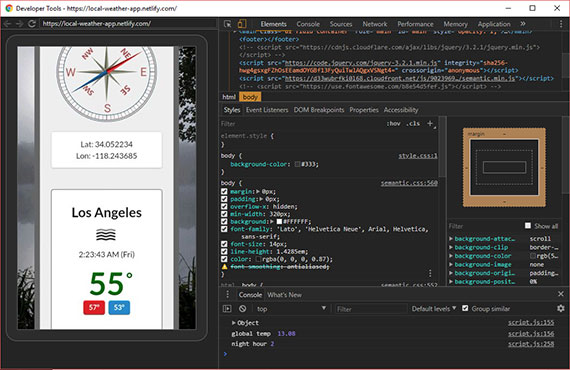](assets/images/full-size/2-lesson1-devtools1.png)

**Progress:** Today's lesson detailed the need for responsive design and set the stage for how to develop and test sites designed for mobile devices, using a mobile-first approach.

Two methods of testing were discussed.

- Testing on an actual device
- Using DevTools' built-in emulator/simulator in lue of an actual device

The lesson covered using Chrome DevTools' device emulators. It then covered creating a bridge to a mobile device with USB debugging so that a site run on the device's installation of Chrome can be debugged on the development machine with DevTools.

**Links:**
- [Grow with Google Scholarship Program](https://www.udacity.com/grow-with-google)
- [Mobile Web Specialist Nanodegree Program](https://www.udacity.com/course/mobile-web-specialist-nanodegree--nd024)

---

## 88. Started Mobile Web Specialist Nanodegree
**Day 88: April 26, 2018 - Thursday**

**Project:** Google Udacity Nandegree (Mobile Web Specialist)

[](assets/images/full-size/scholarship-phase2-ltr2.png)

**Progress:** Started my Google Udacity Nanodegree program today! This [Grow with Google Scholarship](https://www.udacity.com/grow-with-google) program is awesome. It provides a super rich environment for learning that includes:

- Full curriculum consisting of on-demand lessons with quizzes, labs, & projects
- Community Managers that guide us in the program and help keep us engaged and on track
- Targeted Slack channels (announcements, resources, project discussions, live help, etc.)
- Mentors who've completed the course & provide one-on-one guidance and technical help
- Career resources to help us get employed once we graduate

I attended the live student orientation on Tuesday and spent yesterday (Wednesday) doing the following:

- Getting myself set up on Slack
- Going through the student resources
- Reading the syllabus & coursework
- Reviewing project deadlines
- Checking out possible meetups
- Reaching out to my mentor
- Connecting with my fellow students

Today is the day I actually jump into the material starting with Lesson 1: Mobile Web Specialist Nanodegree Orientation.

I'm energized and ready to learn!

**Links:**
- [Grow with Google Scholarship Program](https://www.udacity.com/grow-with-google)
- [Mobile Web Specialist Nanodegree Program](https://www.udacity.com/course/mobile-web-specialist-nanodegree--nd024)

---

## 87. CodePen - Geolocation
**Day 87: April 25, 2018 - Wednesday**

**Project:** Add to CodePen work samples

[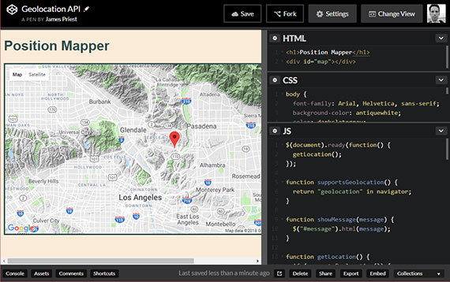](assets/images/full-size/codepen7.png)

**Progress:** Posted a Geolocation API code sample onto CodePen. This uses Google Maps to display a map with coords, TERRAIN map-type, marker, & zoom-level.

**Links:** [https://codepen.io/james-priest/pen/gzMMod](https://codepen.io/james-priest/pen/gzMMod)

---

## 86. CodePen - DragDrop #2
**Day 86: April 24, 2018 - Tuesday**

**Project:** Add to CodePen work samples

[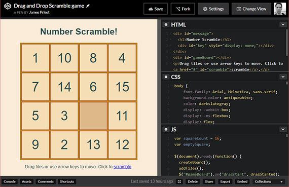](assets/images/full-size/codepen6.png)

**Progress:** Posted my drag and drop samples and exercises onto CodePen. This is a scramble game to uses a bit more code and logic than the proof-of-concept.

**Links:** [https://codepen.io/james-priest/pen/aGZNjb](https://codepen.io/james-priest/pen/aGZNjb)

---

## 85. CodePen - DragDrop #1
**Day 85: April 23, 2018 - Monday**

**Project:** Add to CodePen work samples

[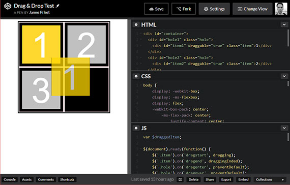](assets/images/full-size/codepen5.png)

**Progress:** Posted my drag and drop samples and exercises onto CodePen. This one is a proof of concept and tests both drag and drop events.

**Links:** [https://codepen.io/james-priest/pen/LmZNeV](https://codepen.io/james-priest/pen/LmZNeV)

---

## 84. CodePen - Canvas #4
**Day 84: April 22, 2018 - Sunday**

**Project:** Add to CodePen work samples

[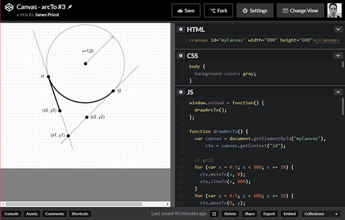](assets/images/full-size/codepen4.png)

**Progress:** Posted previously created `<canvas>` work onto CodePen. Another series of lines and arcs using `beginPath()`, `arc()`, `arcTo()`, `fill()`, and `stroke()`.

**Links:** [https://codepen.io/james-priest/pen/wjMvWV](https://codepen.io/james-priest/pen/wjMvWV)

---

## 83. CodePen - Canvas #3
**Day 83: April 21, 2018 - Saturday**

**Project:** Add to CodePen work samples

[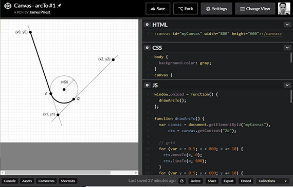](assets/images/full-size/codepen3.png)

**Progress:** Posted previously created `<canvas>` work onto CodePen. This one uses `beginPath()`, `arc()`, `arcTo()`, `fill()`, and `stroke()`.

**Links:** [https://codepen.io/james-priest/pen/YLwKoL](https://codepen.io/james-priest/pen/YLwKoL)

---

## 82. CodePen - Canvas #2
**Day 82: April 20, 2018 - Friday**

**Project:** Add to CodePen work samples

[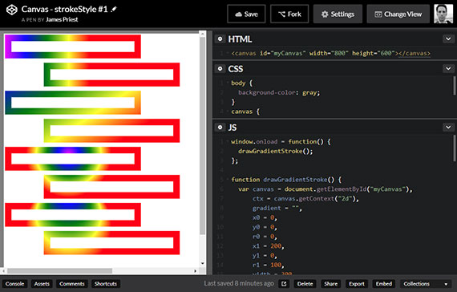](assets/images/full-size/codepen2.png)

**Progress:** Posted previously created `<canvas>` work onto CodePen. This one uses the `strokeRect()` method to create rectangle outlines with gradients.

**Links:** [https://codepen.io/james-priest/pen/XqXryK](https://codepen.io/james-priest/pen/XqXryK)

---

## 81. CodePen - Canvas #1
**Day 81: April 19, 2018 - Thursday**

**Project:** Add to CodePen work samples

[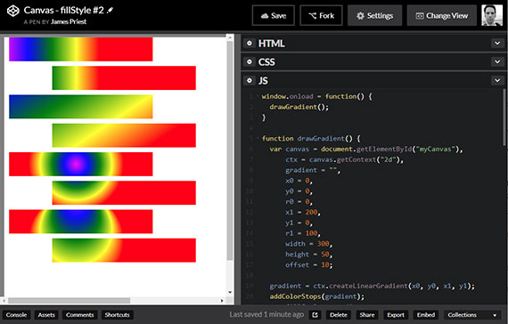](assets/images/full-size/codepen1.png)

**Progress:** Posted previously created `<canvas>` work onto CodePen. This uses the `fillStyle()` method to create some rectangles with gradients.

**Links:** [https://codepen.io/james-priest/pen/wjMwmQ](https://codepen.io/james-priest/pen/wjMwmQ)

---

## 80. Linux Containers on Windows (LCOW)
**Day 80: April 18, 2018 - Wednesday**

**Project:** Upgrade from Windows 8.1 to Windows 10 v1709 Fall Creator's Update

[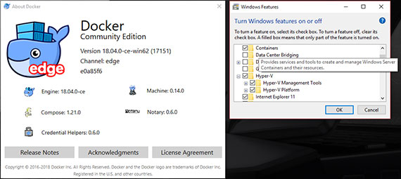](assets/images/full-size/lcow1.png)

I decided to make the switch to Windows 10. I had been hesitant to upgrade until I came across some new features that I couldn't do without.

Linux Bash Shell is one and **Linux Containers on Windows** is another...

Here's what it is and what it offers.

- **Linux Containers on Windows (LCOW)**
  - Baked-in Docker support
  - Think native Docker support on Windows without Hyper-V or VirtualBox overhead
    - That means there's no VM or Hyper-V involved (unless you want), so Linux Containers run on Windows itself using built in container support.
  - Allows you to run other virtualization systems such as VMware Workstation
  - Supports Windows and Linux containers running side-by-side via LCOW

Docker for Windows & LCOW will now allow you to spin up containers for both environments. This was stated in a Docker blog post:

> "Developers will be able to more easily build and test mixed Windows/Linux Docker applications by running containers for both platforms side-by-side on the same system."

**Progress:** Installed Edge version of Docker for Windows Desktop app. This turned on certain Windows features such as **Containers** and **Hyper-V**.

Enabling Hyper-V did prevent VMware from running due to issues with VMware running under hypervisor. This was solved by issuing the following command thru elevated Cmd prompt.

```bash
bcdedit /set hypervisorlaunchtype off
```

**Links:**
- [Allow Hyper-V and VMware Workstation to co-exist](http://dailysysadmin.com/KB/Article/1024/vmware-workstation-and-hyper-v-are-not-compatible-remove-the-hyper-v-role-from-the-system-before-running-vmware-workstation/)
- [Docker and Linux Containers on Windows, with or without Hyper-V Virtual Machines](https://www.hanselman.com/blog/DockerAndLinuxContainersOnWindowsWithOrWithoutHyperVVirtualMachines.aspx)
- Docker blog posts
  - [Preview: Linux Containers on Windows](https://blog.docker.com/2017/09/preview-linux-containers-on-windows/)
  - [Docker for Windows 17.11 with Windows 10 Fall Creators Update](https://blog.docker.com/2017/11/docker-for-windows-17-11/)
  - [
Docker for Windows Desktop 18.02 with Windows 10 Fall Creators Update](https://blog.docker.com/2018/02/docker-for-windows-18-02-with-windows-10-fall-creators-update/)

---

## 79. Linux Bash Shell on Windows (WSL)
**Day 79: April 17, 2018 - Tuesday**

**Project:** Upgrade from Windows 8.1 to Windows 10 v1709 Fall Creator's Update

[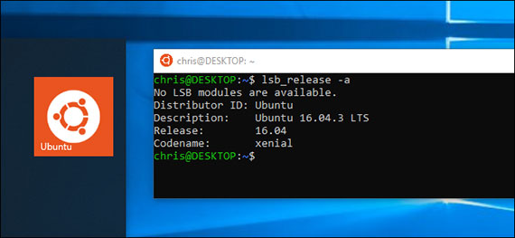](assets/images/full-size/wsl1.png)

I decided to make the switch to Windows 10. I had been hesitant to upgrade until I came across some new features that I couldn't do without.

Linux Bash Shell is one...

**Progress:** Once Windows was up and running properly, I had to turn this feature on. It's under *Control Panel > Programs > Turn Windows Features On Or Off*. From there you enable the "Windows Subsystem for Linux" option.

After you enable the feature you must install a Linux distribution from the Windows Store. I chose Ubuntu although there are many others. Once installed, I was good to go.

[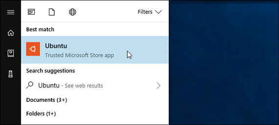](assets/images/full-size/wsl2.png)

Here are some highlights.

- **Windows Subsystem for Linux (WSL)**
  - Used to be called Bash on Ubuntu on Windows
  - Think full Ubuntu or other distro (SUSE, Debian, Kali, etc) with native Bash shell
  - Runs native Linux command-line tools (vim, sed, awk, etc) & first-line packages (Ruby, Python, etc.)
  - Can use `apt` or `apt-get` to install packages

Now I can do things like run Ruby and Jekyll right from Windows rather than incur the overhead of running a build system in a Linux VM. That will help with this blog in particular.

**Links:**
- How-To Geek articles
  - [How to Install the Linux Bash Shell on Windows 10](https://www.howtogeek.com/249966/how-to-install-and-use-the-linux-bash-shell-on-windows-10/)
  - [How to Install Linux Software in Windows 10’s Ubuntu Bash Shell](https://www.howtogeek.com/261449/how-to-install-linux-software-in-windows-10s-ubuntu-bash-shell/)
  - [How to Access Your Ubuntu Bash Files in Windows](https://www.howtogeek.com/261383/how-to-access-your-ubuntu-bash-files-in-windows-and-your-windows-system-drive-in-bash/)

---

## 78. Windows 10 Upgrade
**Day 78: April 14-16, 2018 - Saturday-Monday**

**Project:** Upgrade from Windows 8.1 to Windows 10 v1709 Fall Creator's Update

[](assets/images/full-size/windows10-laptop.png)

I finally decided to make the switch to Windows 10. I had been hesitant to upgrade because I had everything fine-tuned and working beautifully on Win 8.1.

I figured I would wait until a must have feature emerged in Windows 10 that I couldn't do without. There were two...

1. **Windows Subsystem for Linux (WSL)**
2. **Linux Containers on Windows (LCOW)**

More on these two features in upcoming posts.

**Progress:** This took 3+ days due to issues with the Media Creation Tool and my slow internet connection. The tool would fail the installation after a 5-6 hour download. It would then start whole process over again.

I was able to fix what turned out to be permissions issues on the filesystem, registry, & firewall. I also virus scanned the system to make no infections were causing the problem.

Once this was done, I created installation media and did the following.

- Downloaded all laptop mfg system drivers
- Upgraded the Bios
- Uninstalled unnecessary or incompatible applications
- Tidied up the system prior to install

Once the upgrade was done I:

- Installed new system drivers
- Downloaded new updates
- Debugged post-upgrade system issues (no sound, missing utility apps, etc.)

**Links:**
- [Windows Error 0x80070005 fix](https://neosmart.net/wiki/0x80070005/) - This walks through steps to fix Access Denied errors.

---

## 77. Azure Developer Tour
**Day 77: April 13, 2018 - Friday**

**Project:** Azure Research and Evaluation

[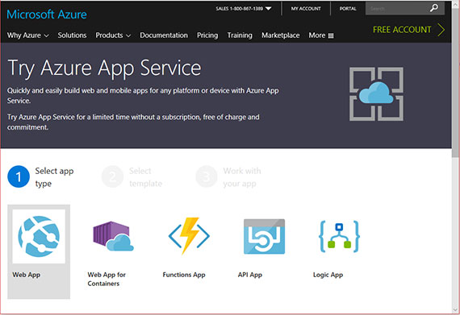](assets/images/full-size/azure3.png)

**Progress:** I attended the Azure Developer Tour in Los Angeles earlier this week. It was a one-day event that covered the following.

- App Service - (Web Apps, Web App Containers, Functions Apps, etc.)
- DevOps / VMs
- Databases
- Containers / Serverless
- AI / Machine Learning

This was a great experience. I got a chance to see how easy it is to host services in the cloud and also got some exposure to new technologies I didn't realize were ready for prime-time.

You can manage your services through a cool dashboard.

[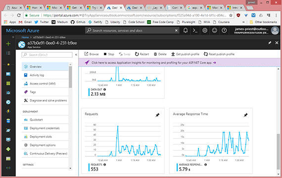](assets/images/full-size/azure1.png)

You can access your app and write code through their App Service Editor which works Visual Studio Code. It has Version Control (Git), a File System Browser, and Integrated Debugger.

[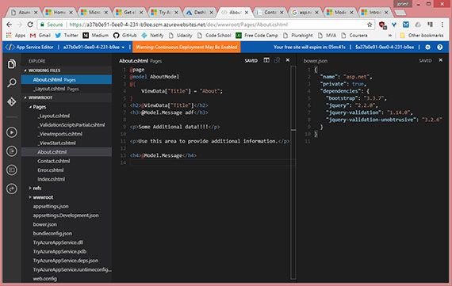](assets/images/full-size/azure2.png)

**Links:**
- [Try Azure App Service](https://tryappservice.azure.com/) - Easily spin up a service for a limited time with no account sign-up

---

## 76. React Bootcamp Day 4
**Day 76: April 12, 2018 - Thursday**

[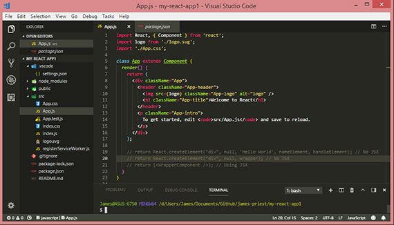](assets/images/full-size/react-day4.png)

**Project:** Tyler McGinnis' React Bootcamp

**Progress:** Completed this four day class which serves as a great introduction to React. The course is taught by Tyler McGinnis who created Udacity's React Nanodegree program. He also has a series of React(v16.3) courses on his website. ([https://tylermcginnis.com/](https://tylermcginnis.com/)).

Day 4 covered:

- Use of the `create-react-app` npm package to create a react app scaffold and build environment
- Installation of React Router v4 (`react-router-dom` package) to create routes, nested routes, & dynamic routes

**Links:**
- Tyler's website - [https://tylermcginnis.com/](https://tylermcginnis.com/)
- Tyler's articles
  - [React Router v4: Philosophy and Introduction](https://tylermcginnis.com/react-router-philosophy-introduction/)
- React Bootcamp: Day 4 video - [https://youtu.be/alZur1g2Cnw](https://youtu.be/alZur1g2Cnw)
- My Code Samples - [React Bootcamp GitHub Repo](https://github.com/james-priest/react-bootcamp)

---

## 75. React Bootcamp Day 3
**Day 75: April 11, 2018 - Wednesday**

[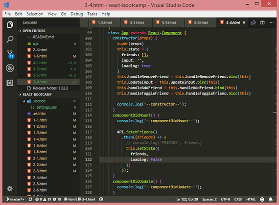](assets/images/full-size/react-day3.png)

**Project:** Tyler McGinnis' React Bootcamp

**Progress:** This is a four day class which serves as a great introduction to React. The course is taught by Tyler McGinnis who created Udacity's React Nanodegree program. He also has a series of React(v16.3) courses on his website. ([https://tylermcginnis.com/](https://tylermcginnis.com/)).

Day 3 covered:

- Component Lifecycle
  - componentDidMount - Fired after the component mounted
  - componentWillUnmount - Fired before the component will unmount
  - getDerivedStateFromProps - Fired when the component mounts and whenever the props change.

**Links:**
- Tyler's website - [https://tylermcginnis.com/](https://tylermcginnis.com/)
- Tyler's articles
  - [React Tutorial: A Comprehensive Guide to learning React.js in 2018](https://tylermcginnis.com/reactjs-tutorial-a-comprehensive-guide-to-building-apps-with-react/)
  - [React Elements vs React Components](https://tylermcginnis.com/react-elements-vs-react-components/)
  - [Building User Interfaces with Pure Functions and Function Composition in React](https://tylermcginnis.com/building-user-interfaces-with-pure-functions-and-function-composition-in-react-js/)
  - [WTF is this - Understanding the this keyword, call, apply, and bind in JavaScript](https://tylermcginnis.com/this-keyword-call-apply-bind-javascript/)
- React Bootcamp: Day 3 video - [https://youtu.be/Xa3DGGP4mLM](https://youtu.be/Xa3DGGP4mLM)
- My Code Samples - [React Bootcamp GitHub Repo](https://github.com/james-priest/react-bootcamp)

---

## 74. React Bootcamp Day 2
**Day 74: April 10, 2018 - Tuesday**

[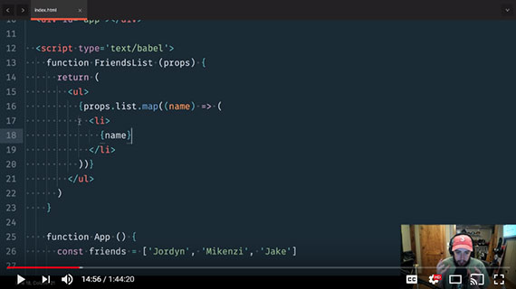](assets/images/full-size/react-day2.png)

**Project:** Tyler McGinnis' React Bootcamp

**Progress:** This is a four day class which serves as a great introduction to React. The course is taught by Tyler McGinnis who created Udacity's React Nanodegree program. He also has a series of React(v16.3) courses on his website. ([https://tylermcginnis.com/](https://tylermcginnis.com/)).

Day 2 consisted of:

- Overview of React components
- Learned how to create a component which is a class that extends from `React.Component`
- Covered the `props` object
- Explored state - the internal data store of a component

**Links:**
- Tyler's website - [https://tylermcginnis.com/](https://tylermcginnis.com/)
- React Bootcamp: Day 2 video - [https://youtu.be/NHfRLQuHjsU](https://youtu.be/NHfRLQuHjsU)
- My Code Samples - [React Bootcamp GitHub Repo](https://github.com/james-priest/react-bootcamp)

---

## 73. React Bootcamp Day 1
**Day 73: April 9, 2018 - Monday**

[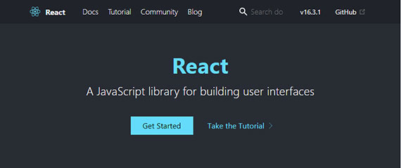](assets/images/full-size/react-day1.png)

**Project:** Tyler McGinnis' React Bootcamp

**Progress:** This four day class served as a great introduction to React. Each day consisted of a live YouTube session lasting about two hours in which a key concept of the library was covered. We then put what was learned into practice by following along with many code examples.

The course is taught by Tyler McGinnis who created Udacity's React Nanodegree program. He also has a series of *very* current React(16.3) and related courses on his website. ([https://tylermcginnis.com/](https://tylermcginnis.com/)).

Day 1 consisted of:

- Overview of what React is and what it does
- Basic setup using a minimal HTML template
- Learning the `React.createElement()` construct
- Creating *functional components* (aka *stateless functional components*) for components that don't need to manage state
- Understanding & using JSX syntax

**Links:**
- Tyler's website - [https://tylermcginnis.com/](https://tylermcginnis.com/)
- React Bootcamp: Day 1 video - [https://youtu.be/8GXXGJRDMdQ](https://youtu.be/8GXXGJRDMdQ)
- My Code Samples - [React Bootcamp GitHub Repo](https://github.com/james-priest/react-bootcamp)

---

## 72. Offline - Web SQL Pt4 - JOIN & Aggregate Functions
**Day 72: April 8, 2018 - Sunday**

**Project:** Study for MS 70-480 Cert Exam (Programming in HTML5 with JavaScript & CSS3)

**Progress:** Today's lesson focused on executing table JOINS and creating aggregate functions with with GROUP BY.  These include `COUNT()`, `MIN()`, `MAX()`, AND `SUM()`.

```js
// JOIN syntax
var db = openDatabase('Library', '1.0', 'My library', 5 * 1024 * 1024);
var lastName = 'D%';
db.transaction(function(t) {
    t.executeSql("SELECT a.firstName, a.lastName, b.title " +
        "FROM authors a " +
        "INNER JOIN books b on a.id = b.authorId " +
        "WHERE lastName LIKE ?"
        , [lastName], displayResults);
});
```

```js
// GROUP BY syntax
db.transaction(function(t) {
    t.executeSql("SELECT a.firstName, a.lastName, COUNT(b.id) as numOfBooks " +
        "FROM authors a " +
        "INNER JOIN books b on a.id = b.authorId " +
        "GROUP BY a.id"
        , [], displayResults);
});
```

Read here: [Chapter 16 - Offline Web Applications: Web SQL - Filtering Results](CH16-Offline1-WebSQL.html#11-using-join-commands).

**Links:**
- Course Notes - [Chapter 16 - Offline Web Applications](CH16-Offline.html)
- Code Samples - [Web SQL - Create database, add table, insert, update, delete](https://james-priest.github.io/node_samples/ch16-OfflineWeb/a-websql1.html)
- GitHub Repo - [Web Storage GitHub Repo](https://github.com/james-priest/node_samples/tree/master/ch16-OfflineWeb)

---

## 71. Offline - Web SQL Pt3 - Reading & Filtering Results
**Day 71: April 7, 2018 - Saturday**

**Project:** Study for MS 70-480 Cert Exam (Programming in HTML5 with JavaScript & CSS3)

**Progress:** Today's lesson focused on reading and filtering data.

```js
// Read & output data
function displayResults(transaction, results) {
  for (var i = 0; i < results.rows.length; i++) {
    var item = results.rows.items(i);
    $('#items').append('<li>' + item.firstName + ' ' + item.lastName + '</li>');
  }
}

var db = openDatabase('library', '2.0', 'My library', 5 * 1024 * 1024);
db.transaction(function(t) {
  t.executeSql("SELECT * FROM authors", [], displayResults)
});
```

```js
// Filter data
var db = openDatabase('Library', '2.0', 'My library', 5 * 1024 * 1024);
var lastName = 'Priest';
db.transaction(function(t) {
    t.executeSql("SELECT * FROM authors WHERE lastName = ?"
    , [lastName], displayResults);
});
```

Read here: [Chapter 16 - Offline Web Applications: Web SQL - Filtering Results](CH16-Offline1-WebSQL.html#10-filtering-results).

**Links:**
- Course Notes - [Chapter 16 - Offline Web Applications](CH16-Offline.html)
- Code Samples - [Web SQL - Create database, add table, insert, update, delete](https://james-priest.github.io/node_samples/ch16-OfflineWeb/a-websql1.html)
- GitHub Repo - [Web Storage GitHub Repo](https://github.com/james-priest/node_samples/tree/master/ch16-OfflineWeb)

---

## 70. Offline - Web SQL Pt2 - Insert, Update, Delete
**Day 70: April 6, 2018 - Friday**

**Project:** Study for MS 70-480 Cert Exam (Programming in HTML5 with JavaScript & CSS3)

[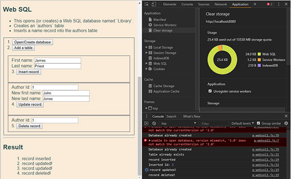](assets/images/full-size/chap16-2.png)
**Live Sample** - [Web SQL - Create database, add table, insert, update, delete](https://james-priest.github.io/node_samples/ch16-OfflineWeb/a-websql1.html)

**Progress:** Today was spent completing a proof-of-concept page that does the following.

1. Creates and opens a Web SQL database
2. Adds a table
3. Inserts a record
4. Updates a record
5. Deletes a record

Read about Web SQL here: [Chapter 16 - Offline Web Applications: Web SQL - Working with data](CH16-Offline1-WebSQL.html#2-creating--opening-the-database).

**Links:**
- Course Notes - [Chapter 16 - Offline Web Applications](CH16-Offline.html)
- Code Samples - [Web SQL - Create database, add table, insert, update, delete](https://james-priest.github.io/node_samples/ch16-OfflineWeb/a-websql1.html)
- GitHub Repo - [Web Storage GitHub Repo](https://github.com/james-priest/node_samples/tree/master/ch16-OfflineWeb)

---

## 69. Offline - Web SQL Pt1 - Open Database
**Day 69: April 5, 2018 - Thursday**

**Project:** Study for MS 70-480 Cert Exam (Programming in HTML5 with JavaScript & CSS3)

[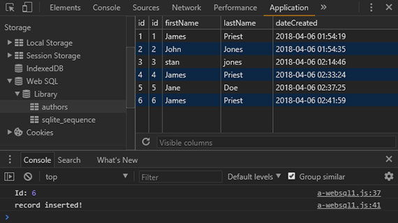](assets/images/full-size/chap16-1.png)
Code Samples - [Web SQL - Create database, add table, insert, update, delete](https://james-priest.github.io/node_samples/ch16-OfflineWeb/a-websql1.html)

**Progress:** This lesson served as an introduction to Web SQL. It is currently only supported by Safari and Chrome so it is best suited for:

- Use in iOS apps (iPad or iPhone)
- A data repository for Chrome extensions

This first lesson consisted of learning how to:

- Open or create a database and set the DB name, version, displayName, & size
- Update the schema by creating a table along with incrementing the version number
- Using transactions
- Inserting records as part of a transaction
- Using parameterized queries

Read about Web SQL here: [Chapter 16 - Offline Web Applications: Lesson 1: Web SQL](CH16-Offline1-WebSQL.html#lesson-1-web-sql).

**Links:**
- Course Notes - [Chapter 16 - Offline Web Applications](CH16-Offline.html)
- Code Samples - [Web SQL - Create a database, add a table, insert records](https://james-priest.github.io/node_samples/ch16-OfflineWeb/a-websql1.html)
- GitHub Repo - [Web Storage GitHub Repo](https://github.com/james-priest/node_samples/tree/master/ch16-OfflineWeb)

---

## 68. Web Storage Pt6 - Storage Events
**Day 68: April 4, 2018 - Wednesday**

**Project:** Study for MS 70-480 Cert Exam (Programming in HTML5 with JavaScript & CSS3)

[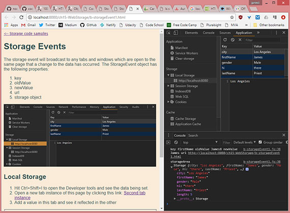](assets/images/full-size/chap15-7.png)
Code Samples - [Storage Events](https://james-priest.github.io/node_samples/ch15-WebStorage/b-storageEvent1.html)

**Progress:** This lesson covers the StorageEvent object and how to use it to effectively notify other tabs and windows of data changes to local or session storage.

Read about HTML5 storage here: [Chapter 15 - Web Storage: Handling storage events](CH15-WebStorage.html#15-handling-storage-events).

**Links:**
- Course Notes - [Chapter 15 - Web Storage](CH15-WebStorage.html)
- Code Samples - [Cookies, Local Storage, Session Storage, & Storage events](https://james-priest.github.io/node_samples/ch15-WebStorage/b-index.html)
- GitHub Repo - [Web Storage GitHub Repo](https://github.com/james-priest/node_samples/tree/master/ch15-WebStorage)

---

## 67. Web Storage Pt5 - Sample Code
**Day 67: April 3, 2018 - Tuesday**

**Project:** Study for MS 70-480 Cert Exam (Programming in HTML5 with JavaScript & CSS3)

[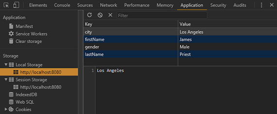](assets/images/full-size/chap15-4.png)

**Progress:** This lesson summarizes the key take-aways regarding local and session storage, collectively known as web storage.

I also created some sample code to test various methods regarding local and session storage.

[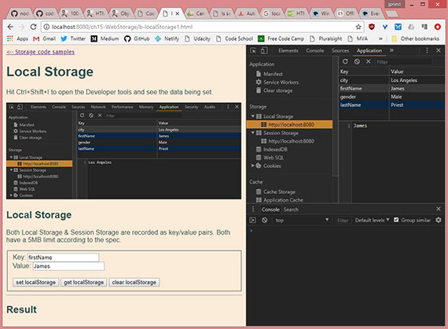](assets/images/full-size/chap15-6.png)
Code Samples - [Cookies, Local Storage, & Session Storage](https://james-priest.github.io/node_samples/ch15-WebStorage/b-index.html)

Read about HTML5 storage here: [Chapter 15 - Web Storage: Lesson summary](CH15-WebStorage.html#13-lesson-summary).

**Links:**
- Course Notes - [Chapter 15 - Web Storage](CH15-WebStorage.html)
- Code Samples - [Cookies, Local Storage, & Session Storage](https://james-priest.github.io/node_samples/ch15-WebStorage/b-index.html)
- GitHub Repo - [Web Storage GitHub Repo](https://github.com/james-priest/node_samples/tree/master/ch15-WebStorage)

---

## 66. Web Storage Pt4 - Google's Storage Recommendations
**Day 66: April 2, 2018 - Monday**

**Project:** Study for MS 70-480 Cert Exam (Programming in HTML5 with JavaScript & CSS3)

[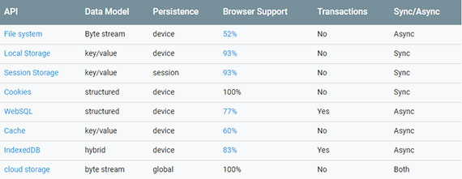](assets/images/full-size/chap15-3.png)

**Progress:** This lesson starts by describing the performance pitfalls of some of these storage techniques including size limitations and synchronous-only blocking operations.

It then gets into Google's recommendation for specific storage methods based on browser adoption and performance considerations. These are IndexedDB & Cache API which are used extensively with Service Workers to provide good *offline first* user experience.

It describes the inherent limitations of other storage methods.

- **Web Storage** (e.g LocalStorage and SessionStorage) is synchronous, has no Web Worker support and is size and type (strings only) limited
- **Cookies** have their uses but are synchronous, lack web worker support and are also size-limited.
- **Web SQL** does not have broad browser support and its use is not recommended.
- The **File System API** is not supported on any browser besides Chrome.
- The **File API** is being improved in the File and Directory Entries API and File API specs but neither is sufficiently mature or standardized to encourage widespread adoption yet.

Read about HTML5 storage here: [Chapter 15 - Web Storage: Anticipating potential performance pitfalls](CH15-WebStorage.html#11-anticipating-potential-performance-pitfalls).

**Links:**
- Course Notes - [Chapter 15 - Web Storage](CH15-WebStorage.html)
- Cookie namespace patterns - [Code Samples](https://james-priest.github.io/node_samples/ch15-WebStorage/a-cookie-index.html)
- GitHub Repo - [Web Storage GitHub Repo](https://github.com/james-priest/node_samples/tree/master/ch15-WebStorage)

---

## 65. Web Storage Pt3 - HTML5 Storage APIs
**Day 65: April 1, 2018 - Sunday**

**Project:** Study for MS 70-480 Cert Exam (Programming in HTML5 with JavaScript & CSS3)

[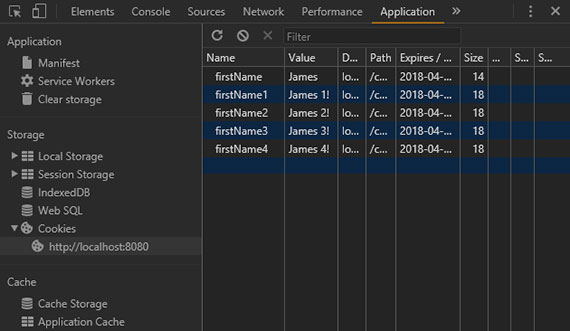](assets/images/full-size/chap15-2.png)

**Progress:** This discusses and breaks down the different HTML5 storage APIs and how they compare and contrast to old style cookies.

This includes:

1. Local Storage (Web Storage)
2. Session Storage (Web Storage)
3. IndexedDB
4. Web SQL (`deprecated`)
5. Filesystem API (`deprecated`)

Read about HTML5 storage here: [Chapter 15 - Web Storage: Understanding HTML5 storage](CH15-WebStorage.html#6-understanding-html5-storage).

**Links:**
- Course Notes - [Chapter 15 - Web Storage](CH15-WebStorage.html)
- Cookie namespace patterns - [Code Samples](https://james-priest.github.io/node_samples/ch15-WebStorage/a-cookie-index.html)
- GitHub Repo - [Web Storage GitHub Repo](https://github.com/james-priest/node_samples/tree/master/ch15-WebStorage)

---

## 64. Web Storage Pt2 - Namespace Patterns
**Day 64: March 31, 2018 - Saturday**

**Project:** Study for MS 70-480 Cert Exam (Programming in HTML5 with JavaScript & CSS3)

```js
// IIFE namespace pattern
var namespace = namespace || {};

/* here a namespace object is passed as a function parameter.
 * this allows us to assign public methods and properties to it. */
(function( o ){
    o.foo = "foo";
    o.bar = function(){
        return "bar";
    };
})(namespace);
```

**Progress:** Much of my cert study material puts code right in the global namespace. This is done to keep proof-of-concept code simple and under control but it misses an opportunity to reinforce good coding practices.

Today I took the time to re-write code to get and set cookies using four different namespace patterns from Addy Osmani's [Essential JavaScript Namespacing Patterns](https://addyosmani.com/blog/essential-js-namespacing/#beginners).

The namespace patterns include:

1. Single global variable
2. Object literal notation
3. Nested namespace pattern
4. Immediately Invoked Function Expression (IIFE)

The notes explaining how to use these four patterns are here: [Chapter 15 - Web Storage: Structuring code with Namespace patterns](CH15-WebStorage.html#3-structuring-code-with-namespace-patterns).

**Links:**
- Course Notes - [Chapter 15 - Web Storage](CH15-WebStorage.html)
- Cookie namespace patterns - [Code Samples](https://james-priest.github.io/node_samples/ch15-WebStorage/a-cookie-index.html)
  - Original code
  - Single global variable
  - Object literal notation
  - Nested namespace pattern
  - Immediately Invoked Function Expression (IIFE)

- GitHub Repo - [Web Storage GitHub Repo](https://github.com/james-priest/node_samples/tree/master/ch15-WebStorage)

---

## 63. Web Storage Pt1 - Cookies
**Day 63: March 30, 2018 - Friday**

**Project:** Study for MS 70-480 Cert Exam (Programming in HTML5 with JavaScript & CSS3)

[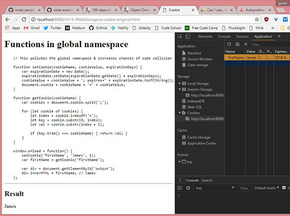](assets/images/full-size/chap15-1.png)

**Progress:** This chapter covers Web Storage (`localStorage` & `sessionStorage`) along with a basic overview of cookies, their use, and their limitations.

This lesson detailed the following.

- Introduction to Web Storage
- Understanding the use of cookies
- How to set and retrieve cookie values.

The live sample can be viewed here: [a-cookie-original.html](https://james-priest.github.io/node_samples/ch15-WebStorage/a-cookie-original.html)

**Links:**
- Course Notes - [Chapter 15 - Web Storage](CH15-WebStorage.html)
- Cookie sample - [Get/Set browser cookie (a-cookie-original.html)](https://james-priest.github.io/node_samples/ch15-WebStorage/a-cookie-original.html)
- GitHub Repo - [Web Storage GitHub Repo](https://github.com/james-priest/node_samples/tree/master/ch15-WebStorage)

---

## 62. JS Tutorial Pt13 - Polymorphism
**Day 62: March 29, 2018 - Thursday**

**Project:** Study for MS 70-480 Cert Exam (Object Oriented JavaScript)

**Progress:** This lesson covers polymorphism in JavaScript. It starts with an example of polymorphism in C# and shows how to accomplish the same task with JavaScript.

```js
 // Shape object is be the base object
var Shape = function () { };

// Add draw function to the Shape prototype
// Objects derived from Shape will be able to override the draw() method
Shape.prototype.draw = function () {
    return "I am a generic shape";
};

// Create a Circle object
var Circle = function () { }

// Make shape the parent for Circle
Circle.prototype = Object.create(Shape.prototype);

// Circle object overrides draw() method
Circle.prototype.draw = function () {
    return "I am a circle";
};
var Square = function () { };
Square.prototype = Object.create(Shape.prototype);
Square.prototype.draw = function () {
    return "I am a square";
};

var Triangle = function () { };
Triangle.prototype = Object.create(Shape.prototype);

var shapes = [new Shape(), new Circle(), new Square(), new Triangle()];

shapes.forEach(function (shape) {
    document.write(shape.draw() + "<br/>");
});
```

**Output**

```text
I am a generic shape
I am a circle
I am a square
I am a generic shape
```

Here are the lesson notes:

- [Object Oriented JavaScript - Polymorphism in JavaScript](OO-JavaScript.html#65-polymorphism-in-javascript).

**Links:**
- Course Notes - [Object Oriented JavaScript](OO-JavaScript.html)
- GitHub Repo - [OO JavaScript GitHub Repo](https://github.com/james-priest/code-exercises/tree/master/javascript_exercises/javascript-csharp)

---

## 61. JS Tutorial Pt12 - Object Reflection
**Day 61: March 28, 2018 - Wednesday**

**Project:** Study for MS 70-480 Cert Exam (Object Oriented JavaScript)

**Progress:** This lesson covers object reflection in JavaScript. In C# reflection allows us to inspect meta data of assemblies, modules, and types. In JavaScript it allows the examination of objects with regards to the object's properties, methods, and inheritance.

```js
var Employee = function (firstName, lastName, gender, email) {
    this.firstName = firstName;
    this.lastName = lastName;
    this.gender = gender;
    this.email = email;
}

Employee.prototype.getFullName = function () {
    return this.firstName + " " + this.lastName;
}

Employee.prototype.getEmail = function () {
    return this.email;
}

Employee.prototype.getGender = function () {
    return this.gender;
}

var employee1 = new Employee("Mark", "Matt", "Male", "a@a.com");

for (var property in employee1) {
    document.write(property + " : " + employee1[property] + "<br/>");
}
```

**Output**

```text
firstName: Mark
lastName: Matt
gender: Male
email: a@a.com
getFullName: function () { return this.firstName + " " + this.lastName; }
getEmail: function () { return this.email; }
getGender: function () { return this.gender; }
```

Here are the lesson notes:

- [Object Oriented JavaScript - Object Reflection in JavaScript](OO-JavaScript.html#64-object-reflection-in-javascript).

**Links:**
- Course Notes - [Object Oriented JavaScript](OO-JavaScript.html)
- GitHub Repo - [OO JavaScript GitHub Repo](https://github.com/james-priest/code-exercises/tree/master/javascript_exercises/javascript-csharp)

---

## 60. JS Tutorial Pt11 - Abstract Classes
**Day 60: March 27, 2018 - Tuesday**

**Project:** Study for MS 70-480 Cert Exam (Object Oriented JavaScript)

**Progress:** This lesson covers abstract classes which cannot be instantiated in an of themselves but rather, act as a base class from which create a sub-class from.

```js
// Create a Shape object which is abstract
var Shape = function () {
    this.shapeName = "None";
    throw new Error("Cannot create an instance of abstract class");
};

// Add draw function to the Shape prototype
// Objects derived from Shape should be able to call draw() method
Shape.prototype.draw = function () {
    return "Drawing " + this.shapeName;
};

// Create a Circle object
var Circle = function (shapeName) {
    this.shapeName = shapeName;
};

// Make shape the parent for Circle
// Object.create() allows to create an object without using constructor
Circle.prototype = Object.create(Shape.prototype);

var circle = new Circle("Circle");
// Since Circle inherits from abstract Shape object, it can call draw() method
document.write(circle.draw());

alert(circle instanceof Circle); // Returns true
alert(circle instanceof Shape);  // Returns true
```

Here are the lesson notes:

- [Object Oriented JavaScript - Abstract Classes in JavaScript](OO-JavaScript.html#63-abstract-classes-in-javascript).

**Links:**
- Course Notes - [Object Oriented JavaScript](OO-JavaScript.html)
- GitHub Repo - [OO JavaScript GitHub Repo](https://github.com/james-priest/code-exercises/tree/master/javascript_exercises/javascript-csharp)

---

## 59. JS Tutorial Pt10 - Inheritance in JavaScript
**Day 59: March 26, 2018 - Monday**

**Project:** Study for MS 70-480 Cert Exam (Object Oriented JavaScript)

**Progress:** This lesson covers the basics of object inheritance in ES5. We do this using a pattern that sets a derived object 's prototype to the base object. This allows the derived object access to the base object's prototype methods and properties.

```js
// Employee will be the base object (Similar to base class in C#)
var Employee = function (name) {
    this.name = name;
};

// getName() function is added to the base object (Employee)
Employee.prototype.getName = function () {
    return this.name;
};

// PermanentEmployee will be the derived object
var PermanentEmployee = function (annualSalary) {
    this.annualSalary = annualSalary;
};

// Use prototype to set Employee as the base object for PermanentEmployee
PermanentEmployee.prototype = new Employee("Mark");

var pe = new PermanentEmployee(50000);
// Derived object (permanentEmployee) can see the
// base object (Employee) getName() method
document.write(pe.getName());

alert(pe instanceof Employee);          // Returns true
alert(pe instanceof PermanentEmployee); // Returns true
```

Here are the lesson notes: [Object Oriented JavaScript - Inheritance in JavaScript](OO-JavaScript.html#62-inheritance-in-javascript).

**Links:**
- Course Notes - [Object Oriented JavaScript](OO-JavaScript.html)
- GitHub Repo - [OO JavaScript GitHub Repo](https://github.com/james-priest/code-exercises/tree/master/javascript_exercises/javascript-csharp)

---

## 58. JS Tutorial Pt9 - Overriding JS functions
**Day 58: March 25, 2018 - Sunday**

**Project:** Study for MS 70-480 Cert Exam (Object Oriented JavaScript)

**Progress:** This lesson covers the process of overriding a function on the prototype object in cases where this behavior is desired.

The lesson covers:

- Creating an object constructor
- Defining a member function on the prototype object.
- Overriding that prototype member function with a new function definition

```js
function Employee(name) {
    this.name = name;
}

Employee.prototype.getName = function () {
    return this.name;
}

function GetEmployeeDetails() {
    Employee.prototype.getName = function () {
        return this.name.toUpperCase();
    }

    var e1 = new Employee("Mark");
    var e2 = new Employee("Sara");

    document.write("e1.name = " + e1.getName() + "<br/>");
    document.write("e2.name = " + e2.getName() + "<br/>");
}

GetEmployeeDetails();
```

Here are the lesson notes: [Object Oriented JavaScript - Overriding JavaScript Functions](OO-JavaScript.html#61-overriding-javascript-functions).

**Links:**
- Course Notes - [Object Oriented JavaScript](OO-JavaScript.html)
- GitHub Repo - [OO JavaScript GitHub Repo](https://github.com/james-priest/code-exercises/tree/master/javascript_exercises/javascript-csharp)

---

## 57. JS Tutorial Pt8 - The Prototype Object
**Day 57: March 24, 2018 - Saturday**

**Project:** Study for MS 70-480 Cert Exam (Object Oriented JavaScript)

**Progress:** This lesson covers the prototype object and how to add methods you wish to make public to this object in order to limit memory consumption.

The lesson covers:

- Creating a privileged method for the function
- Creating the function as a static method
- Creating the function as a public method on the prototype object.

```js
function Employee(name) {
    // public instance field
    this.name = name;
}

// Public prototype method
Employee.prototype.getName = function() {
    return this.name;
};

var e1 = new Employee("Mark");
var e2 = new Employee("Sara");

document.write("e1.name = " + e1.getName() + "<br/>"); // Mark
document.write("e2.name = " + e2.getName() + "<br/>"); // Sara
```

Here are the lesson notes: [Object Oriented JavaScript - Prototype in JavaScript](OO-JavaScript.html#60-prototype-in-javascript).

**Links:**
- Course Notes - [Object Oriented JavaScript](OO-JavaScript.html)
- GitHub Repo - [OO JavaScript GitHub Repo](https://github.com/james-priest/code-exercises/tree/master/javascript_exercises/javascript-csharp)

---

## 56. JS Tutorial Pt7 - Static Fields & Methods
**Day 56: March 23, 2018 - Friday**

**Project:** Study for MS 70-480 Cert Exam (Object Oriented JavaScript)

**Progress:** This lesson covers what a static member is and how to create one. It also discusses when to use this construct.

A static member is a static field (variable) or static method (function). The term static means that there is only ever one copy created in memory for that field or method.

```js
function Shape(shapeName) {
    // Instance field
    this.ShapeName = shapeName;

    // Static field
    Shape.Count = ++Shape.Count || 1;

    // Static method
    Shape.ShowCount = function() {
        return Shape.Count;
    };
}

var shape1 = new Shape('Circle');
var shape2 = new Shape('Rectangle');
var shape3 = new Shape('triangle');

document.write('Shape.Count = ' + Shape.ShowCount());  // Shape.Count = 3
```

Five instances of an object can be created from a constructor function but if that constructor defines a static member, only one copy of that member will be created in memory.

Here are more complete examples: [Object Oriented JavaScript - Static Members in JavaScript](OO-JavaScript.html#59-static-members-in-javascript).

**Links:**
- Course Notes - [Object Oriented JavaScript](OO-JavaScript.html)
- GitHub Repo - [OO JavaScript GitHub Repo](https://github.com/james-priest/code-exercises/tree/master/javascript_exercises/javascript-csharp)

---

## 55. JS Tutorial Pt6 - Property Getters & Setters
**Day 55: March 22, 2018 - Thursday**

**Project:** Study for MS 70-480 Cert Exam (Object Oriented JavaScript)

**Progress:** Today we cover getters and setters in JavaScript. This allows us to control how we update private properties and control what is returned upon request. It provides encapsulation which is one of the four pillars of object-oriented design.

Here is an example in code.

```js
function Employee(name, age) {
    var _name = name;
    var _age = age;

    Object.defineProperty(this, 'age', {
        get: function () {
            return _age;
        },
        set: function (value) {
            if (value > 100 || value < 1) {
                alert("Invalid age");
            } else {
                _age = value;
            }
        }
    });

    Object.defineProperty(this, "name", {
        get: function () {
            return _name;
        }
    });
}
```

You can read a more complete example which includes full code and explanation in my notes on this lesson: [Object Oriented JavaScript - Properties in JavaScript](OO-JavaScript.html#58-properties-in-javascript).

**Links:**
- Course Notes - [Object Oriented JavaScript](OO-JavaScript.html)
- GitHub Repo - [OO JavaScript GitHub Repo](https://github.com/james-priest/code-exercises/tree/master/javascript_exercises/javascript-csharp)

---

## 54. JS Tutorial Pt5 - Private Members
**Day 54: March 21, 2018 - Wednesday**

**Project:** Study for MS 70-480 Cert Exam (Object Oriented JavaScript)

**Progress:** This lesson dives deeper into how to create the kind of encapsulation found in traditional class-based inheritance structures of C# and Java.

```js
// JavaScript
function Employee(firstName, lastName) {
    // Private Field
    var privateFullName;

    // Public Fields
    this.firstName = firstName;
    this.lastName = lastName;

    // Private Function
    var privateGetFullName = function () {
        privateFullName = firstName + " " + lastName;
        return privateFullName;
    };

    // Privileged Function
    this.privilegedGetFullName = function () {
        return privateGetFullName();
    };

    // Public Function
    Employee.prototype.publicGetFullName = function () {
        return this.privilegedGetFullName();
    };
}
```

This lesson covers:

- **Private fields** - variables that can only be accessed by private functions and privileged methods.
- **Public fields** - variables available outside the object.
- **Private functions** - available only to privileged methods or other private functions.
- **Privileged methods** - available both inside and outside the object. Has access to private fields and functions.
- **Public methods** - available inside and outside the object. No access to private fields or functions but can access privileged methods.

You can read a more complete example which includes full code and explanation in my notes on this lesson: [Object Oriented JavaScript - Private members in JavaScript](OO-JavaScript.html#57-private-members-in-javascript).

**Links:**
- Course Notes - [Object Oriented JavaScript](OO-JavaScript.html)
- GitHub Repo - [OO JavaScript GitHub Repo](https://github.com/james-priest/code-exercises/tree/master/javascript_exercises/javascript-csharp)

---

## 53. JS Tutorial Pt4 - Namespaces
**Day 53: March 20, 2018 - Tuesday**

**Project:** Study for MS 70-480 Cert Exam (Object Oriented JavaScript)

**Progress:** This lesson takes the code scenario posed in the previous lesson and solves for it by creating namespaces. JavaScript does not have namespaces as such but uses objects to accomplish the same kind of encapsulation.

Furthermore, we can create nested namespaces by creating a nested object hierarchy. A nested namespace is a namespace inside another namespace.

```js
var myApp = myApp || {};
var myApp.utilities = myApp.utilities || {};

myApp.utilities.validateData = function(data) {
  // some code...
};
```

You can read a more complete example which includes full code and explanation in my notes on this lesson: [Object Oriented JavaScript - Namespaces in JavaScript](OO-JavaScript.html#56-namespaces-in-javascript).

**Links:**
- Course Notes - [Object Oriented JavaScript](OO-JavaScript.html)
- GitHub Repo - [OO JavaScript GitHub Repo](https://github.com/james-priest/code-exercises/tree/master/javascript_exercises/javascript-csharp)

---

## 52. JS Tutorial Pt3 - Global Namespace Pollution
**Day 52: March 19, 2018 - Monday**

**Project:** Study for MS 70-480 Cert Exam (Object Oriented JavaScript)

**Progress:** This lesson details the pitfalls of writing code that lives in the global namespace. Global namespace pollution occurs when we declare variables or functions globally which have the possibility of overwriting code from included libraries or third-parties.

This is most common in large code bases but can occur anytime variables, objects, or functions are being declared globally.

This lesson creates an example of how this can occur.

Notes on this lesson: [Object Oriented JavaScript - Global namespace pollution](OO-JavaScript.html#55-global-namespace-pollution).

**Links:**
- Course Notes - [Object Oriented JavaScript](OO-JavaScript.html)
- GitHub Repo - [OO JavaScript GitHub Repo](https://github.com/james-priest/code-exercises/tree/master/javascript_exercises/javascript-csharp)

---

## 51. JS Tutorial Pt2 - Object Literal vs Constructor
**Day 51: March 18, 2018 - Sunday**

**Project:** Study for MS 70-480 Cert Exam (Object Oriented JavaScript)

**Progress:** This lesson gets more in depth with the differences between using  literal notation to define a custom object vs using a constructor function to create one.

The lesson shows how an object literal is a singleton, and objects defined with a constructor and the `new` keyword are separate individual instances.

```js
// object literal notation
var employee = {
    name: "John"
}
```

```js
// constructor function
var emp = function () {
    this.name = "John";
}
// Create an instance of employee
var employee = new emp();
```

The bottom line is that when we need multiple instances we should use a constructor function. When one instance is needed we can define the object using literal notation.

Notes on this lesson can be found here: [Object Oriented JavaScript - Object literal vs. object constructor](OO-JavaScript.html#54-object-literal-vs-object-constructor).

**Links:**
- Course Notes - [Object Oriented JavaScript](OO-JavaScript.html)
- GitHub Repo - [OO JavaScript GitHub Repo](https://github.com/james-priest/code-exercises/tree/master/javascript_exercises/javascript-csharp)

---

## 50. JS Tutorial Pt1 - Object Oriented Programming
**Day 50: March 17, 2018 - Saturday**

**Project:** Study for MS 70-480 Cert Exam (Object Oriented JavaScript)

**Progress:** Learned about two distinct ways to create custom objects in JavaScript.

1. Constructor functions
2. Object literal notation

The lesson covered code examples of each.

```js
// Constructor function
function Employee(firstName, lastName)
{
    this.firstName = firstName;
    this.lastName = lastName;

    this.getFullName = function () {
        return this.firstName + " " + this.lastName;
    }
}

var employee = new Employee("Pragim", "Tech");
```

```js
// Object literal notation
var employee = {
    firstName: "Pragim",
    lastName: "Tech",

    getFullName: function () {
        return this.firstName + " " + this.lastName;
    }
}
```

Notes on this lesson can be found here: [Object Oriented JavaScript - OOP](OO-JavaScript.html#53-javascript-and-object-oriented-programming).

**Links:**
- Course Notes - [Object Oriented JavaScript](OO-JavaScript.html)
- GitHub Repo - [OO JavaScript GitHub Repo](https://github.com/james-priest/code-exercises/tree/master/javascript_exercises/javascript-csharp)

---

## 49. VSCode from Scratch
**Day 49: March 16, 2018 - Friday**

**Project:** Reinstall Visual Studio Code & plugins

[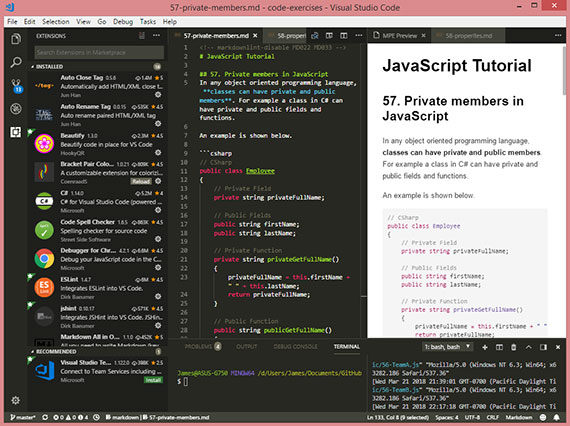](assets/images/full-size/chap14-6.png)

**Progress:** Today I decided to wipe clean my Visual Studio Code installation and start fresh. I had many plug-ins installed that were using resources and keeping me from a streamlined coding experience.

I also had quite a few modifications to my user settings, including linting, code formatting, themes, icons, plugin settings, etc.

I did a number of things before a fresh install:

1. Made a list of all currently used plugins (so I could reinstall the ones I wanted)
2. Uninstalled Visual Studio Code
3. Renamed the `extensions` directory (to clear out old extensions)
4. Renamed the `Code` directory within %UserDir%/AppData/Roaming  (to start with a fresh user settings)
5. Installed fresh copy

Once this was done, I proceeded to install the extensions I wanted along with some new ones. Everything runs clean and smooth now.

---

## 48. Geolocation Pt3
**Day 48: March 15, 2018 - Thursday**

**Project:** Study for MS 70-480 Cert Exam (Programming in HTML5 with JavaScript & CSS3)

[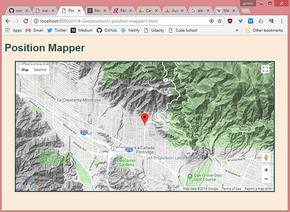](assets/images/full-size/chap14-6.png)

**Progress:** This last lesson covered the use of Geolocation API with Google Maps API.

This lesson detailed the following.

- Properly referencing the Google Maps API
- Setting the `options` object for use with the Google Maps API
- Creating and setting a Map and Marker object

The live sample can be viewed here: [Position Mapper](https://james-priest.github.io/node_samples/ch14-Geolocation/c-position-mapper1.html)

**Links:**
- Course Notes - [Chapter 14 - Geolocation](CH14-Geolocation.html)
- Geolocation sample 1- [Latitude, longitude, & timestamp output](https://james-priest.github.io/node_samples/ch14-Geolocation/a-geolocation2.html)
- Geolocation sample 2- [GPS Watch Position](https://james-priest.github.io/node_samples/ch14-Geolocation/b-watchPosition2.html)
- Geolocation sample 3- [Position Mapper](https://james-priest.github.io/node_samples/ch14-Geolocation/c-position-mapper1.html)
- GitHub Repo - [Geolocation GitHub Repo](https://github.com/james-priest/node_samples/tree/master/ch14-Geolocation)

---

## 47. Geolocation Pt2
**Day 47: March 14, 2018 - Wednesday**

**Project:** Study for MS 70-480 Cert Exam (Programming in HTML5 with JavaScript & CSS3)

[](assets/images/full-size/chap14-5.png)

**Progress:** This lesson covered the use of the `watchPosition()` method to continuously monitor changes in GPS positioning and call a success function in order to respond to the changes.

This lesson detailed the following.

- `navigator.geolocation.watchPosition()` method.
- Use of `watchPosition()`'s return value `watchId` with the `clearWatch()` method.
- Various methods to calculate distance between two points over a curved surface (earth).
- Calculation of distance traveled using the _haversine_ formula.

The live sample can be viewed here: [GPS Watch Position](https://james-priest.github.io/node_samples/ch14-Geolocation/b-watchPosition2.html)

**Links:**
- Course Notes - [Chapter 14 - Geolocation](CH14-Geolocation.html)
- Geolocation sample 1- [Latitude, longitude, & timestamp output](https://james-priest.github.io/node_samples/ch14-Geolocation/a-geolocation2.html)
- Geolocation sample 2- [GPS Watch Position](https://james-priest.github.io/node_samples/ch14-Geolocation/b-watchPosition2.html)
- GitHub Repo - [Geolocation GitHub Repo](https://github.com/james-priest/node_samples/tree/master/ch14-Geolocation)

---

## 46. Geolocation Pt1
**Day 46: March 13, 2018 - Tuesday**

**Project:** Study for MS 70-480 Cert Exam (Programming in HTML5 with JavaScript & CSS3)

```js
$(document).ready(function() {
    getLocation();
});
function supportsGeolocation() {
    return 'geolocation' in navigator;
}
function getLocation() {
    if (supportsGeolocation()) {
        navigator.geolocation.getCurrentPosition(showPosition, showError);
    } else {
        showMessage("Geolocation isn't supported by your browser");
    }
}
function showPosition(position) {
    var datetime = new Date(position.timestamp).toLocaleString();

    showMessage('Latitude: ' + position.coords.latitude + '<br>' +
        'Longitude: ' + position.coords.longitude + '<br>' +
        'Timestamp: ' + datetime);
}
```

[](assets/images/full-size/chap14-1.png)

**Progress:** This lesson covers the basics of the Geolocation API which at its most basic returns latitude and longitude positions from which to use with multiple third-party apps and services.

This lesson detailed the following.

- `navigator.geolocation.getCurrentPosition()` method
- Position object which is returned from `getCurrentPosition()` method. It contains the `coords` and `timestamp` properties
- Coordinates object which contains properties for `latitude`, `longitude`, `altitude`, `accuracy`, `altitudeAccuracy`, `heading`, & `speed`.

**Links:**
- Course Notes - [Chapter 14 - Geolocation](CH14-Geolocation.html)
- Geolocation sample- [Latitude, longitude, & timestamp output](https://james-priest.github.io/node_samples/ch14-Geolocation/a-geolocation2.html)
- GitHub Repo - [Geolocation GitHub Repo](https://github.com/james-priest/node_samples/tree/master/ch14-Geolocation)

---

## 45. Scramble Game Pt3
**Day 45: March 12, 2018 - Monday**

**Project:** Study for MS 70-480 Cert Exam (Programming in HTML5 with JavaScript & CSS3)

[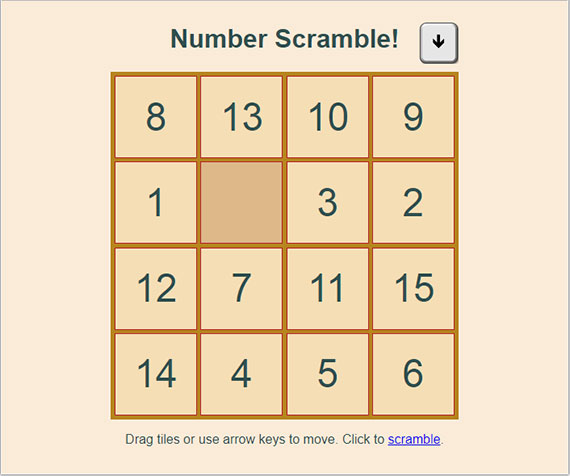](assets/images/full-size/chap13-14.png)

**Progress:** We finish part 3 of the HTML5 Drag & Drop number scramble game by adding keyboard controls and wrapping up some game functions.

This includes:

- Allowing tile movement with arrow keys
- Creating a key press animation to show the user what key was pressed
- Creating a `scramble()` tile function
- Building a `checkForWinner()` function

Here's the completed game: [Scramble Game](https://james-priest.github.io/node_samples/ch13-Drag-Drop/d-scramble3.html)

**Links:**
- Course Notes - [Chapter 13 - Drag and Drop](CH13-Drag-Drop.html)
- Drag & Drop sample 1- [Numbers](https://james-priest.github.io/node_samples/ch13-Drag-Drop/a-scramble4.html)
- Drag & Drop sample 2- [List](https://james-priest.github.io/node_samples/ch13-Drag-Drop/b-cars1.html)
- Drag & Drop sample 3- [Files](https://james-priest.github.io/node_samples/ch13-Drag-Drop/c-files2.html)
- Drag & Drop sample 4- [Scramble Game](https://james-priest.github.io/node_samples/ch13-Drag-Drop/d-scramble3.html)
- GitHub Repo - [Drag and Drop GitHub Repo](https://github.com/james-priest/node_samples/tree/master/ch13-Drag-Drop)

---

## 44. Scramble Game Pt2
**Day 44: March 11, 2018 - Sunday**

**Project:** Study for MS 70-480 Cert Exam (Programming in HTML5 with JavaScript & CSS3)

[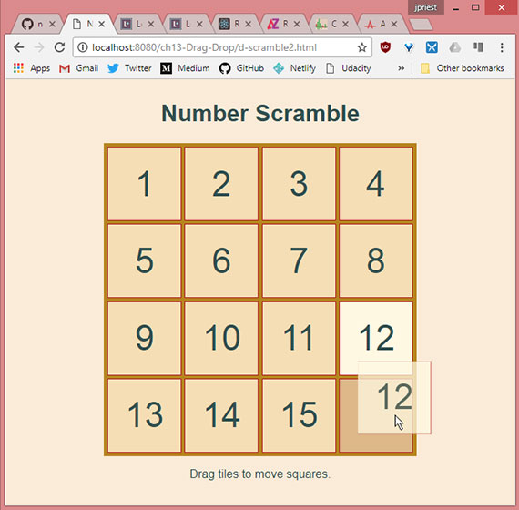](assets/images/full-size/chap13-12.png)

**Progress:** In part 2 of the HTML5 Drag & Drop number scramble game we actually write the bulk of the actual drag and drop code

This includes:

- Wiring up drag and drop events
- Using the DataTransfer object to send data from the drag source to the drop destination
- Logic to evaluate which drops are allowed and to carry those out

Here's the work in progress: [WIP - Scramble Game v2](https://james-priest.github.io/node_samples/ch13-Drag-Drop/d-scramble2.html)

**Links:**
- Course Notes - [Chapter 13 - Drag and Drop](CH13-Drag-Drop.html)
- Drag & Drop sample 1- [Numbers](https://james-priest.github.io/node_samples/ch13-Drag-Drop/a-scramble4.html)
- Drag & Drop sample 2- [List](https://james-priest.github.io/node_samples/ch13-Drag-Drop/b-cars1.html)
- Drag & Drop sample 3- [Files](https://james-priest.github.io/node_samples/ch13-Drag-Drop/c-files2.html)
- Drag & Drop sample 4- [Scramble Game](https://james-priest.github.io/node_samples/ch13-Drag-Drop/d-scramble3.html)
- GitHub Repo - [Drag and Drop GitHub Repo](https://github.com/james-priest/node_samples/tree/master/ch13-Drag-Drop)

---

## 43. Scramble Game Pt1
**Day 43: March 10, 2018 - Saturday**

**Project:** Study for MS 70-480 Cert Exam (Programming in HTML5 with JavaScript & CSS3)

[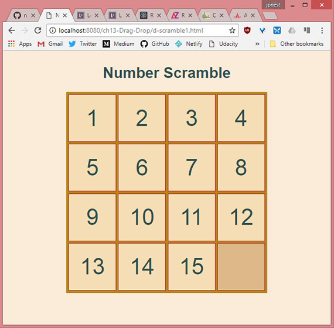](assets/images/full-size/chap13-11.png)

**Progress:** Here we gain experience implementing HTML5 Drag & Drop by building a number scramble game.

The first section covers:

- Basic layout and structure of the game
- Starting point for HTML, CSS, JavaScript, & jQuery

The work in progress page is here : [Scramble Game v1](https://james-priest.github.io/node_samples/ch13-Drag-Drop/d-scramble1.html)

**Links:**
- Course Notes - [Chapter 13 - Drag and Drop](CH13-Drag-Drop.html)
- Drag & Drop sample 1- [Numbers](https://james-priest.github.io/node_samples/ch13-Drag-Drop/a-scramble4.html)
- Drag & Drop sample 2- [List](https://james-priest.github.io/node_samples/ch13-Drag-Drop/b-cars1.html)
- Drag & Drop sample 3- [Files](https://james-priest.github.io/node_samples/ch13-Drag-Drop/c-files2.html)
- Drag & Drop sample 4- [Scramble Game](https://james-priest.github.io/node_samples/ch13-Drag-Drop/d-scramble3.html)
- GitHub Repo - [Drag and Drop GitHub Repo](https://github.com/james-priest/node_samples/tree/master/ch13-Drag-Drop)

---

## 42. HTML5 Drag & Drop Pt2
**Day 42: March 9, 2018 - Friday**

**Project:** Study for MS 70-480 Cert Exam (Programming in HTML5 with JavaScript & CSS3)

[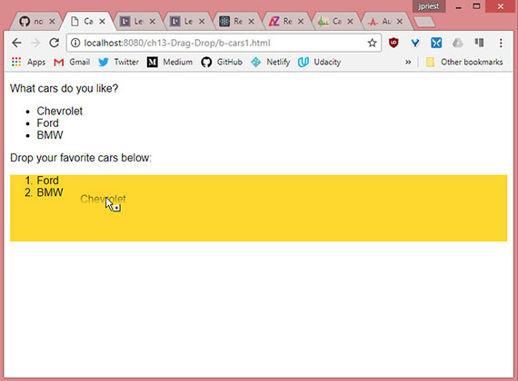](assets/images/full-size/chap13-7.png)

**Progress:** This lesson got into the DataTransfer object and how to use it to effectively move data from the drag location to the drop location.

This covered:

- Using DataTransfer with jQuery
- Using DataTransfer methods `getData()`, `setData()`, & `clearData()`
- Using DataTransfer properties `dropeffect`, `effectAllowed`, `files`, and `types`
- Working with the `drop` event
- Dragging and dropping files with FileList and the Files API object

[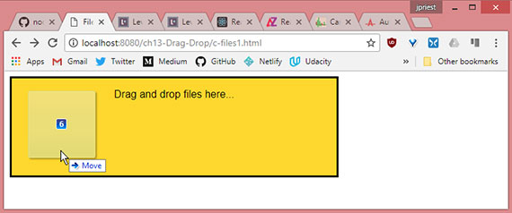](assets/images/full-size/chap13-9.png)

**Links:**
- Course Notes - [Chapter 13 - Drag and Drop](CH13-Drag-Drop.html)
- Drag & Drop sample 1- [Numbers](https://james-priest.github.io/node_samples/ch13-Drag-Drop/a-scramble4.html)
- Drag & Drop sample 2- [List](https://james-priest.github.io/node_samples/ch13-Drag-Drop/b-cars1.html)
- Drag & Drop sample 3- [Files](https://james-priest.github.io/node_samples/ch13-Drag-Drop/c-files2.html)
- GitHub Repo - [Drag and Drop GitHub Repo](https://github.com/james-priest/node_samples/tree/master/ch13-Drag-Drop)

---

## 41. HTML5 Drag & Drop Pt1
**Day 41: March 8, 2018 - Thursday**

**Project:** Study for MS 70-480 Cert Exam (Programming in HTML5 with JavaScript & CSS3)

[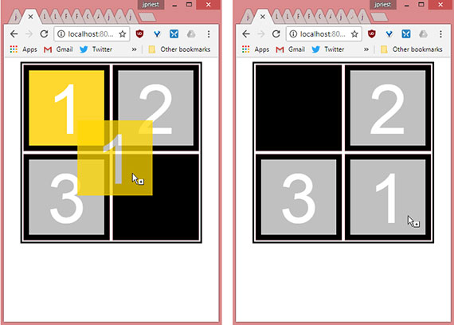](assets/images/full-size/chap13-6.png)

**Progress:** This lesson covered some of the basics behind of Drag and Drop with HTML5. This includes:

- HTML5 `draggable` attribute
- CSS autoprefixing ([https://autoprefixer.github.io/](https://autoprefixer.github.io/)) and [https://caniuse.com/](https://caniuse.com/)
- Drag events (`dragstart`, `drag`, and `dragend`)
- Drop events (`dragenter`, `dragover`, `dragleave`, and `drop`)
- Moving the dropped node from one part of the DOM to another

**Links:**
- Course Notes - [Chapter 13 - Drag and Drop](CH13-Drag-Drop.html)
- Drag & Drop sample - [Scramble](https://james-priest.github.io/node_samples/ch13-Drag-Drop/a-scramble4.html)
- GitHub Repo - [Drag and Drop GitHub Repo](https://github.com/james-priest/node_samples/tree/master/ch13-Drag-Drop)

---

## 40. HTML5 SVG
**Day 40: March 7, 2018 - Wednesday**

**Project:** Study for MS 70-480 Cert Exam (Programming in HTML5 with JavaScript & CSS3)

[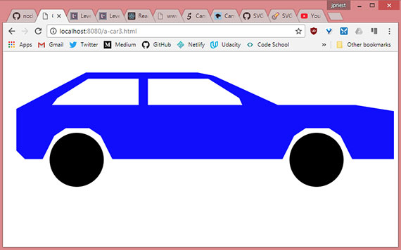](assets/images/full-size/chap12-26.png)

**Progress:** This lesson covered some of the basics behind SVG. This included:

- Use of `<svg>`, `<path>`, and `<circle>` elements
- Various path commands to create complex shapes
- Assigning an `.svg` file to an `` element
- Making SVG's scalable

**Links:**
- Course Notes - [Chapter 12 - SVG](CH12-SVG.html)
- Online SVG Editor - [SVG-edit](https://svg-edit.github.io/svgedit/releases/svg-edit-2.8.1/svg-editor.html)
- GitHub Repo - [SVG GitHub Repo](https://github.com/james-priest/node_samples/tree/master/ch12-SVG)

---

## 39. HTML5 Canvas Pt4
**Day 39: March 6, 2018 - Tuesday**

**Project:** Study for MS 70-480 Cert Exam (Programming in HTML5 with JavaScript & CSS3)

[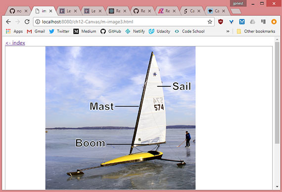](assets/images/full-size/chap12-26.png)

**Progress:** This completes the lesson on HTML5 `<canvas>` element. In the last section we covered:

- Using the `arc()` method to create circles and circle fragments
- Setting text with the `font` property
- Drawing text on the canvas with `fillText()` and `strokeText()` methods
- Including images on the canvas with `drawImage()`
- Tying it all together by including text, lines, and images.

[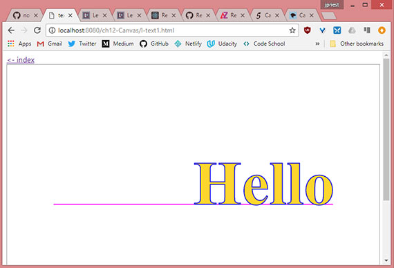](assets/images/full-size/chap12-22.png)

**Links:**
- Course Notes - [Chapter 12 - HTML5 Canvas](CH12-Canvas.html)
- Code samples - [Index page of code samples](https://james-priest.github.io/node_samples/ch12-Canvas/samples.html)
- GitHub Repo - [HTML5 Canvas GitHub Repo](https://github.com/james-priest/node_samples/tree/master/ch12-Canvas)

---

## 38. HTML5 Canvas Pt3
**Day 38: March 5, 2018 - Monday**

**Project:** Study for MS 70-480 Cert Exam (Programming in HTML5 with JavaScript & CSS3)

[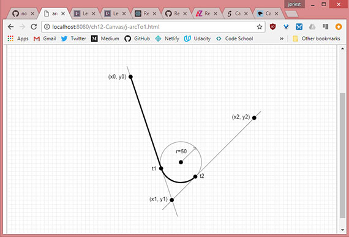](assets/images/full-size/chap12-17.png)

**Progress:** This lesson covered lots of areas, including:

- Setting lineWidth, lineJoin, & strokeStyle
- Saving and restoring drawing state
- Drawing with paths
- Creating lines & rectangles
- Using fill & stroke methods
- Order of method calls
- Creating arcs using arcTo method

[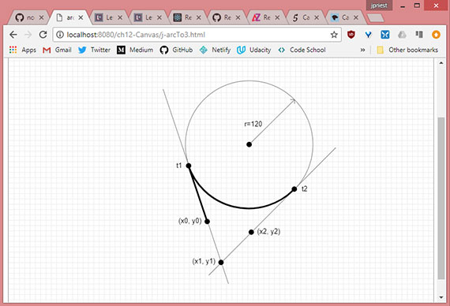](assets/images/full-size/chap12-18.png)

**Links:**
- Course Notes - [Chapter 12 - HTML5 Canvas](CH12-Canvas.html)
- Code samples - [Index page of code samples](https://james-priest.github.io/node_samples/ch12-Canvas/samples.html)
- GitHub Repo - [HTML5 Canvas GitHub Repo](https://github.com/james-priest/node_samples/tree/master/ch12-Canvas)

---

## 37. HTML5 Canvas Pt2
**Day 37: March 4, 2018 - Sunday**

**Project:** Study for MS 70-480 Cert Exam (Programming in HTML5 with JavaScript & CSS3)

[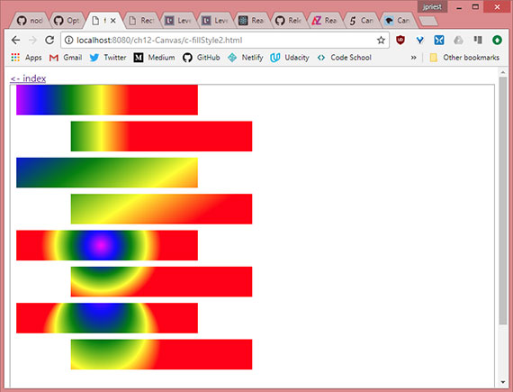](assets/images/full-size/chap12-4.png)

**Progress:** This lesson got into combining `fillStyle` with `fillRect()` for some interesting drawings.

Specifically covered:

- Using CSS color with `fillStyle`
- Using gradients with `fillStyle`
- Using patterns with `fillStyle`

[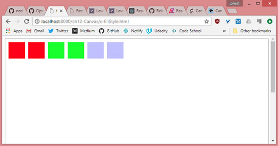](assets/images/full-size/chap12-3.png)

**Links:**
- Course Notes - [Chapter 12 - HTML5 Canvas](CH12-Canvas.html)
- Code samples - [Index page of code samples](https://james-priest.github.io/node_samples/ch12-Canvas/samples.html)
- GitHub Repo - [HTML5 Canvas GitHub Repo](https://github.com/james-priest/node_samples/tree/master/ch12-Canvas)

---

## 36. HTML5 Canvas Pt1
**Day 36: March 3, 2018 - Saturday**

**Project:** Study for MS 70-480 Cert Exam (Programming in HTML5 with JavaScript & CSS3)

[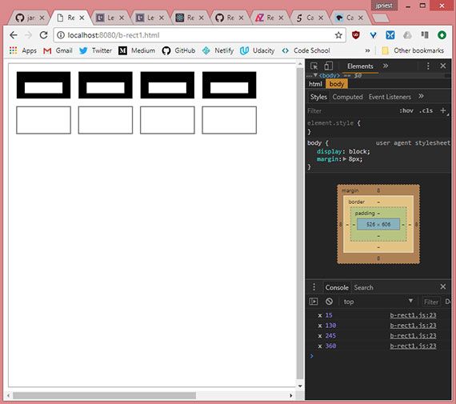](assets/images/full-size/chap12-2.png)

**Progress:** This lesson covered the use of the `<canvas>` element as well as the `CanvasRenderingContext2D` object and API.

Also covered:

- Properties and methods of context object for drawing with JavaScript
- Implementing the canvas
- Basic rectangle methods: `fillRect()`, `strokeRect()`, & `clearRect()`

**Links:**
- Course Notes - [Chapter 12 - HTML5 Canvas](CH12-Canvas.html)
- Code samples - [Index page of code samples](https://james-priest.github.io/node_samples/ch12-Canvas/samples.html)
- GitHub Repo - [HTML5 Canvas GitHub Repo](https://github.com/james-priest/node_samples/tree/master/ch12-Canvas)

---

## 35. HTML5 Media
**Day 35: March 2, 2018 - Friday**

**Project:** Study for MS 70-480 Cert Exam (Programming in HTML5 with JavaScript & CSS3)

[](assets/images/full-size/chap11-1.png)

**Progress:** This lesson covered the use of the `<video>` and `<audio>` HTML elements as well as the `HTMLMediaElement` object and API.

Also covered:

- `<source>` &  `<track>` elements
- Video formats
- Closed captioning and subtitles
- HTMLMediaElement properties, methods, & events
- Controlling media playback through code

[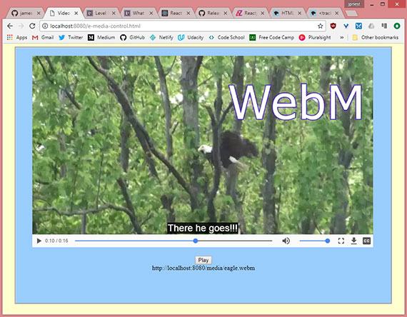](assets/images/full-size/chap11-2.png)

**Links:**
- Course Notes - [Chapter 11 - HTML5 Media](CH11-HTML5-Media.html)
- [HTML5 Media code on GitHub](https://github.com/james-priest/node_samples/tree/master/ch11-HTML5-Media) - Sample code showing how to embed video and audio elements in page.

---

## 34. WebSocket API
**Day 34: March 1, 2018 - Thursday**

**Project:** Study for MS 70-480 Cert Exam (Programming in HTML5 with JavaScript & CSS3)

[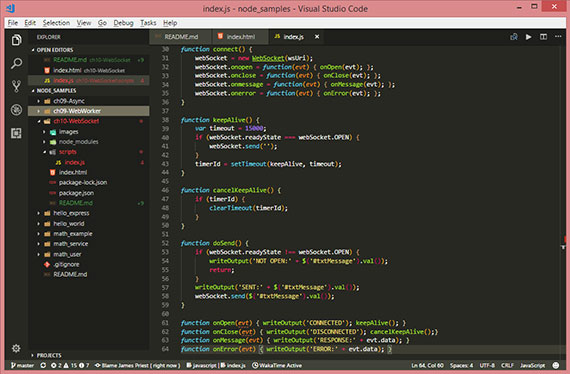](assets/images/full-size/chap10-2.png)

**Progress:** This lesson covered the use of the WebSocket protocol which establishes a two-way, bidirectional connection between the browser and the web server.

This is done with little overhead (2 bytes) and no headers. The light weight structure of the WebSocket protocol makes is an easy choice for any real-time applications such as chat, gaming, and live content.

Here's a quick bullet list of take-away's:

- The WebSocket protocol provides a standardized way to establish a two-way (bi-directional) connection between the browser and the web server while keeping the connection open.
- The WebSocket object contains methods to open connections, send data, & close connections
- It contains the following events: `onclose`, `onmessage`, `onerror`, and `onopen`.
- You can check the `readyState` property on the WebSocket object to obtain the state of the connection.
- Use `ws://` for WebSocket protocol or `wss://` for secure WebSocket protocol.
- Timeouts, dropped connections, web farm implementations, and browser incompatibility are problems you must resolve when implementing WebSocket or you can use a pre-built library such as SignalR or Socket.IO.

**Links:**
- Course Notes - [Chapter 10 - WebSocket Communications](CH10-WebSocket.html)
- [WebSocket example on GitHub](https://github.com/james-priest/node_samples/tree/master/ch10-WebSocket) - A basic WebSocket proof-of-concept app that calls the WebSocket.org echo server and returns a message sent to it.

---

## 33. Web Workers
**Day 33: February 28, 2018 - Wednesday**

**Project:** Study for MS 70-480 Cert Exam (Programming in HTML5 with JavaScript & CSS3)

[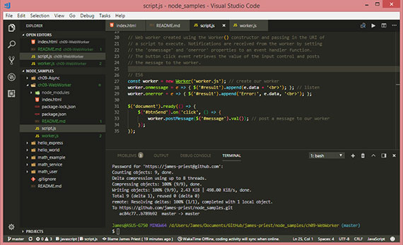](assets/images/full-size/chap9-2.png)

**Progress:** This lesson covered the use of Web Workers as a non-blocking (async) way of performing work. The worker can send messages back to the spawning task by posting  messages to an event handler specified by the creator (calling script). Messages can be any object that can be serialized.

When messages are posted to and from the web worker, the message object is serialized. This **creates a copy** of the message, so the web worker and the creator never reference the same object.

Web workers also don't have access to the DOM. If something needs to be posted to the DOM then that has to happen in the form of a message sent back to the creator, and the creator must access the DOM as needed.

Here's a quick bullet list of take-away's:

- A web worker provides asynchronous code execution.
- Communication to and from the web worker is accomplished by using the `postMessage()` method.
- The `postMessage()` method accepts a serializable object.
- The web worker and the creator cannot access the same object since a copy is made.
- The web worker does not have access to DOM elements.

**Links:**
- [Web Worker example on GitHub](https://github.com/james-priest/node_samples/tree/master/ch09-WebWorker) - A very basic set of scripts that converts a string to uppercase.
- [Demystifying Web Workers and Service Workers](https://nolanlawson.github.io/cascadia-2016/#) - Awesome slide deck with a big picture overview of Web Workers and Service Workers.
- [Web Workers vs Service Workers in JavaScript](http://tech.ovoenergy.com/web-workers-vs-service-workers/) - Great article with sample code.

---

## 32. jQuery Ajax & Promises
**Day 32: February 27, 2018 - Tuesday**

**Project:** Study for MS 70-480 Cert Exam (Programming in HTML5 with JavaScript & CSS3)

[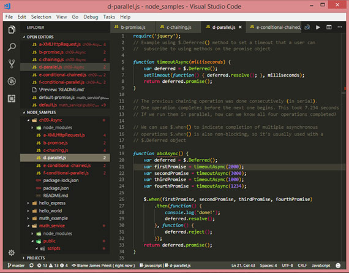](assets/images/full-size/chap9-1.png)

**Progress:** This lesson went into various asynchronous operations using jQuery ajax and jQuery promises. These are still in use as part of the jQuery library but not as modern an implementation as using ES6 Promises with the Fetch API.

Nonetheless, it's still helpful to know these patterns since a huge majority of code-bases are using jQuery's implementation. What was covered is the following:

- $.Deferred() object as a wrapper to the jquery promise() object
- jQuery .pipe() method for serialized(chained) async operations
- $.when() method for parallel async operations
- conditional async operations based on the result of prior async calls for both parallel and chained patterns

**Links:**
- [Asynchronous operations examples on GitHub](https://github.com/james-priest/node_samples/tree/master/ch09-Async) - These are some jQuery $.ajax() $.Deferred object and .promise() method examples
- [Ajax - Async, Callback & Promise](https://medium.com/front-end-hacking/ajax-async-callback-promise-e98f8074ebd7) - Great Medium article on XMLHttpRequest, jQuery Ajax, & Promises

---

## 31. XMLHttpRequest & Ajax
**Day 31: February 26, 2018 - Monday**

**Project:** Study for MS 70-480 Cert Exam (Programming in HTML5 with JavaScript & CSS3)

[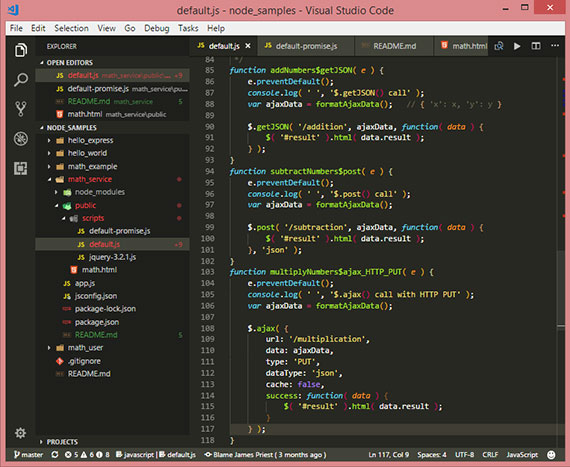](assets/images/full-size/chap8-1.png)

**Progress:** Covered using Ajax to access Web Services created with node.js. The web services were created to use Representational State Transfer (REST) and are also known as RESTful services.

REST attempts to use standard operations of HTTP by mapping _create_, _retrieve_, _update_, & _delete (CRUD) operations to HTTP methods.

The object that makes this call from the browser DOM is the XMLHttpRequest object. It is either invoked directly, or through one of jQuery's many wrapper methods. The ones I used were the following:

- Async XMLHttpRequest (for old-school backwards compatability)
- $.ajax()
- $.get()
- $.getJSON()
- $.post()

**Links:** [AJAX examples on GitHub](https://github.com/james-priest/node_samples/tree/master/math_service) - These are some XMLHttpRequests() & jQuery $.ajax() methods

---

## 30. ES6 Transpiling & Babel
**Day 30: February 25, 2018 - Sunday**

**Project:** [Grow with Google Scholarship Challenge](https://www.udacity.com/grow-with-google): Mobile Web track

[](assets/images/full-size/lesson9-5.png)

**Progress:** Completed [ES6 JavaScript Improved](https://www.udacity.com/course/es6-javascript-improved--ud356) Google Udacity course.

This completes the Google Udacity Scholarship challenge! It took 30 days from start to finish and was exactly the push I needed to stay on track with my 100DaysOfCode challenge.

Now I wait until April 17th to see if I'm selected to complete the remainder of the Mobile Web Nanodegree program!

The lessons covered:

1. Transpiling defined
1. babel-cli & babel-preset-es2015
1. package.json & build scripts

My notes on [ES6 JavaScript Improved (4) - Professional Developer-fu](ES6-Professional-Developer-fu.html).

**Links:**
- Course Notes - [Offline First (1) - Introducing the Service Worker](Introducing-the-Service-Worker.html)
- Course Notes - [Offline First (2) - IndexedDB and Caching](IndexedDB-and-Caching.html)
- Course Notes - [ES6 JavaScript Improved (1) - Syntax](ES6-Syntax.html)
- Course Notes - [ES6 JavaScript Improved (2) - Functions](ES6-Functions.html)
- Course Notes - [ES6 JavaScript Improved (2.5) - Classes](ES6-Classes.html)
- Course Notes - [ES6 JavaScript Improved (3) - Built-ins](ES6-Built-ins.html)
- Course Notes - [ES6 JavaScript Improved (3.5) - Built-ins-Pt2](ES6-Built-ins-Pt2.html)
- Course Notes - [ES6 JavaScript Improved (4) - Professional Developer-fu](ES6-Professional-Developer-fu.html).

- [ES6 JavaScript Improved](https://www.udacity.com/course/es6-javascript-improved--ud356) (free 4 week course) on Udacity

---

## 29. ES6 Polyfills
**Day 29: February 24, 2018 - Saturday**

**Project:** [Grow with Google Scholarship Challenge](https://www.udacity.com/grow-with-google): Mobile Web track

[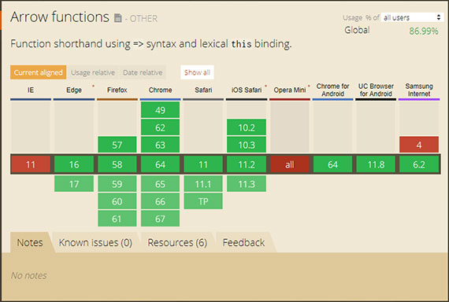](assets/images/full-size/lesson9-3.png)

**Progress:** Continued with my [ES6 JavaScript Improved](https://www.udacity.com/course/es6-javascript-improved--ud356) Google Udacity course.

The lessons covered:

1. Overview of browser support for ES6
1. Feature testing
1. Polyfills to patch missing JS features
1. Polyfills for areas other than JavaScript core. Includes the following
  - SVG, Canvas, Accessibility
  - WebStorage (local / session), Web Sockets
  - HTML5 elements & more...

My notes on [ES6 JavaScript Improved (4) - Professional Developer-fu](ES6-Professional-Developer-fu.html).

**Links:**
- Course Notes - [Offline First (1) - Introducing the Service Worker](Introducing-the-Service-Worker.html)
- Course Notes - [Offline First (2) - IndexedDB and Caching](IndexedDB-and-Caching.html)
- Course Notes - [ES6 JavaScript Improved (1) - Syntax](ES6-Syntax.html)
- Course Notes - [ES6 JavaScript Improved (2) - Functions](ES6-Functions.html)
- Course Notes - [ES6 JavaScript Improved (2.5) - Classes](ES6-Classes.html)
- Course Notes - [ES6 JavaScript Improved (3) - Built-ins](ES6-Built-ins.html)
- Course Notes - [ES6 JavaScript Improved (3.5) - Built-ins-Pt2](ES6-Built-ins-Pt2.html)
- Course Notes - [ES6 JavaScript Improved (4) - Professional Developer-fu](ES6-Professional-Developer-fu.html).

- [ES6 JavaScript Improved](https://www.udacity.com/course/es6-javascript-improved--ud356) (free 4 week course) on Udacity

---

## 28. ES6 Promises, Proxies, & Generators
**Day 28: February 23, 2018 - Friday**

**Project:** [Grow with Google Scholarship Challenge](https://www.udacity.com/grow-with-google): Mobile Web track

```js
// Proxy code
const richard = {status: 'looking for work'};
const handler = {
    get(target, propName) {
        console.log(target);
        console.log(propName);
        return target[propName];
    }
};
const agent = new Proxy(richard, handler);
agent.status; // (1)logs the richard object, (2)logs the property being accessed,
              // (3)returns the text in richard.status
```

**Progress:** Continued with my [ES6 JavaScript Improved](https://www.udacity.com/course/es6-javascript-improved--ud356) Google Udacity course.

The lessons covered:

1. Promises, Successful & Failed requests, Async operations
1. Proxies, handlers, & traps
1. Generators, Iterators, & yield

My notes on [ES6 JavaScript Improved (3.5) - Built-ins-Pt2](ES6-Built-ins-Pt2.html).

**Links:**
- Course Notes - [Offline First (1) - Introducing the Service Worker](Introducing-the-Service-Worker.html)
- Course Notes - [Offline First (2) - IndexedDB and Caching](IndexedDB-and-Caching.html)
- Course Notes - [ES6 JavaScript Improved (1) - Syntax](ES6-Syntax.html)
- Course Notes - [ES6 JavaScript Improved (2) - Functions](ES6-Functions.html)
- Course Notes - [ES6 JavaScript Improved (2.5) - Classes](ES6-Classes.html)
- Course Notes - [ES6 JavaScript Improved (3) - Built-ins](ES6-Built-ins.html)
- Course Notes - [ES6 JavaScript Improved (3.5) - Built-ins-Pt2](ES6-Built-ins-Pt2.html)
- [ES6 JavaScript Improved](https://www.udacity.com/course/es6-javascript-improved--ud356) (free 4 week course) on Udacity

---

## 27. ES6 Maps & WeakMaps
**Day 27: February 22, 2018 - Thursday**

**Project:** [Grow with Google Scholarship Challenge](https://www.udacity.com/grow-with-google): Mobile Web track

```js
/*
 * Using array destructuring, fix the following code to print the
 * keys and values of the `members` Map to the console.
 */

const members = new Map();

members.set('Evelyn', 75.68);
members.set('Liam', 20.16);
members.set('Sophia', 0);
members.set('Marcus', 10.25);

for (const member of members) {
    const [key, value] = member;
    console.log(key, value);
}
```

**Progress:** Continued with my [ES6 JavaScript Improved](https://www.udacity.com/course/es6-javascript-improved--ud356) Google Udacity course.

The lessons covered:

1. Maps & WeakMaps
1. Iteration & Looping
1. Creating & modifying Map objects

My notes on [ES6 JavaScript Improved (3) - Built-ins](ES6-Built-ins.html).

**Links:**
- Course Notes - [Offline First (1) - Introducing the Service Worker](Introducing-the-Service-Worker.html)
- Course Notes - [Offline First (2) - IndexedDB and Caching](IndexedDB-and-Caching.html)
- Course Notes - [ES6 JavaScript Improved (1) - Syntax](ES6-Syntax.html)
- Course Notes - [ES6 JavaScript Improved (2) - Functions](ES6-Functions.html)
- Course Notes - [ES6 JavaScript Improved (2.5) - Classes](ES6-Classes.html)
- Course Notes - [ES6 JavaScript Improved (3) - Built-ins](ES6-Built-ins.html)
- [ES6 JavaScript Improved](https://www.udacity.com/course/es6-javascript-improved--ud356) (free 4 week course) on Udacity

---

## 26. ES6 Built-ins, Symbols, Sets & WeakSets
**Day 26: February 21, 2018 - Wednesday**

**Project:** [Grow with Google Scholarship Challenge](https://www.udacity.com/grow-with-google): Mobile Web track

```js
const bowl = {
  [Symbol('apple')]: { color: 'red', weight: 136.078 },
  [Symbol('banana')]: { color: 'yellow', weight: 183.15 },
  [Symbol('orange')]: { color: 'orange', weight: 170.097 },
  [Symbol('banana')]: { color: 'yellow', weight: 176.845 }
};
console.log(bowl);
```

**Progress:** Continued with my [ES6 JavaScript Improved](https://www.udacity.com/course/es6-javascript-improved--ud356) Google Udacity course.

The lessons covered:

1. Symbols
1. Iteration & Iterable protocols
1. Sets & Weak Sets

My notes on [ES6 JavaScript Improved (3) - Built-ins](ES6-Built-ins.html).

**Links:**
- Course Notes - [Offline First (1) - Introducing the Service Worker](Introducing-the-Service-Worker.html)
- Course Notes - [Offline First (2) - IndexedDB and Caching](IndexedDB-and-Caching.html)
- Course Notes - [ES6 JavaScript Improved (1) - Syntax](ES6-Syntax.html)
- Course Notes - [ES6 JavaScript Improved (2) - Functions](ES6-Functions.html)
- Course Notes - [ES6 JavaScript Improved (2.5) - Classes](ES6-Classes.html)
- Course Notes - [ES6 JavaScript Improved (3) - Built-ins](ES6-Built-ins.html)
- [ES6 JavaScript Improved](https://www.udacity.com/course/es6-javascript-improved--ud356) (free 4 week course) on Udacity

---

## 25. ES6 Classes, Subclasses, & Prototypal Inheritance
**Day 25: February 20, 2018 - Tuesday**

**Project:** [Grow with Google Scholarship Challenge](https://www.udacity.com/grow-with-google): Mobile Web track

[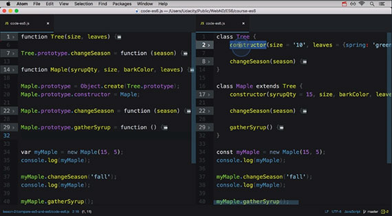](assets/images/full-size/lesson6-class3.png)

**Progress:** Continued with my [ES6 JavaScript Improved](https://www.udacity.com/course/es6-javascript-improved--ud356) Google Udacity course.

The lessons covered:

1. JavaScript prototypal inheritance
1. ES5 vs. ES6 Classes
1. `class`, `super`, and `extends` keywords
1. Working with subclasses

My notes on [ES6 JavaScript Improved (2.5) - Classes](ES6-Classes.html).

**Links:**
- Course Notes - [Offline First (1) - Introducing the Service Worker](Introducing-the-Service-Worker.html)
- Course Notes - [Offline First (2) - IndexedDB and Caching](IndexedDB-and-Caching.html)
- Course Notes - [ES6 JavaScript Improved (1) - Syntax](ES6-Syntax.html)
- Course Notes - [ES6 JavaScript Improved (2) - Functions](ES6-Functions.html)
- Course Notes - [ES6 JavaScript Improved (2.5) - Classes](ES6-Classes.html)
- [ES6 JavaScript Improved](https://www.udacity.com/course/es6-javascript-improved--ud356) (free 4 week course) on Udacity

---

## 24. ES6 'this' Keyword & Default Parameters
**Day 24: February 19, 2018 - Monday**

**Project:** [Grow with Google Scholarship Challenge](https://www.udacity.com/grow-with-google): Mobile Web track

```js
// object defaults with object destructuring
function buildHouse({floors = 1, color = 'red', walls = 'brick'} = {}) {
    return `Your house has ${floors} floor(s) with ${color} ${walls} walls.`;
}

// tests
console.log(buildHouse());
console.log(buildHouse({}));
console.log(buildHouse({floors: 3, color: 'yellow'}));

// Your house has 1 floor(s) with red brick walls.
// Your house has 1 floor(s) with red brick walls.
// Your house has 3 floor(s) with yellow brick walls.
```

**Progress:** Continued with my [ES6 JavaScript Improved](https://www.udacity.com/course/es6-javascript-improved--ud356) Google Udacity course.

The lessons covered:

1. `this` keyword with standard functions
1. `this` keyword with arrow functions
1. Default function parameters using arrays
1. Default function parameters using objects
1. Array defaults with array destructuring
1. Object defaults with object destructuring

My notes on [ES6 JavaScript Improved (2) - Functions](ES6-Functions.html).

**Links:**
- Course Notes - [Offline First (1) - Introducing the Service Worker](Introducing-the-Service-Worker.html)
- Course Notes - [Offline First (2) - IndexedDB and Caching](IndexedDB-and-Caching.html)
- Course Notes - [ES6 JavaScript Improved (1) - Syntax](ES6-Syntax.html)
- Course Notes - [ES6 JavaScript Improved (2) - Functions](ES6-Functions.html)
- [ES6 JavaScript Improved](https://www.udacity.com/course/es6-javascript-improved--ud356) (free 4 week course) on Udacity

---

## 23. ES6 Arrow Functions
**Day 23: February 18, 2018 - Sunday**

**Project:** [Grow with Google Scholarship Challenge](https://www.udacity.com/grow-with-google): Mobile Web track

#### Before

```js
// convert to an arrow function
const squares = [1, 2, 3, 4, 5, 6, 7, 8, 9, 10].map(function(square) {
  return square * square;
});

let output = '';
squares.forEach(function(square){
  output += ` ${square}`;
});
console.log(output.trim());
```

#### After

```js
const squares = [1, 2, 3, 4, 5, 6, 7, 8, 9, 10].map(square => square * square);
console.log(...squares);
```

> **Output:** 1 4 9 16 25 36 49 64 81 100

**Progress:** Continued with my [ES6 JavaScript Improved](https://www.udacity.com/course/es6-javascript-improved--ud356) Google Udacity course.

The lessons covered:

1. Spread (`...`) operator
1. (`...`) Rest parameter
1. Arrow functions
1. Syntactic variations of arrow functions
    - Parens / no parens / empty parens / underscore
1. _"Concise body syntax"_  vs. _"block body syntax"_


**Links:**
- [ES6 JavaScript Improved](https://www.udacity.com/course/es6-javascript-improved--ud356) (free 4 week course) on Udacity
- Course Notes - [Offline First (1) - Introducing the Service Worker](Introducing-the-Service-Worker.html)
- Course Notes - [Offline First (2) - IndexedDB and Caching](IndexedDB-and-Caching.html)
- Course Notes - [ES6 JavaScript Improved (1) - Syntax](ES6-Syntax.html)
- Course Notes - [ES6 JavaScript Improved (2) - Functions](ES6-Functions.html)

---

## 22. ES6 Object Literal Shorthand & For..of Loops
**Day 22: February 17, 2018 - Saturday**

**Project:** [Grow with Google Scholarship Challenge](https://www.udacity.com/grow-with-google): Mobile Web track

```js
// Object Literal shorthand
let type = 'quartz';
let color = 'rose';
let carat = 21.29;

let gemstone = { type, color, carat };

console.log(gemstone);

// for..of loop
const digits = [0, 1, 2, 3, 4, 5, 6, 7, 8, 9];

for (const digit of digits) {
  console.log(digit);
}
```

**Progress:** Continued with my [ES6 JavaScript Improved](https://www.udacity.com/course/es6-javascript-improved--ud356) Google Udacity course.

The lessons covered:

1. Object literal shorthand
1. Iteration
1. Family of For loops
1. For..of loop

**Links:**
- [ES6 JavaScript Improved](https://www.udacity.com/course/es6-javascript-improved--ud356) (free 4 week course) on Udacity
- Course Notes - [Offline First (1) - Introducing the Service Worker](Introducing-the-Service-Worker.html)
- Course Notes - [Offline First (2) - IndexedDB and Caching](IndexedDB-and-Caching.html)
- Course Notes - [ES6 JavaScript Improved (1) - Syntax](ES6-Syntax.html)

---

## 21. ES6 Template Literals & Destructuring Arrays
**Day 21: February 16, 2018 - Friday**

**Project:** [Grow with Google Scholarship Challenge](https://www.udacity.com/grow-with-google): Mobile Web track

```js
// Template Literal syntax
var note = `${teacher.name},

  Please excuse ${student.name}.
  He is recovering from the flu.

  Thank you,
  ${student.guardian}`;
```

**Progress:** Continued with my [ES6 JavaScript Improved](https://www.udacity.com/course/es6-javascript-improved--ud356) Google Udacity course.

The lesson covered:

1. `let` and `const` syntax and when to use each
1. Use of Template Literals for true string interpolation
1. Destructuring of arrays & objects with simpler ES6 syntax

You can read more here: [My notes - ES6 JavaScript Improved - Syntax](ES6-Syntax.html).

**Link to Work:**
- [Full Course Notes - ES6 JavaScript Improved - Syntax](ES6-Syntax.html)
- 4-part Udacity course [ES6 JavaScript Improved](https://www.udacity.com/course/es6-javascript-improved--ud356) (free 4 week course)

---

## 20. ES6 JavaScript Improved
**Day 20: February 15, 2018 - Thursday**

**Project:** [Grow with Google Scholarship Challenge](https://www.udacity.com/grow-with-google): Mobile Web track

[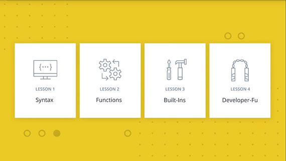](assets/images/full-size/lesson6-syntax1.png)

**Progress:** Started my new Google Udacity course called [ES6 JavaScript Improved](https://www.udacity.com/course/es6-javascript-improved--ud356).

The course is broken down into the following lessons:

1. **Syntax** - let, const, destructuring, for..of loops
1. **Functions** - arrow functions, `this` keyword, classes & subclasses
1. **Built-ins** - Sets, Maps, WeakSets, & WeakMaps, Promises, generators
1. **Polyfills & transpilers** - This lets you convert from ES6 to ES5

You can read more here: [My notes - ES6 JavaScript Improved - Syntax](ES6-Syntax.html).

**Link to Work:**
- [Full Course Notes - ES6 JavaScript Improved - Syntax](ES6-Syntax.html)
- 4-part Udacity course [ES6 JavaScript Improved](https://www.udacity.com/course/es6-javascript-improved--ud356) (free 4 week course)

---

## 19. Cache Avatars
**Day 19: February 14, 2018 - Wednesday**

**Project:** [Grow with Google Scholarship Challenge](https://www.udacity.com/grow-with-google): Mobile Web track

[](assets/images/full-size/lesson4-idb34.png)

**Progress:** The final few sections of this course combined all three of the following:

- Service Workers
- IndexedDB
- Cache Storage with Cache API.

You can read more here: [My notes - IndexedDB and Caching - Cache Avatars](IndexedDB-and-Caching.html#13-caching-avatars).

**Link to Work:**
- [Full Course Notes - IndexedDB and Caching](IndexedDB-and-Caching.html)
- Jake's IDB Promised Library [https://github.com/jakearchibald/idb](https://github.com/jakearchibald/idb)
- 3-part Udacity course [Offline Web Applications by Google](https://www.udacity.com/course/offline-web-applications--ud899) (free 3 week course)

---

## 18. Cache Photos
**Day 18: February 13, 2018 - Tuesday**

**Project:** [Grow with Google Scholarship Challenge](https://www.udacity.com/grow-with-google): Mobile Web track

[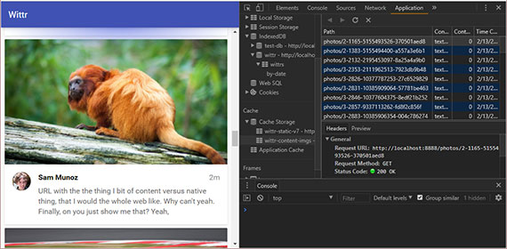](assets/images/full-size/lesson4-idb31.png)

**Progress:** This section deals with retrieving requested images from local Cache Storage. If the images do not exists locally then a fetch request is made to the network.

Once the image is retrieved, it is displayed to the screen and and saved to cache for future use.

You can read more here: [My notes - IndexedDB and Caching - Cache Photos](IndexedDB-and-Caching.html#9-cache-photos).

**Link to Work:**
- [Full Course Notes - IndexedDB and Caching](IndexedDB-and-Caching.html)
- Jake's IDB Promised Library [https://github.com/jakearchibald/idb](https://github.com/jakearchibald/idb)
- 3-part Udacity course [Offline Web Applications by Google](https://www.udacity.com/course/offline-web-applications--ud899) (free 3 week course)

---

## 17. Display Data & Clean Database
**Day 17: February 12, 2018 - Monday**

**Project:** [Grow with Google Scholarship Challenge](https://www.udacity.com/grow-with-google): Mobile Web track

[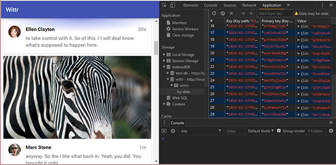](assets/images/full-size/lesson4-idb27.png)

**Progress:** In this section of the course we take the data from the IndexedDB Object Store and write code to display it on the page.

At the same time we create an index and cursor through it to remove any old and stale posts from our database. This makes room for new data that we stream in through web sockets.

You can read more here: [My notes - IndexedDB and Caching - Display IDB Data on Page](IndexedDB-and-Caching.html#7-display-idb-data-on-page).

**Link to Work:**
- [Full Course Notes - IndexedDB and Caching](IndexedDB-and-Caching.html)
- Jake's IDB Promised Library [https://github.com/jakearchibald/idb](https://github.com/jakearchibald/idb)
- 3-part Udacity course [Offline Web Applications by Google](https://www.udacity.com/course/offline-web-applications--ud899) (free 3 week course)

---

## 16. Populate the IDB Database
**Day 16: February 11, 2018 - Sunday**

**Project:** [Grow with Google Scholarship Challenge](https://www.udacity.com/grow-with-google): Mobile Web track

[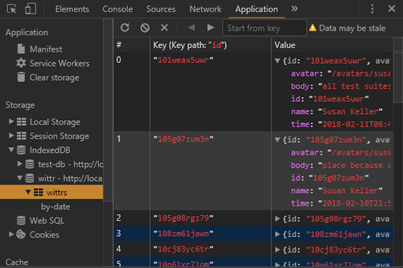](assets/images/full-size/lesson4-idb25.png)

**Progress:** This section consisted of creating an IDB database (wittr) and then writing data to the IDB object store (wittrs).

Once the database was created and populated an index was also created to sort by date.

You can click the link below to read about the process and see the code required to produce the IDB results.

You can read more here: [My notes - IndexedDB and Caching - IDB Cache & Display Entries](IndexedDB-and-Caching.html#6-writing-idb-cache-data).

**Link to Work:**
- [Full Course Notes - IndexedDB and Caching](IndexedDB-and-Caching.html)
- Jake's IDB Promised Library [https://github.com/jakearchibald/idb](https://github.com/jakearchibald/idb)
- 3-part Udacity course [Offline Web Applications by Google](https://www.udacity.com/course/offline-web-applications--ud899) (free 3 week course)

---

## 15. IDB Cache & Display Entries
**Day 15: February 10, 2018 - Saturday**

**Project:** [Grow with Google Scholarship Challenge](https://www.udacity.com/grow-with-google): Mobile Web track

[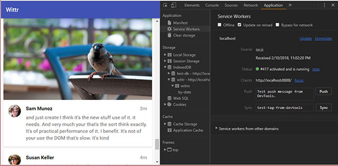](assets/images/full-size/lesson4-idb20.png)

**Progress:** This section of the lesson covered the data that will be save to the IndexedDB Object Store as well as the structure of data.

The process of retrieving existing posts from local storage and then using web sockets to update the feed is also discussed.

Lastly, specifics such as unique index and keys for the data are discussed.

You can read more here: [My notes - IndexedDB and Caching - IDB Cache & Display Entries](IndexedDB-and-Caching.html#5-idb-cache--display-entries).

**Link to Work:**
- [Full Course Notes - IndexedDB and Caching](IndexedDB-and-Caching.html)
- Jake's IDB Promised Library [https://github.com/jakearchibald/idb](https://github.com/jakearchibald/idb)
- 3-part Udacity course [Offline Web Applications by Google](https://www.udacity.com/course/offline-web-applications--ud899) (free 3 week course)

---

## 14. IDB Cursors and Indexes
**Day 14: February 9, 2018 - Friday**

**Project:** [Grow with Google Scholarship Challenge](https://www.udacity.com/grow-with-google): Mobile Web track

[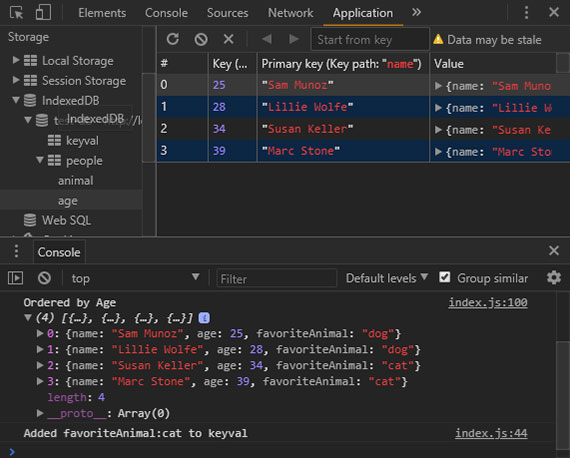](assets/images/full-size/lesson4-idb17.png)

**Progress:** This is the third and final deep dive into IndexedDB fundamentals. Here we cover using cursors and the syntax required to wrap these in Promises rather than nested callback hell.  This includes:

- openCursor()
- cursor.value
- cursor.continue()
- cursor.advance()
- cursor.update()
- cursor.delete()

You can read more here: [My notes - IndexedDB and Caching - IDB Cursors and Indexes](IndexedDB-and-Caching.html#4-idb-cursors-and-indexes).

**Link to Work:**
- [Full Course Notes - IndexedDB and Caching](IndexedDB-and-Caching.html)
- Jake's IDB Promised Library [https://github.com/jakearchibald/idb](https://github.com/jakearchibald/idb)
- 3-part Udacity course [Offline Web Applications by Google](https://www.udacity.com/course/offline-web-applications--ud899) (free 3 week course)

---

## 13. Diving Deeper into IDB
**Day 13: February 8, 2018 - Thursday**

**Project:** [Grow with Google Scholarship Challenge](https://www.udacity.com/grow-with-google): Mobile Web track

[](assets/images/full-size/lesson4-idb10.png)

**Progress:** This section got into deeper into the IDB API. Some of the items covered were:

- Creating, updating, and accessing multiple object stores
- Database versioning with multiple instances
- Transactions with multiple operations
- Creation and use of indexes
- Filtering data on index

Lots of sample code and screen shots for reference.

You can read more here: [My notes - IndexedDB and Caching - Diving Deeper with IDB](IndexedDB-and-Caching.html#3-diving-deeper-with-idb).

**Link to Work:**
- [Full Course Notes - IndexedDB and Caching](IndexedDB-and-Caching.html)
- Jake's IDB Promised Library [https://github.com/jakearchibald/idb](https://github.com/jakearchibald/idb)
- 3-part Udacity course [Offline Web Applications by Google](https://www.udacity.com/course/offline-web-applications--ud899) (free 3 week course)

---

## 12. Getting Started with IDB
**Day 12: February 7, 2018 - Wednesday**

**Project:** [Grow with Google Scholarship Challenge](https://www.udacity.com/grow-with-google): Mobile Web track

[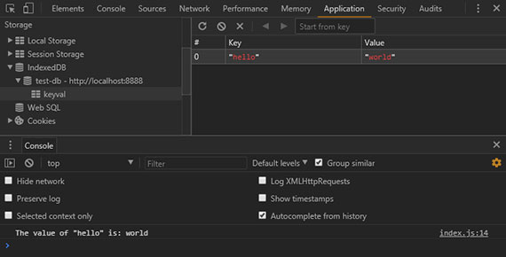](assets/images/full-size/lesson4-idb8.png)

**Progress:** Here we got into the code behind IndexedDB. We quickly covered each of the following:

- Opening a database
- Creating an object store
- Writing data to the object store
- Reading data
- Using transactions
- Inspecting IDB in DevTools

You can read more here: [My notes - IndexedDB and Caching](IndexedDB-and-Caching.html).

**Link to Work:**
- [Full Course Notes - IndexedDB and Caching](IndexedDB-and-Caching.html)
- Jake's IDB Promised Library [https://github.com/jakearchibald/idb](https://github.com/jakearchibald/idb)
- 3-part Udacity course [Offline Web Applications by Google](https://www.udacity.com/course/offline-web-applications--ud899) (free 3 week course)

---

## 11. IndexedDB Promised Library
**Day 11: February 6, 2018 - Tuesday**

**Project:** [Grow with Google Scholarship Challenge](https://www.udacity.com/grow-with-google): Mobile Web track

[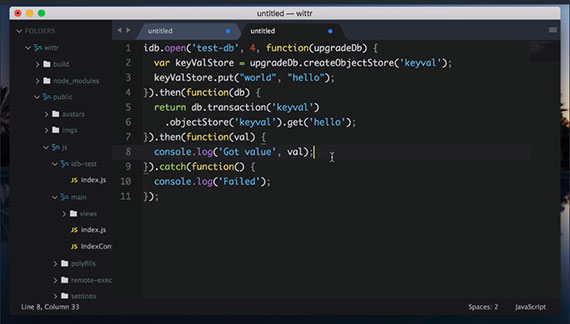](assets/images/full-size/lesson4-idb7.png)

**Progress:** Learned about IndexedDB and how it can be used by all the major browsers to provide database capabilities. This is a NoSQL rather than relational database and is perfectly suited to persist data related to a site.

This lesson also covers some of the deficiencies inherent in the asynchronous implementations of IndexedDB. It was created before Promises and therefore uses a messy callback architecture.

We look at using a tiny wrapper library written by Jake Archibald which allows us to use Promises rather than events.

You can read more here: [My notes - IndexedDB and Caching](IndexedDB-and-Caching.html).

**Link to Work:**
- [Full Course Notes - IndexedDB and Caching](IndexedDB-and-Caching.html)
- Jake's IDB Promised Library [https://github.com/jakearchibald/idb](https://github.com/jakearchibald/idb)
- 3-part Udacity course [Offline Web Applications by Google](https://www.udacity.com/course/offline-web-applications--ud899) (free 3 week course)

---

## 10. Triggering a Service Worker Update
**Day 10: February 5, 2018 - Monday**

**Project:** [Grow with Google Scholarship Challenge](https://www.udacity.com/grow-with-google): Mobile Web track

[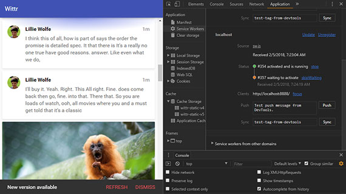](assets/images/full-size/lesson3-service-worker19.png)

**Progress:** Learned how to trigger a cache and Service Worker update for versioned web content. This provides the user with a notification and creates a new cache store instance separate from the existing cache store.

The versioning of caches stores ensures that the current Service Worker does not experience any interruptions servicing it's pages when new content arrives.

The user is given the option of updating immediately or dismissing the notification and updating with the normal Service Worker lifecycle. This occurs when the old Service Worker is released.

You can read more here: [My notes - Triggering an Update](Introducing-the-Service-Worker.html#24-triggering-an-update).

**Link to Work:**
- [Full Course Notes - Introducing the Service Worker](Introducing-the-Service-Worker.html)
- 3-part Udacity course [Offline Web Applications by Google](https://www.udacity.com/course/offline-web-applications--ud899) (free 3 week course)

---

## 9. Update Notification with Service Workers
**Day 9: February 4, 2018 - Sunday**

**Project:** [Grow with Google Scholarship Challenge](https://www.udacity.com/grow-with-google): Mobile Web track

[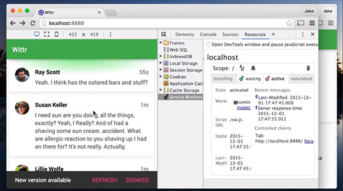](assets/images/full-size/lesson3-service-worker18.png)

**Progress:** Learned how to provide the user with an update notification when new content is available through a new Service Worker instance.

When a new Service Worker instance is installed it remains in a 'waiting' state until the current Service Worker is done servicing all pages in its scope and is released. This usually requires navigating off site and back again.

These changes alert the user to new content so they may update with a button click.

You can read more here: [My notes - Adding UX to the Update Process](Introducing-the-Service-Worker.html#22-adding-ux-to-the-update-process).

**Link to Work:**
- [Full Course Notes - Introducing the Service Worker](Introducing-the-Service-Worker.html)
- 3-part Udacity course [Offline Web Applications by Google](https://www.udacity.com/course/offline-web-applications--ud899) (free 3 week course)

---

## 8. Updating Static Cache
**Day 8: February 3, 2018 - Saturday**

**Project:** [Grow with Google Scholarship Challenge](https://www.udacity.com/grow-with-google): Mobile Web track

[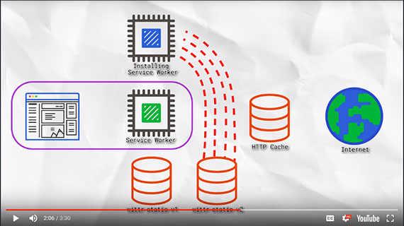](assets/images/full-size/lesson3-service-worker15.png)

**Progress:** Learned how to update static cache for a site by creating versioned cache stores.

By changing the name of a cache store from say 'my-app-v1' to 'my-app-v2' we are causing the service worker to spin up a new instance. The new service worker instance gets installed but not activated until the old service worker is released.

We create a separate cache store because we don't want to disrupt the cache that's already being used by the old service worker and the pages it controls.

Once the old service worker is released, we delete the old cache store so the next page load gets the latest resources from the new cache.

You can read more here: [My notes - Updating the Static Cache](Introducing-the-Service-Worker.html#19-updating-the-static-cache).

**Link to Work:**
- [Full Course Notes - Introducing the Service Worker](Introducing-the-Service-Worker.html)
- 3-part Udacity course [Offline Web Applications by Google](https://www.udacity.com/course/offline-web-applications--ud899) (free 3 week course)

---

## 7. Cache API
**Day 7: February 2, 2018 - Friday**

**Project:** [Grow with Google Scholarship Challenge](https://www.udacity.com/grow-with-google): Mobile Web track

[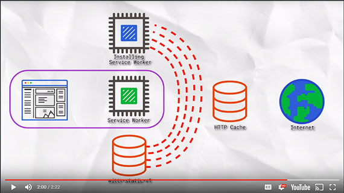](assets/images/full-size/lesson3-service-worker13.png)

**Progress:** Learned the basics of the [Cache API](https://developer.mozilla.org/en-US/docs/Web/API/Cache) for storing offline versions of a site. This includes the use of:

- [CacheStorage.open()](https://developer.mozilla.org/en-US/docs/Web/API/CacheStorage/open)<br>
  Returns a Promise that resolves to the Cache object matching the cacheName (a new cache is created if it doesn't already exist.)
- [Cache.put(request, response)](https://developer.mozilla.org/en-US/docs/Web/API/Cache/put)<br>
  Takes both a request and its response and adds it to the given cache.
- [Cache.add(request)](https://developer.mozilla.org/en-US/docs/Web/API/Cache/add)<br>
  Takes a URL, retrieves it and adds the resulting response object to the given cache. This is functionally equivalent to calling fetch(), then using Cache.put() to add the results to the cache.
- [Cache.match(request, options)](https://developer.mozilla.org/en-US/docs/Web/API/Cache/match)<br>
  Returns a Promise that resolves to the response associated with the first matching request in the Cache object.
- [Cache.addAll(requests)](https://developer.mozilla.org/en-US/docs/Web/API/Cache/addAll)<br>
  Takes an array of URLs, retrieves them, and adds the resulting response objects to the given cache.
- [Cache.matchAll(request, options)](https://developer.mozilla.org/en-US/docs/Web/API/Cache/matchAll)<br>
  Returns a Promise that resolves to an array of all matching requests in the Cache object.

Also learned about the [install](https://developer.mozilla.org/en-US/docs/Web/API/InstallEvent) and [activate](https://developer.mozilla.org/en-US/docs/Web/API/ExtendableEvent/waitUntil) events of a Service Worker.

Full examples can be found in [my notes under - Caching and Serving Assets](Introducing-the-Service-Worker.html#16-caching-and-serving-assets).

**Link to Work:**
- [Introducing the Service Worker - Notes](Introducing-the-Service-Worker.html)
- 3-part Udacity course [Offline Web Applications by Google](https://www.udacity.com/course/offline-web-applications--ud899) (free 3 week course)

---

## 6. Hijacking Requests
**Day 6: February 1, 2018 - Thursday**

**Project:** [Grow with Google Scholarship Challenge](https://www.udacity.com/grow-with-google): Mobile Web track

[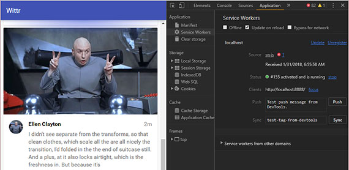](assets/images/full-size/hijacking-requests1.png)

**Progress:** Learned about the following.
1. How to listen for and capture `fetch` events
1. How to use the `fetchEvent.respondWith()` method
1. Using `Fetch API` as a better and modern alternative to XMLHttpRequest.

Here's an example of this kind of event handling.

```js
self.addEventListener('fetch', function(event) {
  // TODO: only respond to requests with a url ending in ".jpg"
  if ( event.request.url.endsWith( '.jpg' ) ) {
    event.respondWith(
      fetch( '/imgs/dr-evil.gif' )
    );
  }
});
```

Full examples can be found in [my notes](Introducing-the-Service-Worker.html).

**Link to Work:**
- [Introducing the Service Worker - Notes](Introducing-the-Service-Worker.html)
- 3-part Udacity course [Offline Web Applications by Google](https://www.udacity.com/course/offline-web-applications--ud899) (free 3 week course)

---

## 5. Service Worker Dev Tools
**Day 5: January,31 2018 - Wednesday**

**Project:** [Grow with Google Scholarship Challenge](https://www.udacity.com/grow-with-google): Mobile Web track

[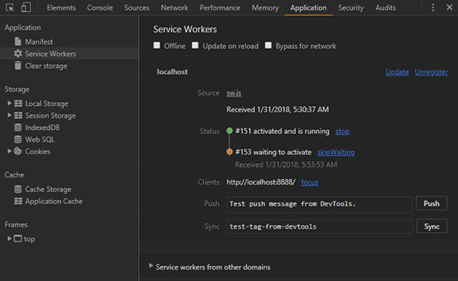](assets/images/full-size/chrome-dev-tools1.png)

**Progress:** Learned about [Chrome Canary](https://www.google.com/chrome/browser/canary.html), the nightly build of Chrome with bleeding edge features. It can be run along side **Chrome Stable** but can often break as well. It receives a new feature push almost daily.

Chrome Stable has the Service Worker features already baked in and might be a better choice to test with since it is less likely to crash. That is what I have pictured above.

**Link to Work:**
- [Introducing the Service Worker - Notes](Introducing-the-Service-Worker.html)
- 3-part Udacity course [Offline Web Applications by Google](https://www.udacity.com/course/offline-web-applications--ud899) (free 3 week course)
- [Chrome Canary](https://www.google.com/chrome/browser/canary.html) - Nightly build of latest Chrome bits.

---

## 4. The Service Worker Lifecycle
**Day 4: January,30 2018 - Tuesday**

**Project:** [Grow with Google Scholarship Challenge](https://www.udacity.com/grow-with-google): Mobile Web track

[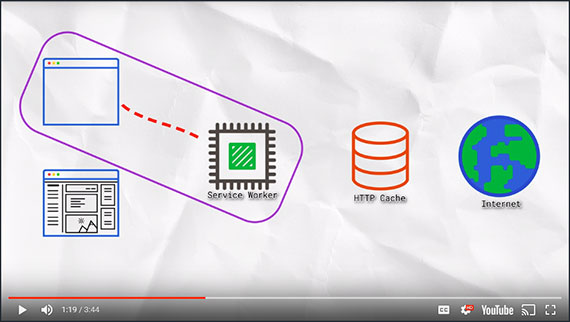](assets/images/full-size/lesson3-service-worker5.png)

**Progress:** Learned about the Service Worker Lifecycle.

This is part of a larger, 3-part Udacity series called [Offline Web Applications by Google](https://www.udacity.com/course/offline-web-applications--ud899). It contains the following lessons and is **FREE**!

1. The Benefits of Offline First
1. Introducing the Service Worker
1. IndexedDB and Caching

**Link to Work:**
- [Introducing the Service Worker - Notes](Introducing-the-Service-Worker.html)
- 3-part Udacity course [Offline Web Applications by Google](https://www.udacity.com/course/offline-web-applications--ud899) (free 3 week course)

---

## 3. An Overview of the Service Worker
**Day 3: January,29 2018 - Monday**

**Project:** [Grow with Google Scholarship Challenge](https://www.udacity.com/grow-with-google): Mobile Web track

[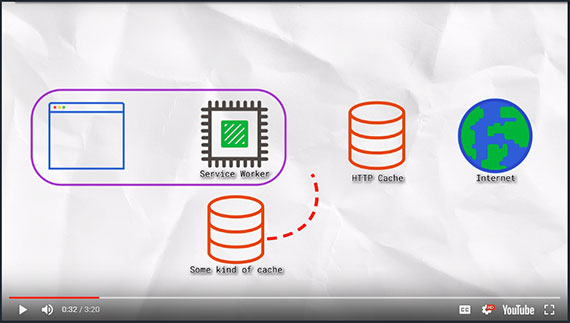](assets/images/full-size/lesson3-service-worker1.png)

**Progress:** Learned what the **Service Worker** is:
- a JavaScript file that sits between you and network requests.
- a type of **Web Worker** meaning it runs separately from your page.
- a process that is invisible to the user and that can't access the DOM.

But, it does control pages by intercepting requests as the browser makes them.

To see full notes along with screen captures click the link below.

**Link to Work:** [My notes on: Introducing the Service Worker](Introducing-the-Service-Worker.html)

---

## 2. The Benefits of Offline First
**Day 2: January,28 2018 - Sunday**

**Project:** [Grow with Google Scholarship Challenge](https://www.udacity.com/grow-with-google): Mobile Web track

**Progress:** Lesson 2: The Benefits of Offline First - Jake Archibald

The _Benefits of Offline First_ course was broken down into 13 segments. It discussed the use of **HTTP Cache** and laid out a new paradigm which loads content from cache first rather than relying on network connectivity to determine if content gets displayed.

This solves for all three of the following use case scenarios:
1. Great connectivity
1. Poor connectivity
1. Offline

_Offline First_ delivers the page (header and/or content) from cache FIRST, and THEN attempts to fetch content from the network.

Lastly, it introduces the **Service Worker**.

[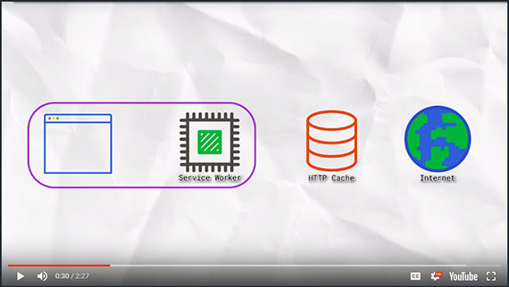](assets/images/full-size/lesson2-service-worker.png)

It's billed as a new browser feature and a total game changer- the greatest paradigm shift since asynchronous operations and one that allows **you to control the network rather than the network control you**.

---

## 1. Grow With Google - Mobile Web - Getting Started
**Day 1: January,27 2018 - Saturday**

**Project:** [Grow with Google Scholarship Challenge](https://www.udacity.com/grow-with-google): Mobile Web track

**Progress:** Lesson 1: Welcome video.

Welcome video got us set up on the discussion forums, Slack, and basically gave a Scholarship Overview.

Looks like the program is broken up into 10 courses.  These are:
1. Welcome! Important Details on your Scholarship
1. The Benefits of Offline First
1. Introducing the Service Worker
1. IndexedDB and Caching
1. Next Up
1. JavaScript Syntax Updates
1. JavaScript ES6 Functions
1. JavaScript Built-ins
1. Professional Developer-fu - polyfills & transpiling ES6
1. Challenge Course Wrap Up

Looks like some nice coverage of things I want to dive into deeper!

---

## Round 2 Preflight Checklist
**Day 0: January 26, 2018 - Friday**

**Project:**
- Create 100 Days of Code Round 2 Log
- [Grow with Google Scholarship Challenge](https://www.udacity.com/grow-with-google): Mobile Web track

**Progress:** Today was about getting ready to start Round 2!  I have created a new R2 repo and log on GitHub and have gone through the Welcome video for my Grow with [Google Scholarship: Mobile Web](https://www.udacity.com/course/mobile-web-specialist-nanodegree--nd024) course.

I am excited and ready to jump in with both feet!

**Link to work:**
- [Google/Udacity Mobile Web Specialist](https://www.udacity.com/course/mobile-web-specialist-nanodegree--nd024)
- [Google Web and Android Scholarship Program](https://www.udacity.com/google-scholarships)